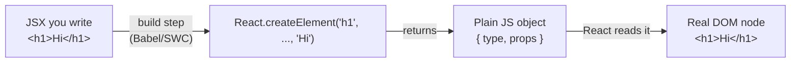
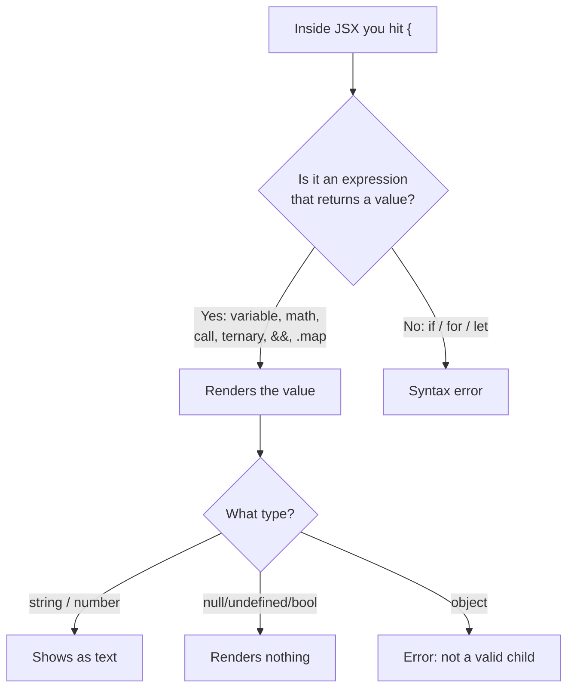
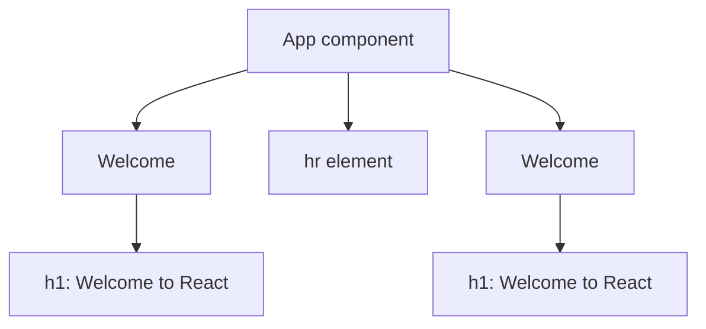
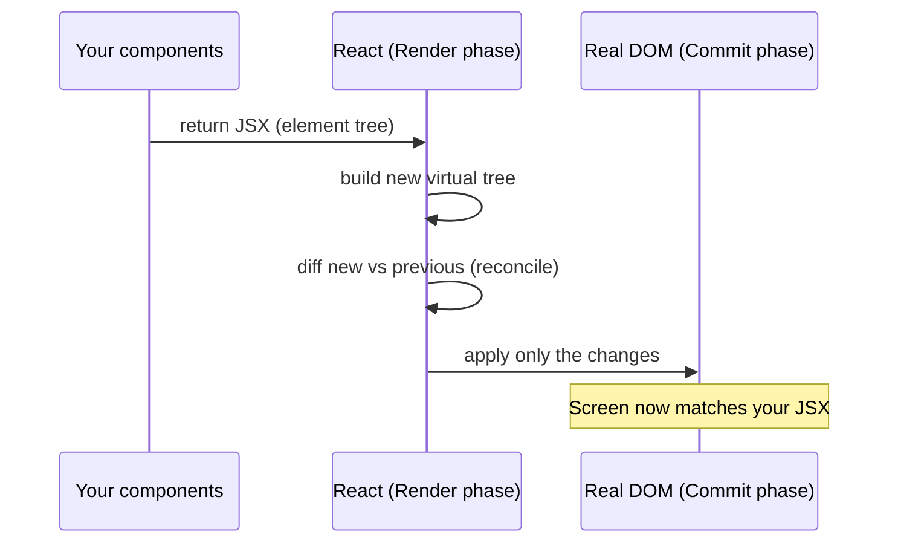
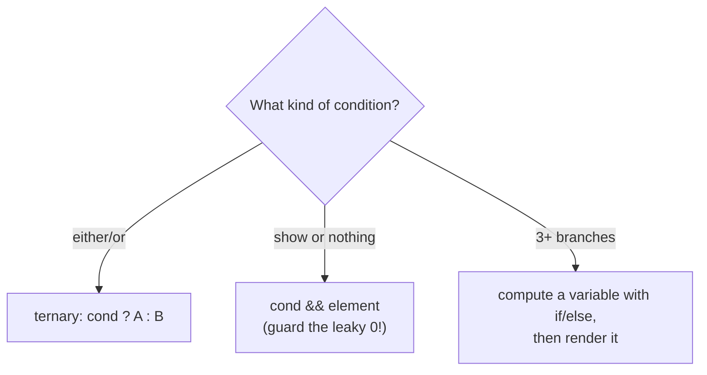

# Part 1 · JSX and the Rendering Model

> Before you can build anything in React, you need to deeply understand two things: **JSX** (the syntax you write) and **the rendering model** (what React does with it). Get these right and everything else clicks. Get them wrong and you'll fight the framework for months. This part is where we build the correct mental model — the one you'll rely on for the rest of the series.

**What you already know helps here.** You write JavaScript fluently, so you'll recognize that JSX is *not* a template language — it's just JavaScript with a nicer syntax for describing UI. We lean on that the whole way through.

## Table of Contents

1. [What JSX really is](#1-what-jsx-really-is)
2. [The rules of JSX](#2-the-rules-of-jsx)
3. [Embedding JavaScript with curly braces](#3-embedding-javascript-with-curly-braces)
4. [Elements vs components](#4-elements-vs-components)
5. [How React actually renders](#5-how-react-actually-renders)
6. [Fragments and returning multiple elements](#6-fragments-and-returning-multiple-elements)
7. [Conditional rendering, the JSX way](#7-conditional-rendering-the-jsx-way)
8. [Mini-project: a profile card](#8-mini-project-a-profile-card)
9. [Exercises and practice problems](#9-exercises-and-practice-problems)
10. [Glossary](#10-glossary)

> **💡 Suggested learning order:** Read sections 1–5 in one sitting — they're a single connected idea. Then take a break, do the inline exercises, and come back for 6–9. Don't move to Part 2 until the mini-project works without peeking.

---

## 1. What JSX really is

🎯 **Analogy:** JSX is like an f-string in Python or a template literal in JavaScript — a piece of *convenient syntax* that the compiler turns into ordinary code before it runs. When you write `` `Hello ${name}` ``, JavaScript doesn't have a special "template runtime"; it just builds a string. Similarly, when you write `<h1>Hello</h1>` in JSX, there's no HTML being executed — the compiler rewrites it into a plain JavaScript function call that returns an object.

Here's the key reveal. This JSX:

```jsx
const element = <h1 className="title">Hello, React</h1>
```

is compiled (by Vite's build step, using Babel/SWC) into this plain JavaScript:

```js
// What the browser actually runs — no HTML, just a function call:
const element = React.createElement(
  'h1',                       // the type of element (a string for HTML tags)
  { className: 'title' },     // the props (attributes) as an object
  'Hello, React'              // the children (what's inside)
)
```

And `React.createElement(...)` simply returns a plain JavaScript object — a lightweight description of what you want on screen:

```js
// A "React element" is just data. Roughly:
const element = {
  type: 'h1',
  props: { className: 'title', children: 'Hello, React' },
}
```

> **🔍 Under the hood:** A React element is **not** a DOM node and **not** something on screen. It's an immutable plain-object *description* — a recipe. React reads these recipes and decides what real DOM to create or update. This indirection is the whole trick: because your UI is just data, React can compare "the UI I want now" against "the UI I had before" and update only the difference. You describe *what*; React handles *how*.

> **⚠️ Common beginner mistake:** Thinking "JSX is HTML in my JavaScript." It looks like HTML, but it's JavaScript. That's why you write `className` instead of `class`, `onClick` instead of `onclick`, and why you can drop any JS expression inside `{}`. Whenever JSX confuses you, mentally compile it to `React.createElement` and the confusion usually disappears.

Because JSX is just function calls that produce objects, JSX **is an expression**. You can store it in a variable, return it from a function, put it in an array, or pass it as an argument — anything you can do with a value:

```jsx
const greeting = <p>Welcome back</p>          // stored in a variable
const list = [<li>One</li>, <li>Two</li>]     // inside an array
function getIcon() { return <span>⭐</span> }  // returned from a function
```



**Key takeaways:**
- JSX is syntax sugar; it compiles to `React.createElement` calls.
- A React element is a plain, immutable JS object describing UI — not the DOM.
- JSX is an *expression* (a value), so it works anywhere a value works.

---

## 2. The rules of JSX

Because JSX compiles to JavaScript, it inherits a handful of rules that trip up every beginner. Learn these five and you'll avoid 90% of "why won't this compile?" errors.

**Rule 1 — Return a single root element.** A function call returns one value, so JSX must resolve to one parent element. Wrap siblings in a parent (or a Fragment — see §6):

```jsx
// ❌ Two sibling roots — syntax error
return (
  <h1>Title</h1>
  <p>Body</p>
)

// ✅ Wrapped in one parent
return (
  <div>
    <h1>Title</h1>
    <p>Body</p>
  </div>
)
```

**Rule 2 — Close every tag.** Unlike HTML, JSX has no optional closing tags. Self-close void elements:

```jsx
   {/* self-closed */}
<br />
<input type="text" />
```

**Rule 3 — `camelCase` for most attributes.** DOM properties are camelCased in JS, and JSX attributes map to them:

```jsx
<label htmlFor="email">Email</label>        {/* not "for" */}
<div className="card" tabIndex={0}></div>    {/* not "class" */}
<button onClick={handleClick}>Save</button>  {/* not "onclick" */}
```

**Rule 4 — `class` → `className`, `for` → `htmlFor`.** These two are reserved words in JavaScript (`class` for classes, `for` for loops), so JSX renames them. This is the single most common beginner surprise.

**Rule 5 — Style is an object, not a string.** The `style` attribute takes a JS object with camelCased CSS properties:

```jsx
// ✅ Object with camelCase keys and string/number values
<div style={{ backgroundColor: 'navy', fontSize: 18, padding: '1rem' }}>Hi</div>

// The double braces = { outer: "this is JS" } + { inner: the object literal }
```

> **🔍 Under the hood:** The reason for `className`, `htmlFor`, and camelCased events is that JSX props map to **DOM element properties**, not HTML attributes. In the DOM API, the property is `element.className`, `element.htmlFor`, and event handlers are `element.onclick` (but React normalizes events to camelCase and wires up its own efficient event system — more in Part 3).

> **⚠️ Common beginner mistake:** Writing `class="..."` out of HTML habit. React will warn you in the console (`Invalid DOM property 'class'. Did you mean 'className'?`). Also forgetting the *double* braces on `style` — `style={{...}}` — and writing `style={{'background-color': ...}}` instead of `style={{ backgroundColor: ... }}`.

Here's a comparison table you'll reference often:

| HTML | JSX | Why |
| --- | --- | --- |
| `class="btn"` | `className="btn"` | `class` is a JS reserved word |
| `for="id"` | `htmlFor="id"` | `for` is a JS reserved word |
| `onclick="..."` | `onClick={fn}` | camelCase; pass a function, not a string |
| `style="color:red"` | `style={{ color: 'red' }}` | style is a JS object |
| `tabindex="0"` | `tabIndex={0}` | camelCase DOM property |
| `<br>` | `<br />` | all tags must close |

**Key takeaways:**
- One root element, all tags closed, attributes camelCased.
- `className` and `htmlFor` replace `class` and `for`.
- `style` is a JS object with camelCase keys: `style={{ fontSize: 16 }}`.

---

## 3. Embedding JavaScript with curly braces

This is where JSX becomes powerful. Anywhere inside JSX, `{}` means **"switch back to JavaScript and evaluate this expression."** Whatever the expression returns gets rendered.

```jsx
const name = 'Ada'
const user = { age: 36, isAdmin: true }

return (
  <div>
    <h1>Hello, {name}</h1>                 {/* a variable */}
    <p>Next year you'll be {user.age + 1}</p> {/* an expression */}
    <p>{name.toUpperCase()}</p>            {/* a method call */}
    <p>Today is {new Date().toDateString()}</p>
     {/* in an attribute */}
  </div>
)
```

The crucial word is **expression** — something that *produces a value*. You can use variables, arithmetic, function calls, ternaries, `&&`, array methods like `.map()`. You **cannot** put statements (`if`, `for`, variable declarations) directly inside `{}`, because statements don't produce a value.

```jsx
// ❌ Statements don't work inside JSX braces
<p>{ if (loggedIn) { 'Hi' } }</p>        // SyntaxError

// ✅ Use an expression instead — a ternary
<p>{ loggedIn ? 'Hi' : 'Please log in' }</p>
```

**What React renders for different values** — this table saves you real debugging time:

| Expression value | What renders |
| --- | --- |
| String / number | The text itself (`{42}` → `42`) |
| `true`, `false`, `null`, `undefined` | **Nothing** (renders empty — this is *useful*) |
| An array | Each item rendered in sequence (`{[a, b]}`) |
| A React element | The element |
| An object `{}` | ❌ **Error**: "Objects are not valid as a React child" |

> **🔍 Under the hood:** React deliberately renders `null`, `undefined`, `true`, and `false` as nothing. That's what makes `{condition && <Thing/>}` work: when `condition` is false, the whole expression is `false`, which renders nothing. It's not magic — it's a documented rule about what React does with each value type.

> **⚠️ Common beginner mistake #1:** Trying to render an object: `<p>{user}</p>` where `user` is `{name: 'Ada'}`. You get *"Objects are not valid as a React child."* You meant `<p>{user.name}</p>`. **Mistake #2:** The number `0` **does** render (as "0"). So `{count && <List/>}` shows a stray `0` when `count` is `0`. Use `{count > 0 && <List/>}` instead — we'll revisit this in §7.



**Key takeaways:**
- `{}` inside JSX evaluates a JavaScript **expression** and renders its result.
- Statements (`if`, `for`) don't work in `{}`; use ternaries and `&&`.
- `null`/`undefined`/booleans render nothing; objects throw; `0` renders as "0".

---

## 4. Elements vs components

So far we've made *elements* (`<h1>`, `<div>`). A **component** is a function that *returns* elements — a reusable, named piece of UI. This is the unit you'll build everything from.

```jsx
// A component is a function that returns JSX.
// RULE: component names MUST start with a capital letter.
function Welcome() {
  return <h1>Welcome to React</h1>
}

// You use it like a custom HTML tag:
function App() {
  return (
    <div>
      <Welcome />        {/* capital W = your component */}
      <Welcome />        {/* reuse it as many times as you like */}
      <hr />             {/* lowercase = built-in HTML element */}
    </div>
  )
}
```

The capital-letter rule is not a style preference — it's how JSX decides what you mean:

```jsx
<welcome />   // compiles to createElement('welcome', ...) → a literal HTML tag (wrong!)
<Welcome />   // compiles to createElement(Welcome, ...)   → calls YOUR function ✓
```

> **🔍 Under the hood:** When JSX compiles `<Welcome />`, it produces `React.createElement(Welcome, null)` — passing your **function** as the `type`. When React renders that element, it *calls* `Welcome()` to get the JSX it returns, then continues rendering that. Lowercase tags compile to a **string** type (`'div'`), which React maps to a real DOM element. That's the entire distinction: string type = DOM node; function type = your component.

> **⚠️ Common beginner mistake:** Naming a component in lowercase (`function welcome() {}`) and wondering why `<welcome />` renders nothing or errors. Capitalize component names. Always.

Components form a **tree**. `App` renders `Welcome` twice; each `Welcome` renders an `h1`. React walks this tree top-down to produce the final UI:



This tree structure is why React is so composable: a component doesn't care whether its parent is `App` or something else, and it can contain any other components. You build big UIs by nesting small, focused components — exactly like composing small functions into bigger ones in your backend code.

**Key takeaways:**
- A component is a function (Capitalized) that returns JSX.
- Capital letter = your component; lowercase = built-in HTML element.
- Components nest into a tree that React renders top-down.

---

## 5. How React actually renders

Now the payoff — understanding the render model deeply. React updates the screen in **two phases**: **Render** and **Commit**.

**Phase 1 — Render (compute).** React calls your component functions to produce a tree of elements (the description of the UI). This is *pure computation* — no DOM is touched yet. On the very first render, React builds the whole tree. On later renders (after state changes, Part 3), it builds a *new* tree.

**Phase 2 — Commit (apply).** React compares the new element tree with the previous one — a process called **reconciliation** — and applies the **minimal** set of real DOM operations to make the screen match. On first render it inserts everything; on updates it changes only what differs.



🎯 **Analogy:** Think of it like `git`. The **render** phase is computing a new snapshot of your working tree. **Reconciliation** is the `diff` between the last commit and the new snapshot. The **commit** phase applies just that diff to the "repository" (the real DOM). React never rewrites the whole DOM, just as git never re-writes every file — it applies the delta.

> **🔍 Under the hood:** "Re-rendering" sounds expensive, but in the render phase it just means **React calls your function again** to get fresh JSX — cheap, because it's plain JS returning objects. The expensive part (touching the DOM) is minimized by reconciliation. This is why the mental model `UI = f(state)` is safe: you can let React re-run your function freely, and it will only mutate the DOM where something genuinely changed.

> **⚠️ Common beginner mistake:** Assuming "render" = "update the screen." It doesn't. Render = *compute a description*. Commit = *apply to the DOM*. A component can render many times while causing zero DOM changes (if its output didn't change). Keeping these separate will make Part 3 (state) and Part 11 (performance) far clearer.

On the **first render specifically**, recall from the README how it starts:

```jsx
// src/main.jsx — this kicks off the very first render
import { createRoot } from 'react-dom/client'
import App from './App.jsx'

// createRoot binds React to a real DOM node; render() starts phase 1 + 2.
createRoot(document.getElementById('root')).render(<App />)
```

React calls `App()`, walks the returned tree calling each component, and commits the whole thing into `<div id="root">`. From then on, *state changes* (Part 3) trigger new render→commit cycles for the affected parts of the tree.

**Key takeaways:**
- Rendering has two phases: **Render** (compute a tree, no DOM) and **Commit** (apply minimal DOM changes).
- **Reconciliation** is the diff between the new and previous trees.
- Re-rendering = re-calling your function; it's cheap and doesn't always change the DOM.

---

## 6. Fragments and returning multiple elements

Rule 1 said "return one root element." But wrapping everything in a `<div>` pollutes your HTML with meaningless wrappers. **Fragments** let you group elements *without* adding a DOM node.

```jsx
import { Fragment } from 'react'

function Info() {
  return (
    <Fragment>
      <h2>Title</h2>
      <p>Body text with no wrapper div.</p>
    </Fragment>
  )
}
```

There's a shorthand — an empty tag `<>...</>` — which you'll use almost always:

```jsx
function Info() {
  return (
    <>
      <h2>Title</h2>
      <p>Body text with no wrapper div.</p>
    </>
  )
}
```

> **🔍 Under the hood:** A Fragment renders its children directly into the parent, producing **no** DOM element of its own. In the browser's Elements panel, you'll see the `<h2>` and `<p>` as direct children of whatever contains `<Info />` — no extra `<div>`. This matters for CSS layouts (flexbox/grid) where a stray wrapper div breaks the layout, and for valid HTML (e.g., you can't wrap `<td>`s in a `<div>` inside a `<tr>`).

> **⚠️ Common beginner mistake:** Reaching for `<div>` every time and ending up with "div soup" — deeply nested meaningless divs. Use `<>...</>` when you only need to satisfy the single-root rule, not to create an actual container. (One caveat: the shorthand `<>` can't take a `key`; when rendering a list of fragments you need the full `<Fragment key={...}>` — more in Part 4.)

**Key takeaways:**
- Fragments group elements without adding a DOM node.
- Use the shorthand `<>...</>` by default; `<Fragment>` when you need a `key`.
- They keep your HTML clean and your CSS layouts intact.

---

## 7. Conditional rendering, the JSX way

Since JSX lives inside JavaScript, you render conditionally using ordinary JS expressions — no special template syntax. There are three idioms.

**1. Ternary — for "either A or B":**

```jsx
function Status({ isOnline }) {
  return (
    <p>
      {isOnline ? <span>🟢 Online</span> : <span>⚪ Offline</span>}
    </p>
  )
}
```

**2. Logical `&&` — for "show this or nothing":**

```jsx
function Inbox({ unread }) {
  return (
    <div>
      <h2>Inbox</h2>
      {unread > 0 && <span className="badge">{unread} new</span>}
      {/* if unread is 0+, the badge shows; if condition is false, nothing renders */}
    </div>
  )
}
```

**3. Assign to a variable — for complex branching:**

```jsx
function Page({ status }) {
  let content
  if (status === 'loading') content = <Spinner />
  else if (status === 'error') content = <ErrorBox />
  else content = <Results />

  // The `if` runs in normal JS (outside JSX); we just render the variable.
  return <main>{content}</main>
}
```

> **🔍 Under the hood:** `{cond && <X/>}` works because `&&` returns its *right* operand when the left is truthy, and the left operand (falsy) otherwise. React renders elements, and renders `false`/`null`/`undefined` as nothing — so a falsy left side produces no output. It's plain JavaScript short-circuit evaluation, not a React feature.

> **⚠️ Common beginner mistake — the "leaky 0":** `{items.length && <List/>}`. When `items.length` is `0`, the expression evaluates to `0`, and React renders **"0"** on screen (numbers render as text!). Always make the left side a real boolean: `{items.length > 0 && <List/>}` or `{!!items.length && <List/>}`.



**Key takeaways:**
- Use ternary for either/or, `&&` for show-or-nothing, a variable for 3+ branches.
- Guard `&&` with a real boolean to avoid rendering a stray `0`.
- All conditional rendering is just JavaScript expressions — no template DSL.

---

## 8. Mini-project: a profile card

🏗️ Time to build. You'll make a **static profile card** — no state yet, just JSX, expressions, components, and conditional rendering. This consolidates everything in Part 1.

**Goal:** A card showing an avatar, name, role, a "PRO" badge (only for pro users), and a list of skills.

**Setup:**

```bash
npm create vite@latest profile-card    # choose React → JavaScript
cd profile-card && npm install && npm run dev
```

Replace `src/App.jsx` with this, then read the annotations:

```jsx
// src/App.jsx

// A small, focused component for one skill "chip".
function SkillChip({ label }) {
  return <span className="chip">{label}</span>
}

// The card component. For now we hardcode the data as plain variables;
// in Part 2 you'll pass this in as props, and in Part 3 make it interactive.
function ProfileCard() {
  const user = {
    name: 'Ada Lovelace',
    role: 'Frontend Engineer',
    isPro: true,
    avatar: 'https://i.pravatar.cc/120?img=47',
    skills: ['React', 'JavaScript', 'CSS'],
  }

  return (
    <article style={cardStyle}>
      

      <h2 style={{ margin: '12px 0 2px' }}>
        {user.name}
        {/* Show the PRO badge ONLY for pro users (guarded && ) */}
        {user.isPro && <span style={badgeStyle}>PRO</span>}
      </h2>

      <p style={{ color: '#64748b', marginTop: 0 }}>{user.role}</p>

      <div style={{ marginTop: 12 }}>
        {/* Render one SkillChip per skill. (.map returns an array of elements;
            we'll cover keys properly in Part 4 — for now React warns, that's OK.) */}
        {user.skills.map((s) => (
          <SkillChip label={s} />
        ))}
      </div>
    </article>
  )
}

// Plain style objects (JSX style = object). We'll switch to real CSS in Part 10.
const cardStyle = {
  maxWidth: 280, padding: 24, borderRadius: 16, textAlign: 'center',
  fontFamily: 'system-ui', boxShadow: '0 8px 30px rgba(0,0,0,.12)', margin: '40px auto',
}
const avatarStyle = { width: 96, height: 96, borderRadius: '50%' }
const badgeStyle = {
  fontSize: 11, background: '#22d3ee', color: '#04121f', padding: '2px 8px',
  borderRadius: 999, marginLeft: 8, verticalAlign: 'middle', fontWeight: 700,
}

// App is the root component that main.jsx renders.
export default function App() {
  return <ProfileCard />
}
```

**Checklist — did you use every Part 1 concept?**

```cards
Components :: SkillChip and ProfileCard are functions returning JSX, composed inside App.
Expressions :: {user.name}, {user.role}, and mapping over {user.skills}.
Conditional :: {user.isPro && <span>PRO</span>} — badge only for pro users.
Attributes :: className/style objects, src/alt on the img.
```

**Extend it (do at least two):**
1. Flip `isPro` to `false` and confirm the badge disappears.
2. Add a "Contact" button (it won't do anything yet — that's Part 3).
3. Add a `location` field and render it under the role.
4. Extract the header (avatar + name + role) into its own `<CardHeader />` component.
5. Show "New member" text when `skills` is empty (hint: guard the leaky `0`).

> **💡 Tip:** If the skills `.map` prints a yellow "key" warning in the console, that's expected — Part 4 fixes it with `key={s}`. Notice React still renders correctly; the warning is about *update efficiency*, not correctness.

**Key takeaways:**
- You just built real UI from components, expressions, and conditionals — no state needed.
- Hardcoded data now becomes **props** in Part 2 and **state** in Part 3.
- Inline style objects are fine for learning; real styling comes in Part 10.

---

## 9. Exercises and practice problems

Do these in your Vite playground. **Attempt each before opening the solution.** Type everything.

### 🧪 Warm-ups (easy)

**E1.** Write a component `Greeting` that renders `<h1>Hello!</h1>`. Render it inside `App`.

<details><summary>Show solution</summary>

```jsx
function Greeting() {
  return <h1>Hello!</h1>
}
export default function App() {
  return <Greeting />
}
```

*Why:* A component is just a capitalized function returning JSX, used as `<Greeting />`.
</details>

**E2.** Given `const price = 42.5`, render `The price is $42.50` using an expression. (Hint: `toFixed(2)`.)

<details><summary>Show solution</summary>

```jsx
const price = 42.5
return <p>The price is ${price.toFixed(2)}</p>
```

*Why:* `{}` runs a JS expression; `price.toFixed(2)` returns the string `"42.50"`.
</details>

**E3.** Fix this broken JSX (three bugs):

```jsx
function Card() {
  return
    <div class="card">
      
      <p>Hi</p>
    </div>
}
```

<details><summary>Show solution</summary>

```jsx
function Card() {
  return (                    // bug 1: `return` on its own line returns undefined
    <div className="card">    // bug 2: class → className
          // bug 3: self-close the img
      <p>Hi</p>
    </div>
  )
}
```

*Why:* JS **automatic semicolon insertion** turns a bare `return` + newline into `return;`, so always put `(` on the same line as `return`. Then `class`→`className` and close the `img`.
</details>

### 🧪 Core (medium)

**E4.** Write `TemperatureLabel` that takes a hardcoded `const celsius = 30` and renders `"Hot 🔥"` if `celsius >= 25`, else `"Mild"`. Use a ternary.

<details><summary>Show solution</summary>

```jsx
function TemperatureLabel() {
  const celsius = 30
  return <p>{celsius >= 25 ? 'Hot 🔥' : 'Mild'}</p>
}
```

*Why:* Ternary is the idiom for either/or rendering inside `{}`.
</details>

**E5.** Given `const cart = []`, show `"Your cart is empty"` when there are no items, otherwise show `"You have N items"`. Make sure the number `0` never leaks onto the screen.

<details><summary>Show solution</summary>

```jsx
const cart = []
return (
  <p>
    {cart.length === 0
      ? 'Your cart is empty'
      : `You have ${cart.length} items`}
  </p>
)
```

*Why:* A ternary avoids the leaky-`0` problem entirely by never using `cart.length &&`. If you *did* use `&&`, you'd write `cart.length > 0 && ...`.
</details>

**E6.** Render this array as three paragraphs without writing three `<p>` tags by hand: `const notes = ['Buy milk', 'Call Sam', 'Ship order']`.

<details><summary>Show solution</summary>

```jsx
const notes = ['Buy milk', 'Call Sam', 'Ship order']
return (
  <div>
    {notes.map((note) => (
      <p key={note}>{note}</p>   // key added; full explanation in Part 4
    ))}
  </div>
)
```

*Why:* `.map()` returns an array of elements, which React renders in order. (`key` previews Part 4.)
</details>

### 🧪 Challenge (hard)

**E7.** Predict the output *before running*, then verify: what does each render?

```jsx
<p>{0}</p>
<p>{null}</p>
<p>{false}</p>
<p>{'0'}</p>
<p>{[1, 2, 3]}</p>
<p>{true && 'yes'}</p>
<p>{0 && 'yes'}</p>
```

<details><summary>Show solution</summary>

| Expression | Renders |
| --- | --- |
| `{0}` | `0` (numbers render as text!) |
| `{null}` | nothing |
| `{false}` | nothing |
| `{'0'}` | `0` (a string) |
| `{[1,2,3]}` | `123` (array items concatenated) |
| `{true && 'yes'}` | `yes` |
| `{0 && 'yes'}` | `0` (the leaky zero — `&&` returns `0`, which renders!) |

*Why:* This is the whole "what renders" table in action. The last row is *the* classic bug — guard with `> 0`.
</details>

**E8 (capstone seed).** Refactor the mini-project so `ProfileCard` renders **three** different cards by calling it three times with three different hardcoded users. Notice the pain of copy-pasting data — this is *exactly* the problem **props** (Part 2) solve. Keep this project; you'll convert it to props next.

<details><summary>Show hint</summary>

Right now `user` is hardcoded inside `ProfileCard`, so all three cards are identical. There's no clean way to vary them without props. That frustration is the point — it motivates Part 2. Don't fight it; just observe it.
</details>

---

## 10. Glossary

| Term | Meaning |
| --- | --- |
| **JSX** | HTML-like syntax that compiles to `React.createElement` calls. |
| **React element** | A plain, immutable JS object describing UI (`{ type, props }`). |
| **Component** | A capitalized function that returns JSX; the reusable unit of UI. |
| **`React.createElement`** | The function JSX compiles to; returns a React element. |
| **Render phase** | React calls your components to compute an element tree (no DOM changes). |
| **Commit phase** | React applies the minimal DOM changes to match the new tree. |
| **Reconciliation** | The diff between the new and previous element trees. |
| **Fragment** | A wrapper (`<>...</>`) that groups elements without a DOM node. |
| **Expression** | JS that produces a value; the only thing allowed inside JSX `{}`. |
| **Leaky zero** | The bug where `count && <X/>` renders "0" when count is 0. |

---

> **You've built the foundation.** You now understand what JSX is, how React turns it into UI, and the render/commit model everything else depends on. Next you'll make components *reusable* by feeding them data.
>
> **Next:** [Part 2 · Components, Props and Composition →](02-components-and-props.md)
