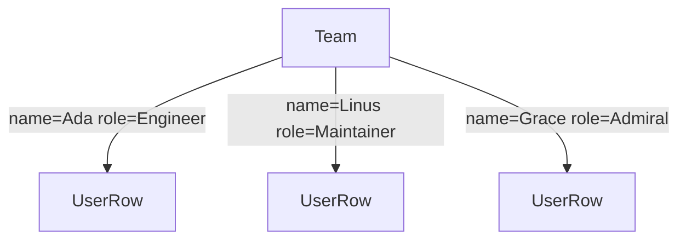
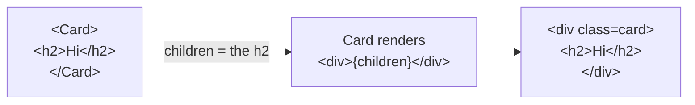
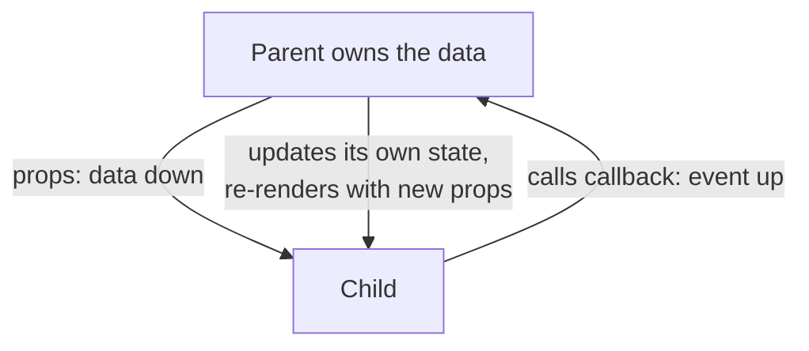
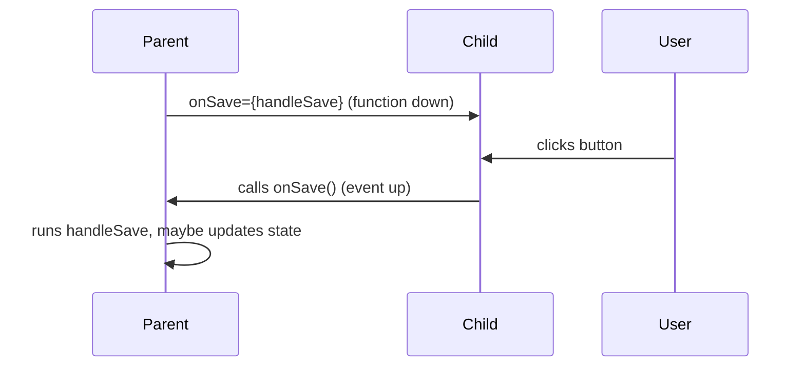
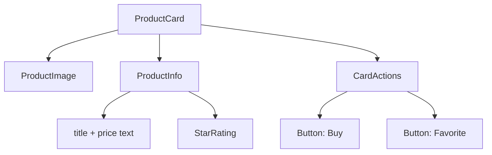

# Part 2 · Components, Props and Composition

> In Part 1 you built components with hardcoded data — every `ProfileCard` looked identical. That's a dead end. This part introduces **props**: the mechanism for passing data *into* components so they become reusable, configurable building blocks. You'll also learn **composition** — how React apps are assembled from small pieces — which is the single most important architectural skill in React.

## Table of Contents

1. [What props are](#1-what-props-are)
2. [Passing and reading props](#2-passing-and-reading-props)
3. [Destructuring and default props](#3-destructuring-and-default-props)
4. [The children prop](#4-the-children-prop)
5. [Composition over configuration](#5-composition-over-configuration)
6. [Props are read-only: one-way data flow](#6-props-are-read-only-one-way-data-flow)
7. [Passing functions as props](#7-passing-functions-as-props)
8. [Thinking in components: splitting a UI](#8-thinking-in-components-splitting-a-ui)
9. [Mini-project: a reusable card system](#9-mini-project-a-reusable-card-system)
10. [Exercises and practice problems](#10-exercises-and-practice-problems)
11. [Glossary](#11-glossary)

---

## 1. What props are

🎯 **Analogy:** A component is a function; **props are its arguments**. Just as `formatCurrency(amount, currency)` produces different output for different arguments, `<Button label="Save" color="blue" />` produces a different button than `<Button label="Delete" color="red" />`. Same function, different inputs, different output. If you're comfortable with function parameters — and you are — you already understand props.

Props (short for "properties") are a single **object** that React passes to your component function, built from the attributes you write in JSX:

```jsx
// When you write this:
<Avatar src="/ada.png" size={96} rounded />

// React calls your function with this props object:
Avatar({ src: '/ada.png', size: 96, rounded: true })
```

Notice: `rounded` with no value becomes `rounded: true` (a boolean shorthand, like HTML). String values use quotes; anything else (numbers, booleans, objects, arrays, functions) uses `{}`.

```jsx
<Product
  name="Keyboard"          // string: quotes
  price={49.99}            // number: braces
  inStock={true}           // boolean: braces
  tags={['new', 'sale']}   // array: braces
  onBuy={handleBuy}        // function: braces
/>
```

> **🔍 Under the hood:** In §1 of Part 1 we saw `<Avatar .../>` compiles to `React.createElement(Avatar, { src, size, rounded })`. That second argument *is* the props object. React takes it and calls `Avatar(props)`. There's no magic — props are literally the function argument, assembled from your JSX attributes.

> **⚠️ Common beginner mistake:** Forgetting braces for non-strings: `size="96"` passes the **string** `"96"`, not the number `96`. Usually harmless for display, but `price="49.99"` will break arithmetic (`price * qty` becomes string concatenation nonsense). Use `{}` for anything that isn't a literal string.

**Key takeaways:**
- Props are a component's inputs — like function arguments.
- They arrive as one object built from your JSX attributes.
- Strings use quotes; everything else uses `{}`. `prop` alone means `prop={true}`.

---

## 2. Passing and reading props

The parent passes props; the child reads them from its `props` parameter.

```jsx
// Child: reads props.name and props.role
function UserRow(props) {
  return (
    <li>
      {props.name} — <em>{props.role}</em>
    </li>
  )
}

// Parent: passes different props to each instance
function Team() {
  return (
    <ul>
      <UserRow name="Ada" role="Engineer" />
      <UserRow name="Linus" role="Maintainer" />
      <UserRow name="Grace" role="Admiral" />
    </ul>
  )
}
```

One component, three uses, three outputs — this is reuse. The parent controls each child by choosing its props.



> **🔍 Under the hood:** Data flows **down** — parent to child, always. The child has no way to reach "up" and grab data from the parent; it can only receive what the parent chose to pass. This one-directional flow (covered in §6) is what makes React apps predictable: to understand any component's output, you only need to know its props, not the entire app.

**Key takeaways:**
- The parent sets props in JSX; the child reads them from its parameter.
- The same component renders differently for different props.
- Data flows downward, parent → child.

---

## 3. Destructuring and default props

Reading `props.name`, `props.role`, `props.everything` gets noisy. Since props is just an object, **destructure** it in the parameter list — this is the idiomatic style you'll see everywhere:

```jsx
// Destructure directly in the parameter — cleaner and self-documenting.
function UserRow({ name, role }) {
  return <li>{name} — <em>{role}</em></li>
}
```

Provide **default values** for optional props with normal JS default parameters:

```jsx
function Button({ label, color = 'blue', disabled = false }) {
  return (
    <button className={`btn btn-${color}`} disabled={disabled}>
      {label}
    </button>
  )
}

<Button label="Save" />                        {/* color defaults to blue */}
<Button label="Delete" color="red" />          {/* color overridden */}
<Button label="Wait" disabled />               {/* disabled = true */}
```

You can also grab "the rest" of the props with the **rest** syntax — handy for forwarding unknown props to a DOM element:

```jsx
// Pull out `label`; collect everything else into `rest`, spread onto <button>.
function IconButton({ label, ...rest }) {
  return <button {...rest}>{label}</button>
}

// onClick and aria-label flow through `rest` to the real button:
<IconButton label="🔍" onClick={search} aria-label="Search" />
```

> **🔍 Under the hood:** `{...rest}` uses JS object spread — the same feature you use in backend code — to copy every remaining prop as an attribute onto the element. This "prop forwarding" pattern is how reusable UI libraries let you pass any native attribute (`id`, `onClick`, `data-*`) through their custom components without listing each one.

> **⚠️ Common beginner mistake:** Destructuring a nested prop that might be undefined: `function Card({ user: { name } })` crashes if `user` is missing. Prefer `function Card({ user })` then read `user?.name`, or default it: `function Card({ user = {} })`.

**Key takeaways:**
- Destructure props in the parameter: `function C({ a, b })`.
- Default optional props with `= value` in the destructure.
- `{...rest}` forwards leftover props onto an element.

---

## 4. The children prop

There's one special prop: **`children`**. It's whatever you put *between* a component's opening and closing tags. This unlocks composition.

```jsx
// Card renders a styled box AROUND whatever you nest inside it.
function Card({ children }) {
  return <div className="card">{children}</div>
}

// Usage — the <h2> and <p> become Card's `children`:
<Card>
  <h2>Welcome</h2>
  <p>This content is passed as children.</p>
</Card>
```

🎯 **Analogy:** `children` is like a picture frame. The `Card` is the frame — it provides border, padding, shadow — and it doesn't care what picture goes inside. You can put text, an image, other components, anything. The frame wraps the content without knowing what it is. This is *dramatically* more flexible than passing content as a string prop.

Compare the two approaches:

```jsx
// ❌ Rigid: content locked to a single string prop
<Card title="Welcome" body="This content is passed as a string." />

// ✅ Flexible: any JSX can go inside
<Card>
  <h2>Welcome</h2>
  
  <button>Go</button>
</Card>
```

> **🔍 Under the hood:** `children` is a normal prop — `<Card>x</Card>` compiles to `createElement(Card, null, x)`, and that third `createElement` argument becomes `props.children`. It can be a string, a single element, or an array of elements (when there are multiple children). React renders it wherever you place `{children}` in your JSX.

> **⚠️ Common beginner mistake:** Forgetting to actually render `{children}`. If your wrapper component doesn't include `{children}` somewhere in its returned JSX, the nested content silently vanishes — React has it, but you never told it where to put it.



**Key takeaways:**
- `children` is the content nested between a component's tags.
- Render it with `{children}` to wrap arbitrary JSX.
- It's far more flexible than passing content via string props.

---

## 5. Composition over configuration

**Composition** means building complex UI by nesting simple components — not by adding endless props/flags to one mega-component. This is React's core design philosophy, and it mirrors good backend design (compose small functions rather than write one giant function with 20 parameters).

Consider a dialog. The "configuration" approach piles on props:

```jsx
// ❌ Configuration hell — every new need = a new prop
<Dialog
  title="Delete file?"
  body="This cannot be undone."
  showCancel={true}
  cancelText="Keep"
  confirmText="Delete"
  confirmColor="red"
  icon="warning"
/>
```

The **composition** approach uses `children` and smaller components:

```jsx
// ✅ Composition — assemble from parts; infinitely flexible
<Dialog>
  <Dialog.Header icon={<WarningIcon />}>Delete file?</Dialog.Header>
  <Dialog.Body>This cannot be undone.</Dialog.Body>
  <Dialog.Footer>
    <Button color="gray">Keep</Button>
    <Button color="red">Delete</Button>
  </Dialog.Footer>
</Dialog>
```

The second version handles *any* header, body, or footer content without new props. You'll formalize this "compound component" pattern in Part 14 — for now, just internalize the principle.

Another everyday composition tool: passing **elements as props** (not just `children`). This is common for "slots":

```jsx
// SplitPane takes two element props and lays them out.
function SplitPane({ left, right }) {
  return (
    <div className="split">
      <div className="pane">{left}</div>
      <div className="pane">{right}</div>
    </div>
  )
}

<SplitPane left={<Sidebar />} right={<Content />} />
```

> **🎯 Rule of thumb:** When you find yourself adding a boolean prop like `showX` or a `xText` string, ask: *could this be `children` or an element prop instead?* Usually yes, and the component gets simpler and more reusable.

**Key takeaways:**
- Prefer composing small components over configuring one big component with many props.
- `children` and element props ("slots") are your composition tools.
- Composition keeps components simple and endlessly reusable.

---

## 6. Props are read-only: one-way data flow

A hard rule: **a component must never modify its own props.** Props are read-only inputs. React relies on this — it's what makes rendering predictable.

```jsx
function Counter({ count }) {
  count = count + 1        // ❌ NEVER mutate props
  return <p>{count}</p>
}
```

If a value needs to *change over time*, it isn't a prop — it's **state** (Part 3). Props come from the parent and are owned by the parent. State is owned by the component itself. This distinction is central.

🎯 **Analogy:** Props are like function arguments passed **by value** in a language where you shouldn't reassign parameters — treat them as constants. If the caller (parent) changes what it passes, your function re-runs with the new value; but *you* don't get to change the argument and expect it to stick.

This gives React **one-way data flow**: data always moves parent → child via props. A child that needs to affect its parent doesn't reach up and mutate — instead the parent passes down a **function** (a callback), and the child calls it (see §7). Data flows down; events flow up via callbacks.



> **🔍 Under the hood:** React re-renders a child when its parent re-renders (Part 3/11 refine this). Each render, the child receives a *fresh* props object. Because props are immutable, React can safely reuse and compare them. Mutating props would corrupt this model and cause subtle, hard-to-trace bugs — which is why React (in Strict Mode) and linters actively discourage it.

> **⚠️ Common beginner mistake:** Trying to "save" a prop into a variable and mutate that to update the UI. It won't re-render. To change what's displayed over time, you need `useState` — the entire subject of Part 3.

**Key takeaways:**
- Never mutate props; treat them as read-only constants.
- Values that change over time are **state**, not props.
- Data flows down (props); events flow up (callbacks) — one-way data flow.

---

## 7. Passing functions as props

Since props can be any value, they can be **functions**. This is how a child communicates back to its parent — the parent hands down a callback, the child invokes it.

```jsx
// Parent owns what happens; passes a function down.
function Toolbar() {
  function handleSave() {
    console.log('Saving...')     // parent decides the behavior
  }
  return <SaveButton onSave={handleSave} />
}

// Child just calls the function it was given, when clicked.
function SaveButton({ onSave }) {
  return <button onClick={onSave}>Save</button>
}
```

Naming convention: props that *are* handlers are named `onSomething` (e.g., `onSave`, `onDelete`), and the internal functions are often `handleSomething`. This mirrors native events (`onClick`, `onChange`).

A critical subtlety — **pass the function, don't call it:**

```jsx
<button onClick={onSave}>     {/* ✅ pass the reference — React calls it on click */}
<button onClick={onSave()}>   {/* ❌ calls it NOW, during render, every render */}
```

If you need to pass arguments, wrap it in an inline arrow so it's *called later*:

```jsx
// ✅ Arrow creates a new function that calls onDelete(id) when clicked.
<button onClick={() => onDelete(item.id)}>Delete</button>
```

> **🔍 Under the hood:** `onClick={onSave}` stores a reference to the function; React invokes it when the click happens. `onClick={onSave()}` *invokes it immediately during rendering* and uses its **return value** as the handler — usually `undefined`, and worse, it runs on every render (often causing infinite loops if it sets state). The arrow-wrapper `() => onDelete(id)` defers the call until the event fires.

> **⚠️ Common beginner mistake:** `onClick={handleClick()}` — the #1 beginner bug. Symptoms: the handler runs on page load instead of on click, or you get "Too many re-renders." Fix: remove the `()`, or wrap in `() => handleClick(args)`.



**Key takeaways:**
- Functions are valid props; they let children notify parents (events up).
- Name handler props `onX` and internal functions `handleX`.
- Pass the function reference (`onClick={fn}`); use `() => fn(arg)` to pass arguments.

---

## 8. Thinking in components: splitting a UI

A core React skill is looking at a design and deciding *where the component boundaries are*. The guideline: **one component = one job** (the single-responsibility principle you know from backend code).

Take a product card mockup. Break it down by responsibility:



How to find the boundaries:
- **Repetition** → a component. Three stars rendered the same way? That's a `Star`, mapped over.
- **Reuse** → a component. Buttons appear everywhere? A shared `Button`.
- **Complexity** → a component. A chunk of JSX doing its own thing? Extract it and name it.
- **Data shape** → a component. Each item in a list often maps to one component.

```jsx
// Composed from focused pieces, each with a single responsibility.
function ProductCard({ product }) {
  return (
    <article className="product">
      <ProductImage src={product.image} alt={product.name} />
      <ProductInfo name={product.name} price={product.price} rating={product.rating} />
      <CardActions onBuy={() => buy(product.id)} onFav={() => fav(product.id)} />
    </article>
  )
}
```

> **💡 Tip:** Don't over-split on day one. Start with a bigger component and extract pieces when they repeat, grow complex, or need reuse. Premature component-splitting is as bad as premature abstraction in backend code. A good trigger: "I'm scrolling to understand this component" → time to split.

> **⚠️ Common beginner mistake:** The opposite extreme — a single 400-line `App` component doing everything. It's hard to read, test, and reuse. If a component has many distinct responsibilities, split by responsibility.

**Key takeaways:**
- One component, one job — split by responsibility.
- Look for repetition, reuse, complexity, and per-item data shape.
- Don't over-split early; extract when there's a real reason.

---

## 9. Mini-project: a reusable card system

🏗️ Convert the Part 1 profile card into a **reusable, composable card system** driven entirely by props and children. This is the natural next step from E8.

**Goal:** A generic `<Card>` wrapper plus focused sub-pieces, rendering a *list* of different users from data.

```bash
npm create vite@latest card-system   # React → JavaScript
cd card-system && npm install && npm run dev
```

```jsx
// src/App.jsx

// 1. A generic wrapper using `children` (composition).
function Card({ children }) {
  return <article style={cardStyle}>{children}</article>
}

// 2. Focused, reusable sub-components driven by props.
function Avatar({ src, alt, size = 88 }) {
  return 
}

function Badge({ children, color = '#22d3ee' }) {
  return <span style={{ ...badgeStyle, background: color }}>{children}</span>
}

function SkillList({ skills }) {
  // Empty-state handled cleanly (guard the leaky 0 from Part 1).
  if (skills.length === 0) return <p style={{ color: '#94a3b8' }}>No skills listed</p>
  return (
    <div>
      {skills.map((s) => (
        <Badge key={s} color="#334155">{s}</Badge>
      ))}
    </div>
  )
}

// 3. Compose a full profile from the pieces — note: all data comes via props.
function ProfileCard({ user }) {
  return (
    <Card>
      <Avatar src={user.avatar} alt={user.name} />
      <h2 style={{ margin: '10px 0 2px' }}>
        {user.name} {user.isPro && <Badge>PRO</Badge>}
      </h2>
      <p style={{ color: '#64748b', marginTop: 0 }}>{user.role}</p>
      <SkillList skills={user.skills} />
    </Card>
  )
}

// 4. Render a LIST of different users — the whole point of props.
const users = [
  { id: 1, name: 'Ada Lovelace', role: 'Engineer', isPro: true,
    avatar: 'https://i.pravatar.cc/120?img=47', skills: ['React', 'JS', 'CSS'] },
  { id: 2, name: 'Linus T.', role: 'Maintainer', isPro: false,
    avatar: 'https://i.pravatar.cc/120?img=12', skills: ['C', 'Git'] },
  { id: 3, name: 'Grace Hopper', role: 'Admiral', isPro: true,
    avatar: 'https://i.pravatar.cc/120?img=32', skills: [] },
]

export default function App() {
  return (
    <div style={{ display: 'flex', gap: 20, flexWrap: 'wrap', justifyContent: 'center', padding: 40 }}>
      {users.map((u) => (
        <ProfileCard key={u.id} user={u} />
      ))}
    </div>
  )
}

const cardStyle = { width: 240, padding: 22, borderRadius: 16, textAlign: 'center',
  fontFamily: 'system-ui', boxShadow: '0 8px 30px rgba(0,0,0,.12)' }
const badgeStyle = { fontSize: 11, color: '#04121f', padding: '2px 8px', borderRadius: 999,
  marginLeft: 4, fontWeight: 700, display: 'inline-block' }
```

**What just leveled up from Part 1:**

```cards
Reuse via props :: One ProfileCard renders three different people from data.
Composition :: Card wraps arbitrary children; pieces snap together.
Sub-components :: Avatar, Badge, SkillList each do one job and are reused.
Empty states :: SkillList handles the no-skills case gracefully.
```

**Extend it (do at least three):**
1. Add a `<Card>`-based `StatCard` (label + big number) reusing the same `Card` wrapper.
2. Give `Badge` a `size` prop (`sm`/`lg`) and use both sizes.
3. Add an `onSelect` function prop to `ProfileCard`; log the user's name when the card is clicked (preview of Part 3/7).
4. Extract the header (`Avatar` + name + role) into `<CardHeader user={user} />`.
5. Add a 4th user with no avatar; make `Avatar` show a placeholder when `src` is missing.

> **💡 Tip:** Notice you didn't touch `Card`, `Avatar`, or `Badge` to render a completely different set of people — you only changed *data*. That's the power of props: components become stable, data becomes the variable. This separation is what makes React scale.

**Key takeaways:**
- Props turned one card into a reusable component rendering many people.
- Composition (`children`) + focused sub-components = clean, flexible UI.
- Components stay stable; data drives what appears.

---

## 10. Exercises and practice problems

### 🧪 Warm-ups (easy)

**E1.** Write `Price({ amount })` that renders `$` + the amount fixed to 2 decimals. Render `<Price amount={9.5} />`.

<details><summary>Show solution</summary>

```jsx
function Price({ amount }) {
  return <span>${amount.toFixed(2)}</span>
}
<Price amount={9.5} />   // $9.50
```

*Why:* Destructure `amount`, use it as a number (braces when passing!).
</details>

**E2.** Write `Alert({ children, type = 'info' })` that wraps `children` in a `<div className={\`alert alert-${type}\`}>`. Render an info alert and an error alert.

<details><summary>Show solution</summary>

```jsx
function Alert({ children, type = 'info' }) {
  return <div className={`alert alert-${type}`}>{children}</div>
}
<Alert>Saved!</Alert>
<Alert type="error">Something broke.</Alert>
```

*Why:* `children` holds the message; `type` defaults to `'info'`.
</details>

### 🧪 Core (medium)

**E3.** Fix this bug: the button fires immediately on render instead of on click.

```jsx
function Row({ id, onDelete }) {
  return <button onClick={onDelete(id)}>Delete</button>
}
```

<details><summary>Show solution</summary>

```jsx
function Row({ id, onDelete }) {
  return <button onClick={() => onDelete(id)}>Delete</button>
}
```

*Why:* `onDelete(id)` *calls* the function during render. Wrap it in an arrow so it's called on click with the argument.
</details>

**E4.** Build `<List items={['a','b','c']} renderItem={fn} />` where `List` maps over `items` and calls `renderItem(item)` for each. Render the items as `<li>`s in uppercase.

<details><summary>Show solution</summary>

```jsx
function List({ items, renderItem }) {
  return <ul>{items.map(renderItem)}</ul>
}
<List
  items={['a', 'b', 'c']}
  renderItem={(x) => <li key={x}>{x.toUpperCase()}</li>}
/>
```

*Why:* A function prop (`renderItem`) lets the parent control how each item looks — a taste of the "render prop" pattern (Part 14).
</details>

**E5.** Create a `Stack({ children, gap = 8 })` layout component that renders its children in a vertical flex column with the given gap. Use it to stack three paragraphs.

<details><summary>Show solution</summary>

```jsx
function Stack({ children, gap = 8 }) {
  return <div style={{ display: 'flex', flexDirection: 'column', gap }}>{children}</div>
}
<Stack gap={16}>
  <p>One</p><p>Two</p><p>Three</p>
</Stack>
```

*Why:* A layout component wraps `children` and applies spacing — pure composition.
</details>

### 🧪 Challenge (hard)

**E6.** Refactor this over-configured component into a composition-based one using `children` and sub-components:

```jsx
<Panel
  title="Settings"
  footerText="Save"
  footerColor="blue"
  bodyText="Adjust your preferences."
/>
```

<details><summary>Show solution</summary>

```jsx
function Panel({ children }) { return <section className="panel">{children}</section> }
function PanelTitle({ children }) { return <h2>{children}</h2> }
function PanelBody({ children }) { return <div className="panel-body">{children}</div> }
function PanelFooter({ children }) { return <footer>{children}</footer> }

<Panel>
  <PanelTitle>Settings</PanelTitle>
  <PanelBody>Adjust your preferences.</PanelBody>
  <PanelFooter><Button color="blue">Save</Button></PanelFooter>
</Panel>
```

*Why:* Composition removes the prop explosion and lets the footer contain *any* content (an icon, two buttons, etc.), not just text.
</details>

**E7 (forwarding).** Write `Input({ label, ...rest })` that renders a `<label>` with the text and an `<input>` that receives all other props (`type`, `placeholder`, `value`, `onChange`). Verify `<Input label="Email" type="email" placeholder="you@x.com" />` works.

<details><summary>Show solution</summary>

```jsx
function Input({ label, ...rest }) {
  return (
    <label style={{ display: 'block' }}>
      {label}
      <input {...rest} />
    </label>
  )
}
```

*Why:* `{...rest}` forwards every native input attribute through your wrapper — the pattern real UI libraries use.
</details>

**E8 (capstone step).** Take your card-system project and add a `<Grid columns={3}>{children}</Grid>` component that arranges its children in a CSS grid. Wrap your list of `ProfileCard`s in it. You now have reusable *layout* + *content* components — keep this; Part 3 will make the cards interactive (favoriting).

<details><summary>Show hint</summary>

```jsx
function Grid({ columns = 2, children }) {
  return (
    <div style={{ display: 'grid', gridTemplateColumns: `repeat(${columns}, 1fr)`, gap: 16 }}>
      {children}
    </div>
  )
}
```

Then `<Grid columns={3}>{users.map(u => <ProfileCard key={u.id} user={u} />)}</Grid>`.
</details>

---

## 11. Glossary

| Term | Meaning |
| --- | --- |
| **Props** | Read-only inputs passed to a component (its "arguments"), as one object. |
| **Destructuring** | Pulling named values out of the props object in the parameter list. |
| **Default prop** | A fallback value via JS default parameters: `{ color = 'blue' }`. |
| **`children`** | The special prop holding content nested between a component's tags. |
| **Composition** | Building UI by nesting small components rather than configuring one big one. |
| **Slot / element prop** | Passing a JSX element as a prop for the child to place. |
| **One-way data flow** | Data moves parent → child (props); events move up via callbacks. |
| **Prop forwarding** | Passing leftover props onto an inner element with `{...rest}`. |
| **Callback prop** | A function passed down so the child can notify the parent. |

---

> **You can now build reusable, composable components.** But everything so far is static — the screen never changes after it loads. Time to bring components to life.
>
> **Next:** [Part 3 · State and Event Handling →](03-state-and-events.md)
