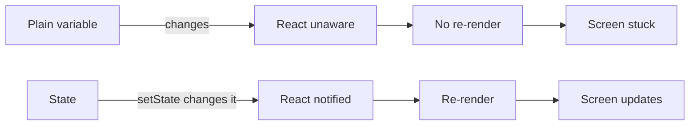
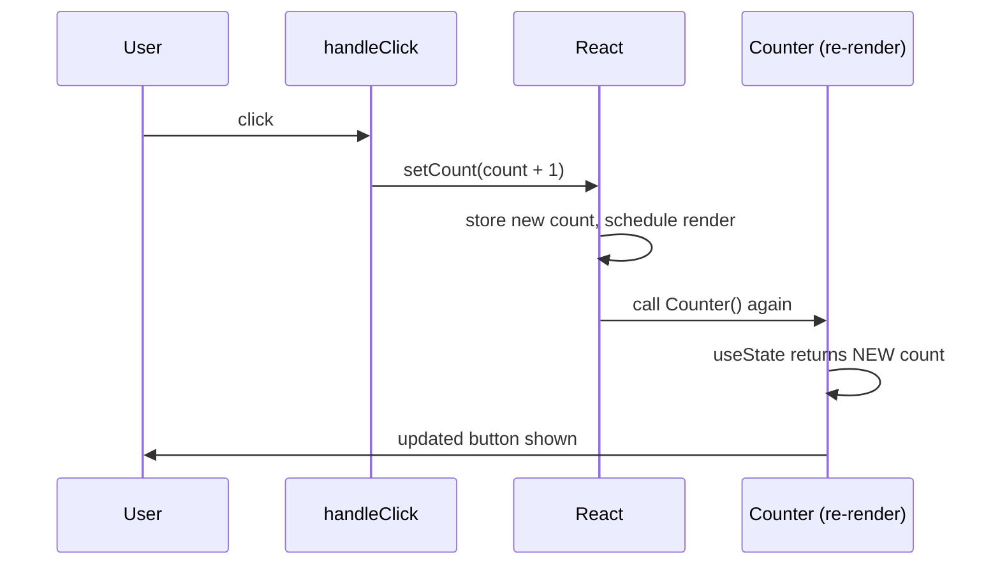
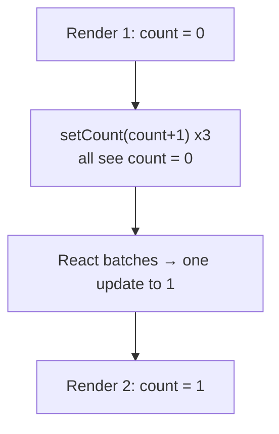
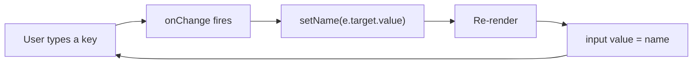

# Part 3 · State and Event Handling

> Everything so far has been static — the screen never changes after it loads. This part is where React comes alive. **State** is data a component owns that can change over time, and when it changes, React re-renders to reflect it. Combined with **event handlers**, state is what turns your JSX into an interactive application. This is the most important part of the series so far — read it slowly.

## Table of Contents

1. [What state is and why props aren't enough](#1-what-state-is-and-why-props-arent-enough)
2. [useState: your first hook](#2-usestate-your-first-hook)
3. [Handling events](#3-handling-events)
4. [State updates are asynchronous and batched](#4-state-updates-are-asynchronous-and-batched)
5. [Updater functions: the safe way to update](#5-updater-functions-the-safe-way-to-update)
6. [State is immutable: objects and arrays](#6-state-is-immutable-objects-and-arrays)
7. [Where state lives: lifting state up](#7-where-state-lives-lifting-state-up)
8. [Controlled inputs: a first look](#8-controlled-inputs-a-first-look)
9. [Capstone kickoff: the Todo app](#9-capstone-kickoff-the-todo-app)
10. [Exercises and practice problems](#10-exercises-and-practice-problems)
11. [Glossary](#11-glossary)

> **💡 Suggested learning order:** Sections 1–5 are the core loop — read them together and do the counter exercises before moving on. Sections 6–8 build on that. The capstone (§9) ties it all together.

---

## 1. What state is and why props aren't enough

🎯 **Analogy:** Props are the arguments a function receives from its caller — you can't change them, they come from outside. **State** is a local variable a function *owns and can change* — except with a superpower: when you change it, React automatically re-runs the function (re-renders the component) so the screen updates. Think of state as a variable that, when reassigned, magically refreshes the UI that depends on it.

Recall from Part 2: **props are read-only**. So how does anything change? Consider a counter button. The count needs to increase when clicked. It can't be a prop (the component can't change props), and it can't be a plain variable:

```jsx
function Counter() {
  let count = 0                                  // ❌ a plain variable

  function handleClick() {
    count = count + 1                            // this DOES change the variable...
    console.log(count)                           // ...logs 1, 2, 3 — but the screen never updates!
  }

  return <button onClick={handleClick}>Count: {count}</button>
}
```

Click it: the console shows the count rising, but the button always says "Count: 0". **Two problems:**
1. React doesn't know the variable changed, so it never re-renders.
2. Even if it did re-render, `let count = 0` would reset to 0 every time the function runs.

State solves both. It **persists across renders** and **triggers a re-render when changed**.



> **🔍 Under the hood:** Every time React renders a component, it calls your function fresh — so any `let`/`const` inside is recreated from scratch. State is different: React stores it *outside* your function (in its internal memory for that component instance) and hands it back to you on each render. That's why state survives re-renders while local variables don't.

> **⚠️ Common beginner mistake:** Trying to make the UI update by reassigning a normal variable, or by mutating a prop. Neither triggers a render. **If a value changes over time and the UI must reflect it, it must be state.**

**Key takeaways:**
- Props come from the parent and are read-only; state is owned and changeable by the component.
- A plain variable can't drive UI updates — it's reset each render and React ignores it.
- State persists across renders *and* triggers a re-render when it changes.

---

## 2. useState: your first hook

State is added with the **`useState`** hook. A "hook" is a special function (name starts with `use`) that lets a component tap into React features. `useState` gives you a state value and a function to update it.

```jsx
import { useState } from 'react'

function Counter() {
  // useState(0) => returns a pair: [current value, setter function]
  const [count, setCount] = useState(0)
  //     ▲ read      ▲ update        ▲ initial value (used only on first render)

  function handleClick() {
    setCount(count + 1)      // ask React to update state AND re-render
  }

  return <button onClick={handleClick}>Count: {count}</button>
}
```

Now clicking works: `setCount` updates the stored value *and* tells React to re-render. On the next render, `useState(0)` returns the **new** count (React ignores the `0` after the first render).

The three pieces of `useState`:

| Piece | Role |
| --- | --- |
| `count` | The current state value for this render. |
| `setCount` | The setter — call it to change state and trigger a re-render. |
| `useState(0)` | The initial value, used **only** on the first render. |

You can have as many state variables as you want — call `useState` once per independent piece of state:

```jsx
function Form() {
  const [name, setName] = useState('')
  const [age, setAge] = useState(0)
  const [agreed, setAgreed] = useState(false)
  // three independent pieces of state
}
```

> **🔍 Under the hood:** How does React know which `useState` call is which, when they have no names? It relies on **call order**. On every render, React expects `useState` to be called the same number of times, in the same order. It stores state in a list indexed by call position: the 1st `useState` → slot 0, the 2nd → slot 1, etc. This is *why* the Rules of Hooks (Part 5) forbid calling hooks conditionally — it would scramble the slot order and corrupt state.

> **⚠️ Common beginner mistake:** Reading state right after setting it: `setCount(count + 1); console.log(count)` logs the **old** value. `setCount` doesn't change the `count` variable in the current render — it schedules a *new render* where `count` will be updated. (More in §4.)



**Key takeaways:**
- `const [value, setValue] = useState(initial)` adds one piece of state.
- The setter updates state *and* triggers a re-render; the initial value is first-render only.
- React tracks state by hook **call order** — always call hooks unconditionally, at the top.

---

## 3. Handling events

React events look like HTML but are camelCased and take a **function**, not a string. You've seen `onClick`; there are handlers for every DOM event.

```jsx
function Demo() {
  return (
    <div>
      <button onClick={() => console.log('clicked')}>Click</button>
      <input onChange={(e) => console.log(e.target.value)} />
      <form onSubmit={(e) => e.preventDefault()}>...</form>
      <div onMouseEnter={() => console.log('hover')}>Hover me</div>
    </div>
  )
}
```

Handlers receive a **synthetic event** object (`e`) — React's cross-browser wrapper around the native event. The most-used bits:

| You need | Use |
| --- | --- |
| The input's current value | `e.target.value` |
| Stop form reload / link navigation | `e.preventDefault()` |
| Stop the event bubbling to parents | `e.stopPropagation()` |
| Which key was pressed | `e.key` (e.g., `'Enter'`) |
| A checkbox's checked state | `e.target.checked` |

Three ways to attach a handler — know when to use each:

```jsx
// 1. Inline arrow — great for short logic or passing arguments
<button onClick={() => setCount(count + 1)}>+1</button>

// 2. Reference to a named function — cleaner for longer logic
function handleReset() { setCount(0) }
<button onClick={handleReset}>Reset</button>

// 3. Arrow that passes an argument (from Part 2 §7)
<button onClick={() => removeItem(item.id)}>Remove</button>
```

> **🔍 Under the hood:** React doesn't attach a listener to every element. It uses **event delegation**: a single listener at the root of your app catches events as they bubble up, then dispatches to the right handler. This is efficient (one listener instead of thousands) and is why React events feel seamless. The `e` you receive is a `SyntheticEvent` normalizing browser differences; `e.nativeEvent` is the raw DOM event if you ever need it.

> **⚠️ Common beginner mistake:** Two classics from Part 2, worth repeating because they cause the most beginner pain:
> - `onClick={handleClick()}` — calls it during render. Use `onClick={handleClick}`.
> - Forgetting `e.preventDefault()` on `onSubmit`, so the form reloads the whole page and your state vanishes.

**Key takeaways:**
- Event props are camelCased (`onClick`, `onChange`, `onSubmit`) and take a function.
- Handlers get a synthetic event `e`; use `e.target.value`, `e.preventDefault()`, `e.key`.
- Use inline arrows for short logic or arguments; named functions for longer logic.

---

## 4. State updates are asynchronous and batched

This trips up *every* beginner, so let's confront it directly. When you call a setter, the state does **not** change immediately in the current function. React schedules the update and applies it on the next render.

```jsx
function Counter() {
  const [count, setCount] = useState(0)

  function handleClick() {
    setCount(count + 1)
    console.log(count)      // ⚠️ logs the OLD value (e.g. 0), not 1
  }
  // ...
}
```

The `count` variable is a **snapshot** for *this* render — it won't change mid-function. `setCount` schedules a re-render where `count` will be the new value.

Even more surprising — this only increments by **1**, not 3:

```jsx
function handleTriple() {
  setCount(count + 1)   // count is 0 → schedules count = 1
  setCount(count + 1)   // count is STILL 0 → schedules count = 1
  setCount(count + 1)   // count is STILL 0 → schedules count = 1
}                       // result: 1, not 3
```

Because `count` is `0` for the whole function, all three calls compute `0 + 1`. React also **batches** these three updates into a single re-render for performance.

🎯 **Analogy:** Think of `count` in a given render like a `const` captured in a closure — it has a fixed value for that entire execution. Calling `setCount` is like leaving a note for React: "next time, use this value." Reading `count` after doesn't re-read the note; you still see the value frozen for this render.



> **🔍 Under the hood:** Each render has its **own** `count` value, captured in that render's scope. React "batches" all state updates triggered by the same event into one re-render (React 18+ batches across promises/timeouts too). This is why reading state right after setting it gives the old value, and why calling a setter multiple times with the same base value collapses into one increment.

> **⚠️ Common beginner mistake:** Expecting `setCount(count + 1)` three times to add 3, or expecting `count` to be updated on the next line. To reliably build on the previous state, use an **updater function** — the subject of §5.

**Key takeaways:**
- Setters don't change state immediately; they schedule a re-render.
- `count` is a fixed snapshot within a single render.
- React batches multiple updates from one event into a single re-render.

---

## 5. Updater functions: the safe way to update

When your new state depends on the previous state, pass a **function** to the setter instead of a value. React calls it with the latest state and uses the return value.

```jsx
function handleTriple() {
  setCount((c) => c + 1)   // c = 0 → 1
  setCount((c) => c + 1)   // c = 1 → 2   (gets the pending value!)
  setCount((c) => c + 1)   // c = 2 → 3
}                          // result: 3 ✓
```

The updater form (`setCount(c => c + 1)`) receives the **most recent pending state**, so chained updates compound correctly. The direct form (`setCount(count + 1)`) uses the render's snapshot.

**When to use which:**

| Situation | Use |
| --- | --- |
| New value depends on previous (`+1`, toggle, append) | Updater: `setX(prev => ...)` ✅ |
| New value is independent (setting from an input) | Direct: `setX(e.target.value)` is fine |
| Multiple updates in one handler | Updater — always |

```jsx
// Toggle — depends on previous, use updater
setIsOpen((open) => !open)

// Increment — depends on previous, use updater
setCount((c) => c + 1)

// Set from input — independent, direct is fine
setName(e.target.value)
```

> **🔍 Under the hood:** React keeps a **queue** of updates for each state variable. A direct value replaces the queued value; an updater function is *added to the queue* and run in order, each receiving the result of the previous. That's why updaters compose and direct calls with a stale snapshot don't. When in doubt, use the updater — it's always correct for dependent updates.

> **⚠️ Common beginner mistake:** Using the direct form inside loops, timeouts, or multiple sequential updates and getting "off by one" bugs. Rule of thumb: **if the new state is computed from the old state, use the updater function.**

**Key takeaways:**
- `setX(prev => next)` reads the latest pending state — safe for dependent updates.
- `setX(value)` uses the current render's snapshot — fine for independent values.
- When new state depends on old state, always use the updater form.

---

## 6. State is immutable: objects and arrays

React state must be treated as **immutable** — never mutate it in place. Instead, create a *new* object or array with the change. This is critical for objects and arrays, where the instinct to `.push()` or reassign a property is strong.

**Why?** React decides whether to re-render partly by checking if the state *reference* changed. Mutating in place keeps the same reference, so React may not re-render, or may behave unpredictably.

```jsx
const [user, setUser] = useState({ name: 'Ada', age: 36 })

// ❌ Mutation — same object reference, React may not re-render
function birthday() {
  user.age = user.age + 1
  setUser(user)             // same reference → often no update
}

// ✅ New object with spread — new reference, guaranteed re-render
function birthday() {
  setUser({ ...user, age: user.age + 1 })   // copy all fields, override age
}
```

Same for arrays — use non-mutating operations:

```jsx
const [todos, setTodos] = useState(['Buy milk'])

// ❌ Mutating methods
todos.push('Call Sam')          // mutates in place — don't
todos.splice(0, 1)              // mutates — don't

// ✅ Return new arrays
setTodos([...todos, 'Call Sam'])                 // add
setTodos(todos.filter((t) => t !== 'Buy milk')) // remove
setTodos(todos.map((t) => t === 'Buy milk' ? 'Buy oat milk' : t)) // update
```

Here's the cheat sheet you'll use constantly:

| Operation | ❌ Mutating | ✅ Immutable |
| --- | --- | --- |
| Add to array | `arr.push(x)` | `[...arr, x]` |
| Remove from array | `arr.splice(i, 1)` | `arr.filter((_, idx) => idx !== i)` |
| Update array item | `arr[i] = x` | `arr.map((el, idx) => idx === i ? x : el)` |
| Add/change object field | `obj.k = v` | `{ ...obj, k: v }` |
| Remove object field | `delete obj.k` | `const { k, ...rest } = obj` |

🎯 **Analogy:** Treat state like an **immutable data structure** or a value in functional programming — you don't edit it, you produce a new version. If you've worked with immutable records or Redux reducers, this is the same discipline. Each "change" is really "compute the next value from the current one."

> **🔍 Under the hood:** React (and optimizations like `React.memo`, Part 11) compare state by **reference identity** (`Object.is`), not deep equality — because deep-comparing every object on every render would be slow. A new reference signals "this changed"; the same reference signals "unchanged." Mutating breaks this contract and produces stale UI. For deeply nested state, either spread at each level or use a helper like Immer (common with Redux Toolkit, Part 9).

> **⚠️ Common beginner mistake:** `todos.push(newTodo); setTodos(todos)` — the list doesn't update on screen because it's the same array reference. Always build a new array/object.

**Key takeaways:**
- Never mutate state; create a new object/array with the change.
- Use `[...arr, x]`, `.filter`, `.map`, and `{ ...obj, k: v }`.
- React detects changes by reference — a new reference is required to re-render reliably.

---

## 7. Where state lives: lifting state up

When two components need the same state, put it in their **closest common parent** and pass it down as props. This is called **lifting state up**, and it's the fundamental pattern for sharing state.

The problem: two sibling components need to share a value. Siblings can't pass props to each other (data only flows down). So move the state *up* to their parent:

```jsx
// Parent OWNS the state; passes value down + a setter down.
function Thermostat() {
  const [temp, setTemp] = useState(20)
  return (
    <div>
      <TempDisplay temp={temp} />                {/* reads it */}
      <TempControls temp={temp} onChange={setTemp} />  {/* changes it */}
    </div>
  )
}

// Child A: display only — receives temp as a prop
function TempDisplay({ temp }) {
  return <h2>{temp}°C</h2>
}

// Child B: controls — receives a callback to change the parent's state
function TempControls({ temp, onChange }) {
  return (
    <div>
      <button onClick={() => onChange(temp - 1)}>−</button>
      <button onClick={() => onChange(temp + 1)}>+</button>
    </div>
  )
}
```

Now both children stay in sync because there's **one source of truth** (the parent's `temp`). The display reads it; the controls change it via the callback (events flow up, Part 2 §7).

```mermaid
flowchart TD
  T["Thermostat<br/>(owns temp state)"] -->|temp| D[TempDisplay]
  T -->|temp + onChange| C[TempControls]
  C -->|onChange(newTemp): event up| T
  T -->|re-render with new temp| D
```

🎯 **Analogy:** If two microservices need the same data, you don't copy it into both — you put it in a shared store both read from. Lifting state up is the same: one owner (the parent), many readers (children via props). Duplicating state in two places leads to them drifting out of sync — the classic distributed-state bug.

> **🔍 Under the hood:** "Single source of truth" means each piece of state has exactly one owner. Children never copy shared state into their own `useState` — they receive it as props. When the owner's state changes, React re-renders it and all children that received the prop, keeping everything consistent automatically.

> **⚠️ Common beginner mistake:** Keeping duplicate copies of the same data in multiple components' state, then struggling to keep them in sync. Lift it to the common parent instead. (When "the common parent" is far away and prop-drilling gets painful, that's what Context and state libraries solve — Part 9.)

**Key takeaways:**
- Shared state belongs in the closest common parent (single source of truth).
- Pass the value down as a prop; pass a setter/callback down to change it.
- Don't duplicate the same state in multiple components.

---

## 8. Controlled inputs: a first look

Form inputs are a special case of state you'll use constantly. A **controlled input** is one whose value is driven by React state — the state is the single source of truth, and the input just reflects it. (Part 7 covers forms in depth; this is the essential idea.)

```jsx
function NameField() {
  const [name, setName] = useState('')

  return (
    <div>
      <input
        value={name}                              // input shows the state
        onChange={(e) => setName(e.target.value)} // typing updates the state
      />
      <p>Hello, {name || 'stranger'}</p>          {/* UI reacts instantly */}
    </div>
  )
}
```

The loop: you type → `onChange` fires → `setName` updates state → re-render → `value={name}` shows the new text. React state and the input are always in lockstep.



> **🔍 Under the hood:** A controlled input's displayed value comes from `value={state}`, not from the browser's own tracking. Every keystroke goes through React: `onChange` updates state, React re-renders, the input reflects the new state. This gives you full control — you can transform input (uppercase, strip characters), validate live, or disable the submit button based on the value.

> **⚠️ Common beginner mistake:** Setting `value={name}` **without** an `onChange`. The input becomes read-only (React pins it to the state, but nothing updates the state) — typing does nothing. Either provide `onChange`, or use `defaultValue` for an uncontrolled input (Part 7).

**Key takeaways:**
- A controlled input's `value` comes from state; `onChange` writes back to state.
- State is the single source of truth; the input mirrors it every keystroke.
- `value` without `onChange` = a stuck, read-only input.

---

## 9. Capstone kickoff: the Todo app

🏗️ **Capstone #1 begins here.** You'll build a Todo app across Parts 3–5, growing it as you learn more. Today's version uses everything from this part: `useState`, events, immutable array updates, and a controlled input. Keep this project — you'll extend it in Part 4 (rendering the list properly with keys) and Part 5 (custom hooks, filtering).

```bash
npm create vite@latest todo-app     # React → JavaScript
cd todo-app && npm install && npm run dev
```

```jsx
// src/App.jsx
import { useState } from 'react'

export default function App() {
  const [todos, setTodos] = useState([
    { id: 1, text: 'Learn useState', done: true },
    { id: 2, text: 'Build a todo app', done: false },
  ])
  const [draft, setDraft] = useState('')          // controlled input state

  function addTodo(e) {
    e.preventDefault()                            // don't reload the page
    const text = draft.trim()
    if (!text) return                             // ignore empty submissions
    const newTodo = { id: Date.now(), text, done: false }
    setTodos((prev) => [...prev, newTodo])        // immutable append (updater)
    setDraft('')                                  // clear the input
  }

  function toggle(id) {
    // Immutable update: map to a new array, flip `done` on the matching item.
    setTodos((prev) =>
      prev.map((t) => (t.id === id ? { ...t, done: !t.done } : t))
    )
  }

  function remove(id) {
    setTodos((prev) => prev.filter((t) => t.id !== id))  // immutable remove
  }

  const remaining = todos.filter((t) => !t.done).length

  return (
    <main style={wrap}>
      <h1>Todo ({remaining} left)</h1>

      <form onSubmit={addTodo} style={{ display: 'flex', gap: 8 }}>
        <input
          value={draft}
          onChange={(e) => setDraft(e.target.value)}   // controlled input
          placeholder="What needs doing?"
          style={{ flex: 1, padding: 8 }}
        />
        <button type="submit">Add</button>
      </form>

      <ul style={{ listStyle: 'none', padding: 0 }}>
        {todos.map((t) => (
          <li key={t.id} style={{ display: 'flex', gap: 8, alignItems: 'center', padding: '6px 0' }}>
            <input type="checkbox" checked={t.done} onChange={() => toggle(t.id)} />
            <span style={{ flex: 1, textDecoration: t.done ? 'line-through' : 'none' }}>
              {t.text}
            </span>
            <button onClick={() => remove(t.id)}>✕</button>
          </li>
        ))}
      </ul>
    </main>
  )
}

const wrap = { maxWidth: 420, margin: '40px auto', fontFamily: 'system-ui' }
```

**Trace every Part 3 concept in this code:**

```cards
useState :: todos (array) and draft (input string) — two independent pieces of state.
Events :: onSubmit (add), onChange (typing + toggle), onClick (remove).
Updater fns :: setTodos(prev => ...) everywhere new state depends on the old.
Immutability :: spread to add, .map to toggle, .filter to remove — never mutate.
Controlled input :: value={draft} + onChange keeps the field and state in sync.
Derived value :: `remaining` is computed from todos — no separate state needed!
```

> **💡 Tip — derived state:** Notice `remaining` is *computed* from `todos` during render, not stored in its own `useState`. This is a golden rule: **don't store what you can compute.** A separate `remaining` state would risk drifting out of sync with `todos`. Compute derived values inline.

**Extend it (do at least three):**
1. Add a "Clear completed" button that removes all done todos (`filter`).
2. Disable the Add button when the input is empty.
3. Add a "Mark all done" button (`map` setting every `done` to `true`).
4. Prevent duplicate todos (same text) — show nothing or ignore the add.
5. Show "All done! 🎉" when `todos` is non-empty and `remaining === 0`.

> **⚠️ Watch the console:** No key warning here — we added `key={t.id}`. Part 4 explains exactly why keys matter and what breaks without them.

**Key takeaways:**
- You built a real interactive app: add, toggle, remove, live count.
- Derived values (`remaining`) are computed, not stored.
- Immutable updates + updater functions + controlled input = the core React loop.

---

## 10. Exercises and practice problems

### 🧪 Warm-ups (easy)

**E1.** Build a counter with `+`, `−`, and `Reset` buttons using one `useState`.

<details><summary>Show solution</summary>

```jsx
function Counter() {
  const [n, setN] = useState(0)
  return (
    <div>
      <button onClick={() => setN((c) => c - 1)}>−</button>
      <span> {n} </span>
      <button onClick={() => setN((c) => c + 1)}>+</button>
      <button onClick={() => setN(0)}>Reset</button>
    </div>
  )
}
```

*Why:* Updater form for the dependent +/−; direct `0` for reset (independent).
</details>

**E2.** Build a toggle that shows/hides a paragraph with a single button.

<details><summary>Show solution</summary>

```jsx
function Toggle() {
  const [open, setOpen] = useState(false)
  return (
    <div>
      <button onClick={() => setOpen((o) => !o)}>{open ? 'Hide' : 'Show'}</button>
      {open && <p>Now you see me.</p>}
    </div>
  )
}
```

*Why:* `!o` via updater; `open && <p/>` for conditional rendering (Part 1 §7).
</details>

### 🧪 Core (medium)

**E3.** This adds only 1 instead of 5. Fix it.

```jsx
function handleClick() {
  for (let i = 0; i < 5; i++) setCount(count + 1)
}
```

<details><summary>Show solution</summary>

```jsx
function handleClick() {
  for (let i = 0; i < 5; i++) setCount((c) => c + 1)
}
```

*Why:* In the loop, `count` is the same snapshot every iteration, so `count + 1` is identical five times. The updater `c => c + 1` reads the latest pending value, so it compounds to +5.
</details>

**E4.** Build a form with a controlled `<input>` and `<textarea>`. Show a live character count under the textarea.

<details><summary>Show solution</summary>

```jsx
function Feedback() {
  const [title, setTitle] = useState('')
  const [body, setBody] = useState('')
  return (
    <form>
      <input value={title} onChange={(e) => setTitle(e.target.value)} />
      <textarea value={body} onChange={(e) => setBody(e.target.value)} />
      <small>{body.length} characters</small>
    </form>
  )
}
```

*Why:* Each control is bound to its own state; the count is *derived* from `body.length`.
</details>

**E5.** State object update: given `const [form, setForm] = useState({ email: '', pw: '' })`, write a single `handleChange(e)` that updates the right field based on the input's `name`.

<details><summary>Show solution</summary>

```jsx
function handleChange(e) {
  const { name, value } = e.target
  setForm((prev) => ({ ...prev, [name]: value }))   // computed key + spread
}
// <input name="email" value={form.email} onChange={handleChange} />
// <input name="pw"    value={form.pw}    onChange={handleChange} />
```

*Why:* Spread keeps other fields; `[name]: value` updates just the changed one immutably. One handler for the whole form.
</details>

### 🧪 Challenge (hard)

**E6.** Lift state up: build `<TemperatureConverter />` with two inputs (Celsius and Fahrenheit). Typing in one updates the other. Keep a *single* source of truth.

<details><summary>Show solution</summary>

```jsx
function TemperatureConverter() {
  const [celsius, setCelsius] = useState(0)      // ONE source of truth
  const fahrenheit = celsius * 9 / 5 + 32        // derived, not stored

  return (
    <div>
      <label>°C <input type="number" value={celsius}
        onChange={(e) => setCelsius(Number(e.target.value))} /></label>
      <label>°F <input type="number" value={fahrenheit}
        onChange={(e) => setCelsius((Number(e.target.value) - 32) * 5 / 9)} /></label>
    </div>
  )
}
```

*Why:* Storing both temperatures risks them drifting apart. Store one, derive the other. The F input converts back to C on change. This is "single source of truth" + "derive don't duplicate."
</details>

**E7.** Predict, then verify. What does `count` show after clicking once?

```jsx
const [count, setCount] = useState(0)
function onClick() {
  setCount(count + 1)
  setCount(count + 1)
  setCount((c) => c + 1)
}
```

<details><summary>Show solution</summary>

**Result: 2.** Walkthrough of the queue (base `count = 0`):
1. `setCount(count + 1)` → queue: "set to 1"
2. `setCount(count + 1)` → queue: "set to 1" (still snapshot 0)
3. `setCount(c => c + 1)` → queue: "1 + 1 = 2"

Final value = 2. The two direct calls both set to 1; the updater then adds 1 to that pending 1.

*Why:* Direct values overwrite with the snapshot-based number; updaters build on the pending value. Mixing them is exactly why "always use updaters for dependent updates" is the rule.
</details>

**E8 (capstone step).** In your Todo app, add an **edit** feature: clicking a todo's text turns it into a controlled input; pressing Enter saves (immutable `map` update), Escape cancels. Keep this — Part 4 will render lists more robustly and Part 5 will extract this logic into a custom hook.

<details><summary>Show hint</summary>

Track `editingId` and `editText` in state. When `editingId === t.id`, render an `<input value={editText} .../>` instead of the `<span>`. On Enter (`e.key === 'Enter'`), do `setTodos(prev => prev.map(t => t.id === editingId ? { ...t, text: editText } : t))` and clear `editingId`. On Escape, just clear `editingId`.
</details>

---

## 11. Glossary

| Term | Meaning |
| --- | --- |
| **State** | Data a component owns that can change and triggers re-renders when it does. |
| **`useState`** | The hook that adds state: `const [value, setValue] = useState(initial)`. |
| **Setter** | The function from `useState` that updates state and schedules a re-render. |
| **Updater function** | `setX(prev => next)` — receives the latest pending state; safe for dependent updates. |
| **Batching** | React grouping multiple state updates from one event into a single re-render. |
| **Snapshot** | The fixed value a state variable has for a single render. |
| **Immutable update** | Producing a new object/array instead of mutating the existing one. |
| **Synthetic event** | React's cross-browser wrapper around a native DOM event (`e`). |
| **Controlled input** | An input whose value is driven by React state via `value` + `onChange`. |
| **Lifting state up** | Moving shared state to the closest common parent (single source of truth). |
| **Derived value** | A value computed from state/props during render instead of stored separately. |

---

> **This is the heart of React.** State + events + immutable updates + lifting state = the loop that powers every interactive app. Everything after this refines and scales these ideas. Next, we render *collections* correctly.
>
> **Next:** [Part 4 · Lists, Keys and Conditional Rendering →](04-lists-keys-conditional.md)
