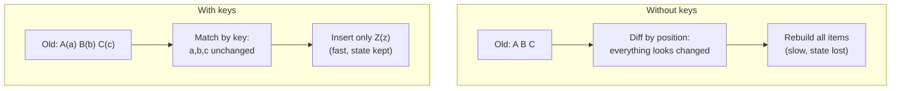
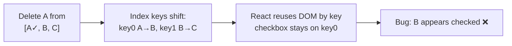
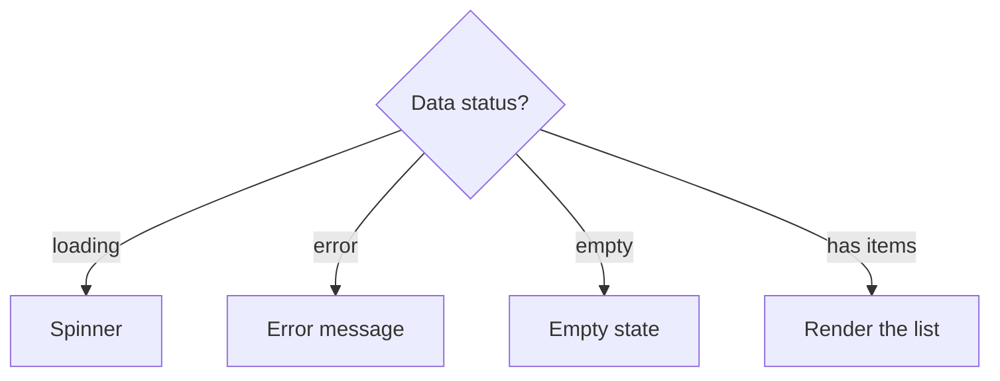

# Part 4 · Lists, Keys and Conditional Rendering

> Real apps render *collections* — lists of todos, tables of users, grids of products. In Part 1 you saw `.map()` render an array, and you saw React warn about "keys." This part explains **why keys exist**, what breaks without them, and how React's reconciliation actually uses them. You'll also master every conditional-rendering pattern for showing, hiding, and switching UI. Get keys right and a whole class of bizarre bugs disappears.

## Table of Contents

1. [Rendering lists with map](#1-rendering-lists-with-map)
2. [Why keys exist: reconciliation](#2-why-keys-exist-reconciliation)
3. [Choosing a good key](#3-choosing-a-good-key)
4. [The index-as-key trap](#4-the-index-as-key-trap)
5. [Conditional rendering patterns in depth](#5-conditional-rendering-patterns-in-depth)
6. [Rendering nothing, empty states, and loading](#6-rendering-nothing-empty-states-and-loading)
7. [Filtering, sorting, and transforming lists](#7-filtering-sorting-and-transforming-lists)
8. [Mini-project: a filterable product list](#8-mini-project-a-filterable-product-list)
9. [Capstone update: robust Todo rendering](#9-capstone-update-robust-todo-rendering)
10. [Exercises and practice problems](#10-exercises-and-practice-problems)
11. [Glossary](#11-glossary)

---

## 1. Rendering lists with map

To render an array as UI, use JavaScript's `.map()` to transform each data item into a React element. Since `{}` renders arrays (Part 1 §3), the resulting array of elements shows up in order.

```jsx
function ShoppingList() {
  const items = ['Milk', 'Bread', 'Eggs']

  return (
    <ul>
      {items.map((item) => (
        <li key={item}>{item}</li>
      ))}
    </ul>
  )
}
```

For arrays of objects — the common case — map each object to an element, using a stable unique field as the `key`:

```jsx
function UserList({ users }) {
  return (
    <ul>
      {users.map((user) => (
        <li key={user.id}>
          {user.name} ({user.email})
        </li>
      ))}
    </ul>
  )
}
```

🎯 **Analogy:** `.map()` here is exactly the `.map()` you use in backend code to transform a list of records into a list of DTOs — except the "DTO" is a piece of UI. `users → <li>`s is no different in spirit from `users → user summaries`. You already know this tool; you're just mapping to JSX.

> **🔍 Under the hood:** `items.map(...)` produces a plain JavaScript array of React elements. When React encounters an array inside JSX, it renders each element in sequence. There's no special "list component" — it's just an array of elements, which React already knows how to render (Part 1's "what renders" table).

> **⚠️ Common beginner mistake:** Using `.forEach()` instead of `.map()`. `.forEach()` returns `undefined` (it's for side effects), so nothing renders. You need `.map()` because it **returns** the new array of elements. Also: forgetting to `return` the element when using a block body — `{items.map((i) => { <li>{i}</li> })}` returns nothing; use `=> ( ... )` or add `return`.

**Key takeaways:**
- Render lists by mapping data to elements with `.map()`.
- Give each element a `key` (explained next).
- `.map()` returns elements; `.forEach()` returns nothing — always `.map()`.

---

## 2. Why keys exist: reconciliation

A **key** is a special prop that gives each list item a stable identity, so React can track it across renders. To understand why that matters, recall reconciliation (Part 1 §5): when state changes, React builds a new element tree and diffs it against the old one to compute minimal DOM changes. For lists, React needs to answer: *"Is this the same item as before, or a new one?"* Keys are the answer.

Imagine a list `[A, B, C]` and you insert `Z` at the front → `[Z, A, B, C]`. Without keys, React compares position-by-position:

```
Old:  [A,  B,  C]
New:  [Z,  A,  B ,  C]
       ↕   ↕   ↕    ↕
Diff: A→Z A→B B→C  +C
```

React thinks *every* item changed and rebuilds all of them — slow, and it destroys any internal DOM state (like text you'd typed in an input). **With keys**, React matches by identity:

```
Old:  [A(a), B(b), C(c)]
New:  [Z(z), A(a), B(b), C(c)]
```

React sees `a`, `b`, `c` still exist (just moved down) and only *inserts* `z`. Fast, and existing items keep their state.



> **🔍 Under the hood:** Keys must be **unique among siblings** (not globally). React builds a map from key → previous element for each list, then matches new elements to old ones by key. Matched items are *updated in place* (or moved); unmatched new keys are *created*; old keys with no match are *destroyed*. This is why the key must be stable across renders for the same logical item — if the key changes, React thinks it's a brand-new item and remounts it (losing its state and DOM).

> **⚠️ Common beginner mistake:** Ignoring the "Each child in a list should have a unique key" warning. It's not cosmetic — without correct keys, list items can show wrong data, lose input focus, or animate incorrectly. Treat the warning as a real bug.

**Key takeaways:**
- Keys give list items a stable identity so React can match them across renders.
- With keys, React moves/updates existing items instead of rebuilding the list.
- Keys must be unique among siblings and stable for the same logical item.

---

## 3. Choosing a good key

A good key is **stable**, **unique**, and **predictable** — it identifies the *same logical item* across every render.

**Best: a stable unique ID from your data.**

```jsx
{users.map((u) => <li key={u.id}>{u.name}</li>)}          // ✅ database id
{todos.map((t) => <Todo key={t.id} todo={t} />)}          // ✅ generated id
{posts.map((p) => <Post key={p.slug} post={p} />)}        // ✅ unique slug
```

**Acceptable: a unique field that never changes.** An email, a slug, a SKU — as long as it's guaranteed unique and stable.

**Where do IDs come from if your data has none?** Generate them when you *create* the item, not while rendering:

```jsx
// ✅ Assign an id at creation time (Part 3 pattern)
const newTodo = { id: crypto.randomUUID(), text, done: false }
// ❌ Don't generate in render — key={Math.random()} makes a NEW key every render,
//    so React remounts every item every time. Never do this.
```

Key selection cheat sheet:

| Key source | Verdict | Notes |
| --- | --- | --- |
| `item.id` (DB/UUID) | ✅ Best | Stable, unique, predictable |
| `item.slug` / `item.email` | ✅ Good | If guaranteed unique & unchanging |
| Array index | ⚠️ Risky | Only if the list is static & never reorders (§4) |
| `Math.random()` / `Date.now()` in render | ❌ Never | New key each render → constant remounts |
| No key | ❌ Never | Warning + reconciliation bugs |

> **💡 Tip:** If your source data genuinely lacks a stable id (e.g., an external API returns bare strings), generate ids once when the data arrives (map it into `{ id: crypto.randomUUID(), value }` in state), not on every render.

**Key takeaways:**
- Prefer a stable unique id from your data as the key.
- Generate ids at item-creation time, never during render.
- Never use `Math.random()`/`Date.now()` in render as a key.

---

## 4. The index-as-key trap

The most common key mistake is using the array **index**:

```jsx
{todos.map((todo, index) => (
  <TodoItem key={index} todo={todo} />    // ⚠️ risky
))}
```

For a **static list that never changes order** (no add/remove/reorder/filter), index is harmless. But the moment the list can change, index-as-key causes real bugs — because the index of an item changes when items are inserted, removed, or reordered.

**Concrete bug.** List `[A, B, C]` with index keys `0, 1, 2`, each item has a checkbox you checked on `A`. Now you delete `A`:

```
Before delete:  key0=A(checked)  key1=B  key2=C
After delete:   key0=B           key1=C
```

React matches by key: `key0` was `A`, now `key0` is `B` — React thinks "item 0's data changed from A to B" and *keeps the DOM state* (the checkbox!) while swapping the text. Result: **B is now checked** even though you checked A. The checkbox state "stuck to the position," not the item.



With a stable `key={todo.id}`, React knows `A` was destroyed and `B`, `C` are unchanged — the checkbox goes away with `A`, exactly right.

> **🔍 Under the hood:** Index keys make the *position* the identity. Since React reuses and updates DOM nodes by key, position-based keys cause React to preserve the wrong node's internal state (input values, focus, checkbox state, animation state) when the list mutates. Stable ids make the *item* the identity, so state follows the item.

> **⚠️ Common beginner mistake:** Reaching for `key={index}` because it's convenient and silences the warning. It silences the *warning* but not the *bug*. Use `index` only for a list that is truly static and never reordered, filtered, or edited.

**Key takeaways:**
- Index-as-key ties identity to position, not to the item.
- On add/remove/reorder, it corrupts item state (checkboxes, inputs, focus).
- Safe only for static, never-changing lists; otherwise use a stable id.

---

## 5. Conditional rendering patterns in depth

Part 1 introduced ternary and `&&`. Here's the complete toolkit, with guidance on when to use each.

**1. `&&` — show something or nothing:**

```jsx
{isLoading && <Spinner />}
{errors.length > 0 && <ErrorSummary errors={errors} />}   {/* guard the leaky 0! */}
```

**2. Ternary — one of two things:**

```jsx
{isLoggedIn ? <Dashboard /> : <LoginForm />}
{items.length ? <List items={items} /> : <EmptyState />}
```

**3. Early return — skip rendering the whole component:**

```jsx
function Profile({ user }) {
  if (!user) return <p>No user selected.</p>     // bail out early
  return <div>{user.name}</div>                  // main render, user guaranteed
}
```

**4. Variable assignment — for 3+ branches (cleaner than nested ternaries):**

```jsx
function StatusBadge({ status }) {
  let badge
  if (status === 'active') badge = <span className="green">Active</span>
  else if (status === 'pending') badge = <span className="amber">Pending</span>
  else badge = <span className="gray">Inactive</span>
  return <div>{badge}</div>
}
```

**5. Object lookup map — for many discrete cases (elegant and scalable):**

```jsx
const ICONS = {
  success: <CheckIcon />,
  error: <XIcon />,
  warning: <AlertIcon />,
}
function StatusIcon({ type }) {
  return ICONS[type] ?? <InfoIcon />    // ?? fallback for unknown types
}
```

Decision guide:

| Situation | Pattern |
| --- | --- |
| Show or hide one thing | `cond && <X/>` |
| Either A or B | `cond ? <A/> : <B/>` |
| Guard clause / bail early | `if (!x) return ...` |
| 3+ branches with logic | assign to a variable with `if/else` |
| Many discrete cases (enum-like) | object lookup map |

> **🔍 Under the hood:** Nested ternaries (`a ? b : c ? d : e`) technically work but become unreadable fast — the classic "ternary hell." For anything beyond two branches, an early return, a variable, or a lookup map reads far better and is easier to change. React doesn't care which you use; this is about *human* readability.

> **⚠️ Common beginner mistake:** Overusing nested ternaries in JSX until no one can read them. If you're nesting a ternary inside a ternary inside JSX, stop and extract the logic to a variable or lookup map above the `return`.

**Key takeaways:**
- `&&` for show/hide, ternary for A/B, early return for guards.
- Use a variable or object lookup map for 3+ cases — avoid nested ternaries.
- Choose the pattern for readability; React supports them all.

---

## 6. Rendering nothing, empty states, and loading

Real UIs must handle *absence* gracefully: empty lists, missing data, in-flight loads. Beginners forget these and ship apps that show a blank void or crash on `undefined`.

**Empty states — always design the "zero items" case:**

```jsx
function TodoList({ todos }) {
  if (todos.length === 0) {
    return <p className="empty">Nothing to do — add your first task! ✨</p>
  }
  return (
    <ul>
      {todos.map((t) => <li key={t.id}>{t.text}</li>)}
    </ul>
  )
}
```

**The three UI states of async data** (you'll formalize this in Part 6): loading, error, and data. Handle all three:

```jsx
function Users({ users, isLoading, error }) {
  if (isLoading) return <Spinner />
  if (error) return <ErrorBox message={error} />
  if (users.length === 0) return <EmptyState />
  return <ul>{users.map((u) => <li key={u.id}>{u.name}</li>)}</ul>
}
```

**Rendering nothing intentionally** — return `null`:

```jsx
function Banner({ show }) {
  if (!show) return null    // render nothing at all — valid and common
  return <div className="banner">Sale ends tonight!</div>
}
```



> **🎯 Analogy:** As a backend engineer, you already handle the "no rows returned," "timeout," and "500 error" cases in an API. UI is the same discipline: loading = request in flight, error = it failed, empty = it succeeded but returned nothing, data = success with results. Skipping any of these is like an endpoint that only handles the happy path.

> **⚠️ Common beginner mistake:** Rendering `{users.map(...)}` before `users` has loaded, when it's `undefined` → `Cannot read properties of undefined (reading 'map')`. Guard first: initialize to `[]`, or check `if (!users) return <Spinner/>` before mapping.

**Key takeaways:**
- Always design the empty state — never leave a blank void.
- Async data has four states: loading, error, empty, data. Handle all four.
- Return `null` to render nothing; guard against `undefined` before `.map()`.

---

## 7. Filtering, sorting, and transforming lists

Because rendering is just JavaScript, you filter/sort/transform with normal array methods *before* mapping. Combine this with state (Part 3) for interactive lists.

```jsx
function ProductList({ products }) {
  const [query, setQuery] = useState('')
  const [sortBy, setSortBy] = useState('name')

  // Derive the visible list from state — do NOT store it in separate state.
  const visible = products
    .filter((p) => p.name.toLowerCase().includes(query.toLowerCase()))
    .sort((a, b) => (sortBy === 'price' ? a.price - b.price : a.name.localeCompare(b.name)))

  return (
    <div>
      <input value={query} onChange={(e) => setQuery(e.target.value)} placeholder="Search..." />
      <select value={sortBy} onChange={(e) => setSortBy(e.target.value)}>
        <option value="name">Name</option>
        <option value="price">Price</option>
      </select>

      {visible.length === 0 ? (
        <p>No products match "{query}".</p>
      ) : (
        <ul>{visible.map((p) => <li key={p.id}>{p.name} — ${p.price}</li>)}</ul>
      )}
    </div>
  )
}
```

The pattern: **state holds the raw data + the filter/sort criteria; the rendered list is derived during render.** You never store the filtered result in state — it's computed fresh each render from the source data and criteria.

> **🔍 Under the hood:** `.sort()` **mutates** the array it's called on. When sorting *state* or props, copy first: `[...products].sort(...)`. In the example above, `.filter()` already returns a new array, so the chained `.sort()` is safe — but if you ever sort directly on a state array, spread it first, or you'll violate immutability (Part 3 §6) and get subtle bugs.

> **⚠️ Common beginner mistake #1:** Storing `filteredProducts` in its own `useState` and trying to keep it in sync with the source — it drifts and causes bugs. Derive it. **Mistake #2:** `products.sort(...)` directly on props/state mutates it; use `[...products].sort(...)`.

**Key takeaways:**
- Filter/sort/transform with array methods *before* `.map()` — it's just JS.
- Store raw data + criteria in state; derive the visible list during render.
- `.sort()` mutates — copy with `[...arr].sort()` when sorting state/props.

---

## 8. Mini-project: a filterable product list

🏗️ Build a **searchable, sortable, filterable product catalog** — the single most common UI pattern in real apps. It combines lists, keys, derived state, conditional rendering, and empty states.

```bash
npm create vite@latest product-list    # React → JavaScript
cd product-list && npm install && npm run dev
```

```jsx
// src/App.jsx
import { useState } from 'react'

const PRODUCTS = [
  { id: 1, name: 'Mechanical Keyboard', price: 89, category: 'Peripherals', inStock: true },
  { id: 2, name: 'USB-C Hub', price: 45, category: 'Accessories', inStock: false },
  { id: 3, name: 'Ergonomic Mouse', price: 59, category: 'Peripherals', inStock: true },
  { id: 4, name: '4K Monitor', price: 399, category: 'Displays', inStock: true },
  { id: 5, name: 'Laptop Stand', price: 35, category: 'Accessories', inStock: true },
]

function ProductCard({ product }) {
  return (
    <li style={card}>
      <div>
        <strong>{product.name}</strong>
        <div style={{ color: '#64748b', fontSize: 13 }}>{product.category}</div>
      </div>
      <div style={{ textAlign: 'right' }}>
        <div>${product.price}</div>
        {/* conditional rendering: stock badge */}
        {product.inStock
          ? <span style={{ color: '#22c55e', fontSize: 12 }}>In stock</span>
          : <span style={{ color: '#ef4444', fontSize: 12 }}>Sold out</span>}
      </div>
    </li>
  )
}

export default function App() {
  const [query, setQuery] = useState('')
  const [sortBy, setSortBy] = useState('name')
  const [inStockOnly, setInStockOnly] = useState(false)

  // Derive the visible list from state — the golden rule.
  const visible = PRODUCTS
    .filter((p) => p.name.toLowerCase().includes(query.trim().toLowerCase()))
    .filter((p) => (inStockOnly ? p.inStock : true))
    .sort((a, b) => (sortBy === 'price' ? a.price - b.price : a.name.localeCompare(b.name)))

  return (
    <main style={{ maxWidth: 520, margin: '40px auto', fontFamily: 'system-ui' }}>
      <h1>Products ({visible.length})</h1>

      <div style={{ display: 'flex', gap: 8, marginBottom: 16 }}>
        <input
          value={query}
          onChange={(e) => setQuery(e.target.value)}
          placeholder="Search products..."
          style={{ flex: 1, padding: 8 }}
        />
        <select value={sortBy} onChange={(e) => setSortBy(e.target.value)}>
          <option value="name">Name</option>
          <option value="price">Price ↑</option>
        </select>
      </div>

      <label style={{ display: 'block', marginBottom: 16 }}>
        <input type="checkbox" checked={inStockOnly}
          onChange={(e) => setInStockOnly(e.target.checked)} /> In stock only
      </label>

      {/* Empty state vs list */}
      {visible.length === 0 ? (
        <p style={{ color: '#64748b' }}>No products match your filters.</p>
      ) : (
        <ul style={{ listStyle: 'none', padding: 0 }}>
          {visible.map((p) => <ProductCard key={p.id} product={p} />)}
        </ul>
      )}
    </main>
  )
}

const card = { display: 'flex', justifyContent: 'space-between',
  padding: 12, border: '1px solid #e2e8f0', borderRadius: 10, marginBottom: 8 }
```

**Every Part 4 concept, in one project:**

```cards
Lists + keys :: visible.map(...) with key={p.id} — stable ids, no index trap.
Derived state :: `visible` computed from query/sortBy/inStockOnly — nothing stored.
Filtering :: two chained .filter() calls (search + stock).
Sorting :: .sort() on the already-new filtered array (safe).
Conditional :: in-stock badge (ternary) + empty state (ternary).
```

**Extend it (do at least three):**
1. Add a category `<select>` filter (All + each unique category via `[...new Set(...)]`).
2. Add a price range (two number inputs: min/max).
3. Highlight the matching part of the name (hint: split on the query).
4. Add a "Sort by price ↓" option (descending).
5. Show a count of how many are filtered out ("Showing 3 of 5").

> **💡 Tip:** Notice how *adding a filter* meant adding one piece of state and one `.filter()` — the derived-list pattern scales cleanly. Each new criterion is independent. This composability is why "store criteria, derive the list" beats "store the filtered list."

**Key takeaways:**
- Search/sort/filter UIs = state for criteria + a derived list + keyed `.map()`.
- Each filter is an independent `.filter()`; sorting comes last on the new array.
- Empty states and stock badges show conditional rendering in real use.

---

## 9. Capstone update: robust Todo rendering

🏗️ Return to your **Todo app** (capstone #1). You already render the list with `key={t.id}` — good. Now prove *why* that matters and add list-driven features that would break with index keys.

**Experiment — see the index-key bug yourself:**
1. Temporarily change `key={t.id}` to `key={index}` (add `index` as the map's 2nd arg).
2. Check the first todo's checkbox.
3. Delete a todo *above* it (add a couple todos first).
4. Watch the checkbox jump to the wrong item. Now revert to `key={t.id}` — fixed.

**Add these list features (all rely on correct keys + derived state):**

```jsx
// Add filter state and derive the visible todos.
const [filter, setFilter] = useState('all')   // 'all' | 'active' | 'done'

const visibleTodos = todos.filter((t) =>
  filter === 'active' ? !t.done : filter === 'done' ? t.done : true
)

// Filter buttons
<div>
  {['all', 'active', 'done'].map((f) => (
    <button
      key={f}
      onClick={() => setFilter(f)}
      style={{ fontWeight: filter === f ? 700 : 400 }}
    >
      {f}
    </button>
  ))}
</div>

// Render visibleTodos (not todos) in the list, still keyed by t.id.
{visibleTodos.length === 0
  ? <p>No {filter === 'all' ? '' : filter} todos.</p>
  : visibleTodos.map((t) => (/* ...existing <li key={t.id}>... */))}
```

**Checklist:**

```cards
Stable keys :: key={t.id} survives add/remove/filter without state corruption.
Derived list :: visibleTodos computed from todos + filter — nothing duplicated.
Filter UI :: the filter buttons are themselves a keyed .map over a string array.
Empty state :: a helpful message when a filter yields no todos.
```

> **💡 Tip:** The filter buttons array `['all','active','done']` is static and never reorders, so `key={f}` (the value) is perfect — and even `key={index}` would be safe here. Contrast with the todos list, which *does* change, where `key={t.id}` is mandatory. Understanding *which* lists are dynamic is how you decide key strategy.

**Extend it:**
1. Show counts on each filter button (`active (2)`).
2. Persist nothing yet — Part 5/6 will add localStorage and effects.
3. Add a "drag to reorder" stub (you'll appreciate why index keys would break it).

**Key takeaways:**
- Stable keys make your Todo list survive filtering, deletion, and reordering.
- Filters are just more derived state + array methods.
- Static option lists can key by value; dynamic lists need stable ids.

---

## 10. Exercises and practice problems

### 🧪 Warm-ups (easy)

**E1.** Render `const tags = ['react', 'vite', 'jsx']` as a list of `<span className="tag">`.

<details><summary>Show solution</summary>

```jsx
{tags.map((tag) => <span key={tag} className="tag">{tag}</span>)}
```

*Why:* Unique string values make fine keys for a static list.
</details>

**E2.** Given `users` (with `id`, `name`, `active`), render each name, with " (active)" appended only for active users.

<details><summary>Show solution</summary>

```jsx
{users.map((u) => (
  <li key={u.id}>{u.name}{u.active && ' (active)'}</li>
))}
```

*Why:* `&&` conditionally appends text; `key={u.id}` is the stable id.
</details>

### 🧪 Core (medium)

**E3.** Explain why this loses input focus/typed text when you delete a row, and fix it:

```jsx
{rows.map((row, i) => (
  <input key={i} defaultValue={row.label} />
))}
```

<details><summary>Show solution</summary>

Index keys tie identity to position. Deleting a row shifts indices, so React reuses the wrong input's DOM node — focus/content sticks to the position, not the row. Fix with a stable id:

```jsx
{rows.map((row) => (
  <input key={row.id} defaultValue={row.label} />
))}
```

*Why:* This is the §4 trap applied to inputs — the classic real-world symptom.
</details>

**E4.** Build a component that shows one of: `<Spinner/>` (loading), `<Error/>` (error), an empty message, or a list — using early returns.

<details><summary>Show solution</summary>

```jsx
function DataList({ isLoading, error, items }) {
  if (isLoading) return <Spinner />
  if (error) return <p className="error">{error}</p>
  if (items.length === 0) return <p>Nothing here yet.</p>
  return <ul>{items.map((i) => <li key={i.id}>{i.name}</li>)}</ul>
}
```

*Why:* Early returns handle all four async states cleanly (§6), each guard narrowing what the next lines can assume.
</details>

**E5.** Turn nested ternary hell into a readable lookup map:

```jsx
{status === 'a' ? <A/> : status === 'b' ? <B/> : status === 'c' ? <C/> : <Fallback/>}
```

<details><summary>Show solution</summary>

```jsx
const VIEWS = { a: <A />, b: <B />, c: <C /> }
return VIEWS[status] ?? <Fallback />
```

*Why:* An object map scales to many cases and reads clearly, unlike stacked ternaries (§5).
</details>

### 🧪 Challenge (hard)

**E6.** Build `<Leaderboard players={...} />` that sorts players by `score` descending and shows rank (1, 2, 3...). Don't mutate the prop.

<details><summary>Show solution</summary>

```jsx
function Leaderboard({ players }) {
  const ranked = [...players].sort((a, b) => b.score - a.score)   // copy before sort!
  return (
    <ol>
      {ranked.map((p, i) => (
        <li key={p.id}>#{i + 1} — {p.name}: {p.score}</li>
      ))}
    </ol>
  )
}
```

*Why:* `[...players]` avoids mutating the prop (§7). Here `i + 1` is *display rank*, not a key — the key is still the stable `p.id`. (Using `i` for the key would be wrong the moment scores change and reorder.)
</details>

**E7.** Build a two-list "transfer" UI: available items and selected items. Clicking an item moves it between lists. Use stable keys and immutable updates.

<details><summary>Show solution</summary>

```jsx
function Transfer({ all }) {
  const [selectedIds, setSelectedIds] = useState([])
  const available = all.filter((x) => !selectedIds.includes(x.id))
  const selected = all.filter((x) => selectedIds.includes(x.id))

  const add = (id) => setSelectedIds((prev) => [...prev, id])
  const remove = (id) => setSelectedIds((prev) => prev.filter((x) => x !== id))

  return (
    <div style={{ display: 'flex', gap: 24 }}>
      <ul>{available.map((x) => <li key={x.id} onClick={() => add(x.id)}>{x.name} →</li>)}</ul>
      <ul>{selected.map((x) => <li key={x.id} onClick={() => remove(x.id)}>← {x.name}</li>)}</ul>
    </div>
  )
}
```

*Why:* One source of truth (`selectedIds`), both lists derived from it. Stable `key={x.id}` keeps items correct as they move. Immutable add/remove per Part 3.
</details>

**E8 (capstone step).** In your Todo app, add filter-button counts (`active (2)`, `done (1)`) computed as derived values, and make the empty message context-aware ("No active todos" vs "No todos yet"). Keep this — Part 5 extracts the todo logic into a reusable custom hook.

<details><summary>Show hint</summary>

Counts are derived: `const activeCount = todos.filter(t => !t.done).length`. Don't store them in state. For the message, branch on both `todos.length === 0` (truly empty) and `visibleTodos.length === 0` (filtered empty).
</details>

---

## 11. Glossary

| Term | Meaning |
| --- | --- |
| **`.map()` rendering** | Transforming a data array into an array of React elements. |
| **Key** | A prop giving a list item stable identity for reconciliation. |
| **Reconciliation** | React's diff of new vs. previous element trees to compute DOM changes. |
| **Index-as-key trap** | Using array index as key, which corrupts item state on reorder/delete. |
| **Empty state** | The UI shown when a list/collection has zero items. |
| **Derived list** | A filtered/sorted list computed during render, not stored in state. |
| **Early return** | Bailing out of a component with `return` before the main render (a guard). |
| **Lookup map** | An object mapping cases to elements, replacing many ternaries/if-elses. |
| **Single source of truth** | Keeping data in one place and deriving everything else from it. |

---

> **You can now render and manipulate real collections correctly.** Keys, reconciliation, and derived state are foundational — you'll rely on them in every list-driven UI. Next, the big one: a deep dive into *all* of React's hooks, where `useState` was just the beginning.
>
> **Next:** [Part 5 · Hooks Deep Dive →](05-hooks-deep-dive.md)
