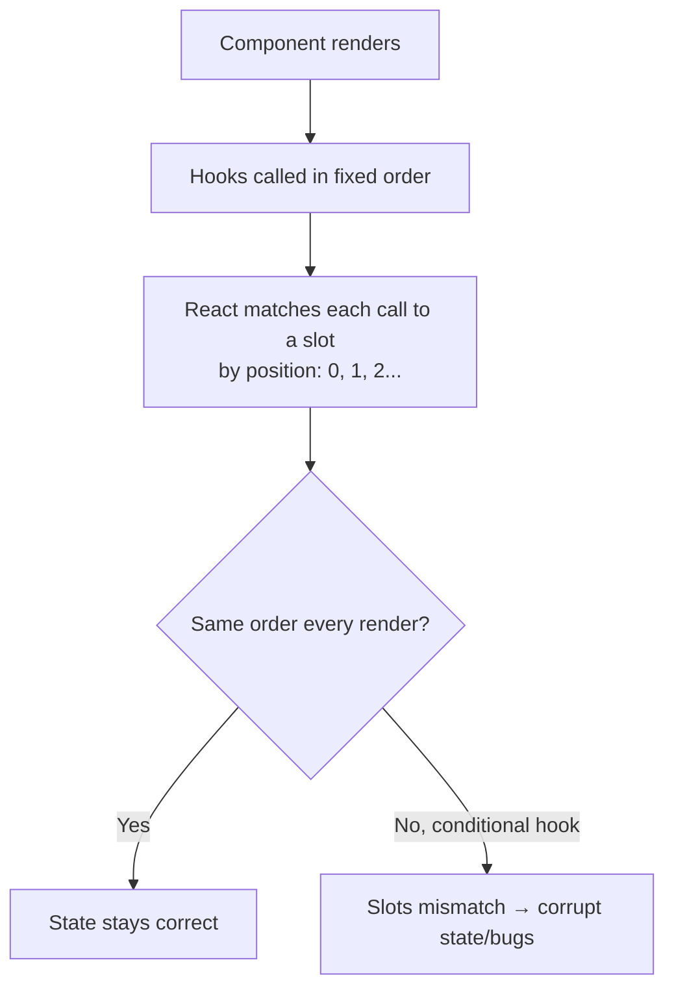
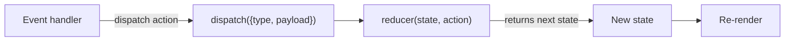
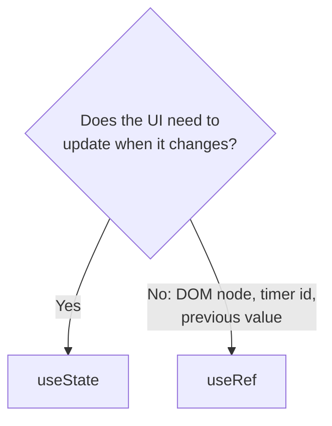
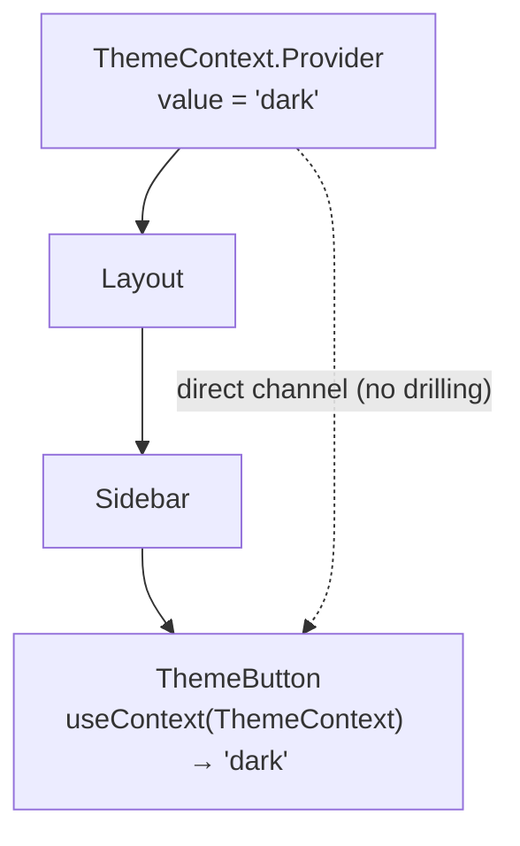
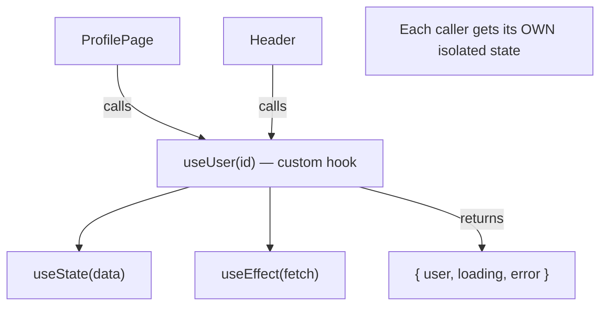

# Part 5 · Hooks Deep Dive

> You've been using `useState` since Part 3. It's one of about a dozen **hooks** — special functions that let components "hook into" React's features: state, lifecycle, context, refs, performance, and more. This part is a complete tour of the built-in hooks, the non-negotiable **Rules of Hooks**, and the skill that ties it all together: writing your own **custom hooks** to extract and reuse logic. Master this and you write real, idiomatic React.

## Table of Contents

1. [What hooks are and the Rules of Hooks](#1-what-hooks-are-and-the-rules-of-hooks)
2. [useState, revisited: lazy init and patterns](#2-usestate-revisited-lazy-init-and-patterns)
3. [useReducer: state logic that scales](#3-usereducer-state-logic-that-scales)
4. [useRef: escape hatches and DOM access](#4-useref-escape-hatches-and-dom-access)
5. [useContext: passing data without prop drilling](#5-usecontext-passing-data-without-prop-drilling)
6. [useMemo and useCallback: a first look](#6-usememo-and-usecallback-a-first-look)
7. [The modern hooks: useId, useTransition, useDeferredValue, useSyncExternalStore, use](#7-the-modern-hooks)
8. [Custom hooks: your superpower](#8-custom-hooks-your-superpower)
9. [Mini-project and capstone: extract the Todo logic](#9-mini-project-and-capstone-extract-the-todo-logic)
10. [Exercises and practice problems](#10-exercises-and-practice-problems)
11. [Glossary](#11-glossary)

> **💡 Suggested learning order:** Read §1 carefully — the Rules of Hooks explain *why* everything else works. Then §2–4 are the workhorses you'll use daily. §5–7 you'll use situationally (and revisit in Parts 9 & 11). §8 (custom hooks) is the payoff — don't skip it.

---

## 1. What hooks are and the Rules of Hooks

🎯 **Analogy:** A component function runs top to bottom every render, but it has no memory of its own — local variables reset each time (Part 3 §1). Hooks are how a component **remembers things between renders** and **connects to React's machinery**. Think of them as the component reaching into a backpack that React holds for it: `useState` pulls out a remembered value, `useRef` pulls out a mutable box, `useEffect` schedules work. The backpack persists; the function is re-run.

Every hook is a function whose name starts with `use`. There are two ironclad **Rules of Hooks**:

**Rule 1 — Only call hooks at the top level.** Never inside conditions, loops, or nested functions. Call them in the same order every render.

```jsx
function Profile({ userId }) {
  const [name, setName] = useState('')     // ✅ top level

  if (userId) {
    const [x, setX] = useState(0)          // ❌ conditional hook — forbidden
  }

  for (const item of items) {
    useState(item)                         // ❌ hook in a loop — forbidden
  }
}
```

**Rule 2 — Only call hooks from React functions.** From component functions or from other custom hooks — never from plain functions, event handlers, or class methods.

```jsx
function handleClick() {
  const [x, setX] = useState(0)   // ❌ hook inside an event handler — forbidden
}
```

**Why these rules exist** — this is the crucial insight from Part 3 §2. React tracks hooks by **call order**, not by name. Each render, it walks the same sequence of hook calls and matches them to stored slots:

```
Render 1:  useState → slot 0    useState → slot 1    useEffect → slot 2
Render 2:  useState → slot 0    useState → slot 1    useEffect → slot 2   ✓ consistent
```

If you called a hook conditionally, the order could change between renders, and slot 1's state would suddenly be handed to the wrong hook — corrupting everything.



> **🔍 Under the hood:** React stores a component's hooks as a linked list attached to that component's internal "fiber" (its instance record). On each render, an internal cursor walks that list in order. `useState` call #2 always reads list node #2. Conditionally skipping a hook shifts every subsequent node by one — which is exactly the catastrophe the rules prevent. The ESLint plugin `eslint-plugin-react-hooks` enforces both rules automatically; keep it on.

> **⚠️ Common beginner mistake:** "I only want this state when `x` is true, so I'll put `useState` in the `if`." Don't. Always call the hook unconditionally; put the *condition* on how you use the value: `const [v, setV] = useState(null); if (x) { /* use v */ }`.

**Key takeaways:**
- Hooks (`use…`) let components remember values and use React features across renders.
- Rule 1: call hooks at the top level only — never in conditions/loops/nested functions.
- Rule 2: call hooks only from components or custom hooks. React tracks them by call order.

---

## 2. useState, revisited: lazy init and patterns

You know the basics. Two refinements make you fluent.

**Lazy initialization.** If the initial state is *expensive* to compute, pass a **function** to `useState` — React calls it only once (on the first render) instead of every render.

```jsx
// ❌ readFromLocalStorage() runs on EVERY render (result thrown away after first)
const [data, setData] = useState(readFromLocalStorage())

// ✅ Pass a function — React calls it ONCE, on first render only
const [data, setData] = useState(() => readFromLocalStorage())
```

The difference: `useState(expensiveThing())` *calls* the function every render (React ignores the result after the first, but you still paid the cost). `useState(() => expensiveThing())` passes a function React invokes only when it needs the initial value.

**Grouping related state.** Prefer one object when fields change together, separate states when independent:

```jsx
// Independent values → separate states (simplest)
const [name, setName] = useState('')
const [age, setAge] = useState(0)

// Related values that update together → one object (fewer setters)
const [form, setForm] = useState({ name: '', age: 0 })
setForm((prev) => ({ ...prev, name: 'Ada' }))   // remember immutable update!
```

> **🔍 Under the hood:** The lazy initializer is called by React during the first render and never again — it's not a "run once" side effect (that's `useEffect`), it's purely for computing the starting value. A common real use is reading from `localStorage` or parsing a URL once. If you pass a plain value, JS evaluates it *before* `useState` even runs, which is why the eager form always pays the cost.

> **⚠️ Common beginner mistake:** `useState(new Array(10000).fill(0))` or `useState(JSON.parse(localStorage.getItem('x')))` — both run every render. Wrap in `() =>` to make them lazy.

**Key takeaways:**
- Use `useState(() => expensive())` for costly initial values — runs once.
- `useState(value)` evaluates `value` on every render; only the first result is kept.
- Group state that changes together; keep independent state separate.

---

## 3. useReducer: state logic that scales

When state updates get complex — multiple sub-values, many action types, next-state-depends-on-previous logic — `useState` handlers sprawl. **`useReducer`** centralizes all update logic in one pure function, the **reducer**. If you've used Redux (Part 9), this is the same idea, built into React.

🎯 **Analogy:** `useState` is like exposing a raw variable and letting anyone set it however they want. `useReducer` is like a **state machine with a single API**: instead of "set this field to that," you dispatch named *actions* ("increment", "reset", "toggle_done"), and one function decides how each action transforms state. It's the difference between many scattered setters and one well-defined transition table.

```jsx
import { useReducer } from 'react'

// 1. The reducer: (currentState, action) => nextState. Pure — no side effects.
function reducer(state, action) {
  switch (action.type) {
    case 'increment': return { count: state.count + 1 }
    case 'decrement': return { count: state.count - 1 }
    case 'set':       return { count: action.payload }
    case 'reset':     return { count: 0 }
    default:          throw new Error('Unknown action: ' + action.type)
  }
}

function Counter() {
  // 2. useReducer(reducer, initialState) => [state, dispatch]
  const [state, dispatch] = useReducer(reducer, { count: 0 })

  return (
    <div>
      <button onClick={() => dispatch({ type: 'decrement' })}>−</button>
      <span>{state.count}</span>
      <button onClick={() => dispatch({ type: 'increment' })}>+</button>
      <button onClick={() => dispatch({ type: 'set', payload: 100 })}>Set 100</button>
      <button onClick={() => dispatch({ type: 'reset' })}>Reset</button>
    </div>
  )
}
```

**`useState` vs `useReducer` — when to reach for which:**

| Use `useState` when | Use `useReducer` when |
| --- | --- |
| One or few independent values | Complex state with many sub-values |
| Simple updates | Next state depends on previous in intricate ways |
| Logic fits in a line or two | Many related actions/transitions |
| — | You want update logic testable in isolation |



> **🔍 Under the hood:** `dispatch` is stable — it never changes identity across renders (unlike a fresh inline function), which matters for performance and dependency arrays (Part 6/11). The reducer must be **pure**: given the same state + action, it returns the same next state, with no side effects or mutations. Return a *new* object each time (immutability, Part 3 §6) — don't mutate `state`.

> **⚠️ Common beginner mistake:** Mutating state inside the reducer (`state.count++; return state`). Return a new object: `return { ...state, count: state.count + 1 }`. Also: putting side effects (API calls, logging) inside the reducer — keep it pure; side effects belong in event handlers or effects (Part 6).

**Key takeaways:**
- `useReducer` centralizes complex update logic in one pure reducer function.
- `dispatch({ type, payload })` sends named actions; the reducer maps them to next state.
- Reach for it when state has many actions/sub-values; `dispatch` is stable.

---

## 4. useRef: escape hatches and DOM access

**`useRef`** gives you a mutable "box" (`{ current: value }`) that **persists across renders but does not trigger a re-render when changed**. It has two distinct uses: (1) accessing DOM nodes, and (2) holding mutable values that shouldn't cause renders.

**Use 1 — accessing a DOM element** (the escape hatch to imperative DOM APIs like focus, scroll, media playback):

```jsx
import { useRef } from 'react'

function SearchBox() {
  const inputRef = useRef(null)          // will point to the <input> DOM node

  function focusInput() {
    inputRef.current.focus()             // imperative DOM call
  }

  return (
    <div>
      <input ref={inputRef} />           {/* React sets inputRef.current to this node */}
      <button onClick={focusInput}>Focus</button>
    </div>
  )
}
```

**Use 2 — a mutable value that survives renders without causing them** (timers, previous values, instance-like data):

```jsx
function Timer() {
  const intervalRef = useRef(null)       // holds the interval id across renders

  function start() {
    intervalRef.current = setInterval(() => console.log('tick'), 1000)
  }
  function stop() {
    clearInterval(intervalRef.current)   // read it back later
  }
  // Changing intervalRef.current does NOT re-render — exactly what we want here.
}
```

**The critical distinction — state vs ref:**

| | `useState` | `useRef` |
| --- | --- | --- |
| Persists across renders | ✅ | ✅ |
| Changing it re-renders | ✅ Yes | ❌ No |
| Read the latest value synchronously | ❌ (snapshot) | ✅ (`.current`) |
| Use for | Anything shown in the UI | DOM nodes, timers, non-UI mutable data |

> **🔍 Under the hood:** `useRef(initial)` returns the *same object* (`{ current }`) on every render — React just keeps handing you the identical box. Mutating `.current` doesn't schedule a render because React doesn't watch it. When you attach `ref={x}` to a JSX element, React writes the real DOM node into `x.current` after committing to the DOM (and sets it back to `null` on unmount). That's why `inputRef.current` is `null` on the very first render *before* commit, and populated after.

> **⚠️ Common beginner mistake:** Using a ref for something that *should* be shown in the UI. If changing a value must update the screen, it's **state**, not a ref — a ref change won't re-render, so the UI goes stale. Rule: *does the UI need to update when this changes?* Yes → state. No → ref.



**Key takeaways:**
- `useRef` is a persistent mutable box (`.current`) that does **not** trigger re-renders.
- Use it for DOM access (`ref={x}`) and non-UI mutable values (timers, ids).
- If a change must update the UI, use state, not a ref.

---

## 5. useContext: passing data without prop drilling

**Prop drilling** is passing a prop through many intermediate components that don't use it, just to reach a deep child. **Context** lets a provider share a value with any descendant directly — no drilling. (Part 9 covers global state strategy in depth; here's the mechanism.)

The problem:

```jsx
// theme has to be threaded through Layout and Sidebar just to reach ThemeButton
<App theme={theme}>
  <Layout theme={theme}>
    <Sidebar theme={theme}>
      <ThemeButton theme={theme} />   {/* only THIS needs it */}
```

The solution — three steps: **create**, **provide**, **consume**:

```jsx
import { createContext, useContext, useState } from 'react'

// 1. Create a context (with an optional default value).
const ThemeContext = createContext('light')

function App() {
  const [theme, setTheme] = useState('dark')
  return (
    // 2. Provide a value to the whole subtree.
    <ThemeContext.Provider value={theme}>
      <Layout />                            {/* no theme prop needed anywhere below */}
    </ThemeContext.Provider>
  )
}

function ThemeButton() {
  // 3. Consume it directly, however deep — no props threaded through.
  const theme = useContext(ThemeContext)
  return <button className={theme}>Current theme: {theme}</button>
}
```



> **🔍 Under the hood:** When a component calls `useContext(Ctx)`, React walks *up* the tree to find the nearest `Ctx.Provider` and returns its `value`. When that `value` changes, **every** consumer of that context re-renders — regardless of `React.memo`. This is powerful but a performance consideration: don't put rapidly-changing values in a context that has many consumers, or split contexts (Part 9/11). If there's no Provider above, `useContext` returns the `createContext(default)` default.

> **⚠️ Common beginner mistake:** Reaching for Context too early. For 1–2 levels of passing, plain props are clearer. Context shines for *truly global* things: theme, current user, locale, auth. Overusing it makes data flow harder to trace. Also: a new object `value={{ a, b }}` created inline re-renders all consumers every render — memoize it (Part 11).

**Key takeaways:**
- Context shares a value with any descendant, avoiding prop drilling.
- Three steps: `createContext`, `<Ctx.Provider value=…>`, `useContext(Ctx)`.
- All consumers re-render when the value changes; use it for global-ish data.

---

## 6. useMemo and useCallback: a first look

These two hooks **cache** things across renders to avoid needless work. You'll rarely need them at first — add them when profiling shows a real problem (Part 11 goes deep). But you must recognize them.

**`useMemo`** caches the *result of a computation*, recomputing only when its dependencies change:

```jsx
// Without: sortedList is recomputed every render, even if `items` didn't change.
const sortedList = [...items].sort(expensiveCompare)

// With: recomputed only when `items` changes.
const sortedList = useMemo(() => [...items].sort(expensiveCompare), [items])
```

**`useCallback`** caches a *function definition* so it keeps the same identity across renders (useful when passing callbacks to memoized children or effect dependencies):

```jsx
// Without: a NEW function every render (new identity each time).
const handleClick = () => doSomething(id)

// With: same function identity until `id` changes.
const handleClick = useCallback(() => doSomething(id), [id])
```

`useCallback(fn, deps)` is exactly `useMemo(() => fn, deps)` — one memoizes a value, the other a function.

| Hook | Caches | Use when |
| --- | --- | --- |
| `useMemo` | A computed **value** | An expensive calculation reruns needlessly |
| `useCallback` | A **function** identity | Passing a stable callback to memoized children / effect deps |

> **🔍 Under the hood:** Both compare their dependency array to the previous render's (by reference, `Object.is`). If unchanged, they return the cached value/function; if changed, they recompute. This caching itself has a small cost (storing + comparing), so wrapping *everything* is counterproductive — it can be slower than just recomputing cheap values. Measure first (Part 11).

> **⚠️ Common beginner mistake:** Sprinkling `useMemo`/`useCallback` everywhere "for performance." For trivial computations this adds overhead and clutter without benefit. Reach for them when: (a) a computation is genuinely expensive, or (b) you need a *stable identity* to prevent a memoized child from re-rendering or to satisfy an effect's dependencies. Otherwise, leave them out.

**Key takeaways:**
- `useMemo` caches a computed value; `useCallback` caches a function identity.
- Both recompute only when their dependency array changes.
- Don't over-apply them — add when profiling shows a real need (Part 11).

---

## 7. The modern hooks

React 18–19 added hooks you'll meet as you grow. Know what each is *for*; you'll use them situationally.

**`useId`** — generates a unique, stable id (great for linking `<label htmlFor>` to inputs, especially in reusable components and SSR):

```jsx
function Field({ label }) {
  const id = useId()                         // e.g. ":r3:" — unique & stable
  return (
    <div>
      <label htmlFor={id}>{label}</label>
      <input id={id} />                       {/* label ↔ input linked correctly */}
    </div>
  )
}
```

**`useTransition`** — marks a state update as **non-urgent** so React can keep the UI responsive (e.g., typing stays snappy while a heavy filtered list updates in the background):

```jsx
const [isPending, startTransition] = useTransition()

function handleChange(e) {
  setQuery(e.target.value)                    // urgent: the input updates immediately
  startTransition(() => {
    setResults(filterHugeList(e.target.value)) // non-urgent: can be interrupted
  })
}
// isPending is true while the transition is rendering — show a subtle spinner.
```

**`useDeferredValue`** — a simpler cousin: gives you a "lagging" copy of a value that updates at lower priority:

```jsx
const deferredQuery = useDeferredValue(query)   // updates after urgent work settles
const results = useMemo(() => filterHugeList(deferredQuery), [deferredQuery])
```

**`useSyncExternalStore`** — for subscribing to **external** (non-React) stores safely (used internally by Redux, Zustand). You rarely call it directly, but it's how state libraries integrate with React's rendering.

**`use`** (React 19) — reads a **promise** or context during render, integrating with Suspense. It can be called conditionally (unlike other hooks):

```jsx
// Suspends until the promise resolves; Suspense shows a fallback meanwhile.
function Profile({ userPromise }) {
  const user = use(userPromise)               // unwraps the resolved value
  return <h1>{user.name}</h1>
}
```

| Hook | One-line purpose |
| --- | --- |
| `useId` | Stable unique ids for accessibility/SSR |
| `useTransition` | Mark updates non-urgent to keep UI responsive |
| `useDeferredValue` | A low-priority, lagging copy of a value |
| `useSyncExternalStore` | Subscribe to external stores (library internals) |
| `use` | Read a promise/context during render (Suspense) |

> **💡 Tip:** Don't force these in early. `useId` you'll use soon (forms, Part 7). `useTransition`/`useDeferredValue` matter for performance (Part 11). `use` + Suspense is the modern data-loading direction (touched on in Part 6/15). Recognizing them is enough for now.

**Key takeaways:**
- `useId` for accessible unique ids; `useTransition`/`useDeferredValue` for responsiveness.
- `useSyncExternalStore` powers state libraries; `use` reads promises/context with Suspense.
- Learn these by need — recognition now, deep use in later parts.

---

## 8. Custom hooks: your superpower

A **custom hook** is a function whose name starts with `use` and that calls other hooks. It lets you **extract stateful logic** into a reusable, named function — the primary way you share behavior (not UI) between components. This is what separates beginner React from fluent React.

🎯 **Analogy:** Just as you refactor repeated backend logic into a shared function or service, custom hooks let you refactor repeated *stateful* logic — a data fetch, a form field, a subscription, a toggle — into one place. The component gets a clean, declarative API (`const { data, loading } = useUser(id)`) and doesn't care about the messy internals.

Start with a trivial one — a boolean toggle you keep re-writing:

```jsx
// The custom hook: just a function using useState, returning a tidy API.
function useToggle(initial = false) {
  const [on, setOn] = useState(initial)
  const toggle = () => setOn((v) => !v)
  return [on, toggle]           // return whatever shape is convenient
}

// Any component can now reuse it:
function Panel() {
  const [open, toggleOpen] = useToggle()
  return (
    <div>
      <button onClick={toggleOpen}>{open ? 'Close' : 'Open'}</button>
      {open && <p>Panel content</p>}
    </div>
  )
}
```

A more useful one — persist any state to `localStorage`:

```jsx
function useLocalStorage(key, initialValue) {
  // Lazy init (§2): read from storage once.
  const [value, setValue] = useState(() => {
    const stored = localStorage.getItem(key)
    return stored ? JSON.parse(stored) : initialValue
  })

  // Write back whenever value or key changes (useEffect — full treatment in Part 6).
  useEffect(() => {
    localStorage.setItem(key, JSON.stringify(value))
  }, [key, value])

  return [value, setValue]      // same API shape as useState — drop-in replacement!
}

// Usage — identical to useState, but it persists across reloads:
const [name, setName] = useLocalStorage('name', '')
```

**Rules and conventions for custom hooks:**
- **Must** start with `use` (so React's linter enforces the Rules of Hooks inside it).
- Can call any hooks (`useState`, `useEffect`, other custom hooks).
- Each call gets **isolated** state — two components using `useToggle()` don't share state; they each get their own.
- Return whatever's convenient: an array (`[value, setter]`), an object (`{ data, loading, error }`), or a single value.



> **🔍 Under the hood:** A custom hook isn't magic — it's just a function that happens to call hooks. When `Panel` calls `useToggle()`, the `useState` inside runs *as if it were written directly in `Panel`*, so it counts toward `Panel`'s hook order and gets `Panel`'s own state slot. That's why two components calling the same custom hook get independent state — the state belongs to the *component*, not the hook definition.

> **⚠️ Common beginner mistake:** Thinking a custom hook *shares* state between components (like a global store). It shares **logic**, not state — each call is independent. To share actual state across components, you need Context (§5) or a state library (Part 9). Also: naming a custom hook without `use` (`function toggle()`) — the linter can't enforce hook rules, and you'll get subtle bugs.

**Key takeaways:**
- A custom hook is a `use…` function that calls hooks to package reusable logic.
- It shares **logic**, not state — each caller gets isolated state.
- Return a convenient API shape; this is how you keep components clean and DRY.

---

## 9. Mini-project and capstone: extract the Todo logic

🏗️ Time to apply custom hooks to your **Todo app** (capstone #1). Right now all the todo logic (add, toggle, remove, filter) lives inside `App`. You'll extract it into a `useTodos` custom hook — and add persistence with `useLocalStorage`. This is exactly how real apps stay maintainable.

```jsx
// src/hooks/useLocalStorage.js
import { useState, useEffect } from 'react'

export function useLocalStorage(key, initial) {
  const [value, setValue] = useState(() => {
    const stored = localStorage.getItem(key)
    return stored ? JSON.parse(stored) : initial
  })
  useEffect(() => {
    localStorage.setItem(key, JSON.stringify(value))
  }, [key, value])
  return [value, setValue]
}
```

```jsx
// src/hooks/useTodos.js
import { useState } from 'react'
import { useLocalStorage } from './useLocalStorage'

export function useTodos() {
  // Todos persist across reloads for free — composed from another custom hook.
  const [todos, setTodos] = useLocalStorage('todos', [])
  const [filter, setFilter] = useState('all')     // 'all' | 'active' | 'done'

  // All the mutation logic, packaged behind a clean API:
  const addTodo = (text) => {
    const trimmed = text.trim()
    if (!trimmed) return
    setTodos((prev) => [...prev, { id: crypto.randomUUID(), text: trimmed, done: false }])
  }
  const toggleTodo = (id) =>
    setTodos((prev) => prev.map((t) => (t.id === id ? { ...t, done: !t.done } : t)))
  const removeTodo = (id) =>
    setTodos((prev) => prev.filter((t) => t.id !== id))
  const clearCompleted = () =>
    setTodos((prev) => prev.filter((t) => !t.done))

  // Derived values (computed, not stored — Part 3/4 rule):
  const visibleTodos = todos.filter((t) =>
    filter === 'active' ? !t.done : filter === 'done' ? t.done : true
  )
  const remaining = todos.filter((t) => !t.done).length

  // Return a tidy, declarative API. The component doesn't see the internals.
  return { todos, visibleTodos, remaining, filter, setFilter,
           addTodo, toggleTodo, removeTodo, clearCompleted }
}
```

```jsx
// src/App.jsx — now a clean, presentational component
import { useState } from 'react'
import { useTodos } from './hooks/useTodos'

export default function App() {
  const { visibleTodos, remaining, filter, setFilter,
          addTodo, toggleTodo, removeTodo, clearCompleted } = useTodos()
  const [draft, setDraft] = useState('')

  function handleSubmit(e) {
    e.preventDefault()
    addTodo(draft)
    setDraft('')
  }

  return (
    <main style={{ maxWidth: 420, margin: '40px auto', fontFamily: 'system-ui' }}>
      <h1>Todo ({remaining} left)</h1>

      <form onSubmit={handleSubmit} style={{ display: 'flex', gap: 8 }}>
        <input value={draft} onChange={(e) => setDraft(e.target.value)}
          placeholder="What needs doing?" style={{ flex: 1, padding: 8 }} />
        <button disabled={!draft.trim()}>Add</button>
      </form>

      <div style={{ margin: '12px 0' }}>
        {['all', 'active', 'done'].map((f) => (
          <button key={f} onClick={() => setFilter(f)}
            style={{ fontWeight: filter === f ? 700 : 400 }}>{f}</button>
        ))}
        <button onClick={clearCompleted} style={{ marginLeft: 8 }}>Clear completed</button>
      </div>

      <ul style={{ listStyle: 'none', padding: 0 }}>
        {visibleTodos.map((t) => (
          <li key={t.id} style={{ display: 'flex', gap: 8, alignItems: 'center', padding: '6px 0' }}>
            <input type="checkbox" checked={t.done} onChange={() => toggleTodo(t.id)} />
            <span style={{ flex: 1, textDecoration: t.done ? 'line-through' : 'none' }}>{t.text}</span>
            <button onClick={() => removeTodo(t.id)}>✕</button>
          </li>
        ))}
      </ul>
    </main>
  )
}
```

**What just improved:**

```cards
Separation :: App is now presentational; all logic lives in useTodos.
Reuse :: useTodos could power a mobile layout, a widget, tests — any UI.
Composition :: useTodos builds on useLocalStorage — hooks compose like functions.
Persistence :: todos survive a page reload, for free, via one composed hook.
Testability :: useTodos can be tested in isolation (Part 13) without rendering UI.
```

> **💡 Tip:** Notice `useTodos` composes `useLocalStorage`, which composes `useState` + `useEffect`. Hooks compose exactly like functions — small, focused hooks combine into powerful ones. This is the core of scalable React architecture (Part 14).

**Extend it (do at least three):**
1. Add an `editTodo(id, text)` action to `useTodos` and wire up inline editing.
2. Add `toggleAll()` (mark every todo done/undone).
3. Extract a `useToggle` hook and use it for a "show completed" section.
4. Add a `reorder(fromId, toId)` action (stable keys make this safe — Part 4).
5. Write a `useDebouncedValue(value, ms)` hook (preview of Part 6) and debounce a search field.

**Key takeaways:**
- Extracting logic into `useTodos` made `App` clean and the logic reusable/testable.
- Custom hooks compose: `useTodos` → `useLocalStorage` → `useState`/`useEffect`.
- This is idiomatic React architecture — logic in hooks, UI in components.

---

## 10. Exercises and practice problems

### 🧪 Warm-ups (easy)

**E1.** Write a `useCounter(initial = 0)` hook returning `{ count, increment, decrement, reset }`.

<details><summary>Show solution</summary>

```jsx
function useCounter(initial = 0) {
  const [count, setCount] = useState(initial)
  return {
    count,
    increment: () => setCount((c) => c + 1),
    decrement: () => setCount((c) => c - 1),
    reset: () => setCount(initial),
  }
}
```

*Why:* Package state + actions behind a clean object API; updater functions for dependent updates.
</details>

**E2.** Why is this hook call illegal? Fix it.

```jsx
function Widget({ enabled }) {
  if (enabled) {
    const [x, setX] = useState(0)
    return <p>{x}</p>
  }
  return <p>off</p>
}
```

<details><summary>Show solution</summary>

```jsx
function Widget({ enabled }) {
  const [x, setX] = useState(0)     // always call the hook, unconditionally
  if (!enabled) return <p>off</p>
  return <p>{x}</p>
}
```

*Why:* Rule 1 — hooks must be called at the top level, same order every render. Put the condition on the *rendering*, not the hook.
</details>

### 🧪 Core (medium)

**E3.** Convert this `useState` counter with tangled logic into a `useReducer`.

```jsx
const [state, setState] = useState({ count: 0, step: 1 })
// increment by step, change step, reset...
```

<details><summary>Show solution</summary>

```jsx
function reducer(state, action) {
  switch (action.type) {
    case 'inc':      return { ...state, count: state.count + state.step }
    case 'setStep':  return { ...state, step: action.payload }
    case 'reset':    return { count: 0, step: 1 }
    default:         throw new Error('bad action')
  }
}
const [state, dispatch] = useReducer(reducer, { count: 0, step: 1 })
// dispatch({ type: 'inc' }) / dispatch({ type: 'setStep', payload: 5 })
```

*Why:* Multiple related sub-values + several actions is the sweet spot for `useReducer`.
</details>

**E4.** Build a `useDebouncedValue(value, delay)` hook: returns `value`, but only after it stops changing for `delay` ms. (Uses `useEffect` + `useState` — peek at Part 6 if needed.)

<details><summary>Show solution</summary>

```jsx
function useDebouncedValue(value, delay = 300) {
  const [debounced, setDebounced] = useState(value)
  useEffect(() => {
    const id = setTimeout(() => setDebounced(value), delay)
    return () => clearTimeout(id)          // cleanup cancels the pending update
  }, [value, delay])
  return debounced
}
```

*Why:* Each change restarts the timer; cleanup cancels the previous one. Classic custom-hook pattern (search inputs).
</details>

**E5.** Use `useRef` to build a component that shows how many times it has rendered — *without* causing extra renders.

<details><summary>Show solution</summary>

```jsx
function RenderCounter() {
  const renders = useRef(0)
  renders.current++              // mutating a ref doesn't re-render
  return <p>Rendered {renders.current} times</p>
}
```

*Why:* A ref persists across renders and mutating it is side-effect-free (no render loop). Using state here would cause an infinite loop.
</details>

### 🧪 Challenge (hard)

**E6.** Build `usePrevious(value)` — returns the value from the *previous* render.

<details><summary>Show solution</summary>

```jsx
function usePrevious(value) {
  const ref = useRef()
  useEffect(() => {
    ref.current = value          // runs AFTER render, so during render ref holds the old value
  }, [value])
  return ref.current
}
```

*Why:* The effect updates the ref *after* the render commits, so on the next render the ref still holds the prior value at read time. A neat interplay of refs and effect timing (Part 6).
</details>

**E7.** Build `useFetch(url)` returning `{ data, loading, error }`. (Full data-fetching nuance — race conditions, cleanup — is Part 6; do a basic version now.)

<details><summary>Show solution</summary>

```jsx
function useFetch(url) {
  const [data, setData] = useState(null)
  const [loading, setLoading] = useState(true)
  const [error, setError] = useState(null)

  useEffect(() => {
    let cancelled = false                    // guard against race conditions
    setLoading(true)
    fetch(url)
      .then((r) => r.json())
      .then((json) => { if (!cancelled) { setData(json); setError(null) } })
      .catch((e) => { if (!cancelled) setError(e) })
      .finally(() => { if (!cancelled) setLoading(false) })
    return () => { cancelled = true }        // cleanup on unmount / url change
  }, [url])

  return { data, loading, error }
}
```

*Why:* Packages the loading/error/data trio (Part 4 §6) into a reusable hook. The `cancelled` flag prevents setting state after unmount — Part 6 explains this deeply and replaces it with TanStack Query.
</details>

**E8 (capstone step).** Finish extracting your Todo app: move ALL logic into `useTodos`, compose `useLocalStorage`, and add `editTodo`. `App` should contain only JSX + the draft input state. Keep it — Part 6 replaces manual fetching with TanStack Query on a *new* capstone (Data Dashboard).

<details><summary>Show hint</summary>

If `App` still has any `setTodos` or filtering logic, it's not fully extracted. The test: `App` imports `useTodos`, destructures its API, and every list operation goes through that API. The only local state left in `App` is the `draft` input.
</details>

---

## 11. Glossary

| Term | Meaning |
| --- | --- |
| **Hook** | A `use…` function that lets a component use React features (state, refs, etc.). |
| **Rules of Hooks** | Call hooks only at the top level and only from React functions. |
| **Lazy initializer** | `useState(() => expensive())` — computes the initial value once. |
| **`useReducer`** | Centralizes complex state updates in a pure reducer + `dispatch`. |
| **Reducer** | A pure `(state, action) => nextState` function. |
| **`useRef`** | A persistent mutable box (`.current`) that doesn't trigger re-renders. |
| **`useContext`** | Reads the nearest Provider's value; avoids prop drilling. |
| **Prop drilling** | Passing props through components that don't use them to reach a deep child. |
| **`useMemo` / `useCallback`** | Cache a computed value / a function identity across renders. |
| **Custom hook** | A `use…` function that calls hooks to package reusable *logic* (not state). |

---

> **You now command React's hook system** — the built-ins and, more importantly, how to write your own. Custom hooks are the architectural backbone of every serious React app. Next, we tackle the one hook that deserves its own part: `useEffect`, and how to fetch data the right way.
>
> **Next:** [Part 6 · Effects and Data Fetching →](06-effects-and-data-fetching.md)
