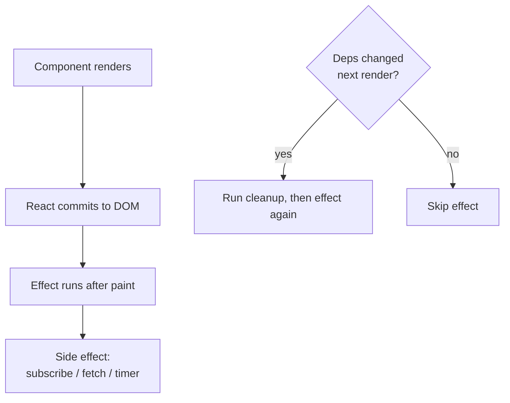
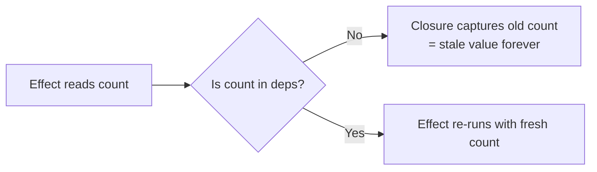
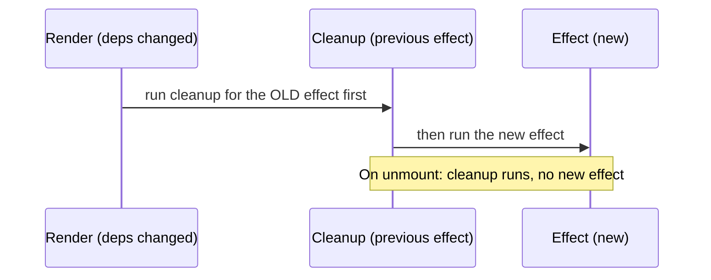
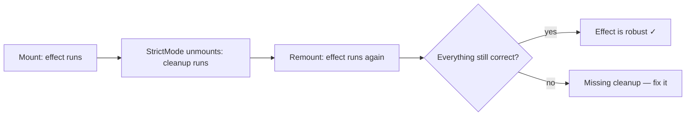
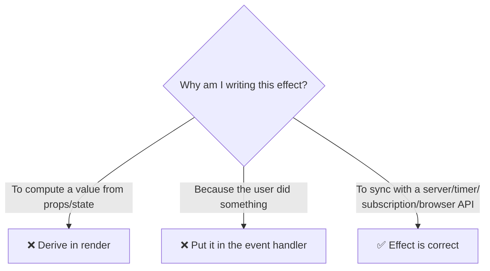
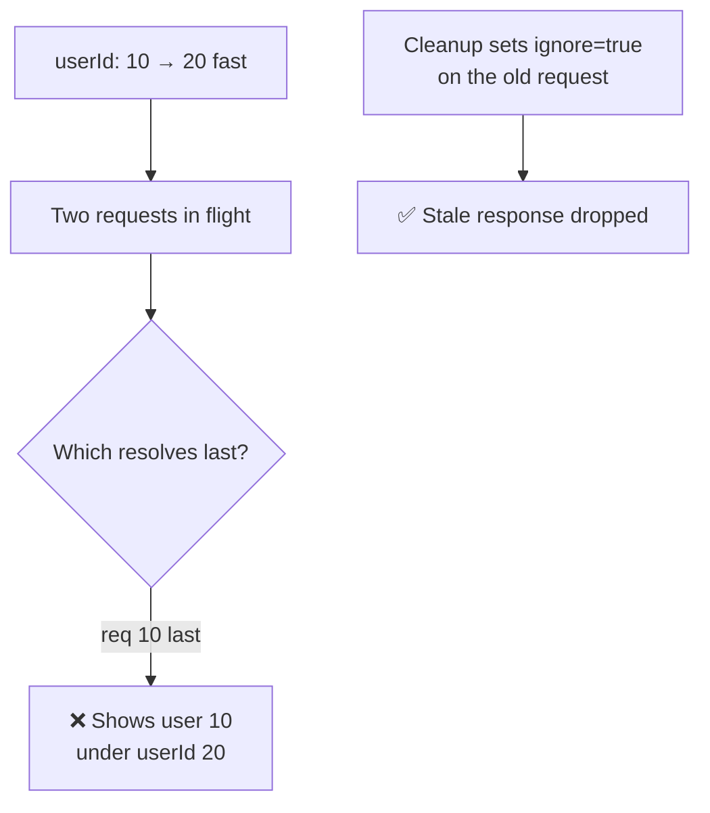
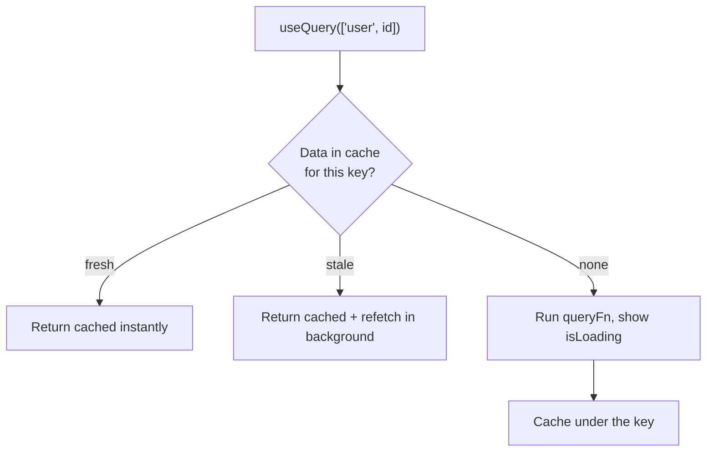
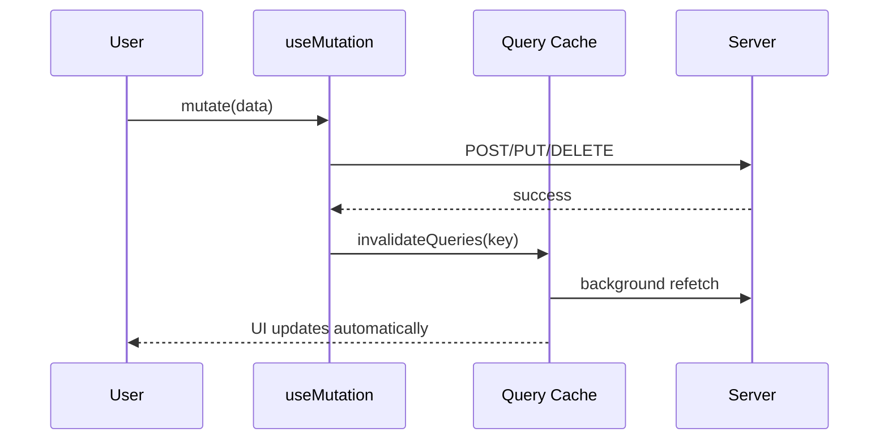

# Part 6 · Effects and Data Fetching

> `useEffect` is the most powerful — and most misused — hook in React. It lets your components synchronize with things *outside* React: servers, timers, subscriptions, the browser. Used well, it's essential. Used badly, it causes infinite loops, race conditions, and double-fetches. This part teaches effects the modern way: what they're really for, when *not* to use them, and how to fetch data properly — first manually, then with **TanStack Query**, the tool real apps use. It launches **Capstone #2: a data dashboard.**

## Table of Contents

1. [What an effect is and why it exists](#1-what-an-effect-is-and-why-it-exists)
2. [The dependency array](#2-the-dependency-array)
3. [Cleanup functions](#3-cleanup-functions)
4. [Effects in Strict Mode: the double-run](#4-effects-in-strict-mode-the-double-run)
5. [You might not need an effect](#5-you-might-not-need-an-effect)
6. [Fetching data with useEffect and its pitfalls](#6-fetching-data-with-useeffect-and-its-pitfalls)
7. [TanStack Query: data fetching done right](#7-tanstack-query-data-fetching-done-right)
8. [Mutations, cache, and invalidation](#8-mutations-cache-and-invalidation)
9. [Capstone kickoff: the data dashboard](#9-capstone-kickoff-the-data-dashboard)
10. [Exercises and practice problems](#10-exercises-and-practice-problems)
11. [Glossary](#11-glossary)

> **💡 Suggested learning order:** §1–4 are the mechanics — read them together. §5 is the mindset shift that prevents most effect bugs. §6 shows why manual fetching is hard, motivating §7–8 (TanStack Query), which is what you'll actually use.

---

## 1. What an effect is and why it exists

🎯 **Analogy:** Your component function's job is to be a *pure* description: given props and state, return JSX (`UI = f(state)`). But some things aren't part of describing UI — connecting to a chat server, setting a timer, reading from `localStorage`, focusing an input. These are **side effects**: interactions with the world outside React's render. `useEffect` is the sanctioned place to run them — *after* React has rendered and updated the DOM, so your render stays pure.

```jsx
import { useEffect } from 'react'

function ChatRoom({ roomId }) {
  useEffect(() => {
    // This runs AFTER render + DOM commit — a side effect.
    const connection = createConnection(roomId)
    connection.connect()

    // Optional cleanup (see §3): runs before the next effect and on unmount.
    return () => connection.disconnect()
  }, [roomId])   // dependency array — re-run when roomId changes (see §2)

  return <h1>Welcome to room {roomId}</h1>
}
```

The three parts of every effect:
1. **The effect function** — the side effect to run.
2. **The cleanup** (optional `return`) — undo/teardown before re-running or unmounting.
3. **The dependency array** — controls *when* the effect re-runs.



> **🔍 Under the hood:** React runs effects **after** the render is committed to the screen — so they never block painting. During render, your component must stay pure (no fetching, no DOM mutation, no subscriptions); those go in effects. This separation is what lets React render freely (and repeatedly) without triggering side effects each time.

> **⚠️ Common beginner mistake:** Treating `useEffect` as "code that runs on load," and stuffing everything in it. Effects are specifically for **synchronizing with external systems**. Much of what beginners put in effects (deriving values, responding to events) doesn't belong there at all — see §5.

**Key takeaways:**
- An effect runs side effects *after* render, keeping render pure.
- It has three parts: the effect, optional cleanup, and a dependency array.
- Effects are for synchronizing with things outside React (servers, timers, browser APIs).

---

## 2. The dependency array

The second argument to `useEffect` — the dependency array — controls *when* the effect re-runs. This is where most effect bugs live, so understand it exactly.

```jsx
useEffect(() => { /* ... */ })              // no array: runs after EVERY render
useEffect(() => { /* ... */ }, [])          // empty array: runs ONCE (after first render)
useEffect(() => { /* ... */ }, [a, b])      // runs when a or b changes (by Object.is)
```

The three forms:

| Deps | When the effect runs |
| --- | --- |
| *(omitted)* | After every render — rarely what you want |
| `[]` | Once, after the first render (mount) |
| `[a, b]` | After first render, then whenever `a` or `b` changes |

**The golden rule: include every reactive value the effect uses.** Any prop, state, or derived value referenced inside the effect must be in the deps array. The ESLint rule `react-hooks/exhaustive-deps` enforces this — trust it.

```jsx
function Search({ query, pageSize }) {
  useEffect(() => {
    fetchResults(query, pageSize)      // uses query AND pageSize...
  }, [query, pageSize])                // ...so BOTH must be in deps
}
```

**Why completeness matters** — omitting a dependency creates a **stale closure**: the effect "remembers" the value from the render when it last ran, not the current one:

```jsx
// ❌ Missing `count` — the interval always logs the STALE count from the first render
useEffect(() => {
  const id = setInterval(() => console.log(count), 1000)  // count is frozen at initial value!
  return () => clearInterval(id)
}, [])   // eslint will warn: "count is missing"
```



> **🔍 Under the hood:** Each render creates a *new* effect function that closes over *that render's* props and state. React compares the new deps array to the previous one (element by element, `Object.is`). If all equal, it skips the effect (keeping the old one); if any differ, it runs cleanup for the old effect, then the new one. Omitting a dep means the effect keeps the closure from a stale render — the value never updates inside it.

> **⚠️ Common beginner mistake:** "Lying" to the deps array to silence the linter (`// eslint-disable-next-line`). This hides real staleness bugs. Instead, if you don't want to depend on a value, restructure: use an updater function (`setCount(c => c + 1)` needs no `count` dep), move the value into a ref, or extract the logic. Fix the cause, don't disable the rule.

**Key takeaways:**
- Deps control re-runs: omitted = every render, `[]` = once, `[a,b]` = when they change.
- Include every reactive value the effect reads — the exhaustive-deps rule is right.
- Missing deps cause stale closures; fix the structure, never disable the lint rule.

---

## 3. Cleanup functions

If your effect *sets something up* — a subscription, timer, or connection — it must *tear it down*. Return a **cleanup function** from the effect; React runs it before the effect re-runs and when the component unmounts.

```jsx
function Clock() {
  const [time, setTime] = useState(new Date())

  useEffect(() => {
    const id = setInterval(() => setTime(new Date()), 1000)  // set up
    return () => clearInterval(id)                            // tear down
  }, [])

  return <p>{time.toLocaleTimeString()}</p>
}
```

Without cleanup, you leak: every re-run adds a *new* interval while old ones keep firing, and unmounting leaves timers/subscriptions running against a component that no longer exists (causing warnings and memory leaks).

**When cleanup runs** — this timing catches beginners:



Real examples that all need cleanup:

```jsx
// Event listener
useEffect(() => {
  const onResize = () => setWidth(window.innerWidth)
  window.addEventListener('resize', onResize)
  return () => window.removeEventListener('resize', onResize)   // remove it
}, [])

// Subscription
useEffect(() => {
  const sub = store.subscribe(handleChange)
  return () => sub.unsubscribe()
}, [])

// A connection that depends on a prop — cleanup runs on every roomId change
useEffect(() => {
  const conn = connect(roomId)
  return () => conn.close()
}, [roomId])
```

> **🔍 Under the hood:** For an effect with deps `[roomId]`, when `roomId` changes from `A` to `B`, React runs: cleanup(A) → effect(B). So you disconnect from room A *before* connecting to room B — never two live connections. On unmount, only cleanup runs. This "always clean up the previous before starting the next" model is what keeps subscriptions and connections consistent.

> **⚠️ Common beginner mistake:** Forgetting cleanup for timers/listeners/subscriptions — the classic memory leak. Symptom: "Can't perform a React state update on an unmounted component," or timers multiplying. If your effect *starts* something ongoing, it almost always needs a cleanup that *stops* it.

**Key takeaways:**
- Return a cleanup function to tear down subscriptions, timers, and listeners.
- Cleanup runs before the next effect run and on unmount.
- If an effect sets something up, it almost always needs cleanup — or it leaks.

---

## 4. Effects in Strict Mode: the double-run

In development, React's `<StrictMode>` (in your `main.jsx` since Part 1) **intentionally runs each effect twice** — mount, unmount, mount — to surface missing cleanup. This confuses everyone the first time.

```jsx
useEffect(() => {
  console.log('effect ran')       // logs TWICE in dev with StrictMode
  return () => console.log('cleanup ran')
}, [])
// Dev console: "effect ran" → "cleanup ran" → "effect ran"
```

This is **not a bug** and it **only happens in development** — production runs effects once. React does it to prove your effect is *resilient to being run repeatedly*: if setup + cleanup + setup leaves things correct, your effect is robust. If double-running breaks something (two connections, doubled data), your effect is missing cleanup — exactly the bug StrictMode is exposing.



> **🔍 Under the hood:** StrictMode double-invokes effects (and some other functions) *only in dev* to catch effects that aren't idempotent. A correctly-cleaned-up effect handles this gracefully: the cleanup undoes the first run, so the second run starts fresh. The famous "my API is called twice on load" is StrictMode + a fetch effect without proper handling — the fix (cleanup / a fetching library) makes it correct anyway.

> **⚠️ Common beginner mistake:** Disabling StrictMode to "fix" the double-run. Don't — you're removing a smoke detector, not the fire. The double-run is telling you something. Add cleanup, or (better for data) use TanStack Query (§7), which handles this correctly by design.

**Key takeaways:**
- StrictMode runs effects twice in **development** to reveal missing cleanup.
- It's intentional and dev-only; production runs effects once.
- Don't disable it — fix the effect (add cleanup) so double-running is harmless.

---

## 5. You might not need an effect

The single biggest effect mistake is using them when you shouldn't. Effects are for **synchronizing with external systems** — not for reacting to renders in general. Here are the anti-patterns and their fixes.

**Anti-pattern 1 — deriving state from props/state.** If you can *compute* it during render, don't put it in state + an effect.

```jsx
// ❌ Effect + state to keep a derived value in sync — needless, causes extra renders
const [fullName, setFullName] = useState('')
useEffect(() => { setFullName(first + ' ' + last) }, [first, last])

// ✅ Just compute it during render (Part 3/4: derive, don't store)
const fullName = first + ' ' + last
```

**Anti-pattern 2 — responding to an event.** Logic that should run *because the user did something* belongs in the event handler, not an effect watching state.

```jsx
// ❌ Effect watching a flag to show a toast after a purchase
useEffect(() => { if (purchased) showToast('Thanks!') }, [purchased])

// ✅ Do it right in the handler — it's an event, not a synchronization
function handleBuy() {
  setPurchased(true)
  showToast('Thanks!')          // the event caused it; handle it here
}
```

**Anti-pattern 3 — expensive computation.** Use `useMemo` (Part 5 §6), not an effect + state.

**Legitimate effect uses** (keep these in effects):

```cards
External subscriptions :: WebSocket, event listeners, store subscriptions.
Timers :: setInterval / setTimeout that drive UI.
Browser APIs :: document.title, focus, scroll, IntersectionObserver.
Data fetching :: syncing with a server (though prefer a library — §7).
```

The decision test — ask *"is this synchronizing with something outside React?"*



> **🔍 Under the hood:** Every unnecessary effect adds a render cycle: state updates in an effect trigger *another* render, sometimes cascading. Deriving during render is synchronous and free. The React docs devote a whole page ("You Might Not Need an Effect") to this because removing needless effects is the top way to simplify and speed up React code.

> **⚠️ Common beginner mistake:** The "effect to sync state" reflex — `useEffect(() => setX(computeFrom(y)), [y])`. Almost always, `const x = computeFrom(y)` during render is correct, simpler, and bug-free. Reach for an effect only when synchronizing with the outside world.

**Key takeaways:**
- Effects are for external synchronization, not general "react to a render" logic.
- Derive values in render; handle user actions in event handlers; memoize expensive calcs.
- Ask "am I syncing with something outside React?" — if no, you don't need an effect.

---

## 6. Fetching data with useEffect and its pitfalls

Data fetching is a side effect, so `useEffect` *can* do it. But doing it *correctly* by hand is deceptively hard. Let's build it up and expose the problems — this motivates using a library.

A naive fetch:

```jsx
function UserProfile({ userId }) {
  const [user, setUser] = useState(null)
  const [loading, setLoading] = useState(true)
  const [error, setError] = useState(null)

  useEffect(() => {
    setLoading(true)
    fetch(`/api/users/${userId}`)
      .then((r) => r.json())
      .then(setUser)
      .catch(setError)
      .finally(() => setLoading(false))
  }, [userId])

  if (loading) return <Spinner />
  if (error) return <p>Error: {error.message}</p>
  return <h1>{user.name}</h1>
}
```

This *works* but has a serious bug: **race conditions.** If `userId` changes quickly (10 → 20), two requests are in flight. If request 10 resolves *after* request 20, you'll display user 10's data under user 20 — the responses arrive out of order.

The fix — an "ignore stale responses" flag in cleanup (you saw this in Part 5's `useFetch`):

```jsx
useEffect(() => {
  let ignore = false                     // this render's guard
  setLoading(true)
  fetch(`/api/users/${userId}`)
    .then((r) => r.json())
    .then((data) => { if (!ignore) setUser(data) })     // drop stale responses
    .catch((e) => { if (!ignore) setError(e) })
    .finally(() => { if (!ignore) setLoading(false) })
  return () => { ignore = true }         // cleanup marks THIS request stale
}, [userId])
```

When `userId` changes, cleanup sets the old render's `ignore = true`, so its late response is discarded. Now count everything manual fetching forces you to handle:

```cards
Race conditions :: the ignore flag above — for every fetch.
Loading + error + empty :: three states, by hand, every time (Part 4 §6).
Caching :: none — revisiting a page refetches from scratch.
Refetch on focus/reconnect :: not happening without more code.
Deduplication :: two components fetching the same data = two requests.
Retries, pagination, polling :: all manual.
```



> **🔍 Under the hood:** There's no way to "cancel" a resolved promise, so the `ignore` flag discards the *result* instead. (You can also abort the network request with `AbortController` — `fetch(url, { signal })` — and call `controller.abort()` in cleanup, which is even better.) The point: correct manual fetching is a lot of careful boilerplate, repeated for every request. This is exactly the problem TanStack Query solves.

> **⚠️ Common beginner mistake:** Shipping the naive version without the `ignore`/abort guard. It seems fine locally (fast responses) but produces flickering wrong data in production under real network conditions. If you fetch in an effect, you *must* handle races and cleanup.

**Key takeaways:**
- Fetching in `useEffect` works but requires manual race-condition handling and cleanup.
- You also reimplement loading/error/caching/refetch/dedup by hand — every time.
- Use the `ignore` flag or `AbortController` in cleanup; better, use a library (next).

---

## 7. TanStack Query: data fetching done right

**TanStack Query** (formerly React Query) is the standard library for **server state** — data that lives on a server and you cache on the client. It eliminates all the boilerplate from §6: caching, dedup, background refetch, loading/error states, retries — declaratively.

🎯 **Analogy:** Manual `useEffect` fetching is like writing raw SQL with manual connection pooling, retries, and caching every time. TanStack Query is the **ORM + cache layer**: you declare *what* data you want (a query key + a fetch function), and it manages the *how* — caching by key, deduping concurrent requests, refetching when stale, retrying failures.

Setup — wrap your app in a `QueryClientProvider` once:

```jsx
// src/main.jsx
import { QueryClient, QueryClientProvider } from '@tanstack/react-query'

const queryClient = new QueryClient()

createRoot(document.getElementById('root')).render(
  <QueryClientProvider client={queryClient}>
    <App />
  </QueryClientProvider>
)
```

Then fetching becomes a one-liner with `useQuery`:

```jsx
import { useQuery } from '@tanstack/react-query'

function UserProfile({ userId }) {
  const { data: user, isLoading, error } = useQuery({
    queryKey: ['user', userId],                              // unique cache key
    queryFn: () => fetch(`/api/users/${userId}`).then((r) => r.json()),
  })

  if (isLoading) return <Spinner />
  if (error) return <p>Error: {error.message}</p>
  return <h1>{user.name}</h1>
}
```

That tiny snippet gives you, for free: race-condition safety, caching by `['user', userId]`, request dedup, background refetch on window focus, retries, and the loading/error flags. Compare to §6's manual version — same behavior, a fraction of the code, and *more* correct.

**The core concepts:**

| Concept | Meaning |
| --- | --- |
| **Query key** | A unique array identifying cached data (`['user', id]`). Same key = shared cache. |
| **Query function** | An async function that returns the data (any fetch/axios/GraphQL call). |
| **Stale time** | How long data is considered fresh before a background refetch. |
| **Cache time (`gcTime`)** | How long unused data stays cached before garbage collection. |
| **`isLoading` / `isFetching`** | First load vs. any (including background) fetch. |



> **🔍 Under the hood:** TanStack Query keeps a client-side cache keyed by your `queryKey`. Multiple components using the same key share one request and one cache entry (dedup). Data has a lifecycle: **fresh** → **stale** (after `staleTime`) → **refetched in background** when a component mounts or the window refocuses. Because the cache is keyed, navigating away and back shows cached data *instantly* while revalidating — the "stale-while-revalidate" pattern.

> **⚠️ Common beginner mistake:** Using `useState` + `useEffect` to store server data (and then reaching for Redux to "cache" it). Server data isn't really *your* state — it's a cache of the server's state. Treat it as **server state** with a query library, and keep `useState`/Redux/Zustand for genuine **client state** (Part 9 draws this line clearly).

**Key takeaways:**
- TanStack Query manages *server state*: caching, dedup, background refetch, retries.
- `useQuery({ queryKey, queryFn })` replaces the entire manual effect + flags dance.
- Same query key = shared cache and deduped requests across components.

---

## 8. Mutations, cache, and invalidation

Reading data is `useQuery`; *changing* server data (POST/PUT/DELETE) is `useMutation`. After a mutation, you tell the cache what changed so the UI updates — via **invalidation**.

```jsx
import { useMutation, useQueryClient } from '@tanstack/react-query'

function AddTodo() {
  const queryClient = useQueryClient()

  const mutation = useMutation({
    mutationFn: (text) =>
      fetch('/api/todos', { method: 'POST', body: JSON.stringify({ text }) }).then((r) => r.json()),
    onSuccess: () => {
      // Mark the todos query stale → TanStack Query refetches it automatically.
      queryClient.invalidateQueries({ queryKey: ['todos'] })
    },
  })

  return (
    <button onClick={() => mutation.mutate('New task')} disabled={mutation.isPending}>
      {mutation.isPending ? 'Adding…' : 'Add todo'}
    </button>
  )
}
```

The flow: `mutate()` sends the change → on success, `invalidateQueries(['todos'])` marks the cached list stale → TanStack Query refetches it → every component showing todos updates automatically. You never manually touch the cached array.

**Optimistic updates** — for instant-feeling UIs, update the cache *before* the server responds, and roll back on error:

```jsx
useMutation({
  mutationFn: toggleTodoOnServer,
  onMutate: async (id) => {
    await queryClient.cancelQueries({ queryKey: ['todos'] })
    const previous = queryClient.getQueryData(['todos'])
    // Optimistically flip it in the cache immediately:
    queryClient.setQueryData(['todos'], (old) =>
      old.map((t) => (t.id === id ? { ...t, done: !t.done } : t)))
    return { previous }                         // context for rollback
  },
  onError: (err, id, context) => {
    queryClient.setQueryData(['todos'], context.previous)   // roll back on failure
  },
  onSettled: () => queryClient.invalidateQueries({ queryKey: ['todos'] }),
})
```



> **🔍 Under the hood:** Invalidation doesn't blindly refetch everything — it marks matching queries stale and refetches only those currently mounted (others refetch when next used). Optimistic updates write directly to the cache via `setQueryData`, giving instant feedback; the `onError` rollback restores the snapshot if the server rejects. This is how modern apps feel instant while staying consistent.

> **⚠️ Common beginner mistake:** After a mutation, manually calling `setUser`/`setTodos` in a dozen components to reflect the change. With a query cache, you invalidate *one* key and every consumer updates. Reaching back into local state defeats the purpose.

**Key takeaways:**
- `useMutation` handles create/update/delete; `mutate()` triggers it with `isPending` state.
- `invalidateQueries(key)` marks data stale so the UI refetches and updates automatically.
- Optimistic updates write to the cache immediately and roll back on error for instant UX.

---

## 9. Capstone kickoff: the data dashboard

🏗️ **Capstone #2 begins.** You'll build a **GitHub-style data dashboard** that fetches real data with TanStack Query — the pattern behind most real apps. It grows in Part 9 (global UI state), Part 10 (styling), and Part 11 (performance). Uses the free public GitHub API (no key needed for light use).

```bash
npm create vite@latest data-dashboard    # React → JavaScript
cd data-dashboard && npm install
npm install @tanstack/react-query
npm run dev
```

```jsx
// src/main.jsx
import { StrictMode } from 'react'
import { createRoot } from 'react-dom/client'
import { QueryClient, QueryClientProvider } from '@tanstack/react-query'
import App from './App.jsx'

const queryClient = new QueryClient({
  defaultOptions: { queries: { staleTime: 60_000 } },   // 1 min fresh
})

createRoot(document.getElementById('root')).render(
  <StrictMode>
    <QueryClientProvider client={queryClient}>
      <App />
    </QueryClientProvider>
  </StrictMode>
)
```

```jsx
// src/App.jsx
import { useState } from 'react'
import { useQuery } from '@tanstack/react-query'

// The fetch function — plain async, returns data or throws.
async function fetchUser(username) {
  const res = await fetch(`https://api.github.com/users/${username}`)
  if (!res.ok) throw new Error(res.status === 404 ? 'User not found' : 'Request failed')
  return res.json()
}
async function fetchRepos(username) {
  const res = await fetch(`https://api.github.com/users/${username}/repos?sort=stars&per_page=5`)
  if (!res.ok) throw new Error('Could not load repos')
  return res.json()
}

function UserCard({ username }) {
  const { data: user, isLoading, error } = useQuery({
    queryKey: ['user', username],
    queryFn: () => fetchUser(username),
    enabled: !!username,               // don't run until we have a username
  })

  if (!username) return <p style={muted}>Search for a GitHub user above.</p>
  if (isLoading) return <p>Loading {username}…</p>
  if (error) return <p style={{ color: '#ef4444' }}>{error.message}</p>

  return (
    <div style={card}>
      
      <div>
        <h2 style={{ margin: 0 }}>{user.name ?? user.login}</h2>
        <p style={muted}>{user.bio}</p>
        <small>{user.followers} followers · {user.public_repos} repos</small>
      </div>
    </div>
  )
}

function RepoList({ username }) {
  const { data: repos, isLoading } = useQuery({
    queryKey: ['repos', username],     // separate cache key from the user query
    queryFn: () => fetchRepos(username),
    enabled: !!username,
  })
  if (!username || isLoading) return null
  return (
    <ul style={{ listStyle: 'none', padding: 0 }}>
      {repos.map((repo) => (
        <li key={repo.id} style={card}>
          <a href={repo.html_url}>{repo.name}</a> ⭐ {repo.stargazers_count}
          <div style={muted}>{repo.description}</div>
        </li>
      ))}
    </ul>
  )
}

export default function App() {
  const [input, setInput] = useState('')
  const [username, setUsername] = useState('')   // committed search term

  function handleSubmit(e) {
    e.preventDefault()
    setUsername(input.trim())
  }

  return (
    <main style={{ maxWidth: 560, margin: '40px auto', fontFamily: 'system-ui' }}>
      <h1>GitHub Dashboard</h1>
      <form onSubmit={handleSubmit} style={{ display: 'flex', gap: 8 }}>
        <input value={input} onChange={(e) => setInput(e.target.value)}
          placeholder="GitHub username (e.g. gaearon)" style={{ flex: 1, padding: 8 }} />
        <button>Search</button>
      </form>
      <UserCard username={username} />
      <RepoList username={username} />
    </main>
  )
}

const card = { display: 'flex', gap: 14, alignItems: 'center', padding: 14,
  border: '1px solid #e2e8f0', borderRadius: 12, margin: '12px 0' }
const muted = { color: '#64748b', fontSize: 14, margin: '4px 0' }
```

**Every Part 6 concept, applied:**

```cards
useQuery :: two queries (user + repos), each with its own cache key.
Loading/error/empty :: handled per query — no manual flags.
enabled flag :: queries don't run until a username is committed.
Caching :: search the same user twice → instant from cache, no refetch.
Server vs client state :: `input`/`username` are client state (useState); GitHub data is server state (useQuery).
```

> **💡 Tip:** Search a user, search another, then search the first again — it appears **instantly** from cache while revalidating in the background. That's stale-while-revalidate with zero extra code. Try turning off `staleTime` and watch the network tab to feel the difference.

**Extend it (do at least three):**
1. Show a loading skeleton instead of "Loading…" text.
2. Add a "recent searches" list (client state) — clicking one re-runs the query.
3. Handle the GitHub rate-limit error (403) with a friendly message.
4. Add `isFetching` indicator (subtle spinner) during background refetches.
5. Add a `useDebouncedValue` (Part 5) so it searches as you type, without hammering the API.

**Key takeaways:**
- You built a real data app with caching, dedup, and proper states — minimal code.
- Server state (GitHub data) uses `useQuery`; client state (the input) uses `useState`.
- The `enabled` flag and separate query keys give precise, independent control.

---

## 10. Exercises and practice problems

### 🧪 Warm-ups (easy)

**E1.** Write an effect that updates `document.title` to `` `${count} unread` `` whenever `count` changes.

<details><summary>Show solution</summary>

```jsx
useEffect(() => {
  document.title = `${count} unread`
}, [count])
```

*Why:* Syncing with a browser API (the title) is a legit effect; `count` is the dependency.
</details>

**E2.** This effect has a bug — it runs on every render and never cleans up. Fix both.

```jsx
useEffect(() => {
  setInterval(() => console.log('tick'), 1000)
})
```

<details><summary>Show solution</summary>

```jsx
useEffect(() => {
  const id = setInterval(() => console.log('tick'), 1000)
  return () => clearInterval(id)
}, [])
```

*Why:* `[]` runs it once; the cleanup clears the interval. Without both, you stack up intervals.
</details>

### 🧪 Core (medium)

**E3.** Identify why this shows the wrong value and fix without disabling ESLint.

```jsx
const [count, setCount] = useState(0)
useEffect(() => {
  const id = setInterval(() => setCount(count + 1), 1000)
  return () => clearInterval(id)
}, [])
```

<details><summary>Show solution</summary>

```jsx
useEffect(() => {
  const id = setInterval(() => setCount((c) => c + 1), 1000)  // updater — no count dep needed
  return () => clearInterval(id)
}, [])
```

*Why:* `count` is captured stale in the closure (`[]` deps). The updater `c => c + 1` reads the latest value, so no `count` dependency is needed — the correct fix, not disabling the rule.
</details>

**E4.** Rewrite this "derive state with an effect" anti-pattern correctly.

```jsx
const [items, setItems] = useState([...])
const [total, setTotal] = useState(0)
useEffect(() => { setTotal(items.reduce((s, i) => s + i.price, 0)) }, [items])
```

<details><summary>Show solution</summary>

```jsx
const [items, setItems] = useState([...])
const total = items.reduce((s, i) => s + i.price, 0)   // derive during render
```

*Why:* `total` is fully determined by `items` — compute it in render (§5). The effect + state version is slower and bug-prone.
</details>

**E5.** Convert this manual fetch into a TanStack Query `useQuery`.

```jsx
const [data, setData] = useState(null)
useEffect(() => { fetch('/api/stats').then(r => r.json()).then(setData) }, [])
```

<details><summary>Show solution</summary>

```jsx
const { data } = useQuery({
  queryKey: ['stats'],
  queryFn: () => fetch('/api/stats').then((r) => r.json()),
})
```

*Why:* You get caching, dedup, refetch, and loading/error handling for free — and no race-condition risk.
</details>

### 🧪 Challenge (hard)

**E6.** Build a `useOnlineStatus()` hook that returns whether the browser is online, updating live. (Uses `navigator.onLine` + `online`/`offline` events.)

<details><summary>Show solution</summary>

```jsx
function useOnlineStatus() {
  const [online, setOnline] = useState(navigator.onLine)
  useEffect(() => {
    const on = () => setOnline(true)
    const off = () => setOnline(false)
    window.addEventListener('online', on)
    window.addEventListener('offline', off)
    return () => {
      window.removeEventListener('online', on)
      window.removeEventListener('offline', off)
    }
  }, [])
  return online
}
```

*Why:* Subscribing to browser events is a textbook effect — with cleanup to remove both listeners.
</details>

**E7.** Add a `useMutation` to the data dashboard idea: a "follow" button that POSTs and invalidates the user query on success. Show `isPending` and roll back optimistically on error. (Mock the endpoint.)

<details><summary>Show solution</summary>

```jsx
const qc = useQueryClient()
const follow = useMutation({
  mutationFn: (username) => fakePost(`/follow/${username}`),
  onMutate: async (username) => {
    await qc.cancelQueries({ queryKey: ['user', username] })
    const prev = qc.getQueryData(['user', username])
    qc.setQueryData(['user', username], (u) => ({ ...u, followers: u.followers + 1 }))
    return { prev, username }
  },
  onError: (_e, _v, ctx) => qc.setQueryData(['user', ctx.username], ctx.prev),
  onSettled: (_d, _e, username) => qc.invalidateQueries({ queryKey: ['user', username] }),
})
// <button onClick={() => follow.mutate(username)} disabled={follow.isPending}>Follow</button>
```

*Why:* Full optimistic-update lifecycle (§8): snapshot, optimistic write, rollback on error, revalidate on settle.
</details>

**E8 (capstone step).** Extend the data dashboard: add a debounced live search (search as you type using `useDebouncedValue` from Part 5), a "recent searches" list (client state), and `isFetching` background indicators. Keep it — Part 9 adds global UI state (theme, saved users) and Part 10 styles it.

<details><summary>Show hint</summary>

Feed `useDebouncedValue(input, 400)` into the query key: `queryKey: ['user', debouncedInput]` with `enabled: debouncedInput.length > 0`. TanStack Query caches each term, so re-searching is instant. Store recent searches in a `useState` array (or `useLocalStorage` from Part 5) — that's *client* state, distinct from the *server* state in the cache.
</details>

---

## 11. Glossary

| Term | Meaning |
| --- | --- |
| **Effect** | Code that synchronizes a component with an external system, run after render. |
| **`useEffect`** | The hook to run effects: `useEffect(fn, deps)`. |
| **Dependency array** | Controls when an effect re-runs; must include all reactive values it reads. |
| **Cleanup function** | The function an effect returns to tear down setup before re-run/unmount. |
| **Stale closure** | An effect/callback capturing an outdated value due to missing deps. |
| **Strict Mode double-run** | Dev-only double invocation of effects to reveal missing cleanup. |
| **Race condition** | Out-of-order async responses displaying stale data. |
| **Server state** | Data owned by a server and cached on the client (use TanStack Query). |
| **Query key** | The unique array identifying a cached query (`['user', id]`). |
| **Invalidation** | Marking cached queries stale so they refetch after a mutation. |
| **Optimistic update** | Updating the cache before the server responds, rolling back on error. |

---

> **You've mastered effects and data fetching** — the mechanics of `useEffect`, when *not* to use it, and the modern, library-based approach to server state. You now have two capstones running (Todo, Data Dashboard). Next, we take the app further: navigating between pages with a router.
>
> **Next:** [Part 7 · Forms in React →](07-forms.md)
