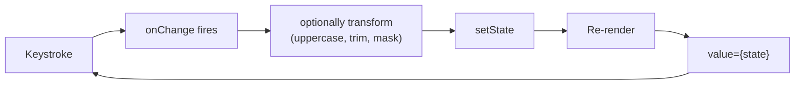
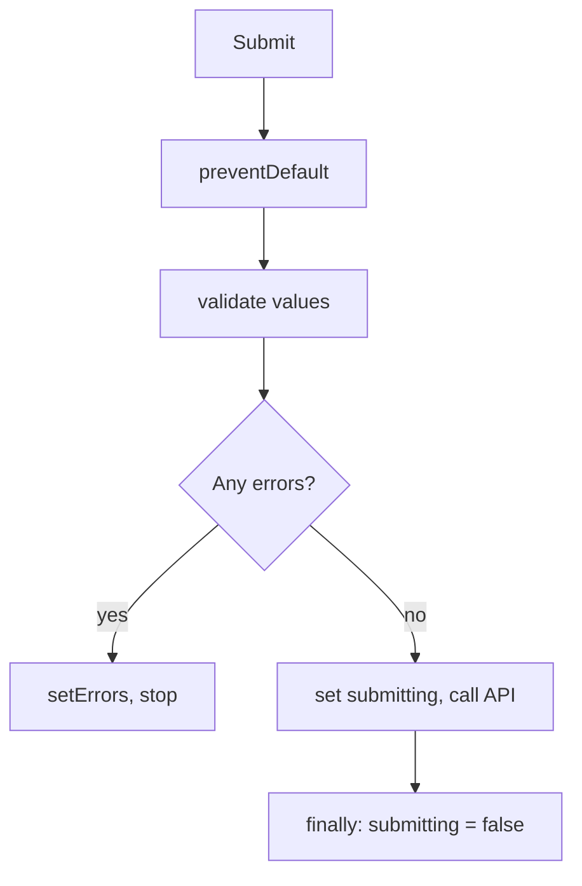
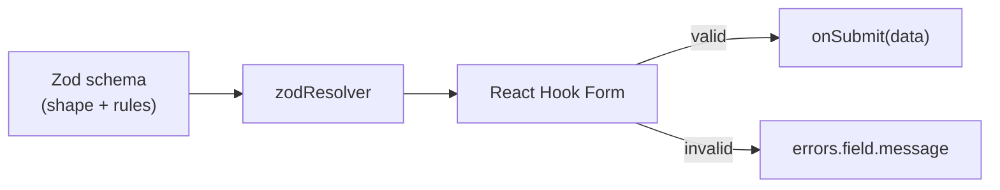

# Part 7 · Forms in React

> Forms are where users *give you data* — logins, signups, checkouts, settings, search. They're also where React beginners struggle most, because forms mix state, events, validation, and submission. This part builds forms from first principles: **controlled** vs **uncontrolled** inputs, every input type, validation strategies, and then the production tool most teams use — **React Hook Form with Zod** for schema validation. By the end you can build any form, from a search box to a multi-step wizard.

## Table of Contents

1. [Controlled inputs, the full picture](#1-controlled-inputs-the-full-picture)
2. [Every input type: text, checkbox, radio, select, textarea](#2-every-input-type)
3. [One handler for a whole form](#3-one-handler-for-a-whole-form)
4. [Uncontrolled inputs and refs](#4-uncontrolled-inputs-and-refs)
5. [Submission and validation by hand](#5-submission-and-validation-by-hand)
6. [React Hook Form: forms without the pain](#6-react-hook-form-forms-without-the-pain)
7. [Zod: schema validation done right](#7-zod-schema-validation-done-right)
8. [Mini-project: a validated signup form](#8-mini-project-a-validated-signup-form)
9. [Exercises and practice problems](#9-exercises-and-practice-problems)
10. [Glossary](#10-glossary)

> **💡 Suggested learning order:** §1–5 teach the fundamentals — do them even though §6–7 are what you'll use in real apps. Understanding the manual way makes React Hook Form make sense, and you'll still hand-build tiny forms (search boxes) often.

---

## 1. Controlled inputs, the full picture

You met controlled inputs in Part 3 §8. Let's make the model airtight because everything else builds on it. A **controlled input** has its value driven by React state: `value={state}` displays it, `onChange` writes back to it. React is the single source of truth.

```jsx
function NameField() {
  const [name, setName] = useState('')
  return (
    <input
      value={name}                               // state → input (display)
      onChange={(e) => setName(e.target.value)}  // input → state (update)
    />
  )
}
```

🎯 **Analogy:** A controlled input is like a **two-way sync** where React holds the authoritative copy. The DOM input isn't allowed to "remember" its own value — every keystroke round-trips through React state and comes back. It's the same discipline as keeping your database as the source of truth and treating the UI as a projection of it.

Because state is the source of truth, you get *superpowers* for free:

```jsx
function UppercaseField() {
  const [code, setCode] = useState('')
  return (
    <input
      value={code}
      // Transform on the way in — force uppercase, strip spaces:
      onChange={(e) => setCode(e.target.value.toUpperCase().replace(/\s/g, ''))}
      maxLength={8}
    />
  )
}
```

You can transform input live, validate as they type, conditionally disable a submit button, or sync two inputs — all because the value lives in state you control.



> **🔍 Under the hood:** With `value={state}`, React controls the input's displayed value on every render. When you type, the browser *would* update the input itself, but React immediately re-renders and sets `value` back to whatever state says. So if `onChange` transforms the text (uppercase), the user only ever sees the transformed version — the raw keystroke never "sticks." This tight loop is what makes controlled inputs so flexible.

> **⚠️ Common beginner mistake:** `value={name}` without `onChange` → a **read-only** input (React pins it, nothing updates state). React even warns: "You provided a `value` prop to a form field without an `onChange` handler." Either add `onChange`, or use `defaultValue` for an uncontrolled input (§4).

**Key takeaways:**
- Controlled input: `value` from state, `onChange` writes to state — React is the source of truth.
- This unlocks live transformation, validation, and cross-field syncing.
- `value` without `onChange` = a stuck, read-only input.

---

## 2. Every input type

Each input type reads/writes state slightly differently. Here's the complete reference — bookmark it.

**Text / email / password / number** — use `e.target.value` (always a string; convert numbers):

```jsx
<input type="text" value={name} onChange={(e) => setName(e.target.value)} />
<input type="number" value={age} onChange={(e) => setAge(Number(e.target.value))} />
```

**Checkbox** — use `e.target.checked` (a boolean), not `value`:

```jsx
<input type="checkbox" checked={agreed} onChange={(e) => setAgreed(e.target.checked)} />
```

**Radio group** — all share the same state; `checked` compares to the value:

```jsx
<label><input type="radio" name="plan" value="free"
  checked={plan === 'free'} onChange={(e) => setPlan(e.target.value)} /> Free</label>
<label><input type="radio" name="plan" value="pro"
  checked={plan === 'pro'} onChange={(e) => setPlan(e.target.value)} /> Pro</label>
```

**Select** — bind `value` on the `<select>` itself (not the options):

```jsx
<select value={country} onChange={(e) => setCountry(e.target.value)}>
  <option value="in">India</option>
  <option value="us">USA</option>
</select>
```

**Multi-select** — read selected options into an array:

```jsx
<select multiple value={tags} onChange={(e) =>
  setTags(Array.from(e.target.selectedOptions, (o) => o.value))}>
  ...
</select>
```

**Textarea** — in React, value goes in `value`, not between tags:

```jsx
<textarea value={bio} onChange={(e) => setBio(e.target.value)} />
```

Quick reference:

| Input | Read from | State type |
| --- | --- | --- |
| text / email / password | `e.target.value` | string |
| number | `Number(e.target.value)` | number |
| checkbox | `e.target.checked` | boolean |
| radio | `e.target.value` (shared state) | string |
| select | `e.target.value` on `<select>` | string |
| multi-select | `Array.from(e.target.selectedOptions, o => o.value)` | array |
| textarea | `e.target.value` | string |

> **🔍 Under the hood:** A checkbox's meaningful state is `checked` (on/off), not `value` (which defaults to `"on"`). Radio buttons work as a group because they share the same state variable — only the one whose `value` equals the state is `checked`. `<textarea>` in HTML uses inner text, but React normalizes it to a `value` prop for consistency with other inputs.

> **⚠️ Common beginner mistake:** Using `e.target.value` for checkboxes (always `"on"`, never the true/false you want) — use `checked`. And forgetting `Number()` on number inputs, so `age` stays a string and `age > 18` or `age + 1` misbehaves.

**Key takeaways:**
- Checkboxes use `checked` (boolean); everything else uses `value`.
- `<select>` and `<textarea>` bind `value` on the element itself.
- Convert number inputs with `Number()`; multi-selects read `selectedOptions`.

---

## 3. One handler for a whole form

Writing a separate `useState` + handler per field gets tedious. For multi-field forms, use **one state object** and **one handler** keyed by the input's `name` attribute.

```jsx
function SignupForm() {
  const [form, setForm] = useState({ email: '', password: '', remember: false })

  // One handler for every field — branches on type, keys by name.
  function handleChange(e) {
    const { name, value, type, checked } = e.target
    setForm((prev) => ({
      ...prev,                                     // keep other fields (immutability)
      [name]: type === 'checkbox' ? checked : value,  // computed key
    }))
  }

  return (
    <form>
      <input name="email" value={form.email} onChange={handleChange} />
      <input name="password" type="password" value={form.password} onChange={handleChange} />
      <label>
        <input name="remember" type="checkbox" checked={form.remember} onChange={handleChange} />
        Remember me
      </label>
    </form>
  )
}
```

The `name` attribute connects each input to its state field via the **computed key** `[name]: ...`. Add a field? Add one `<input name="…">` — the handler already covers it.

> **🔍 Under the hood:** `[name]: value` is JS **computed property names** — the key is evaluated from the variable. Since `name="email"`, it becomes `{ email: value }`. Spreading `...prev` first preserves the other fields (Part 3 §6 immutability). The `type === 'checkbox' ? checked : value` branch handles the one input that reports `checked` instead of `value`.

> **⚠️ Common beginner mistake:** Forgetting `...prev`, so each change *replaces* the whole object and wipes other fields. Or forgetting the `name` attribute, so `[name]` is `[undefined]` and all fields write to one key. Every input needs a `name` matching a state key.

**Key takeaways:**
- One state object + one handler scales cleanly to many fields.
- Connect inputs via `name`, update with the computed key `[name]: value`.
- Always spread `...prev` to preserve untouched fields.

---

## 4. Uncontrolled inputs and refs

An **uncontrolled input** manages its *own* value in the DOM; you read it only when needed (usually on submit) via a **ref**. It's the opposite of controlled — no state, no re-render per keystroke.

```jsx
import { useRef } from 'react'

function SearchForm() {
  const inputRef = useRef(null)

  function handleSubmit(e) {
    e.preventDefault()
    console.log(inputRef.current.value)   // read the DOM value on submit
  }

  return (
    <form onSubmit={handleSubmit}>
      <input ref={inputRef} defaultValue="" />   {/* defaultValue, NOT value */}
      <button>Search</button>
    </form>
  )
}
```

Note `defaultValue` (sets the *initial* value once) instead of `value` (which would make it controlled). The DOM owns the value; you peek at it via the ref.

**Controlled vs uncontrolled — when to use each:**

| | Controlled | Uncontrolled |
| --- | --- | --- |
| Value lives in | React state | The DOM |
| Re-renders per keystroke | Yes | No |
| Live validation / transform | ✅ Easy | ❌ Hard |
| Read value | Anytime from state | Via ref, on demand |
| Best for | Most forms, dynamic UIs | Simple/one-shot forms, file inputs |

**File inputs are always uncontrolled** (you can't set their value programmatically for security):

```jsx
function Upload() {
  const fileRef = useRef(null)
  function handleSubmit(e) {
    e.preventDefault()
    const file = fileRef.current.files[0]   // read the File object
    console.log(file?.name)
  }
  return (
    <form onSubmit={handleSubmit}>
      <input type="file" ref={fileRef} />
      <button>Upload</button>
    </form>
  )
}
```

> **🔍 Under the hood:** Controlled inputs re-render the component on every keystroke; for most forms that's negligible, but for huge forms it can matter (React Hook Form, §6, uses uncontrolled inputs precisely to avoid this). Uncontrolled inputs let the browser do its native thing and you sample the value later — simpler for fire-and-forget forms, but you lose live control.

> **⚠️ Common beginner mistake:** Mixing them — passing both `value` and `defaultValue`, or `value` without `onChange`. Pick one model per input. React warns if a controlled input flips to uncontrolled (value goes from a string to `undefined`) mid-life.

**Key takeaways:**
- Uncontrolled inputs keep their value in the DOM; read it via a ref on demand.
- Use `defaultValue` (not `value`) and no `onChange`.
- File inputs are always uncontrolled; controlled is the default choice otherwise.

---

## 5. Submission and validation by hand

Form submission and validation, done manually, ties together events, state, and conditional rendering. This is the foundation React Hook Form automates.

```jsx
function LoginForm() {
  const [form, setForm] = useState({ email: '', password: '' })
  const [errors, setErrors] = useState({})
  const [submitting, setSubmitting] = useState(false)

  function validate(values) {
    const errs = {}
    if (!values.email) errs.email = 'Email is required'
    else if (!/^[^\s@]+@[^\s@]+\.[^\s@]+$/.test(values.email)) errs.email = 'Invalid email'
    if (values.password.length < 8) errs.password = 'Min 8 characters'
    return errs
  }

  async function handleSubmit(e) {
    e.preventDefault()                       // stop the page reload
    const errs = validate(form)
    setErrors(errs)
    if (Object.keys(errs).length > 0) return // don't submit if invalid

    setSubmitting(true)
    try {
      await login(form)                      // your API call
    } finally {
      setSubmitting(false)
    }
  }

  const handleChange = (e) =>
    setForm((prev) => ({ ...prev, [e.target.name]: e.target.value }))

  return (
    <form onSubmit={handleSubmit} noValidate>
      <input name="email" value={form.email} onChange={handleChange} />
      {errors.email && <p className="err">{errors.email}</p>}   {/* show field error */}

      <input name="password" type="password" value={form.password} onChange={handleChange} />
      {errors.password && <p className="err">{errors.password}</p>}

      <button disabled={submitting}>{submitting ? 'Signing in…' : 'Sign in'}</button>
    </form>
  )
}
```

The anatomy of a real form: **values** (what's typed), **errors** (validation messages), **submitting** (in-flight flag). Notice how much bookkeeping this is for two fields.



> **🔍 Under the hood:** `noValidate` on the `<form>` disables the browser's built-in validation bubbles so you control the UX entirely. `Object.keys(errs).length` checks if validation produced any errors. The `submitting` flag prevents double-submits and drives the button's disabled/label state — essential for real forms where the API takes time.

> **⚠️ Common beginner mistake:** Forgetting `e.preventDefault()` — the form does a full-page GET/POST reload, blowing away your React state. Every `onSubmit` handler needs it (unless you genuinely want a native submit).

**Key takeaways:**
- Real forms track values, errors, and a submitting flag — lots of manual state.
- Validate on submit, set errors, and bail if invalid; use `noValidate` for custom UX.
- Always `preventDefault()`; disable the button while submitting.

---

## 6. React Hook Form: forms without the pain

§5 showed how much boilerplate hand-rolled forms need. **React Hook Form (RHF)** eliminates it: it manages values, errors, touched/dirty state, and submission with minimal code — using *uncontrolled* inputs for performance (few re-renders).

```bash
npm install react-hook-form
```

```jsx
import { useForm } from 'react-hook-form'

function LoginForm() {
  const {
    register,             // connect an input to the form
    handleSubmit,         // wraps your submit with validation
    formState: { errors, isSubmitting },
  } = useForm()

  const onSubmit = async (data) => {
    await login(data)     // `data` is the collected, validated values
  }

  return (
    <form onSubmit={handleSubmit(onSubmit)}>
      {/* register wires the input; the 2nd arg holds validation rules */}
      <input {...register('email', {
        required: 'Email is required',
        pattern: { value: /^[^\s@]+@[^\s@]+\.[^\s@]+$/, message: 'Invalid email' },
      })} />
      {errors.email && <p className="err">{errors.email.message}</p>}

      <input type="password" {...register('password', {
        required: 'Password is required',
        minLength: { value: 8, message: 'Min 8 characters' },
      })} />
      {errors.password && <p className="err">{errors.password.message}</p>}

      <button disabled={isSubmitting}>{isSubmitting ? 'Signing in…' : 'Sign in'}</button>
    </form>
  )
}
```

Compare to §5: no `useState` for values, no manual `errors` state, no `handleChange`, no `preventDefault` — RHF does all of it. The `register('email', rules)` spreads `name`, `ref`, `onChange`, and `onBlur` onto the input.

**The key RHF pieces:**

| API | Purpose |
| --- | --- |
| `register(name, rules)` | Connects an input + declares its validation rules |
| `handleSubmit(fn)` | Validates, then calls `fn(data)` with values if valid |
| `formState.errors` | Per-field error objects (`errors.email.message`) |
| `formState.isSubmitting` | True while your async submit runs |
| `watch(name)` | Subscribe to a field's live value (for conditional UI) |
| `reset()` / `setValue()` | Programmatically reset or set values |

🎯 **Analogy:** Hand-rolled forms (§5) are like writing raw SQL for every query. RHF is a query builder — you *declare* fields and rules, and it handles the plumbing (change tracking, validation timing, error collection, submission). You describe *what* valid means; RHF handles *when* and *how* to check.

> **🔍 Under the hood:** RHF registers inputs as **uncontrolled** (via refs), so typing doesn't re-render your component — only the fields that need to (like error messages) update. This makes even large forms fast. `handleSubmit` runs your validation rules first; if all pass, it calls your `onSubmit(data)`; if not, it populates `errors` and skips submission.

> **⚠️ Common beginner mistake:** Wrapping RHF inputs in controlled `value`/`onChange` (defeats its uncontrolled performance model). Let `register` own the input. For third-party controlled components (custom selects, date pickers), use RHF's `<Controller>` wrapper instead of `register`.

**Key takeaways:**
- React Hook Form removes the values/errors/submit boilerplate with `register` + `handleSubmit`.
- It uses uncontrolled inputs for performance; error messages come from `formState.errors`.
- Declare validation rules inline; use `<Controller>` for controlled third-party inputs.

---

## 7. Zod: schema validation done right

Inline validation rules (§6) get unwieldy for complex forms, and they don't give you a reusable, typed definition of "valid." **Zod** lets you define a **schema** — a single source of truth for your data shape and rules — and plug it into RHF via a resolver.

```bash
npm install zod @hookform/resolvers
```

```jsx
import { z } from 'zod'
import { useForm } from 'react-hook-form'
import { zodResolver } from '@hookform/resolvers/zod'

// 1. Define the schema once — declarative, reusable, composable.
const signupSchema = z.object({
  name: z.string().min(2, 'Name too short'),
  email: z.string().email('Invalid email'),
  age: z.coerce.number().min(18, 'Must be 18+'),          // coerce string→number
  password: z.string().min(8, 'Min 8 characters'),
  confirm: z.string(),
}).refine((data) => data.password === data.confirm, {     // cross-field rule
  message: 'Passwords do not match',
  path: ['confirm'],                                        // attach error to `confirm`
})

function SignupForm() {
  const { register, handleSubmit, formState: { errors } } = useForm({
    resolver: zodResolver(signupSchema),   // RHF validates against the schema
  })

  const onSubmit = (data) => console.log('valid!', data)

  return (
    <form onSubmit={handleSubmit(onSubmit)}>
      <input {...register('name')} />
      {errors.name && <p>{errors.name.message}</p>}
      <input {...register('email')} />
      {errors.email && <p>{errors.email.message}</p>}
      <input {...register('age')} />
      {errors.age && <p>{errors.age.message}</p>}
      <input type="password" {...register('password')} />
      {errors.password && <p>{errors.password.message}</p>}
      <input type="password" {...register('confirm')} />
      {errors.confirm && <p>{errors.confirm.message}</p>}
      <button>Sign up</button>
    </form>
  )
}
```

Now validation lives in *one* schema, separate from the JSX. The `.refine()` handles cross-field rules (password confirmation) that inline rules can't express cleanly.

**Why schemas win:**

```cards
Single source of truth :: one schema defines shape + rules, reused anywhere.
Cross-field validation :: .refine() checks relationships (password === confirm).
Reusable :: the same schema can validate an API response or a config file.
Type inference :: z.infer<typeof schema> gives you a TypeScript type for free (Part 12).
Composable :: build big schemas from small ones (.extend, .merge, .pick).
```



> **🔍 Under the hood:** `zodResolver(schema)` adapts Zod to RHF's resolver interface. On submit, RHF calls it with the form values; Zod parses them against the schema, returning either the clean parsed data or a map of field errors, which RHF places into `formState.errors`. Zod also *coerces* and *transforms* (`z.coerce.number()` turns the string input into a number) — so `data` arrives already the right types.

> **⚠️ Common beginner mistake:** Duplicating validation logic in the frontend and backend. With Zod you can **share the same schema** between client and server (in a monorepo), guaranteeing they agree. Also: forgetting `z.coerce.number()` for number inputs — raw input values are strings, so `z.number()` alone rejects them.

**Key takeaways:**
- Zod defines validation as a reusable schema, plugged into RHF via `zodResolver`.
- `.refine()` handles cross-field rules; `z.coerce` fixes string-typed inputs.
- One schema can validate forms, API responses, and (Part 12) generate TS types.

---

## 8. Mini-project: a validated signup form

🏗️ Build a **complete, production-style signup form** with React Hook Form + Zod: multiple field types, live errors, password confirmation, a submitting state, and a success screen.

```bash
npm create vite@latest signup-form    # React → JavaScript
cd signup-form && npm install
npm install react-hook-form zod @hookform/resolvers
npm run dev
```

```jsx
// src/App.jsx
import { useState } from 'react'
import { z } from 'zod'
import { useForm } from 'react-hook-form'
import { zodResolver } from '@hookform/resolvers/zod'

const schema = z.object({
  username: z.string().min(3, 'At least 3 characters').max(20, 'Too long'),
  email: z.string().email('Enter a valid email'),
  age: z.coerce.number().int('Whole numbers only').min(18, 'Must be 18 or older'),
  plan: z.enum(['free', 'pro'], { message: 'Choose a plan' }),
  password: z.string().min(8, 'Min 8 characters').regex(/[0-9]/, 'Include a number'),
  confirm: z.string(),
  terms: z.literal(true, { message: 'You must accept the terms' }),
}).refine((d) => d.password === d.confirm, { message: 'Passwords do not match', path: ['confirm'] })

export default function App() {
  const [done, setDone] = useState(null)
  const { register, handleSubmit, reset, formState: { errors, isSubmitting } } = useForm({
    resolver: zodResolver(schema),
    defaultValues: { plan: 'free' },
  })

  async function onSubmit(data) {
    await new Promise((r) => setTimeout(r, 800))   // simulate an API call
    setDone(data)
    reset()
  }

  if (done) {
    return (
      <main style={wrap}>
        <h1>🎉 Welcome, {done.username}!</h1>
        <p>Account created with the {done.plan} plan.</p>
        <button onClick={() => setDone(null)}>Create another</button>
      </main>
    )
  }

  return (
    <main style={wrap}>
      <h1>Create account</h1>
      <form onSubmit={handleSubmit(onSubmit)} style={{ display: 'grid', gap: 12 }}>
        <Field label="Username" error={errors.username}>
          <input {...register('username')} style={input} />
        </Field>
        <Field label="Email" error={errors.email}>
          <input {...register('email')} style={input} />
        </Field>
        <Field label="Age" error={errors.age}>
          <input {...register('age')} style={input} />
        </Field>
        <Field label="Plan" error={errors.plan}>
          <select {...register('plan')} style={input}>
            <option value="free">Free</option>
            <option value="pro">Pro</option>
          </select>
        </Field>
        <Field label="Password" error={errors.password}>
          <input type="password" {...register('password')} style={input} />
        </Field>
        <Field label="Confirm password" error={errors.confirm}>
          <input type="password" {...register('confirm')} style={input} />
        </Field>
        <label style={{ fontSize: 14 }}>
          <input type="checkbox" {...register('terms')} /> I accept the terms
        </label>
        {errors.terms && <small style={err}>{errors.terms.message}</small>}

        <button disabled={isSubmitting} style={btn}>
          {isSubmitting ? 'Creating…' : 'Sign up'}
        </button>
      </form>
    </main>
  )
}

// A reusable field wrapper — label + error, DRY across every field.
function Field({ label, error, children }) {
  return (
    <label style={{ display: 'grid', gap: 4 }}>
      <span style={{ fontSize: 13, fontWeight: 600 }}>{label}</span>
      {children}
      {error && <small style={err}>{error.message}</small>}
    </label>
  )
}

const wrap = { maxWidth: 420, margin: '40px auto', fontFamily: 'system-ui' }
const input = { padding: 8, border: '1px solid #cbd5e1', borderRadius: 8, width: '100%' }
const btn = { padding: 10, background: '#0ea5e9', color: '#fff', border: 0, borderRadius: 8, fontWeight: 700 }
const err = { color: '#ef4444' }
```

**Everything from Part 7, in one form:**

```cards
Schema validation :: one Zod schema — text, number, enum, checkbox, cross-field.
React Hook Form :: register + handleSubmit; zero manual value/error state.
Reusable Field :: a wrapper component (Part 2 composition) keeps fields DRY.
Submitting state :: isSubmitting disables the button + shows progress.
Success flow :: conditional render (Part 4) + reset() after submit.
```

> **💡 Tip:** The `Field` wrapper is composition (Part 2) meeting forms — every field gets consistent label + error layout with no repetition. This pattern scales to design systems: one `<Field>`, `<Input>`, `<Select>` set powers your whole app's forms.

**Extend it (do at least three):**
1. Add live password-strength feedback using RHF's `watch('password')`.
2. Add a "show password" toggle (a `useToggle` from Part 5).
3. Disable submit until the form is valid (`formState.isValid` + `mode: 'onChange'`).
4. Add a phone field with a Zod regex, formatted live.
5. Make it a two-step wizard (account → profile) keeping one schema, split by `.pick()`.

**Key takeaways:**
- RHF + Zod is the production standard: declarative schema, minimal component code.
- A reusable `Field` wrapper keeps large forms clean and consistent.
- Handle the full lifecycle: validating, submitting, success/reset.

---

## 9. Exercises and practice problems

### 🧪 Warm-ups (easy)

**E1.** Build a controlled search input that shows the query live below it, and a "Clear" button.

<details><summary>Show solution</summary>

```jsx
function Search() {
  const [q, setQ] = useState('')
  return (
    <div>
      <input value={q} onChange={(e) => setQ(e.target.value)} />
      <button onClick={() => setQ('')}>Clear</button>
      <p>Searching for: {q || '—'}</p>
    </div>
  )
}
```

*Why:* Controlled input; the display and the Clear button both read/write one state.
</details>

**E2.** Build a checkbox that enables/disables a submit button.

<details><summary>Show solution</summary>

```jsx
function Agree() {
  const [ok, setOk] = useState(false)
  return (
    <div>
      <label><input type="checkbox" checked={ok} onChange={(e) => setOk(e.target.checked)} /> I agree</label>
      <button disabled={!ok}>Continue</button>
    </div>
  )
}
```

*Why:* Checkbox uses `checked`; the button's `disabled` is derived from it.
</details>

### 🧪 Core (medium)

**E3.** Build a form with name, email, and a country `<select>`, using ONE state object and ONE handler.

<details><summary>Show solution</summary>

```jsx
const [form, setForm] = useState({ name: '', email: '', country: 'in' })
const onChange = (e) => setForm((p) => ({ ...p, [e.target.name]: e.target.value }))
// <input name="name" value={form.name} onChange={onChange} />
// <input name="email" value={form.email} onChange={onChange} />
// <select name="country" value={form.country} onChange={onChange}>...</select>
```

*Why:* Computed key `[name]` + spread `...p` — one handler for all fields (§3).
</details>

**E4.** Convert this manual form to React Hook Form (email required + valid, message min 10 chars).

<details><summary>Show solution</summary>

```jsx
const { register, handleSubmit, formState: { errors } } = useForm()
// <form onSubmit={handleSubmit(onSubmit)}>
//   <input {...register('email', { required: 'Required',
//     pattern: { value: /^[^\s@]+@[^\s@]+\.[^\s@]+$/, message: 'Invalid' } })} />
//   {errors.email && <p>{errors.email.message}</p>}
//   <textarea {...register('message', { minLength: { value: 10, message: 'Too short' } })} />
//   {errors.message && <p>{errors.message.message}</p>}
//   <button>Send</button>
// </form>
```

*Why:* `register` + rules replaces all manual value/error state.
</details>

**E5.** Write a Zod schema for a product: `name` (non-empty), `price` (positive number), `category` (one of three), `onSale` (boolean).

<details><summary>Show solution</summary>

```jsx
const productSchema = z.object({
  name: z.string().min(1, 'Required'),
  price: z.coerce.number().positive('Must be positive'),
  category: z.enum(['tech', 'home', 'toys']),
  onSale: z.boolean(),
})
```

*Why:* `z.coerce.number()` handles the string input; `z.enum` restricts categories.
</details>

### 🧪 Challenge (hard)

**E6.** Build a dynamic field-array form: a list of "skills" where you can add/remove rows, each a text input. (Hint: RHF's `useFieldArray`, or manage an array in state.)

<details><summary>Show solution</summary>

```jsx
import { useForm, useFieldArray } from 'react-hook-form'
function SkillsForm() {
  const { register, control, handleSubmit } = useForm({ defaultValues: { skills: [{ value: '' }] } })
  const { fields, append, remove } = useFieldArray({ control, name: 'skills' })
  return (
    <form onSubmit={handleSubmit((d) => console.log(d))}>
      {fields.map((field, i) => (
        <div key={field.id}>
          <input {...register(`skills.${i}.value`)} />
          <button type="button" onClick={() => remove(i)}>✕</button>
        </div>
      ))}
      <button type="button" onClick={() => append({ value: '' })}>Add skill</button>
      <button>Save</button>
    </form>
  )
}
```

*Why:* `useFieldArray` manages dynamic lists of fields with stable `field.id` keys (Part 4!). `type="button"` prevents add/remove from submitting the form.
</details>

**E7.** Add cross-field validation with Zod: a date-range form where `endDate` must be after `startDate`.

<details><summary>Show solution</summary>

```jsx
const rangeSchema = z.object({
  startDate: z.string(),
  endDate: z.string(),
}).refine((d) => new Date(d.endDate) > new Date(d.startDate), {
  message: 'End must be after start',
  path: ['endDate'],
})
```

*Why:* `.refine()` expresses relationships between fields; `path` attaches the error to the right field.
</details>

**E8 (capstone tie-in).** Build a reusable `<FormField>` + `<TextInput>` + `<SelectInput>` set that all work with RHF's `register`, so any form in your app is just a schema + a few components. You'll reuse this in the CRUD-app capstone (Part 8+).

<details><summary>Show hint</summary>

Make `TextInput` accept `register` output via `{...register(name)}` forwarded through props (Part 2's `{...rest}`), plus a `label` and `error`. Then a whole form becomes: define a Zod schema, render `<TextInput label=… {...register('x')} error={errors.x} />` per field. This is the seed of a design-system form layer.
</details>

---

## 10. Glossary

| Term | Meaning |
| --- | --- |
| **Controlled input** | Input whose value is driven by React state (`value` + `onChange`). |
| **Uncontrolled input** | Input that keeps its value in the DOM; read via a ref. |
| **`defaultValue`** | Sets an uncontrolled input's initial value (vs `value` for controlled). |
| **Computed key** | `{ [name]: value }` — a property key evaluated from a variable. |
| **React Hook Form** | A library that manages form state/validation with minimal code. |
| **`register`** | RHF function connecting an input and declaring its validation rules. |
| **`handleSubmit`** | RHF wrapper that validates then calls your submit with the values. |
| **Zod** | A schema library for declaring and validating data shapes. |
| **Resolver** | The adapter (`zodResolver`) connecting a schema to React Hook Form. |
| **`.refine()`** | Zod method for cross-field / custom validation rules. |

---

> **You can now build any form** — from a controlled search box to a schema-validated, multi-field signup. Forms collect data; next you'll learn to move *between* screens as your app grows into multiple pages.
>
> **Next:** [Part 8 · Routing with React Router →](08-routing.md)
