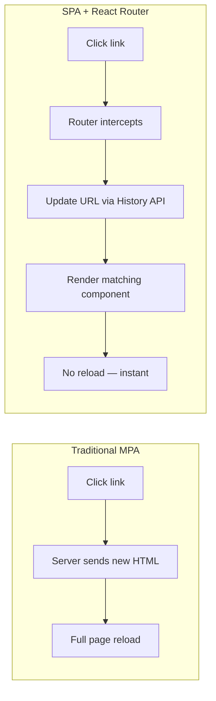
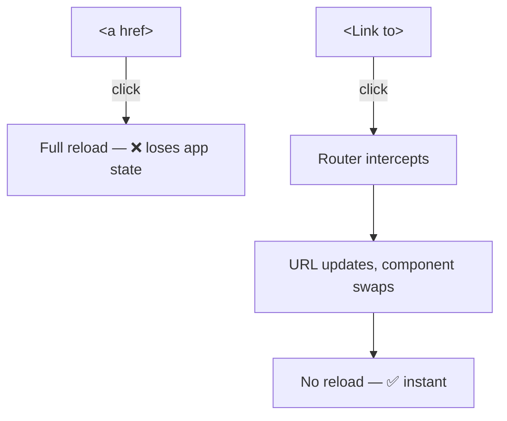
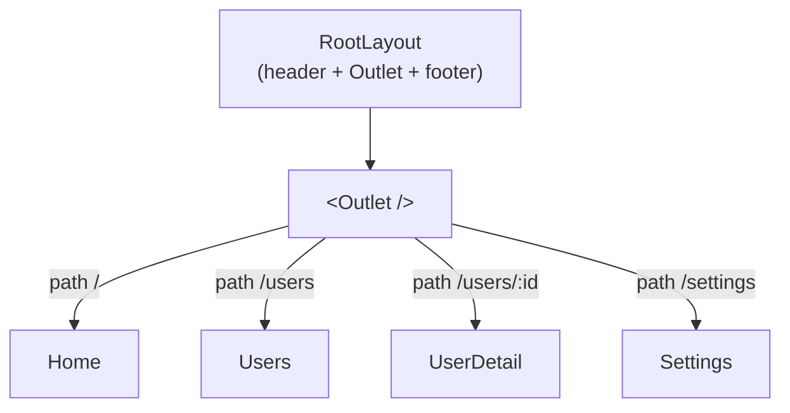
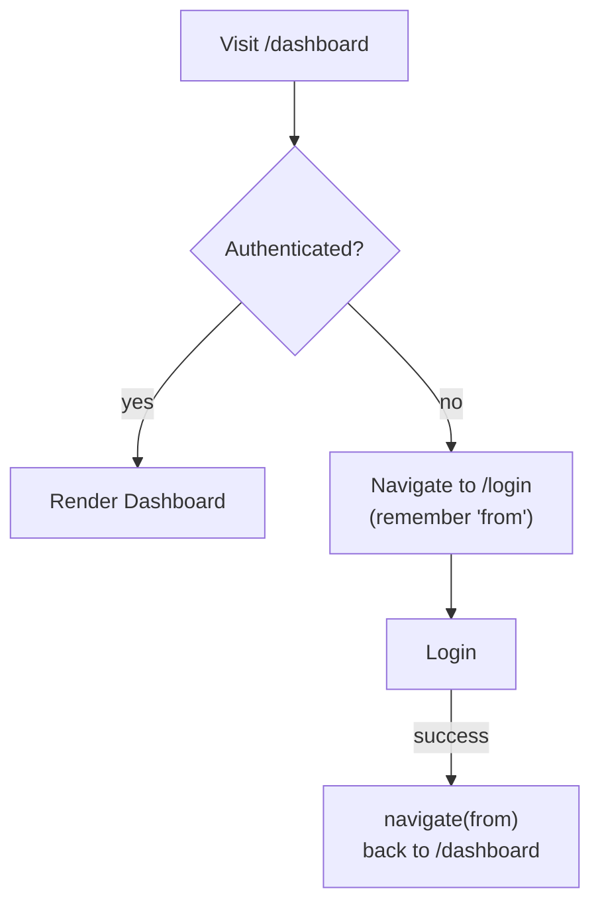
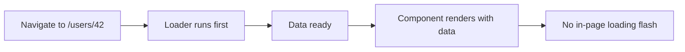

# Part 8 · Routing with React Router

> So far every app has been a single screen. Real apps have *pages*: a home page, a list, a detail view, a settings screen — each with its own URL. But a React app is a **single-page application** (one `index.html`), so navigation happens in JavaScript, not by loading new HTML. **React Router** is the library that maps URLs to components, handles navigation, and keeps the URL and UI in sync. This part takes you from "one screen" to a real multi-page app — and kicks off **Capstone #3: a full CRUD application.**

## Table of Contents

1. [Why routing, and how SPAs navigate](#1-why-routing-and-how-spas-navigate)
2. [Setting up React Router](#2-setting-up-react-router)
3. [Links and navigation](#3-links-and-navigation)
4. [Route parameters and reading them](#4-route-parameters-and-reading-them)
5. [Nested routes and layouts](#5-nested-routes-and-layouts)
6. [Programmatic navigation and query params](#6-programmatic-navigation-and-query-params)
7. [Protected routes and redirects](#7-protected-routes-and-redirects)
8. [Data loading with loaders and actions](#8-data-loading-with-loaders-and-actions)
9. [Capstone kickoff: a CRUD app shell](#9-capstone-kickoff-a-crud-app-shell)
10. [Exercises and practice problems](#10-exercises-and-practice-problems)
11. [Glossary](#11-glossary)

> **💡 Suggested learning order:** §1–5 are the core you'll use in every app. §6–7 handle real navigation needs. §8 (loaders/actions) is the modern data-router approach — powerful, and it pairs with what you learned in Part 6. This part uses React Router v6/7 (the current API).

---

## 1. Why routing, and how SPAs navigate

Recall from the README: a React app is a **single-page application** — one HTML file, and JavaScript swaps the content. Traditional websites load a *new HTML document* from the server for every URL. SPAs don't: they intercept navigation, update the URL via the browser's History API, and render different components — no full reload.

🎯 **Analogy:** A traditional multi-page site is like calling a restaurant and having them mail you a whole new menu for every question. An SPA is like having the full menu already — when you "navigate," you just flip to a different section instantly. React Router is the table of contents that maps "I want the desserts page" (a URL) to "show the dessert section" (a component), without re-fetching the whole menu.



What React Router gives you:
- **URL ↔ UI mapping:** each path (`/`, `/users`, `/users/42`) renders specific components.
- **Client-side navigation:** instant transitions, no full reload, preserved app state.
- **Deep linking:** `/users/42` works if pasted/refreshed — the URL is real and shareable.
- **Browser integration:** back/forward buttons, bookmarks, and history all work.

> **🔍 Under the hood:** React Router uses the browser's **History API** (`pushState`/`replaceState`) to change the URL bar *without* a server request. It listens for URL changes, matches the path against your route definitions, and renders the matching component tree. Because the URL is genuine, refreshing or sharing `/users/42` works — as long as your server is configured to serve `index.html` for all paths (Part 15 covers this "SPA fallback").

> **⚠️ Common beginner mistake:** Expecting deep links to work in production without server config. In dev, Vite handles the fallback; in production, if the server returns 404 for `/users/42` (because there's no such file), refreshing breaks. You must configure the host to serve `index.html` for unknown paths (Part 15).

**Key takeaways:**
- SPAs navigate in JavaScript via the History API — no full page reloads.
- React Router maps URLs to components and integrates with browser history.
- Real URLs mean deep links and refreshes work (with a server SPA fallback).

---

## 2. Setting up React Router

Install it and define your routes. There are two styles; we'll use the modern **`createBrowserRouter`** (the "data router" that unlocks loaders/actions in §8).

```bash
npm install react-router-dom
```

```jsx
// src/main.jsx
import { createRoot } from 'react-dom/client'
import { createBrowserRouter, RouterProvider } from 'react-router-dom'
import Home from './pages/Home'
import About from './pages/About'
import Users from './pages/Users'
import NotFound from './pages/NotFound'

// A route table: each object maps a path to an element.
const router = createBrowserRouter([
  { path: '/', element: <Home /> },
  { path: '/about', element: <About /> },
  { path: '/users', element: <Users /> },
  { path: '*', element: <NotFound /> },   // catch-all for unmatched URLs (404)
])

createRoot(document.getElementById('root')).render(
  <RouterProvider router={router} />
)
```

Each route object has a `path` and an `element` (the component to render). The `path: '*'` wildcard matches anything not matched above — your 404 page.

The two router APIs you'll see:

| API | Style | When |
| --- | --- | --- |
| `createBrowserRouter` + `RouterProvider` | Route objects (data router) | ✅ Recommended — enables loaders/actions |
| `<BrowserRouter>` + `<Routes>`/`<Route>` | JSX routes | Older/simpler; no loaders |

> **🔍 Under the hood:** `createBrowserRouter` builds a route-matching tree from your objects. `RouterProvider` renders it and provides routing context to the whole app (so hooks like `useNavigate`, `useParams` work anywhere below). The "browser" variant uses clean URLs (`/users/42`); there's also `createHashRouter` (`/#/users/42`) for static hosts that can't do SPA fallback.

> **⚠️ Common beginner mistake:** Forgetting the catch-all `path: '*'` route, so unmatched URLs render nothing (blank screen) instead of a helpful 404. Always include it.

**Key takeaways:**
- Install `react-router-dom`; define routes with `createBrowserRouter`.
- Each route maps a `path` to an `element`; `path: '*'` is your 404 catch-all.
- The data-router API (`createBrowserRouter`) is the modern default — it enables loaders/actions.

---

## 3. Links and navigation

Never use plain `<a href>` for internal navigation — it triggers a **full page reload**, defeating the SPA. Use React Router's **`<Link>`** (or **`<NavLink>`** for nav menus that need active styling).

```jsx
import { Link, NavLink } from 'react-router-dom'

function Nav() {
  return (
    <nav>
      <Link to="/">Home</Link>
      <Link to="/about">About</Link>

      {/* NavLink knows when it's active — style the current page's link */}
      <NavLink to="/users" className={({ isActive }) => (isActive ? 'active' : '')}>
        Users
      </NavLink>
    </nav>
  )
}
```

`<Link to="/about">` renders an `<a>` but intercepts the click to navigate client-side. `<NavLink>` additionally gives you an `isActive` flag to highlight the current route.



> **🔍 Under the hood:** `<Link>` renders a real `<a href="/about">` (good for accessibility, SEO, and open-in-new-tab), but its `onClick` calls `preventDefault()` and uses the History API instead of letting the browser load a new page. That's why cmd/ctrl-click *does* open a new tab (native anchor behavior) while a plain click navigates in-app.

> **⚠️ Common beginner mistake:** Using `<a href="/about">` for internal links. It works — but reloads the whole app, clearing state and re-downloading everything. Use `<a>` only for *external* links (other websites). Internal = `<Link>`.

**Key takeaways:**
- Use `<Link to="…">` for internal navigation (no reload); `<a>` only for external URLs.
- `<NavLink>` adds an `isActive` flag for styling the current page's link.
- Links render real anchors, so accessibility and open-in-new-tab still work.

---

## 4. Route parameters and reading them

Detail pages need dynamic URLs: `/users/1`, `/users/42`, `/products/shoes`. Define a **route parameter** with `:name`, then read it with **`useParams`**.

```jsx
// Route definition — :userId is a parameter that matches any value
{ path: '/users/:userId', element: <UserDetail /> }
```

```jsx
import { useParams } from 'react-router-dom'
import { useQuery } from '@tanstack/react-query'

function UserDetail() {
  const { userId } = useParams()          // read the URL param (a string)

  // Combine with TanStack Query (Part 6) — the param drives the fetch
  const { data: user, isLoading } = useQuery({
    queryKey: ['user', userId],
    queryFn: () => fetch(`/api/users/${userId}`).then((r) => r.json()),
  })

  if (isLoading) return <p>Loading…</p>
  return <h1>{user.name}</h1>
}
```

Visiting `/users/42` makes `useParams()` return `{ userId: '42' }`. Params are always **strings** — convert if you need a number.

Multiple params work too:

```jsx
{ path: '/teams/:teamId/members/:memberId', element: <Member /> }
// useParams() → { teamId: '...', memberId: '...' }
```

> **🔍 Under the hood:** When the URL matches `/users/:userId`, React Router extracts the segment into a params object keyed by the param name. This is *the* pattern for master-detail UIs: a list links to `/users/:id`, the detail page reads `:id` via `useParams`, and (with Part 6) fetches that user. The param is the bridge between the URL and the data.

> **⚠️ Common beginner mistake:** Treating params as numbers — `userId === 42` is `false` because `userId` is the string `'42'`. Use `Number(userId)` when comparing to numbers or doing math. Also: mismatched names — the route says `:userId` but you read `useParams().id`; the names must match exactly.

**Key takeaways:**
- Define dynamic segments with `:paramName`; read them with `useParams()`.
- Params are always strings — convert with `Number()` when needed.
- Params + TanStack Query = the standard master-detail data pattern.

---

## 5. Nested routes and layouts

Most apps share chrome — a header, sidebar, footer — across many pages. **Nested routes** let a parent route render shared layout plus an **`<Outlet />`** where child routes appear. This avoids repeating the layout in every page.

```jsx
// Route table with nesting: children render inside the parent's <Outlet/>
const router = createBrowserRouter([
  {
    path: '/',
    element: <RootLayout />,        // shared shell (nav + outlet)
    children: [
      { index: true, element: <Home /> },          // "/" (index route)
      { path: 'users', element: <Users /> },        // "/users"
      { path: 'users/:userId', element: <UserDetail /> }, // "/users/42"
      { path: 'settings', element: <Settings /> },  // "/settings"
    ],
  },
])
```

```jsx
import { Outlet, NavLink } from 'react-router-dom'

// The layout renders once; the Outlet swaps per child route.
function RootLayout() {
  return (
    <div>
      <header>
        <nav>
          <NavLink to="/">Home</NavLink>
          <NavLink to="/users">Users</NavLink>
          <NavLink to="/settings">Settings</NavLink>
        </nav>
      </header>
      <main>
        <Outlet />       {/* the matched child route renders HERE */}
      </main>
      <footer>© 2026</footer>
    </div>
  )
}
```

Now the header/footer render once and persist across navigation; only the `<Outlet>` content changes. You can nest layouts arbitrarily deep (an app shell → a dashboard layout → a section layout).



> **🔍 Under the hood:** When the URL is `/users`, React Router matches `RootLayout` (parent) *and* `Users` (child), then renders `Users` wherever the parent placed `<Outlet />`. The `index: true` route is the child shown when the parent's path matches exactly (`/`). This composition means shared UI (and shared data via nested loaders, §8) lives at the right level, once.

> **⚠️ Common beginner mistake:** Forgetting `<Outlet />` in the layout — child routes match but render nothing (the layout shows, but the page content is missing). If a nested page is blank, check that the parent renders an `<Outlet />`.

**Key takeaways:**
- Nested routes share layout via a parent route + `<Outlet />` for children.
- `index: true` marks the default child for the parent's exact path.
- Layout renders once and persists; only the outlet content changes on navigation.

---

## 6. Programmatic navigation and query params

Sometimes you navigate from *code*, not a click — after a form submits, a login succeeds, or a timeout. Use the **`useNavigate`** hook.

```jsx
import { useNavigate } from 'react-router-dom'

function CreateUser() {
  const navigate = useNavigate()

  async function handleSubmit(data) {
    const user = await createUser(data)
    navigate(`/users/${user.id}`)     // go to the new user's page
    // navigate(-1)                    // go back (like the back button)
    // navigate('/users', { replace: true })  // replace history (no back to this page)
  }
  // ...
}
```

`navigate(path)` pushes a new history entry; `navigate(-1)` goes back; `{ replace: true }` replaces the current entry (useful after login so "back" doesn't return to the login page).

**Query parameters** (`?sort=name&page=2`) — for filters, search, pagination — use **`useSearchParams`**:

```jsx
import { useSearchParams } from 'react-router-dom'

function ProductList() {
  const [searchParams, setSearchParams] = useSearchParams()
  const sort = searchParams.get('sort') ?? 'name'      // read ?sort=
  const page = Number(searchParams.get('page') ?? '1') // read ?page=

  return (
    <div>
      <select value={sort} onChange={(e) => setSearchParams({ sort: e.target.value, page })}>
        <option value="name">Name</option>
        <option value="price">Price</option>
      </select>
      {/* changing the select updates the URL: ?sort=price&page=1 */}
    </div>
  )
}
```

Storing filters in the URL makes them **shareable and bookmarkable** — someone can send a link to "products sorted by price, page 2."

> **🔍 Under the hood:** `useSearchParams` works like `useState`, but the "state" *is* the URL query string. Reading uses the `URLSearchParams` API (`.get(key)`); writing (`setSearchParams`) updates the URL and re-renders. This is powerful: your filter/sort/pagination state lives in the URL, so it survives refreshes, is shareable, and integrates with browser history (back button undoes a filter change).

> **⚠️ Common beginner mistake:** Duplicating URL state in `useState` and trying to sync them. If a value belongs in the URL (filters, search, current page), let `useSearchParams` be the source of truth — don't shadow it with local state.

**Key takeaways:**
- `useNavigate` navigates from code; `navigate(-1)` goes back, `{ replace: true }` replaces history.
- `useSearchParams` reads/writes query params (`?sort=…`) like `useState` on the URL.
- Put filters/search/pagination in the URL for shareable, bookmarkable state.

---

## 7. Protected routes and redirects

Many routes require authentication — a dashboard, settings, checkout. A **protected route** checks auth and either renders the page or redirects to login. The pattern: a guard component that wraps protected content.

```jsx
import { Navigate, useLocation, Outlet } from 'react-router-dom'

// A guard: render children if authed, else redirect to /login.
function RequireAuth() {
  const { user } = useAuth()            // your auth hook/context (Part 5/9)
  const location = useLocation()

  if (!user) {
    // Redirect, remembering where they wanted to go (so we can return after login).
    return <Navigate to="/login" state={{ from: location }} replace />
  }
  return <Outlet />                     // authed — render the nested protected routes
}
```

Wire it into the route table as a layout route around protected pages:

```jsx
const router = createBrowserRouter([
  { path: '/login', element: <Login /> },
  {
    element: <RequireAuth />,           // guard wraps these children
    children: [
      { path: '/dashboard', element: <Dashboard /> },
      { path: '/settings', element: <Settings /> },
    ],
  },
])
```

After login, send them back where they came from:

```jsx
function Login() {
  const navigate = useNavigate()
  const location = useLocation()
  const from = location.state?.from?.pathname ?? '/dashboard'  // where they tried to go

  async function handleLogin(creds) {
    await signIn(creds)
    navigate(from, { replace: true })   // return to the original destination
  }
}
```



> **🔍 Under the hood:** `<Navigate>` is a component that triggers a redirect when rendered (declarative navigation). Passing `state={{ from: location }}` stashes the attempted URL in history state, so after login you can return there. `replace` avoids leaving the login page in history (so "back" doesn't loop). The guard as a layout route + `<Outlet />` cleanly protects any number of nested pages.

> **⚠️ Common beginner mistake:** Doing the auth check with an effect + `navigate` inside each protected page — it flashes the protected content before redirecting. Redirect *during render* with `<Navigate>` (or in a loader, §8), so protected content never appears for unauthenticated users.

**Key takeaways:**
- Protect routes with a guard that renders `<Outlet/>` if authed, else `<Navigate to="/login">`.
- Stash the attempted location in `state` to return there after login.
- Redirect during render (not in an effect) to avoid flashing protected content.

---

## 8. Data loading with loaders and actions

The data router (`createBrowserRouter`) can load data **before** a route renders, via **loaders** — so there's no loading spinner flash inside the page, and data is ready when the component mounts. **Actions** handle form submissions similarly. This is React Router's own data layer (an alternative or complement to TanStack Query).

```jsx
// A loader runs BEFORE the route renders; its return value feeds the component.
async function userLoader({ params }) {
  const res = await fetch(`/api/users/${params.userId}`)
  if (!res.ok) throw new Response('Not Found', { status: 404 })  // triggers errorElement
  return res.json()
}

const router = createBrowserRouter([
  {
    path: '/users/:userId',
    element: <UserDetail />,
    loader: userLoader,                 // data fetched before render
    errorElement: <ErrorPage />,        // shown if the loader throws
  },
])
```

```jsx
import { useLoaderData } from 'react-router-dom'

function UserDetail() {
  const user = useLoaderData()          // the loader's return value — already here!
  return <h1>{user.name}</h1>           // no isLoading needed — data is ready
}
```

**Actions** handle form posts declaratively with React Router's `<Form>`:

```jsx
import { Form, redirect } from 'react-router-dom'

async function createUserAction({ request }) {
  const formData = await request.formData()
  const user = await createUser(Object.fromEntries(formData))
  return redirect(`/users/${user.id}`)  // navigate after success
}

// Route: { path: '/users/new', element: <NewUser/>, action: createUserAction }
function NewUser() {
  return (
    <Form method="post">          {/* React Router's Form posts to the route's action */}
      <input name="name" />
      <button>Create</button>
    </Form>
  )
}
```

**Loaders/actions vs TanStack Query — how to think about it:**

| | Router loaders/actions | TanStack Query |
| --- | --- | --- |
| When data loads | Before route renders (no in-page spinner) | On/after render, with caching |
| Best for | Route-level data, forms | Caching, background refetch, shared data |
| They can | Coexist! Many apps use both | |



> **🔍 Under the hood:** When you navigate, the router calls the matching route's `loader` and *waits* for it before rendering the component — so `useLoaderData()` has the data immediately. If the loader throws (e.g., a 404 `Response`), the nearest `errorElement` renders instead. This moves data fetching to the *route* level, enabling patterns like parallel loading of nested routes' data. Many teams use loaders for initial route data and TanStack Query for caching/mutations on top.

> **⚠️ Common beginner mistake:** Assuming you must choose loaders *or* TanStack Query. They complement each other — a loader can even prime the Query cache. For this series' capstone we'll lean on TanStack Query (Part 6) since you already know it, and use loaders where route-level loading shines.

**Key takeaways:**
- Loaders fetch route data *before* render — no in-page spinner flash; read with `useLoaderData`.
- Actions + `<Form>` handle submissions declaratively; `redirect()` navigates after.
- Loaders and TanStack Query can coexist; pick per need.

---

## 9. Capstone kickoff: a CRUD app shell

🏗️ **Capstone #3 begins: a Contacts Manager** — a full Create/Read/Update/Delete app, the archetype of real-world React. It grows through Parts 8–14 (routing now; state, styling, TypeScript, testing, patterns later). Today you build the **routed shell**: a layout, a list page, a detail page, and a "new" page — wired with everything from this part.

```bash
npm create vite@latest contacts-manager   # React → JavaScript
cd contacts-manager && npm install
npm install react-router-dom @tanstack/react-query
npm run dev
```

```jsx
// src/main.jsx
import { createRoot } from 'react-dom/client'
import { createBrowserRouter, RouterProvider } from 'react-router-dom'
import { QueryClient, QueryClientProvider } from '@tanstack/react-query'
import RootLayout from './layouts/RootLayout'
import ContactList from './pages/ContactList'
import ContactDetail from './pages/ContactDetail'
import NewContact from './pages/NewContact'
import NotFound from './pages/NotFound'

const queryClient = new QueryClient()

const router = createBrowserRouter([
  {
    path: '/',
    element: <RootLayout />,
    children: [
      { index: true, element: <ContactList /> },
      { path: 'contacts/new', element: <NewContact /> },
      { path: 'contacts/:id', element: <ContactDetail /> },
      { path: '*', element: <NotFound /> },
    ],
  },
])

createRoot(document.getElementById('root')).render(
  <QueryClientProvider client={queryClient}>
    <RouterProvider router={router} />
  </QueryClientProvider>
)
```

```jsx
// src/layouts/RootLayout.jsx
import { NavLink, Outlet } from 'react-router-dom'

export default function RootLayout() {
  return (
    <div style={{ maxWidth: 640, margin: '0 auto', fontFamily: 'system-ui' }}>
      <header style={{ display: 'flex', gap: 16, padding: 16, borderBottom: '1px solid #e2e8f0' }}>
        <NavLink to="/" style={navStyle}>Contacts</NavLink>
        <NavLink to="/contacts/new" style={navStyle}>+ New</NavLink>
      </header>
      <main style={{ padding: 16 }}>
        <Outlet />
      </main>
    </div>
  )
}
const navStyle = ({ isActive }) => ({ fontWeight: isActive ? 700 : 400, textDecoration: 'none', color: '#0ea5e9' })
```

```jsx
// src/data/store.js — a tiny fake API (localStorage-backed) so the app works without a backend
const KEY = 'contacts'
const seed = [
  { id: '1', name: 'Ada Lovelace', email: 'ada@compute.org', phone: '111' },
  { id: '2', name: 'Alan Turing', email: 'alan@enigma.uk', phone: '222' },
]
function read() {
  const raw = localStorage.getItem(KEY)
  if (!raw) { localStorage.setItem(KEY, JSON.stringify(seed)); return seed }
  return JSON.parse(raw)
}
function write(list) { localStorage.setItem(KEY, JSON.stringify(list)) }

export const api = {
  list: async () => read(),
  get: async (id) => read().find((c) => c.id === id),
  create: async (data) => {
    const list = read(); const item = { id: crypto.randomUUID(), ...data }
    write([...list, item]); return item
  },
  remove: async (id) => write(read().filter((c) => c.id !== id)),
}
```

```jsx
// src/pages/ContactList.jsx
import { Link } from 'react-router-dom'
import { useQuery } from '@tanstack/react-query'
import { api } from '../data/store'

export default function ContactList() {
  const { data: contacts, isLoading } = useQuery({ queryKey: ['contacts'], queryFn: api.list })
  if (isLoading) return <p>Loading…</p>
  if (contacts.length === 0) return <p>No contacts yet. <Link to="/contacts/new">Add one</Link>.</p>
  return (
    <ul style={{ listStyle: 'none', padding: 0 }}>
      {contacts.map((c) => (
        <li key={c.id} style={{ padding: '10px 0', borderBottom: '1px solid #f1f5f9' }}>
          <Link to={`/contacts/${c.id}`}>{c.name}</Link>
          <div style={{ color: '#64748b', fontSize: 14 }}>{c.email}</div>
        </li>
      ))}
    </ul>
  )
}
```

```jsx
// src/pages/ContactDetail.jsx
import { useParams, useNavigate, Link } from 'react-router-dom'
import { useQuery, useMutation, useQueryClient } from '@tanstack/react-query'
import { api } from '../data/store'

export default function ContactDetail() {
  const { id } = useParams()                       // route param (§4)
  const navigate = useNavigate()                   // programmatic nav (§6)
  const qc = useQueryClient()

  const { data: contact, isLoading } = useQuery({ queryKey: ['contact', id], queryFn: () => api.get(id) })
  const del = useMutation({
    mutationFn: () => api.remove(id),
    onSuccess: () => { qc.invalidateQueries({ queryKey: ['contacts'] }); navigate('/') },
  })

  if (isLoading) return <p>Loading…</p>
  if (!contact) return <p>Contact not found. <Link to="/">Back</Link></p>

  return (
    <article>
      <h1>{contact.name}</h1>
      <p>{contact.email} · {contact.phone}</p>
      <button onClick={() => del.mutate()} disabled={del.isPending}>Delete</button>{' '}
      <Link to="/">Back to list</Link>
    </article>
  )
}
```

```jsx
// src/pages/NewContact.jsx  (+ a simple NotFound page with a Link home)
import { useNavigate } from 'react-router-dom'
import { useMutation, useQueryClient } from '@tanstack/react-query'
import { api } from '../data/store'

export default function NewContact() {
  const navigate = useNavigate()
  const qc = useQueryClient()
  const create = useMutation({
    mutationFn: (data) => api.create(data),
    onSuccess: (item) => { qc.invalidateQueries({ queryKey: ['contacts'] }); navigate(`/contacts/${item.id}`) },
  })

  function handleSubmit(e) {
    e.preventDefault()
    const data = Object.fromEntries(new FormData(e.target))
    create.mutate(data)
  }

  return (
    <form onSubmit={handleSubmit} style={{ display: 'grid', gap: 10, maxWidth: 360 }}>
      <input name="name" placeholder="Name" required />
      <input name="email" placeholder="Email" type="email" required />
      <input name="phone" placeholder="Phone" />
      <button disabled={create.isPending}>{create.isPending ? 'Saving…' : 'Create contact'}</button>
    </form>
  )
}
```

**Every Part 8 concept, working together:**

```cards
Nested routes + layout :: RootLayout + Outlet wrap all pages (§5).
Route params :: /contacts/:id read via useParams (§4).
Links :: <Link>/<NavLink> for internal nav, no reloads (§3).
Programmatic nav :: navigate() after create/delete (§6).
Data (Part 6) :: useQuery to read, useMutation + invalidate to write.
```

> **💡 Tip:** The `api` module fakes a backend with `localStorage`, so the whole CRUD app runs with no server. In Part 15 you'll swap it for a real API by changing *only* that file — the router, pages, and queries stay the same. That's the payoff of separating data access from UI.

**Extend it (do at least three):**
1. Add an **Edit** page (`/contacts/:id/edit`) reusing a shared form (Part 7's `Field`).
2. Add search via `useSearchParams` (`?q=ada`) that filters the list (URL-driven).
3. Add a confirm dialog before delete.
4. Add a 404 `NotFound` with a link home, and an `errorElement`.
5. Protect `/contacts/new` behind a fake `RequireAuth` (§7).

**Key takeaways:**
- You built a routed multi-page CRUD shell: list, detail, create, delete.
- Routing (params, nesting, nav) + TanStack Query (read/write) compose cleanly.
- Faking the API behind one module keeps UI independent of the backend.

---

## 10. Exercises and practice problems

### 🧪 Warm-ups (easy)

**E1.** Set up a router with `/`, `/about`, and a 404 catch-all. Add a nav with `<Link>`s.

<details><summary>Show solution</summary>

```jsx
const router = createBrowserRouter([
  { path: '/', element: <Home /> },
  { path: '/about', element: <About /> },
  { path: '*', element: <h1>404</h1> },
])
// <Link to="/">Home</Link> <Link to="/about">About</Link>
```

*Why:* Minimal route table with the essential catch-all.
</details>

**E2.** Given route `/posts/:slug`, read and display the slug.

<details><summary>Show solution</summary>

```jsx
function Post() {
  const { slug } = useParams()
  return <h1>Post: {slug}</h1>
}
```

*Why:* `useParams()` returns `{ slug }` from the `:slug` segment.
</details>

### 🧪 Core (medium)

**E3.** Build a layout with a persistent sidebar and an `<Outlet>`. Add `/`, `/inbox`, `/sent` as children.

<details><summary>Show solution</summary>

```jsx
function Layout() {
  return (
    <div style={{ display: 'flex' }}>
      <aside><NavLink to="/inbox">Inbox</NavLink><NavLink to="/sent">Sent</NavLink></aside>
      <main><Outlet /></main>
    </div>
  )
}
// { path:'/', element:<Layout/>, children:[
//   { index:true, element:<Home/> },
//   { path:'inbox', element:<Inbox/> },
//   { path:'sent', element:<Sent/> } ] }
```

*Why:* Parent layout + `<Outlet>` renders shared sidebar once (§5).
</details>

**E4.** Add sort + page to a list using `useSearchParams`, so the URL reflects `?sort=name&page=2`.

<details><summary>Show solution</summary>

```jsx
const [params, setParams] = useSearchParams()
const sort = params.get('sort') ?? 'name'
const page = Number(params.get('page') ?? '1')
// setParams({ sort: 'price', page: String(page + 1) })
```

*Why:* URL as the source of truth for filters — shareable and bookmarkable (§6).
</details>

**E5.** Build a `RequireAuth` guard and protect `/dashboard`. Redirect to `/login` when not authed.

<details><summary>Show solution</summary>

```jsx
function RequireAuth() {
  const { user } = useAuth()
  return user ? <Outlet /> : <Navigate to="/login" replace />
}
// { element:<RequireAuth/>, children:[ { path:'/dashboard', element:<Dashboard/> } ] }
```

*Why:* Declarative redirect during render (§7), no content flash.
</details>

### 🧪 Challenge (hard)

**E6.** Add a loader to `/users/:id` that fetches the user before render, with an `errorElement` for 404s.

<details><summary>Show solution</summary>

```jsx
async function loader({ params }) {
  const res = await fetch(`/api/users/${params.id}`)
  if (!res.ok) throw new Response('Not found', { status: 404 })
  return res.json()
}
// { path:'/users/:id', element:<User/>, loader, errorElement:<ErrorPage/> }
function User() { const user = useLoaderData(); return <h1>{user.name}</h1> }
```

*Why:* Data ready before render, errors routed to `errorElement` (§8).
</details>

**E7.** Implement "return to intended page after login": visiting `/settings` unauthenticated redirects to `/login`, and logging in returns to `/settings`.

<details><summary>Show solution</summary>

```jsx
// Guard: <Navigate to="/login" state={{ from: location }} replace />
// Login: const from = location.state?.from?.pathname ?? '/'
//        after signIn: navigate(from, { replace: true })
```

*Why:* Stash `from` in history state and navigate back after auth (§7).
</details>

**E8 (capstone step).** Add the **Edit** flow to your Contacts Manager: an `/contacts/:id/edit` route with a form pre-filled from the contact, saving via a mutation that invalidates both `['contact', id]` and `['contacts']`. Keep it — Part 9 adds global UI state (theme, toasts) and Part 10 styles the whole app.

<details><summary>Show hint</summary>

Add `update: async (id, data) => { ... }` to the `api` store. The edit page reads the contact with `useQuery(['contact', id])`, renders a form with `defaultValue`s, and on submit calls `useMutation` → `onSuccess` invalidates both query keys and navigates back to `/contacts/${id}`. Reuse the same form fields as `NewContact` by extracting a `<ContactForm>` (Part 2/7 composition).
</details>

---

## 11. Glossary

| Term | Meaning |
| --- | --- |
| **SPA** | Single-Page Application — one HTML file; JS swaps content client-side. |
| **React Router** | The library mapping URLs to components and handling navigation. |
| **`createBrowserRouter`** | The data-router API for defining routes (enables loaders/actions). |
| **`<Link>` / `<NavLink>`** | Client-side navigation links (NavLink adds `isActive`). |
| **Route parameter** | A dynamic URL segment (`:id`), read with `useParams()`. |
| **`<Outlet />`** | Where a parent route renders its matched child (nested routes). |
| **Index route** | The default child (`index: true`) for a parent's exact path. |
| **`useNavigate`** | Hook to navigate programmatically from code. |
| **`useSearchParams`** | Read/write query params (`?sort=…`) like `useState` on the URL. |
| **Protected route** | A guard that redirects unauthenticated users (`<Navigate>`). |
| **Loader / action** | Route-level functions that load data before render / handle form posts. |

---

> **Your app now has real pages, navigation, and URLs.** Combined with data fetching, you can build genuine multi-screen applications. But as apps grow, sharing state across distant screens gets painful — the next part solves that with proper state management.
>
> **Next:** [Part 9 · State Management →](09-state-management.md)
