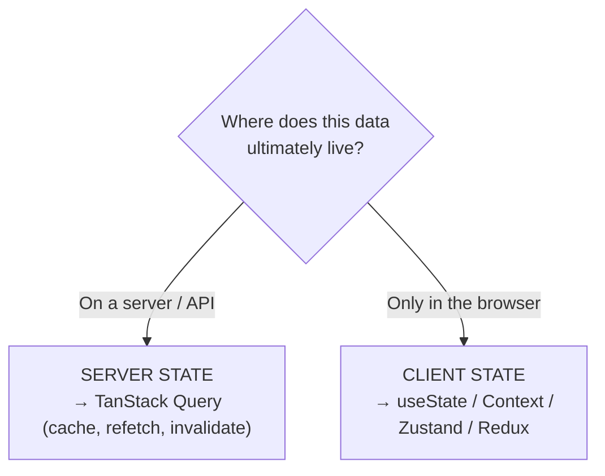
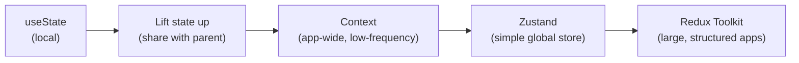
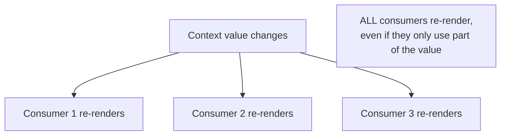
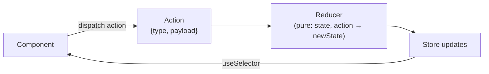
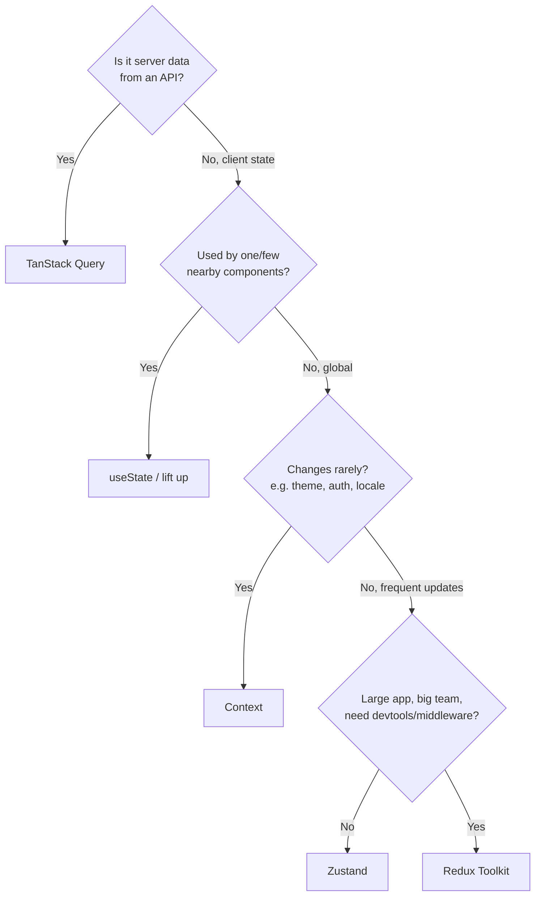

# Part 9 · State Management

> As apps grow, state gets shared across distant components — the current user, theme, a shopping cart, notifications. Passing it all through props (**prop drilling**) becomes unbearable. This part is about **state management at scale**: the crucial distinction between *server state* and *client state*, when plain Context is enough, and the two libraries you asked to learn — **Redux Toolkit** and **Zustand**. The most important lesson isn't any one tool; it's knowing *which kind of state you have* and picking the simplest thing that works.

## Table of Contents

1. [The most important idea: server state vs client state](#1-the-most-important-idea-server-state-vs-client-state)
2. [The state management spectrum](#2-the-state-management-spectrum)
3. [Context as state management (and its limits)](#3-context-as-state-management-and-its-limits)
4. [Zustand: minimal global state](#4-zustand-minimal-global-state)
5. [Redux Toolkit: structured state at scale](#5-redux-toolkit-structured-state-at-scale)
6. [Redux Toolkit in practice: slices, store, hooks](#6-redux-toolkit-in-practice-slices-store-hooks)
7. [Choosing the right tool](#7-choosing-the-right-tool)
8. [Capstone update: global UI state](#8-capstone-update-global-ui-state)
9. [Exercises and practice problems](#9-exercises-and-practice-problems)
10. [Glossary](#10-glossary)

> **💡 Suggested learning order:** §1 is the mindset that prevents most state-management mistakes — read it twice. Then §2–3 (Context), §4 (Zustand, the easy win), §5–6 (Redux Toolkit). §7 ties it together into a decision framework you'll actually use.

---

## 1. The most important idea: server state vs client state

Before any library, internalize this: **not all state is the same.** There are two fundamentally different kinds, and confusing them is the #1 state-management mistake.

**Server state** — data that lives on a server and you *cache* on the client: users, products, posts, anything from an API. It's asynchronous, shared, can go stale, and isn't really "yours." **This belongs in TanStack Query (Part 6), not a state library.**

**Client state** — data that exists only in the browser and belongs to your UI: the current theme, whether a modal is open, a multi-step form's progress, a cart before checkout, the selected tab. It's synchronous and truly yours. **This is what Context / Zustand / Redux are for.**

🎯 **Analogy:** Server state is like a **cached copy of a shared Google Doc** — the source of truth is elsewhere; you're showing a snapshot and syncing. Client state is like the **scroll position and zoom level** in your own editor window — purely local, no server involved. You wouldn't store scroll position in a database, and you shouldn't store server data in Redux.



| | Server state | Client state |
| --- | --- | --- |
| Source of truth | The server | The browser |
| Examples | Users, posts, products | Theme, modals, cart, form steps |
| Async? | Yes (fetch/mutate) | No (synchronous) |
| Can be stale? | Yes (needs refetch) | No |
| Tool | **TanStack Query** | Context / Zustand / Redux |

> **🔍 Under the hood:** The historical mistake (2015–2020) was dumping *everything* into Redux — including fetched API data — then hand-writing caching, loading flags, and refetch logic. TanStack Query (Part 6) solved server state so well that modern apps use **far less** global client state than before. Often, once server data moves to TanStack Query, the remaining client state is small enough for Context or Zustand — Redux becomes optional.

> **⚠️ Common beginner mistake:** "I need to share fetched data across components, so I'll put it in Redux/Zustand." Stop — that's server state; use TanStack Query, and it's shared via the cache automatically. Reserve client-state tools for genuine UI state.

**Key takeaways:**
- Server state (API data) → TanStack Query. Client state (UI data) → Context/Zustand/Redux.
- Most "I need global state" problems are actually server state in disguise.
- Separating the two shrinks your global client state dramatically.

---

## 2. The state management spectrum

There's no single answer — pick the *simplest* option that solves your actual problem. Escalate only when you feel real pain.



The escalation ladder — start at the top, move down only when needed:

| Level | Tool | Use when |
| --- | --- | --- |
| 1 | `useState` | State used by one component |
| 2 | Lift state up (Part 3) | A few nearby components share it |
| 3 | `useContext` | App-wide, rarely-changing (theme, user, locale) |
| 4 | **Zustand** | Global state that changes often, want minimal boilerplate |
| 5 | **Redux Toolkit** | Large app, many developers, complex state, need devtools/middleware |

> **💡 Tip:** Beginners over-reach for global state. Ask: *does this state truly need to be global?* Most state is local or lifted. A theme toggle is genuinely global; a dropdown's open/closed state is not. Resist adding a library until prop-drilling or coordination becomes a real, recurring pain.

> **⚠️ Common beginner mistake:** Installing Redux on day one "because real apps use it." Many modern apps use *no* global state library — just `useState`, Context, and TanStack Query. Add Redux/Zustand when you have a concrete need, not preemptively.

**Key takeaways:**
- Escalate from `useState` → lift → Context → Zustand → Redux only as pain appears.
- Most state is local or lifted; truly-global state is rarer than beginners think.
- The best tool is the simplest one that removes your actual pain.

---

## 3. Context as state management (and its limits)

You met Context in Part 5 §5 as a way to avoid prop drilling. Combined with `useState`/`useReducer`, it becomes a lightweight *global state* solution — no library needed. Here's the full pattern.

```jsx
import { createContext, useContext, useState } from 'react'

// 1. Create the context.
const ThemeContext = createContext(null)

// 2. A provider component that holds the state and exposes it.
export function ThemeProvider({ children }) {
  const [theme, setTheme] = useState('light')
  const toggle = () => setTheme((t) => (t === 'light' ? 'dark' : 'light'))
  // Expose both value and updater through the context.
  return (
    <ThemeContext.Provider value={{ theme, toggle }}>
      {children}
    </ThemeContext.Provider>
  )
}

// 3. A custom hook for clean consumption (best practice).
export function useTheme() {
  const ctx = useContext(ThemeContext)
  if (!ctx) throw new Error('useTheme must be used within ThemeProvider')
  return ctx
}
```

```jsx
// Wrap the app once...
<ThemeProvider><App /></ThemeProvider>

// ...then consume anywhere, no drilling:
function Header() {
  const { theme, toggle } = useTheme()
  return <button onClick={toggle}>Theme: {theme}</button>
}
```

Wrapping `useContext` in a custom `useTheme` hook is the idiomatic pattern — it gives a clean API and a helpful error if used outside the provider.

**Context's real limitation — performance.** When a context value changes, **every** consumer re-renders, even those using an unrelated part of the value. For low-frequency state (theme, auth) that's fine. For high-frequency state (mouse position, form keystrokes) with many consumers, it causes excessive re-renders.



> **🔍 Under the hood:** Context has no built-in selector — a consumer subscribes to the *whole* value, so any change re-renders all consumers. Mitigations: split into multiple contexts (a `ThemeContext` and a separate `AuthContext`), memoize the provider `value` (Part 11), or use a library with selectors (Zustand, Redux) that re-render only components using the *changed slice*. This selector gap is the main reason libraries exist beyond Context.

> **⚠️ Common beginner mistake:** Putting fast-changing state (or a giant "app state" object) in one Context with many consumers, then wondering why the app is slow. Use Context for stable, global-ish values; reach for Zustand/Redux when you need frequent updates + selective re-renders.

**Key takeaways:**
- Context + `useState`/`useReducer` = a no-library global state for stable values.
- Wrap consumption in a custom hook (`useTheme`) with a provider-check.
- Every consumer re-renders on any change — great for theme/auth, poor for high-frequency state.

---

## 4. Zustand: minimal global state

**Zustand** is a tiny state library that fixes Context's ergonomics and performance with almost no boilerplate. You create a store as a hook; components subscribe to *slices* and re-render only when that slice changes.

```bash
npm install zustand
```

```jsx
import { create } from 'zustand'

// Define a store: state + the functions that update it, all in one place.
const useCartStore = create((set) => ({
  items: [],
  addItem: (item) => set((state) => ({ items: [...state.items, item] })),  // immutable
  removeItem: (id) => set((state) => ({ items: state.items.filter((i) => i.id !== id) })),
  clear: () => set({ items: [] }),
}))
```

Use it anywhere — no provider needed, and **select only what you need**:

```jsx
function CartBadge() {
  // Select ONLY the count — this component re-renders only when items.length changes.
  const count = useCartStore((state) => state.items.length)
  return <span>🛒 {count}</span>
}

function AddButton({ product }) {
  const addItem = useCartStore((state) => state.addItem)   // select just the action
  return <button onClick={() => addItem(product)}>Add to cart</button>
}
```

🎯 **Analogy:** Zustand is like a **single shared JavaScript object with subscriptions**. `create` makes the object; the `set` function updates it immutably; components "subscribe" by selecting a slice. Unlike Context, a component that selects `items.length` doesn't re-render when an *unrelated* field changes — you get precise, selector-based updates for free.

**Why Zustand is loved:**

```cards
No provider :: the store is a hook you import — no wrapping the app.
Selectors :: subscribe to a slice; re-render only when it changes (fixes Context's problem).
Minimal boilerplate :: state + actions in one small object.
Outside React :: read/set the store from anywhere (useCartStore.getState()).
Middleware :: persist to localStorage, devtools, immer — opt-in.
```

Persisting a store to `localStorage` is a one-liner with middleware:

```jsx
import { persist } from 'zustand/middleware'
const useSettings = create(persist(
  (set) => ({ theme: 'light', setTheme: (theme) => set({ theme }) }),
  { name: 'settings' }   // localStorage key — survives reloads automatically
))
```

> **🔍 Under the hood:** Zustand keeps state in a closure and maintains a set of subscribers. When you call `set`, it computes the next state and notifies subscribers; each component's **selector** decides whether its selected slice changed (by `Object.is`) — if not, it skips re-rendering. This selector model is why Zustand scales to frequent updates where Context would thrash. It uses `useSyncExternalStore` (Part 5 §7) under the hood to integrate with React safely.

> **⚠️ Common beginner mistake:** Selecting the whole store — `const store = useCartStore()` — which re-renders on *every* change, throwing away the performance benefit. Always select the minimal slice: `useCartStore(s => s.items.length)`. For multiple values, use a shallow-compare selector or separate `useCartStore` calls.

**Key takeaways:**
- Zustand: `create` a store of state + actions; no provider needed.
- Select the minimal slice so components re-render only when it changes.
- Middleware (`persist`, devtools) adds persistence/tooling with one line.

---

## 5. Redux Toolkit: structured state at scale

**Redux** is the original global state library — predictable, debuggable, with powerful devtools and middleware. Classic Redux was famously verbose; **Redux Toolkit (RTK)** is the modern, official way that removes most boilerplate. Use RTK for large apps, big teams, or complex state that benefits from strict structure and time-travel debugging.

The Redux mental model — a strict, one-directional data flow:



The three principles (why Redux is predictable):
1. **Single source of truth** — one store holds all this state.
2. **State is read-only** — you never mutate it; you dispatch **actions** describing what happened.
3. **Changes via pure reducers** — a reducer `(state, action) => newState` computes the next state.

🎯 **Analogy:** Redux is like an **event-sourced ledger**. You don't edit balances directly; you record transactions (actions: "deposit $50"), and a pure function replays them into the current state. This makes every change traceable — the Redux DevTools let you *replay*, *rewind*, and inspect every action, which is invaluable for debugging complex apps. That auditability is Redux's superpower (and why it's still chosen for large, intricate apps).

> **🔍 Under the hood:** Redux Toolkit's `createSlice` uses **Immer** internally, so you can write "mutating" code (`state.value++`) and it produces a correct immutable update behind the scenes — eliminating the spread-heavy reducers of old Redux (Part 3 §6 immutability, but ergonomic). RTK also auto-generates action creators and types, and `configureStore` wires up DevTools and sensible middleware automatically. It's Redux with the pain removed.

> **⚠️ Common beginner mistake:** Choosing classic Redux (with `connect`, action-type constants, hand-written reducers) from an old tutorial. Always use **Redux Toolkit** — it's the official recommendation and roughly 1/3 the code. If a tutorial has you writing `const ADD_TODO = 'ADD_TODO'`, it's outdated.

**Key takeaways:**
- Redux = one store, read-only state, changes via dispatched actions + pure reducers.
- Its strict flow + DevTools (replay/rewind) make large apps debuggable.
- Always use **Redux Toolkit** (`createSlice`, `configureStore`) — never classic Redux boilerplate.

---

## 6. Redux Toolkit in practice: slices, store, hooks

Let's build a working RTK store. A **slice** bundles a piece of state with its reducers and auto-generated actions.

```bash
npm install @reduxjs/toolkit react-redux
```

```jsx
// src/store/cartSlice.js
import { createSlice } from '@reduxjs/toolkit'

const cartSlice = createSlice({
  name: 'cart',
  initialState: { items: [] },
  reducers: {
    // Thanks to Immer, you can "mutate" — RTK makes it immutable safely.
    addItem: (state, action) => { state.items.push(action.payload) },
    removeItem: (state, action) => {
      state.items = state.items.filter((i) => i.id !== action.payload)
    },
    clear: (state) => { state.items = [] },
  },
})

// createSlice auto-generates action creators from the reducer names:
export const { addItem, removeItem, clear } = cartSlice.actions
export default cartSlice.reducer
```

```jsx
// src/store/index.js — combine slices into one store
import { configureStore } from '@reduxjs/toolkit'
import cartReducer from './cartSlice'

export const store = configureStore({
  reducer: { cart: cartReducer },   // state shape: { cart: { items: [] } }
})
```

```jsx
// src/main.jsx — provide the store to the app
import { Provider } from 'react-redux'
import { store } from './store'

createRoot(document.getElementById('root')).render(
  <Provider store={store}>
    <App />
  </Provider>
)
```

Now read with **`useSelector`** and update with **`useDispatch`**:

```jsx
import { useSelector, useDispatch } from 'react-redux'
import { addItem, removeItem } from './store/cartSlice'

function CartBadge() {
  // Select the slice you need — re-renders only when it changes.
  const count = useSelector((state) => state.cart.items.length)
  return <span>🛒 {count}</span>
}

function AddButton({ product }) {
  const dispatch = useDispatch()
  return <button onClick={() => dispatch(addItem(product))}>Add</button>
}
```

The RTK workflow in one picture:

```mermaid
flowchart TD
  SL["createSlice<br/>(state + reducers)"] --> AC[auto action creators]
  SL --> RD[reducer]
  RD --> ST["configureStore<br/>{ cart: reducer }"]
  ST --> PR["&lt;Provider store&gt;"]
  UI[Component] -->|useDispatch → dispatch(addItem)| ST
  ST -->|useSelector| UI
```

> **🔍 Under the hood:** `createSlice` generates action creators (`addItem(payload)` returns `{ type: 'cart/addItem', payload }`) and a reducer that responds to them. `useSelector(fn)` subscribes your component to the store and re-renders only when the *selected value* changes (like Zustand's selectors). `useDispatch` returns the store's `dispatch`. For server data, RTK also has **RTK Query** (a TanStack-Query-like layer) — but if you already use TanStack Query, keep server state there.

> **⚠️ Common beginner mistake:** Selecting too much — `useSelector(state => state.cart)` re-renders whenever *any* cart field changes; select the narrowest value (`state.cart.items.length`). Also: putting async server data in Redux instead of TanStack Query (§1) — reserve the store for client state.

**Key takeaways:**
- `createSlice` bundles state + reducers + auto-generated actions (with Immer for "mutations").
- `configureStore` combines slices; `<Provider>` makes the store available.
- Read with `useSelector` (select narrowly), write with `useDispatch(action())`.

---

## 7. Choosing the right tool

Here's the decision framework — internalize this and you'll never agonize over state management again.



A side-by-side of the client-state options:

| | Context | Zustand | Redux Toolkit |
| --- | --- | --- | --- |
| Boilerplate | Low | Very low | Moderate |
| Provider needed | Yes | No | Yes |
| Selective re-renders | No | ✅ Yes | ✅ Yes |
| DevTools / time-travel | No | Basic | ✅ Excellent |
| Best for | Theme, auth, locale | Most global client state | Large/complex apps, teams |
| Learning curve | Lowest | Low | Moderate |

**Real-world guidance:**

```cards
Small/medium app :: useState + Context + TanStack Query. Often no library needed.
Need global client state, low ceremony :: Zustand — the pragmatic default.
Large app, many devs, complex flows :: Redux Toolkit — structure + devtools pay off.
Server data :: always TanStack Query, regardless of the above.
```

> **💡 Tip:** A very common, healthy modern stack: **TanStack Query for server state + Zustand (or Context) for the little client state that remains.** Redux Toolkit shines when you have genuinely complex client-side logic, many contributors, or need the auditability of time-travel debugging. Don't cargo-cult Redux into a small app.

> **⚠️ Common beginner mistake:** Believing you must pick *one* tool for everything. Real apps mix them: TanStack Query for API data, Context for theme, Zustand for a cart, local `useState` everywhere else. Use each where it fits.

**Key takeaways:**
- Server data → TanStack Query, always. Client state → the simplest of Context/Zustand/Redux.
- Zustand is the pragmatic default for global client state; Redux Toolkit for large/complex apps.
- Mixing tools per-need is normal and correct — there's no single "right" library.

---

## 8. Capstone update: global UI state

🏗️ Add **global client state** to your **Contacts Manager** (Capstone #3): a theme toggle (Context) and toast notifications (Zustand) — the two most common pieces of genuine global UI state. This cleanly complements the *server* state already handled by TanStack Query.

**Theme with Context** (rarely changes → Context is perfect):

```jsx
// src/state/ThemeProvider.jsx
import { createContext, useContext } from 'react'
import { useLocalStorage } from '../hooks/useLocalStorage'   // from Part 5!

const ThemeContext = createContext(null)

export function ThemeProvider({ children }) {
  const [theme, setTheme] = useLocalStorage('theme', 'light')  // persists across reloads
  const toggle = () => setTheme((t) => (t === 'light' ? 'dark' : 'light'))
  return <ThemeContext.Provider value={{ theme, toggle }}>{children}</ThemeContext.Provider>
}
export const useTheme = () => useContext(ThemeContext)
```

**Toasts with Zustand** (frequent, fired from anywhere → Zustand's no-provider model shines):

```jsx
// src/state/toastStore.js
import { create } from 'zustand'

export const useToasts = create((set) => ({
  toasts: [],
  add: (message, type = 'info') => {
    const id = crypto.randomUUID()
    set((s) => ({ toasts: [...s.toasts, { id, message, type }] }))
    setTimeout(() => set((s) => ({ toasts: s.toasts.filter((t) => t.id !== id) })), 3000)
  },
  remove: (id) => set((s) => ({ toasts: s.toasts.filter((t) => t.id !== id) })),
}))
```

```jsx
// A toast viewport rendered once at the app root:
function ToastViewport() {
  const toasts = useToasts((s) => s.toasts)     // select the slice
  return (
    <div style={{ position: 'fixed', bottom: 16, right: 16, display: 'grid', gap: 8 }}>
      {toasts.map((t) => (
        <div key={t.id} style={{ padding: '10px 14px', borderRadius: 8, background: '#0ea5e9', color: '#fff' }}>
          {t.message}
        </div>
      ))}
    </div>
  )
}

// Fire a toast from ANY component — no provider, no prop drilling:
function DeleteButton({ id }) {
  const addToast = useToasts((s) => s.add)
  const del = useMutation({
    mutationFn: () => api.remove(id),
    onSuccess: () => addToast('Contact deleted', 'success'),
  })
  return <button onClick={() => del.mutate()}>Delete</button>
}
```

**How the three kinds of state now coexist in your app:**

```cards
Server state :: contacts data — TanStack Query (Part 6). Cached, refetched, invalidated.
Global client state (rare) :: theme — Context + useLocalStorage (Parts 5, 9).
Global client state (frequent) :: toasts — Zustand, fired from anywhere.
Local state :: form drafts, modal open/close — plain useState.
```

> **💡 Tip:** Notice each kind of state landed in the *right* tool: you didn't put contacts in Redux, or theme in Zustand, or toasts in Context. This is the whole lesson of Part 9 — match the tool to the *kind* of state. An app that does this stays simple even as it grows.

**Extend it (do at least three):**
1. Apply the theme: read `useTheme()` in `RootLayout` and swap CSS variables (preview of Part 10).
2. Fire success/error toasts on every create/update/delete mutation.
3. Add a Zustand `useUiStore` for a global "command palette" open/close + selected contact.
4. Add Redux Toolkit for a "recently viewed contacts" list and compare the ergonomics to Zustand.
5. Persist the theme AND toasts-muted preference; verify both survive a reload.

**Key takeaways:**
- Theme (rare) → Context; toasts (frequent, global) → Zustand; contacts → TanStack Query.
- Zustand fires actions from anywhere with no provider — ideal for toasts/notifications.
- The app now demonstrates all four state kinds, each in its proper home.

---

## 9. Exercises and practice problems

### 🧪 Warm-ups (easy)

**E1.** For each, name the right tool: (a) list of products from an API, (b) dark mode, (c) whether a tooltip is hovered, (d) a shopping cart.

<details><summary>Show solution</summary>

(a) **TanStack Query** — server state. (b) **Context** — rare, global. (c) **useState** — local. (d) **Zustand** (or Context/Redux) — global client state.

*Why:* This is the §1/§7 decision framework in action — always classify the *kind* of state first.
</details>

**E2.** Create a Zustand store with a `count`, `increment`, and `reset`. Use it in two components.

<details><summary>Show solution</summary>

```jsx
const useCounter = create((set) => ({
  count: 0,
  increment: () => set((s) => ({ count: s.count + 1 })),
  reset: () => set({ count: 0 }),
}))
// A: const count = useCounter((s) => s.count)
// B: const inc = useCounter((s) => s.increment)
```

*Why:* No provider; each component selects only what it needs.
</details>

### 🧪 Core (medium)

**E3.** Build a Context-based `AuthProvider` exposing `{ user, login, logout }` and a `useAuth` hook with a provider-check.

<details><summary>Show solution</summary>

```jsx
const AuthContext = createContext(null)
export function AuthProvider({ children }) {
  const [user, setUser] = useState(null)
  const login = (u) => setUser(u)
  const logout = () => setUser(null)
  return <AuthContext.Provider value={{ user, login, logout }}>{children}</AuthContext.Provider>
}
export function useAuth() {
  const ctx = useContext(AuthContext)
  if (!ctx) throw new Error('useAuth must be inside AuthProvider')
  return ctx
}
```

*Why:* The custom-hook-with-check pattern (§3) — clean API + safety.
</details>

**E4.** Convert the Zustand cart store from §4 into a Redux Toolkit slice + store.

<details><summary>Show solution</summary>

```jsx
const cartSlice = createSlice({
  name: 'cart',
  initialState: { items: [] },
  reducers: {
    addItem: (s, a) => { s.items.push(a.payload) },
    removeItem: (s, a) => { s.items = s.items.filter((i) => i.id !== a.payload) },
    clear: (s) => { s.items = [] },
  },
})
export const { addItem, removeItem, clear } = cartSlice.actions
export const store = configureStore({ reducer: { cart: cartSlice.reducer } })
```

*Why:* Same behavior, RTK structure. Compare the boilerplate to Zustand — that trade-off is the choice in §7.
</details>

**E5.** Explain why `const cart = useSelector(s => s.cart)` can hurt performance, and fix it.

<details><summary>Show solution</summary>

It re-renders whenever *any* field of `cart` changes, even ones this component doesn't use. Select narrowly:

```jsx
const count = useSelector((s) => s.cart.items.length)   // re-renders only when length changes
```

*Why:* Narrow selectors = fewer re-renders (§6). Same principle as Zustand selectors.
</details>

### 🧪 Challenge (hard)

**E6.** Build a `useToasts` Zustand store where toasts auto-dismiss after a timeout, and a `<ToastViewport>` that renders them. (Like §8.)

<details><summary>Show solution</summary>

See §8's `toastStore.js` and `ToastViewport`. Key points: generate a stable `id` (`crypto.randomUUID()`) for keys (Part 4), immutably append/filter, and use `setTimeout` inside the action to auto-remove. The viewport selects `s.toasts` and maps with `key={t.id}`.

*Why:* Combines Zustand, immutable updates, timers, and keyed lists — a real, reusable feature.
</details>

**E7.** You have a form wizard (3 steps) whose data must survive navigation between steps but reset on completion. Which tool, and sketch it.

<details><summary>Show solution</summary>

**Zustand** (or Context) — it's client state shared across step components, changing as the user progresses:

```jsx
const useWizard = create((set) => ({
  step: 1, data: {},
  next: () => set((s) => ({ step: s.step + 1 })),
  setData: (patch) => set((s) => ({ data: { ...s.data, ...patch } })),
  reset: () => set({ step: 1, data: {} }),
}))
```

*Why:* Server state (Query) doesn't fit — this is transient UI state. Context works too; Zustand is less ceremony. On submit success, call `reset()`.
</details>

**E8 (capstone step).** In Contacts Manager, wire theme (Context) into the layout so it actually changes colors, and fire toasts on all mutations. Compare adding a "recently viewed" feature in Zustand vs Redux Toolkit. Keep it — Part 10 styles the whole app, Part 11 optimizes it, Part 12 types it.

<details><summary>Show hint</summary>

For theme: in `RootLayout`, read `const { theme } = useTheme()` and set a `data-theme` attribute or inline CSS variables on the wrapper; Part 10 makes this real with CSS. For toasts: add `onSuccess`/`onError` to each `useMutation` calling `useToasts.getState().add(...)` (you can call the store outside a component via `getState()`). For "recently viewed," try both libraries and note: Zustand needs ~5 lines and no provider; RTK needs a slice + store wiring but gives you DevTools.
</details>

---

## 10. Glossary

| Term | Meaning |
| --- | --- |
| **Server state** | Data owned by a server, cached on the client (use TanStack Query). |
| **Client state** | UI data that lives only in the browser (theme, modals, cart). |
| **Prop drilling** | Passing props through many components to reach a deep one. |
| **Context** | React's built-in mechanism to share a value with a subtree. |
| **Zustand** | A minimal global state library with selectors and no provider. |
| **Selector** | A function picking a slice of state so a component re-renders only on its change. |
| **Redux** | A predictable global state container with actions and pure reducers. |
| **Redux Toolkit (RTK)** | The modern, low-boilerplate official way to use Redux. |
| **Slice** | An RTK bundle of state + reducers + auto-generated actions. |
| **`useSelector` / `useDispatch`** | React-Redux hooks to read state / dispatch actions. |
| **Action** | A `{ type, payload }` object describing what happened. |
| **Reducer** | A pure `(state, action) => newState` function. |

---

> **You now know how to manage state at every scale** — and, more importantly, how to tell which *kind* of state you have and pick the simplest tool. Your app has server state, global client state, and local state, each in its proper home. Next, we make it *look* good: styling React applications.
>
> **Next:** [Part 10 · Styling React Applications →](10-styling.md)
