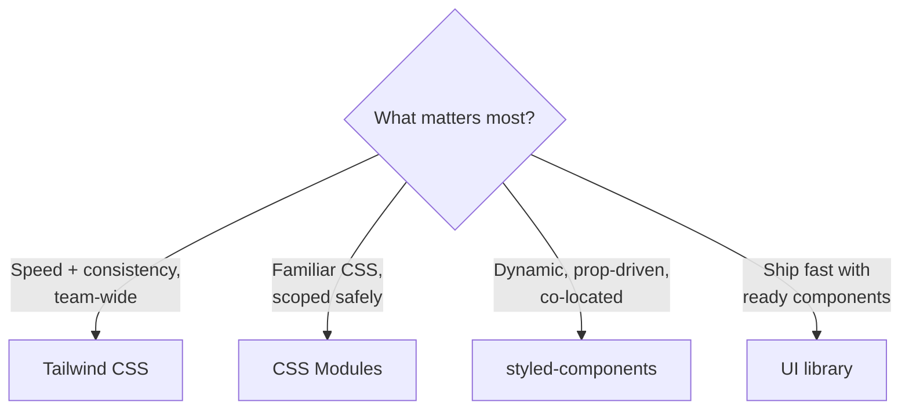
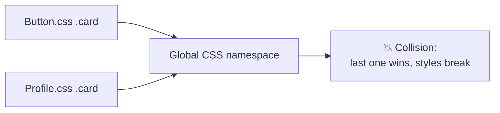
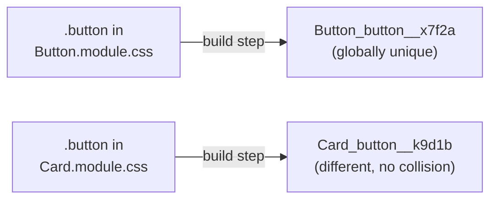
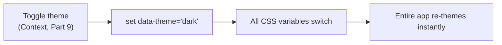

# Part 10 · Styling React Applications

> A working app that looks unstyled won't ship. React is unopinionated about CSS — it gives you many options, which is both freeing and confusing. This part maps the entire styling landscape and teaches the three approaches you asked for in depth: **CSS Modules** (scoped plain CSS), **Tailwind CSS** (utility-first, the current community favorite), and **styled-components** (CSS-in-JS). You'll learn when to use each, how to build responsive and themeable UIs, and how to structure a real design system.

## Table of Contents

1. [The styling landscape](#1-the-styling-landscape)
2. [Plain CSS and the scoping problem](#2-plain-css-and-the-scoping-problem)
3. [CSS Modules: scoped styles](#3-css-modules-scoped-styles)
4. [Tailwind CSS: utility-first styling](#4-tailwind-css-utility-first-styling)
5. [styled-components: CSS-in-JS](#5-styled-components-css-in-js)
6. [Conditional and dynamic styling](#6-conditional-and-dynamic-styling)
7. [Responsive design and theming](#7-responsive-design-and-theming)
8. [Mini-project: style the Contacts Manager](#8-mini-project-style-the-contacts-manager)
9. [Exercises and practice problems](#9-exercises-and-practice-problems)
10. [Glossary](#10-glossary)

> **💡 Suggested learning order:** Read §1–2 for the mental model, then focus on whichever of §3–5 you'll use (many teams pick one). Do §6–7 regardless — conditional styling, responsiveness, and theming apply to all approaches.

---

## 1. The styling landscape

React doesn't ship a styling solution, so the ecosystem offers several. Here's the map so you can choose deliberately rather than by accident.

| Approach | What it is | Best for |
| --- | --- | --- |
| **Inline styles** | `style={{ ... }}` objects | Tiny/dynamic one-offs; learning (we've used these) |
| **Plain CSS** | Global `.css` files | Small apps; global resets/themes |
| **CSS Modules** | Locally-scoped `.module.css` | Component styles without naming collisions |
| **Tailwind CSS** | Utility classes in JSX | Fast, consistent UIs; the current favorite |
| **styled-components / Emotion** | CSS-in-JS components | Dynamic, prop-driven styling; co-located |
| **UI libraries** (MUI, Chakra, shadcn/ui) | Pre-built components | Shipping fast with a ready design system |

🎯 **Analogy:** Choosing a styling approach is like choosing a database — there's no universally "best" one, only trade-offs for your context. Tailwind is like a well-indexed key-value store (fast, consistent, some learning curve). CSS Modules are like classic normalized SQL (familiar, explicit). styled-components are like an ORM (co-located, dynamic, a bit of runtime cost). Pick per project constraints, and don't mix three of them without reason.



> **💡 Tip:** Don't agonize. For most new projects in 2026, **Tailwind CSS** is the pragmatic default (fast, consistent, huge ecosystem, pairs with shadcn/ui). **CSS Modules** are a great choice if your team prefers writing plain CSS. Learn one well; you can read the others.

> **⚠️ Common beginner mistake:** Mixing several approaches in one codebase without a reason — some Tailwind, some CSS Modules, some inline, some styled-components — producing an inconsistent, hard-to-maintain mess. Pick a primary approach and stick to it; reserve inline styles for genuinely dynamic values.

**Key takeaways:**
- React is styling-agnostic; the ecosystem offers many approaches with trade-offs.
- Tailwind is the common default; CSS Modules suit plain-CSS teams; styled-components suit dynamic styling.
- Choose one primary approach per project for consistency.

---

## 2. Plain CSS and the scoping problem

The simplest approach: write a `.css` file and import it. Vite bundles it automatically.

```jsx
import './Button.css'         // Vite injects this CSS into the page
function Button({ children }) {
  return <button className="button">{children}</button>
}
```

```css
/* Button.css */
.button { padding: 8px 16px; border-radius: 8px; background: #0ea5e9; color: white; }
```

This works, but has a fatal flaw at scale: **CSS is global.** Every class name lives in one namespace across your entire app. If two components both define `.button` or `.card`, they collide — the last one loaded wins, silently breaking styles.

```css
/* Button.css */    .card { padding: 16px; }
/* Profile.css */   .card { padding: 0; }      /* 💥 overrides Button's .card everywhere */
```



Historically, teams solved this with naming conventions like **BEM** (`.card__title--active`) — verbose and error-prone. The modern solutions (CSS Modules, Tailwind, CSS-in-JS) solve scoping *automatically*.

> **🔍 Under the hood:** Browsers have no concept of "component-scoped" CSS — all rules are global, matched by selector against the whole DOM. Specificity and source order decide conflicts. This global model is fine for a handful of pages but becomes unmanageable in a large component tree where anyone can accidentally style anyone else's elements. Scoping is *the* problem modern CSS tooling exists to solve.

> **⚠️ Common beginner mistake:** Building a large app with plain global CSS and generic class names (`.container`, `.title`, `.active`), then spending hours debugging why one component's styles leaked into another. Reach for scoped styles (next) before this bites you.

**Key takeaways:**
- Plain CSS works but is globally scoped — class names collide across components.
- Naming conventions (BEM) mitigate this manually but are verbose.
- Modern approaches (CSS Modules, Tailwind, CSS-in-JS) solve scoping automatically.

---

## 3. CSS Modules: scoped styles

**CSS Modules** let you write normal CSS that is **automatically scoped** to one component. Name the file `*.module.css`, import it as an object, and reference classes as properties. Vite supports this out of the box — no config.

```css
/* Button.module.css — write plain CSS, no special syntax */
.button { padding: 8px 16px; border-radius: 8px; background: #0ea5e9; color: white; }
.primary { background: #0ea5e9; }
.danger { background: #ef4444; }
```

```jsx
import styles from './Button.module.css'   // imports an object of class names

function Button({ variant = 'primary', children }) {
  // styles.button becomes a UNIQUE name like "Button_button__x7f2a" at build time
  return <button className={`${styles.button} ${styles[variant]}`}>{children}</button>
}
```

At build time, `.button` becomes a globally-unique name like `Button_button__x7f2a`, so it can never collide with another component's `.button`. You write plain CSS; the tooling handles scoping.

**Combining classes** — a common need; use a helper or template literal:

```jsx
// Template literal (fine for a couple classes)
className={`${styles.button} ${isActive ? styles.active : ''}`}

// clsx / classnames library (cleaner for many conditional classes)
import clsx from 'clsx'
className={clsx(styles.button, { [styles.active]: isActive, [styles.disabled]: disabled })}
```



> **🔍 Under the hood:** The bundler transforms each class name into a unique hash based on the file + name, and the imported `styles` object maps your original names to the hashed ones. So `styles.button` at runtime is the string `"Button_button__x7f2a"`. This is pure build-time magic — zero runtime cost, and you get familiar CSS with guaranteed scoping. Global styles (resets, variables) still go in a plain `.css` file.

> **⚠️ Common beginner mistake:** Writing `className="button"` (a string) instead of `className={styles.button}` in a module — the raw string won't match the hashed class, so nothing styles. In modules, always reference via the imported object.

**Key takeaways:**
- CSS Modules (`*.module.css`) scope class names automatically — no collisions.
- Import as an object; use `styles.className`; combine with template literals or `clsx`.
- You write plain, familiar CSS with zero runtime cost and guaranteed isolation.

---

## 4. Tailwind CSS: utility-first styling

**Tailwind CSS** takes a different philosophy: instead of writing CSS files, you compose small **utility classes** directly in your JSX (`p-4`, `text-lg`, `bg-sky-500`). It's the most popular styling approach in modern React — fast to write, consistent by design, and pairs perfectly with component libraries like shadcn/ui.

Setup with Vite (Tailwind v4):

```bash
npm install tailwindcss @tailwindcss/vite
```

```jsx
// vite.config.js
import tailwindcss from '@tailwindcss/vite'
export default { plugins: [tailwindcss()] }
```

```css
/* src/index.css */
@import "tailwindcss";
```

Then style entirely in JSX with utilities:

```jsx
function Card({ title, children }) {
  return (
    <div className="rounded-2xl border border-slate-200 bg-white p-6 shadow-sm">
      <h3 className="mb-2 text-lg font-bold text-slate-900">{title}</h3>
      <p className="text-sm text-slate-600">{children}</p>
    </div>
  )
}
```

Each class maps to one CSS declaration: `p-6` = `padding: 1.5rem`, `text-lg` = `font-size: 1.125rem`, `bg-white` = `background: white`. You build designs by composing them.

🎯 **Analogy:** Tailwind is like having a **design system as a vocabulary**. Instead of inventing values (`padding: 13px`), you pick from a constrained scale (`p-1` … `p-8`), so everything is automatically consistent — spacing, colors, font sizes all come from one tuned palette. It feels verbose at first (like learning any vocabulary) but becomes faster than writing CSS, and it kills the "what should this padding be?" decision fatigue.

**Why teams love it:**

```cards
Speed :: style without leaving your JSX or naming anything.
Consistency :: values come from one design scale — no random 13px paddings.
No dead CSS :: unused utilities aren't shipped (it scans your files).
Responsive built-in :: prefixes like md: and hover: (see §7).
Ecosystem :: shadcn/ui, Headless UI, and countless components build on it.
```

Common utility categories you'll use constantly:

| Category | Examples |
| --- | --- |
| Spacing | `p-4` `px-2` `m-6` `gap-3` |
| Typography | `text-lg` `font-bold` `text-slate-600` `leading-tight` |
| Layout | `flex` `grid` `grid-cols-3` `items-center` `justify-between` |
| Colors | `bg-sky-500` `text-white` `border-slate-200` |
| Effects | `rounded-xl` `shadow-md` `hover:bg-sky-600` |

> **🔍 Under the hood:** Tailwind scans your source files for class names and generates *only* the CSS for utilities you actually use — so the shipped stylesheet is tiny regardless of how many utilities exist. There's no runtime; it's all build-time CSS generation. The "utility-first" approach means you rarely write custom CSS — and when a pattern repeats, you extract a *React component* (not a CSS class), keeping one source of reuse.

> **⚠️ Common beginner mistake:** "This is just inline styles with extra steps!" It isn't — utilities give you responsive variants, hover/focus states, a constrained design scale, and dead-code elimination, none of which inline styles offer. Second mistake: copy-pasting long class strings everywhere instead of extracting a `<Button>` component — extract to components for reuse, not to CSS classes.

**Key takeaways:**
- Tailwind composes utility classes in JSX from a constrained, consistent design scale.
- It generates only the CSS you use (tiny bundle), with built-in responsive/state variants.
- Reuse by extracting React components, not CSS classes.

---

## 5. styled-components: CSS-in-JS

**styled-components** (a CSS-in-JS library) lets you write actual CSS *inside* JavaScript, creating styled React components. Styles are co-located with the component, scoped automatically, and can react to props dynamically.

```bash
npm install styled-components
```

```jsx
import styled from 'styled-components'

// Create a component with styles attached. It renders a real <button>.
const Button = styled.button`
  padding: 8px 16px;
  border-radius: 8px;
  border: none;
  color: white;
  /* Styles can depend on props — this is the superpower */
  background: ${(props) => (props.$variant === 'danger' ? '#ef4444' : '#0ea5e9')};
  &:hover { opacity: 0.9; }       /* nesting & pseudo-selectors work */
`

function App() {
  return (
    <div>
      <Button>Save</Button>
      <Button $variant="danger">Delete</Button>   {/* prop drives the style */}
    </div>
  )
}
```

`Button` is a real component you use like any other; its styles are generated and scoped automatically. The `$variant` prop (the `$` marks it "transient" — not forwarded to the DOM) makes styling **dynamic** based on props — cleaner than juggling conditional class strings.

**Why CSS-in-JS:**

```cards
Co-location :: styles live next to the component, not in a separate file.
Dynamic :: styles are JS — full access to props, theme, and logic.
Scoped :: unique class names generated automatically, no collisions.
Theming :: a ThemeProvider passes a theme object to every styled component.
```

Theming is first-class:

```jsx
import { ThemeProvider } from 'styled-components'
const theme = { colors: { primary: '#0ea5e9', text: '#0f172a' } }

const Title = styled.h1`color: ${(props) => props.theme.colors.primary};`

<ThemeProvider theme={theme}><Title>Hello</Title></ThemeProvider>
```

> **🔍 Under the hood:** styled-components parses your template-literal CSS at runtime, generates a unique class name, injects the styles into a `<style>` tag, and applies the class. This gives dynamic, prop-driven styling but has a **runtime cost** (parsing/injecting on render) — which is why some teams prefer zero-runtime alternatives (Tailwind, CSS Modules, or compile-time CSS-in-JS like Vanilla Extract). For most apps the cost is negligible; for extreme performance needs it matters (Part 11).

> **⚠️ Common beginner mistake:** Defining a `styled.button` *inside* a component's render function — it recreates the styled component on every render, breaking memoization and hurting performance. Define styled components at **module level** (outside the component), as shown above.

**Key takeaways:**
- styled-components create scoped, co-located components with CSS-in-JS.
- Props drive dynamic styles; `ThemeProvider` supplies a shared theme.
- Define styled components at module level; note the small runtime cost.

---

## 6. Conditional and dynamic styling

Whatever approach you use, you'll style based on state/props — active tabs, error fields, disabled buttons. Here's the idiom in each system.

**With class-based approaches (CSS Modules / plain / Tailwind)** — build the class string conditionally. The `clsx` (or `classnames`) library is the clean standard:

```jsx
import clsx from 'clsx'

function Tab({ isActive, isDisabled, children }) {
  return (
    <button
      className={clsx(
        'tab',                          // always
        isActive && 'tab--active',      // conditionally
        { 'tab--disabled': isDisabled } // object form: key added if value truthy
      )}
    >
      {children}
    </button>
  )
}
```

With **Tailwind**, the same pattern selects between utility strings:

```jsx
className={clsx(
  'rounded-lg px-4 py-2 font-medium',
  isActive ? 'bg-sky-500 text-white' : 'bg-slate-100 text-slate-700'
)}
```

**With styled-components**, use props (no class juggling):

```jsx
const Tab = styled.button`
  background: ${(p) => (p.$active ? '#0ea5e9' : '#f1f5f9')};
  color: ${(p) => (p.$active ? 'white' : '#334155')};
`
```

**Truly dynamic values** (a computed width, a user-chosen color) that can't be a predefined class → inline style is legitimate here:

```jsx
// A progress bar whose width is a runtime number — inline is correct.
<div className="progress-track">
  <div className="progress-fill" style={{ width: `${percent}%` }} />
</div>
```

> **🔍 Under the hood:** `clsx(...)` joins truthy arguments into a space-separated class string, skipping falsy ones — so `clsx('a', false && 'b', cond && 'c')` yields `'a c'` when `cond` is true. It's tiny and the de-facto standard for conditional classes. Use inline `style` only for values that genuinely can't be enumerated as classes (computed positions/sizes/colors), since inline styles can't do media queries or pseudo-states.

> **⚠️ Common beginner mistake:** Building conditional classes with fragile string concatenation (`'tab ' + (isActive ? 'active' : '')`) that leaves stray spaces or `undefined` in the class list. Use `clsx`/`classnames` — it handles all the edge cases.

**Key takeaways:**
- Conditional classes: use `clsx`/`classnames` for clean, safe class composition.
- styled-components use props; class systems build the class string.
- Reserve inline `style` for genuinely dynamic values (computed width/color).

---

## 7. Responsive design and theming

**Responsive design** — your UI must adapt to screen size. All approaches use CSS **media queries**; the syntax differs.

**Tailwind** — responsive prefixes (mobile-first: unprefixed = all sizes, `md:` = ≥768px, etc.):

```jsx
{/* 1 column on mobile, 2 on tablet, 3 on desktop */}
<div className="grid grid-cols-1 md:grid-cols-2 lg:grid-cols-3 gap-4">...</div>
{/* small text on mobile, larger on desktop */}
<h1 className="text-2xl md:text-4xl">Responsive heading</h1>
```

**CSS Modules / plain CSS** — normal media queries:

```css
.grid { display: grid; grid-template-columns: 1fr; gap: 16px; }
@media (min-width: 768px) { .grid { grid-template-columns: repeat(2, 1fr); } }
@media (min-width: 1024px) { .grid { grid-template-columns: repeat(3, 1fr); } }
```

**Theming (light/dark)** — the modern, approach-agnostic pattern uses **CSS custom properties** (variables) toggled by a `data-theme` attribute or class — exactly what this very documentation uses:

```css
/* Define theme variables, switch them by attribute */
:root, [data-theme="light"] { --bg: #ffffff; --text: #0f172a; --accent: #0ea5e9; }
[data-theme="dark"]         { --bg: #0f172a; --text: #e2e8f0; --accent: #38bdf8; }

body { background: var(--bg); color: var(--text); }
.button { background: var(--accent); }
```

```jsx
// Toggle by setting the attribute (wire to your theme Context from Part 9)
function ThemeToggle() {
  const { theme, toggle } = useTheme()
  useEffect(() => {
    document.documentElement.setAttribute('data-theme', theme)   // flip all variables at once
  }, [theme])
  return <button onClick={toggle}>Toggle theme</button>
}
```

Flipping one attribute re-themes the entire app, because every color references a variable. Tailwind has a built-in `dark:` variant that works the same way (`dark:bg-slate-900`).



> **🔍 Under the hood:** CSS custom properties **cascade and are live** — change `--bg` on `:root` and every element using `var(--bg)` updates immediately, no re-render needed (it's pure CSS). That's why theming via variables is so clean: React just flips one attribute; CSS does the rest. This is the industry-standard theming pattern across all styling approaches.

> **⚠️ Common beginner mistake:** Hard-coding colors everywhere (`background: #0ea5e9`) then trying to add dark mode by conditionally swapping hundreds of values in JS. Define colors as CSS variables from the start; theming becomes a one-attribute flip.

**Key takeaways:**
- Responsive design uses media queries; Tailwind wraps them in `md:`/`lg:` prefixes.
- Theme with CSS custom properties toggled by `data-theme` — flip one attribute, re-theme everything.
- Design with variables from the start so dark mode is trivial later.

---

## 8. Mini-project: style the Contacts Manager

🏗️ Take your **Contacts Manager** (Capstone #3) from bare HTML to a polished, responsive, themeable UI. We'll use **Tailwind** (the pragmatic default), but the structure applies to any approach. This also wires in the theme Context from Part 9.

```bash
# In your contacts-manager project:
npm install tailwindcss @tailwindcss/vite clsx
```

```jsx
// vite.config.js
import tailwindcss from '@tailwindcss/vite'
export default { plugins: [tailwindcss()] }
```

```css
/* src/index.css */
@import "tailwindcss";

/* Theme variables — the approach-agnostic theming from §7 */
:root, [data-theme="light"] { --bg: #f8fafc; --card: #ffffff; --text: #0f172a; --muted: #64748b; --accent: #0ea5e9; }
[data-theme="dark"]         { --bg: #0f172a; --card: #1e293b; --text: #e2e8f0; --muted: #94a3b8; --accent: #38bdf8; }
body { background: var(--bg); color: var(--text); }
```

```jsx
// A reusable Button component — reuse via COMPONENTS, not copied class strings (§4)
import clsx from 'clsx'
export function Button({ variant = 'primary', className, ...props }) {
  return (
    <button
      className={clsx(
        'rounded-lg px-4 py-2 text-sm font-semibold transition',
        variant === 'primary' && 'bg-sky-500 text-white hover:bg-sky-600',
        variant === 'ghost' && 'bg-slate-100 text-slate-700 hover:bg-slate-200',
        variant === 'danger' && 'bg-red-500 text-white hover:bg-red-600',
        className
      )}
      {...props}   // forward onClick, disabled, etc. (Part 2 prop forwarding)
    />
  )
}
```

```jsx
// src/layouts/RootLayout.jsx — responsive shell with theme wiring
import { NavLink, Outlet } from 'react-router-dom'
import { useEffect } from 'react'
import { useTheme } from '../state/ThemeProvider'   // Part 9
import { Button } from '../components/Button'

export default function RootLayout() {
  const { theme, toggle } = useTheme()
  useEffect(() => { document.documentElement.setAttribute('data-theme', theme) }, [theme])

  return (
    <div className="mx-auto min-h-screen max-w-2xl px-4">
      <header className="flex items-center justify-between border-b border-slate-200/50 py-4">
        <nav className="flex gap-4">
          <NavLink to="/" className={({ isActive }) =>
            clsx('font-medium', isActive ? 'text-sky-500' : 'text-slate-500')}>Contacts</NavLink>
          <NavLink to="/contacts/new" className={({ isActive }) =>
            clsx('font-medium', isActive ? 'text-sky-500' : 'text-slate-500')}>+ New</NavLink>
        </nav>
        <Button variant="ghost" onClick={toggle}>{theme === 'dark' ? '☀️' : '🌙'}</Button>
      </header>
      <main className="py-6"><Outlet /></main>
    </div>
  )
}
```

```jsx
// A styled contact card (in ContactList) — responsive, themed
<li className="rounded-xl border border-slate-200/60 p-4 transition hover:shadow-md"
    style={{ background: 'var(--card)' }}>
  <Link to={`/contacts/${c.id}`} className="text-base font-semibold text-sky-500">{c.name}</Link>
  <p className="text-sm" style={{ color: 'var(--muted)' }}>{c.email}</p>
</li>
```

**Everything from Part 10, applied:**

```cards
Tailwind utilities :: spacing, layout, colors, hover states throughout.
Reusable Button :: one component, variant prop, clsx for conditional classes.
Theming :: CSS variables toggled by data-theme, wired to Part 9's Context.
Responsive :: max-w-2xl, flex/grid, mobile-first layout.
Prop forwarding :: Button spreads {...props} (Part 2) for onClick/disabled.
```

> **💡 Tip:** The `Button` component is where styling meets composition (Part 2). Every button in the app now looks consistent and changes in one place. This is how you turn Tailwind's utilities into a real design system: extract components for repeated patterns, keep utilities for one-offs.

**Extend it (do at least three):**
1. Build matching `<Input>` and `<Field>` components (tie into Part 7's form).
2. Add a responsive two-column layout on desktop (list + detail side by side).
3. Add loading skeletons with Tailwind's `animate-pulse`.
4. Make the theme respect the OS preference on first load (`prefers-color-scheme`).
5. Try re-implementing the `Button` with CSS Modules to feel the difference.

**Key takeaways:**
- You turned a bare app into a polished, responsive, themeable UI.
- Extract components (`Button`) for reuse; use utilities for one-offs; `clsx` for conditionals.
- CSS-variable theming + Part 9's Context = a one-click dark mode across the app.

---

## 9. Exercises and practice problems

### 🧪 Warm-ups (easy)

**E1.** Convert this inline-styled box to a CSS Module.

```jsx
<div style={{ padding: 16, borderRadius: 8, background: '#eee' }}>Hi</div>
```

<details><summary>Show solution</summary>

```css
/* Box.module.css */ .box { padding: 16px; border-radius: 8px; background: #eee; }
```
```jsx
import styles from './Box.module.css'
<div className={styles.box}>Hi</div>
```

*Why:* Scoped class via the imported object (§3).
</details>

**E2.** Write the Tailwind classes for: a white card, rounded-xl, padding 6, subtle shadow, centered text.

<details><summary>Show solution</summary>

```jsx
<div className="bg-white rounded-xl p-6 shadow-sm text-center">...</div>
```

*Why:* Direct utility composition (§4).
</details>

### 🧪 Core (medium)

**E3.** Build a `<Badge variant="success|warning|error">` using `clsx` and CSS Modules (or Tailwind).

<details><summary>Show solution</summary>

```jsx
import clsx from 'clsx'
function Badge({ variant = 'success', children }) {
  return <span className={clsx('badge', {
    'badge--success': variant === 'success',
    'badge--warning': variant === 'warning',
    'badge--error': variant === 'error',
  })}>{children}</span>
}
// Tailwind version: clsx('px-2 py-0.5 rounded text-xs',
//   variant==='success' && 'bg-green-100 text-green-700', ...)
```

*Why:* Conditional classes via `clsx` (§6).
</details>

**E4.** Make a responsive grid: 1 column mobile, 2 tablet, 4 desktop — in both Tailwind and CSS.

<details><summary>Show solution</summary>

```jsx
// Tailwind
<div className="grid grid-cols-1 sm:grid-cols-2 lg:grid-cols-4 gap-4">...</div>
```
```css
/* CSS */ .grid { display:grid; grid-template-columns:1fr; gap:16px; }
@media(min-width:640px){ .grid{ grid-template-columns:repeat(2,1fr);} }
@media(min-width:1024px){ .grid{ grid-template-columns:repeat(4,1fr);} }
```

*Why:* Mobile-first responsive design in both systems (§7).
</details>

**E5.** Implement a dark-mode toggle with CSS variables and a `data-theme` attribute.

<details><summary>Show solution</summary>

```css
:root { --bg:#fff; --text:#111; } [data-theme="dark"]{ --bg:#111; --text:#eee; }
body { background:var(--bg); color:var(--text); }
```
```jsx
const [dark, setDark] = useState(false)
useEffect(() => {
  document.documentElement.setAttribute('data-theme', dark ? 'dark' : 'light')
}, [dark])
```

*Why:* One attribute flip re-themes everything via variables (§7).
</details>

### 🧪 Challenge (hard)

**E6.** Build a styled-components `<Button>` with `primary`/`danger`/`ghost` variants and a `size` prop, using the theme.

<details><summary>Show solution</summary>

```jsx
const Button = styled.button`
  padding: ${(p) => (p.$size === 'lg' ? '12px 20px' : '8px 16px')};
  border-radius: 8px; border: none; cursor: pointer;
  background: ${(p) => p.theme.colors[p.$variant] ?? p.theme.colors.primary};
  color: ${(p) => (p.$variant === 'ghost' ? p.theme.colors.text : 'white')};
  &:hover { opacity: .9; }
`
// <ThemeProvider theme={{colors:{primary:'#0ea5e9',danger:'#ef4444',ghost:'#f1f5f9',text:'#0f172a'}}}>
```

*Why:* Prop-driven, theme-aware CSS-in-JS (§5) — defined at module level.
</details>

**E7.** A component re-renders slowly because a `styled.div` is defined inside it. Explain and fix.

<details><summary>Show solution</summary>

Defining `const Box = styled.div\`...\`` inside the component recreates a new styled component every render, forcing style re-injection and breaking reconciliation (React sees a new component type each time). Fix: **move it to module scope** (outside the component). This is the §5 gotcha.
</details>

**E8 (capstone step).** Build a small design system for Contacts Manager: `Button`, `Input`, `Card`, `Badge` components with consistent Tailwind styling + variants, and a themed light/dark mode. Reuse them across all pages. Keep it — Part 11 optimizes render performance, Part 12 adds types to these components.

<details><summary>Show hint</summary>

Put them in `src/components/ui/`. Each takes a `variant`/`size` and forwards `{...props}` (Part 2). Use `clsx` for variant→class mapping. This mirrors how real design systems (and shadcn/ui) are structured — small, composable, prop-driven primitives.
</details>

---

## 10. Glossary

| Term | Meaning |
| --- | --- |
| **Global CSS** | Plain CSS whose class names live in one app-wide namespace (can collide). |
| **CSS Modules** | `*.module.css` files with automatically-scoped, hashed class names. |
| **Tailwind CSS** | Utility-first framework: compose small classes in JSX from a design scale. |
| **Utility class** | A single-purpose class (`p-4`, `bg-sky-500`) mapping to one declaration. |
| **styled-components** | CSS-in-JS library creating scoped, prop-driven styled components. |
| **CSS-in-JS** | Writing CSS inside JavaScript, co-located with components. |
| **`clsx` / `classnames`** | Utilities for building conditional class strings cleanly. |
| **CSS custom property** | A CSS variable (`--bg`) that cascades and updates live — used for theming. |
| **Media query** | CSS rule applying styles at certain screen sizes (responsive design). |
| **Design system** | A reusable set of styled component primitives (Button, Input, Card…). |

---

> **Your app now looks the part** — scoped, responsive, and themeable. You understand the whole styling landscape and can work in any of the three main approaches. Next, we make it *fast*: React performance optimization.
>
> **Next:** [Part 11 · Performance Optimization →](11-performance.md)
