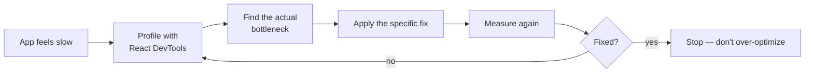
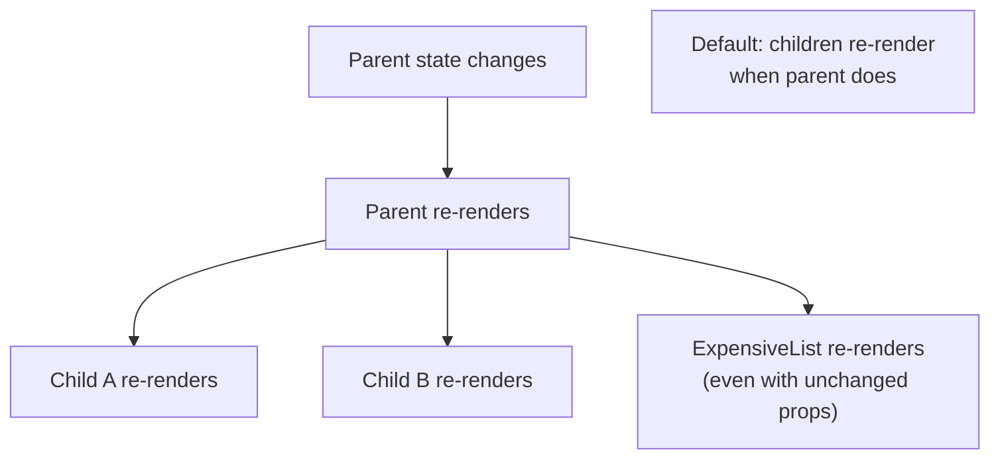
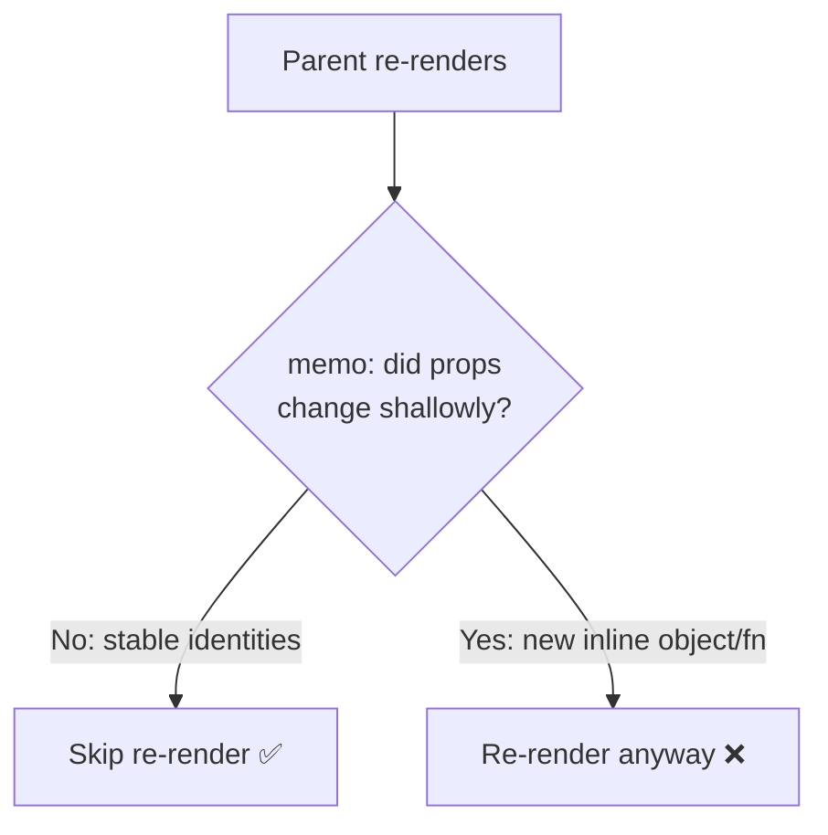
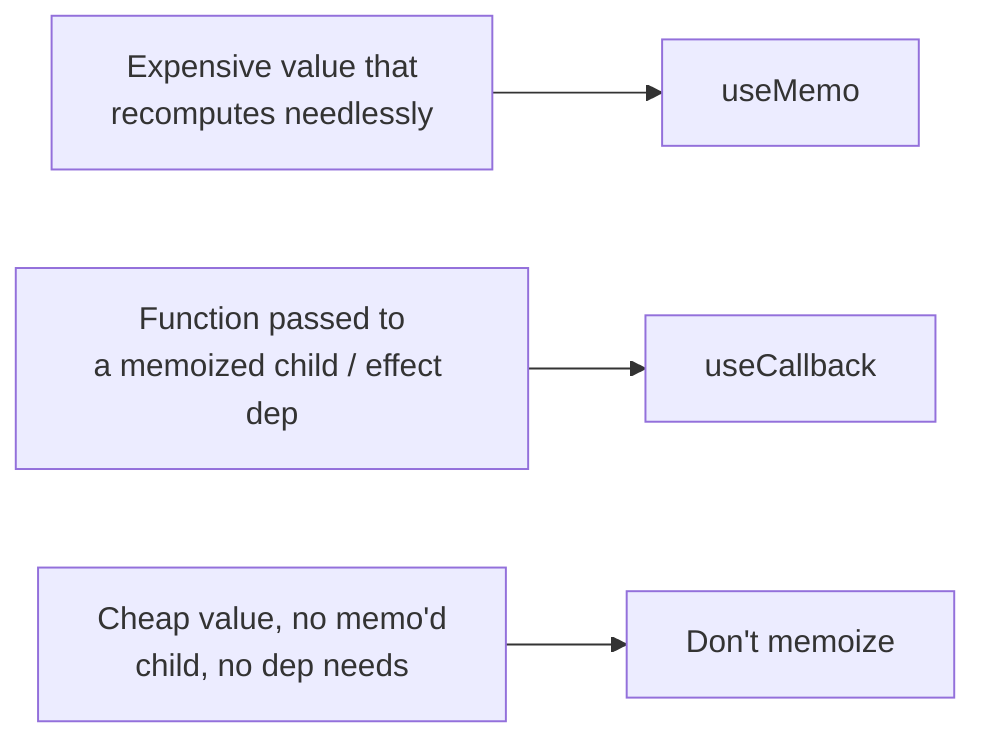
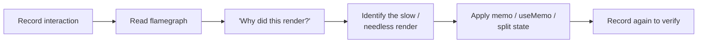
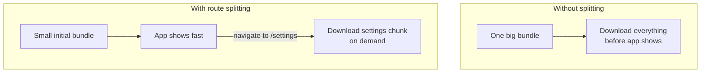
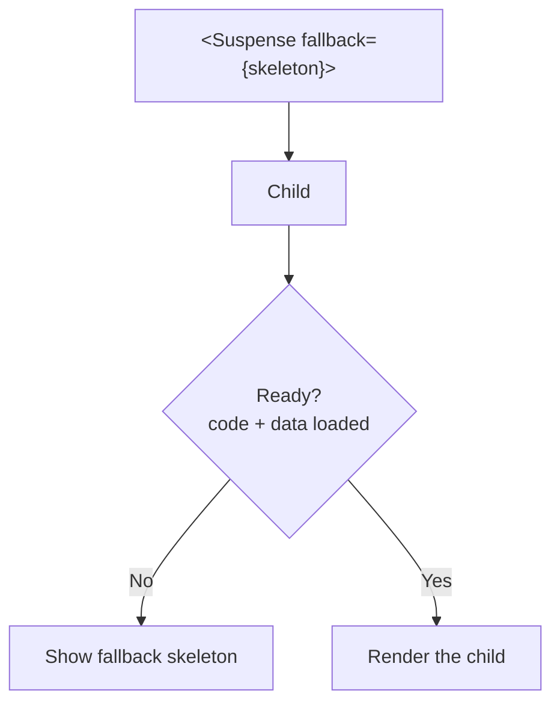
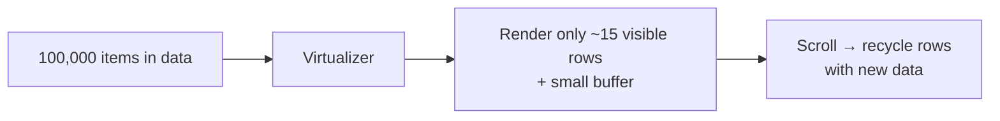

# Part 11 · Performance Optimization

> Most React apps are fast enough without any optimization — and premature optimization adds complexity for no gain. But when an app *does* get slow, you need to know exactly why and which tool fixes it. This part teaches performance the right way: first *measure* to find the real bottleneck, then apply the right fix — `React.memo`, `useMemo`/`useCallback`, code splitting, `Suspense`, or list virtualization. You'll learn what actually causes slow renders and how to reason about them, not just cargo-cult `useMemo` everywhere.

## Table of Contents

1. [The golden rule: measure first](#1-the-golden-rule-measure-first)
2. [What causes re-renders](#2-what-causes-re-renders)
3. [React.memo: skipping re-renders](#3-reactmemo-skipping-re-renders)
4. [useMemo and useCallback in depth](#4-usememo-and-usecallback-in-depth)
5. [The React DevTools Profiler](#5-the-react-devtools-profiler)
6. [Code splitting and lazy loading](#6-code-splitting-and-lazy-loading)
7. [Suspense for loading states](#7-suspense-for-loading-states)
8. [List virtualization](#8-list-virtualization)
9. [Mini-project: optimize a slow dashboard](#9-mini-project-optimize-a-slow-dashboard)
10. [Exercises and practice problems](#10-exercises-and-practice-problems)
11. [Glossary](#11-glossary)

> **💡 Suggested learning order:** §1–2 are the mindset and mental model — the most important part. §3–5 are the "reduce re-renders" toolkit. §6–8 are the "load less, render less" techniques. Never apply §3–4 without §1 and §5.

---

## 1. The golden rule: measure first

The most important performance lesson: **don't optimize blindly.** Adding `useMemo`, `useCallback`, and `React.memo` everywhere makes code harder to read, adds its own overhead, and usually helps nothing — because you're guessing at the bottleneck. Always **measure first**, fix the actual hot spot, then measure again.

🎯 **Analogy:** You already know this from backend work: you don't add database indexes to every column "for speed" — you profile the slow query, find it's missing one index, add that index, and verify. React is identical. Optimize the *measured* bottleneck, not every component. Blind `useMemo` is like indexing every column: overhead everywhere, benefit nowhere.

The correct workflow:



> **🔍 Under the hood:** React is genuinely fast by default. A re-render is just calling your function and diffing — cheap for most components. Problems arise from *specific* causes: a huge list rendering thousands of nodes, an expensive computation running every keystroke, or a large component tree re-rendering needlessly. Each has a *specific* fix. Sprinkling memoization randomly addresses none of them and clutters the code with dependency arrays to maintain.

> **⚠️ Common beginner mistake:** Wrapping every value in `useMemo` and every function in `useCallback` "to be safe." This is *negative* value: the caching itself costs CPU and memory, the deps arrays are bug-prone, and readability drops — all with no measured benefit. Write clear code first; optimize the measured hot spot only.

**Key takeaways:**
- Measure before optimizing — profile to find the *real* bottleneck.
- React is fast by default; slowness comes from specific, identifiable causes.
- Blind memoization adds overhead and complexity with no benefit — resist it.

---

## 2. What causes re-renders

To optimize renders, you must know *when* React re-renders a component. There are exactly three triggers:

1. **Its state changed** (a `useState`/`useReducer` update).
2. **Its parent re-rendered** (by default, children re-render when the parent does).
3. **A context it consumes changed** (Part 5/9).

The one that surprises beginners is #2: **when a component re-renders, all its children re-render by default** — even if their props didn't change. Usually this is fine (cheap). It becomes a problem only when a child is expensive *and* re-renders needlessly.

```jsx
function Parent() {
  const [count, setCount] = useState(0)
  return (
    <div>
      <button onClick={() => setCount((c) => c + 1)}>{count}</button>
      <ExpensiveList />    {/* re-renders every click, though its props never change! */}
    </div>
  )
}
```

Clicking the button re-renders `Parent`, which re-renders `ExpensiveList` — even though `ExpensiveList` has no props that changed. If `ExpensiveList` is heavy, that's wasted work.



The fixes map directly to the causes:
- Child re-renders needlessly from a parent → **`React.memo`** (§3).
- Expensive computation reruns → **`useMemo`** (§4).
- New function identity breaks a memoized child → **`useCallback`** (§4).
- Context change re-renders too much → split contexts / selectors (Part 9).

> **🔍 Under the hood:** "Re-render" means React calls the component function and diffs the result — it does *not* necessarily touch the DOM (Part 1 §5: render vs commit). So a re-render with identical output causes *zero* DOM changes; it just costs the function call + diff. That's why most re-renders are harmless. You only optimize when the re-render itself (the function work) is expensive or frequent enough to matter — which you confirm by measuring.

> **⚠️ Common beginner mistake:** Believing every re-render is a performance problem. It usually isn't — React re-renders constantly and cheaply. A re-render only matters if it does expensive work or updates a large subtree. Don't fight re-renders you can't measure.

**Key takeaways:**
- Re-render triggers: own state changed, parent re-rendered, or consumed context changed.
- By default, children re-render when the parent does — usually harmless.
- Each cause has a specific fix; a re-render with unchanged output makes no DOM changes.

---

## 3. React.memo: skipping re-renders

**`React.memo`** wraps a component so it **skips re-rendering when its props haven't changed** (by shallow comparison). It targets cause #2 from §2 — a child re-rendering because its parent did, despite unchanged props.

```jsx
import { memo } from 'react'

// Without memo: re-renders whenever Parent renders.
// With memo: re-renders only when its props actually change.
const ExpensiveList = memo(function ExpensiveList({ items }) {
  console.log('rendering ExpensiveList')
  return <ul>{items.map((i) => <li key={i.id}>{i.name}</li>)}</ul>
})
```

Now if `Parent` re-renders but passes the *same* `items`, `ExpensiveList` skips re-rendering. React compares each prop shallowly (`Object.is`); if all are equal, it reuses the previous result.

**The catch — memo only helps if props are stable.** Objects, arrays, and functions created *inline* in the parent get a **new identity every render**, so shallow comparison always sees them as "changed," and memo does nothing:

```jsx
function Parent() {
  const [count, setCount] = useState(0)
  return (
    <div>
      <button onClick={() => setCount((c) => c + 1)}>{count}</button>
      {/* ❌ New array + new function every render → memo is defeated */}
      <ExpensiveList items={[1, 2, 3]} onSelect={() => {}} />
    </div>
  )
}
```

To make memo work, the props must keep a stable identity — which is exactly what `useMemo`/`useCallback` provide (§4):

```jsx
const items = useMemo(() => [1, 2, 3], [])            // stable array
const onSelect = useCallback((id) => {...}, [])       // stable function
<ExpensiveList items={items} onSelect={onSelect} />   // now memo actually skips
```



> **🔍 Under the hood:** `React.memo` does a **shallow** prop comparison: it checks each prop with `Object.is`. Primitives (strings, numbers, booleans) compare by value, so they're stable. But `{...}`, `[...]`, and `() => {}` create new references each render, so they're never "equal" to last time — defeating memo unless you stabilize them. You can pass a custom comparison function as memo's second argument for special cases, but stabilizing props is the usual approach.

> **⚠️ Common beginner mistake:** Wrapping a component in `memo` but still passing inline objects/functions as props — memo silently does nothing, and you wonder why it "didn't work." Memo and `useMemo`/`useCallback` are a *team*: memo the child, stabilize the props.

**Key takeaways:**
- `React.memo` skips a child's re-render when its props are shallowly unchanged.
- Inline objects/arrays/functions get new identities each render, defeating memo.
- Pair memo with `useMemo`/`useCallback` to stabilize prop identities.

---

## 4. useMemo and useCallback in depth

You met these in Part 5 §6. Now their real purpose in performance. Both **cache across renders**, recomputing only when dependencies change.

**`useMemo`** — cache an expensive *computed value*:

```jsx
function ProductTable({ products, query }) {
  // Without: this filter+sort runs on EVERY render (e.g., every keystroke elsewhere).
  // With: runs only when products or query changes.
  const visible = useMemo(
    () => products.filter((p) => p.name.includes(query)).sort(byPrice),
    [products, query]
  )
  return <Table rows={visible} />
}
```

**`useCallback`** — cache a *function identity* (so memoized children don't re-render, or effect deps stay stable):

```jsx
function Parent({ items }) {
  // Without: new handleSelect every render → any memo'd child using it re-renders.
  // With: same identity until nothing in deps changes.
  const handleSelect = useCallback((id) => {
    console.log('selected', id)
  }, [])   // empty deps → stable forever

  return <MemoizedList items={items} onSelect={handleSelect} />
}
```

`useCallback(fn, deps)` is literally `useMemo(() => fn, deps)` — one memoizes a value, the other a function.

**When each is actually worth it:**

| Use `useMemo` when | Use `useCallback` when |
| --- | --- |
| A computation is genuinely expensive (big filter/sort/derive) | Passing a callback to a `React.memo` child |
| A referenced object must stay stable for a memo'd child | The function is an effect dependency (Part 6) |
| — | The function goes into another hook's deps |



> **🔍 Under the hood:** Both store their result plus the previous deps array. On each render, they shallow-compare the new deps to the old; if equal, return the cached value/function; if not, recompute and re-cache. This comparison + storage has a real (small) cost. So memoizing a *cheap* value is net-negative — you pay the caching cost to avoid a cheaper recompute. This is why "measure first" (§1) matters: only memoize when the thing being cached is more expensive than the caching.

> **⚠️ Common beginner mistake:** Memoizing trivially-cheap values (`useMemo(() => a + b, [a, b])`) — the memo overhead exceeds the addition it avoids. And "lying" to deps arrays to keep something stable, causing stale bugs (Part 6). Only reach for these when there's a measured expensive computation or a genuine identity-stability need.

**Key takeaways:**
- `useMemo` caches an expensive computed value; `useCallback` caches a function identity.
- Use them for measured-expensive computations or to keep props stable for memoized children.
- The caching has a cost — memoizing cheap values is counterproductive.

---

## 5. The React DevTools Profiler

The **React DevTools Profiler** (a browser extension) is how you *measure* — it shows which components rendered, how often, and how long each took. This is step 1 of §1's workflow, and it turns guessing into knowing.

The workflow:
1. Install the **React Developer Tools** browser extension.
2. Open DevTools → **Profiler** tab → click **record** ⏺.
3. Interact with your app (type, click, navigate).
4. Stop recording and read the **flamegraph**.

What the flamegraph tells you:
- **Which components rendered** during the interaction (highlighted).
- **How long each took** (wider/colored bars = slower).
- **Why they rendered** (props changed, state changed, parent rendered) — enable "Record why each component rendered" in settings.

```cards
Highlight updates :: a setting that flashes components as they re-render — spot needless renders visually.
Ranked view :: sorts components by render time — your bottleneck is at the top.
Commit list :: each state update is a "commit"; step through to see what changed.
"Why did this render?" :: tells you if it was props, state, hooks, or parent.
```

🎯 **Analogy:** The Profiler is your `EXPLAIN ANALYZE` for React. Just as you'd never optimize a SQL query without seeing its execution plan, you shouldn't optimize a component without the Profiler showing you which renders are slow and why. It replaces "I think this is slow" with "this component rendered 60 times and took 400ms."



> **🔍 Under the hood:** The Profiler hooks into React's render cycle to time each component's render and record what triggered it. A "commit" corresponds to one render→commit cycle (Part 1 §5). The "highlight updates" feature is especially useful: flashing borders around re-rendering components instantly reveals a child that re-renders on every keystroke when it shouldn't — the exact target for `React.memo`.

> **⚠️ Common beginner mistake:** Optimizing based on feel instead of the Profiler. You'll often find the *actual* bottleneck is somewhere you didn't expect — and the component you "optimized" wasn't the problem. Let the Profiler point you; don't guess.

**Key takeaways:**
- The React DevTools Profiler measures which components render, how often, and why.
- Use the flamegraph, ranked view, and "why did this render?" to find the real bottleneck.
- It's your `EXPLAIN ANALYZE` — always profile before and after optimizing.

---

## 6. Code splitting and lazy loading

Beyond render performance, there's **load** performance — how fast the app starts. By default, Vite bundles your whole app into files the browser downloads before anything shows. **Code splitting** breaks the bundle into chunks loaded *on demand*, so the initial download is smaller and the app starts faster.

**`React.lazy`** loads a component only when it's first rendered:

```jsx
import { lazy, Suspense } from 'react'

// This component's code is split into a separate chunk, loaded when first needed.
const Dashboard = lazy(() => import('./pages/Dashboard'))
const Settings = lazy(() => import('./pages/Settings'))

function App() {
  return (
    <Suspense fallback={<Spinner />}>   {/* shown while the chunk downloads */}
      <Routes>
        <Route path="/dashboard" element={<Dashboard />} />
        <Route path="/settings" element={<Settings />} />
      </Routes>
    </Suspense>
  )
}
```

The most impactful place to split is **at routes** (Part 8): each page becomes its own chunk, so visiting `/` doesn't download the code for `/settings`. The user downloads a page's code only when they navigate to it.



> **🔍 Under the hood:** `lazy(() => import('./X'))` uses a **dynamic `import()`**, which the bundler (Vite/Rollup) recognizes as a split point — it emits `X` as a separate JS chunk. When React first renders `<X/>`, the browser fetches that chunk; `Suspense` shows the fallback until it arrives, then renders the component. This is the single biggest lever for initial-load performance in large SPAs — split by route, and heavy components (charts, editors, modals) that aren't needed immediately.

> **⚠️ Common beginner mistake:** Lazy-loading *everything*, including tiny components — each split adds a network request, and over-splitting can make navigation feel laggier (many small fetches). Split at meaningful boundaries: routes first, then genuinely heavy components (rich text editors, charting libs, maps). Don't split a 2 KB button.

**Key takeaways:**
- Code splitting loads parts of your app on demand, shrinking the initial download.
- `React.lazy` + dynamic `import()` split a component into its own chunk; wrap in `Suspense`.
- Split at routes first, then heavy components — don't over-split tiny ones.

---

## 7. Suspense for loading states

**`Suspense`** is a component that shows a **fallback** UI while its children are "not ready" — either their lazy-loaded code is still downloading (§6) or (with modern data APIs) their data is still loading. It declaratively handles the "loading" state for a whole subtree.

```jsx
<Suspense fallback={<PageSkeleton />}>
  <Dashboard />        {/* while Dashboard's code/data loads, PageSkeleton shows */}
</Suspense>
```

You can nest Suspense boundaries to control *where* loading states appear — a granular skeleton per section instead of one whole-page spinner:

```jsx
<Suspense fallback={<HeaderSkeleton />}>
  <Header />
</Suspense>
<Suspense fallback={<FeedSkeleton />}>
  <Feed />           {/* Feed can load independently of Header */}
</Suspense>
```

**Data + Suspense** — modern data fetching integrates with Suspense so a component can "suspend" while its data loads. TanStack Query supports this via `useSuspenseQuery`, and React 19's `use()` (Part 5 §7) reads a promise directly:

```jsx
import { useSuspenseQuery } from '@tanstack/react-query'

function Profile({ id }) {
  // Suspends until data is ready — no isLoading branch needed here.
  const { data } = useSuspenseQuery({ queryKey: ['user', id], queryFn: () => fetchUser(id) })
  return <h1>{data.name}</h1>
}
// The nearest <Suspense fallback> handles the loading UI.
```



> **🔍 Under the hood:** When a component "suspends" (throws a promise internally), React catches it at the nearest `Suspense` boundary and shows the fallback until the promise resolves, then retries rendering. This lets you declare loading UI *structurally* (where the boundary is) rather than threading `isLoading` flags through every component. Combined with lazy loading and error boundaries (Part 14), it gives clean loading + error handling for entire subtrees.

> **⚠️ Common beginner mistake:** Putting one giant `Suspense` at the app root so the *entire* app shows a spinner while any one thing loads. Place boundaries thoughtfully — around independently-loading sections — so ready content shows immediately while slow parts fill in.

**Key takeaways:**
- `Suspense` shows a fallback while its subtree's code or data isn't ready.
- Nest boundaries to control where loading skeletons appear (granular, not whole-page).
- Modern data (TanStack Query's `useSuspenseQuery`, React 19's `use`) integrates with Suspense.

---

## 8. List virtualization

Rendering a list of 10,000 rows creates 10,000 DOM nodes — slow to render and scroll, even though the user sees maybe 20 at a time. **Virtualization** renders only the visible rows (plus a small buffer), recycling them as you scroll. It's the fix for genuinely huge lists.

```bash
npm install @tanstack/react-virtual
```

```jsx
import { useVirtualizer } from '@tanstack/react-virtual'
import { useRef } from 'react'

function BigList({ rows }) {          // rows could be 100,000 items
  const parentRef = useRef(null)
  const virtualizer = useVirtualizer({
    count: rows.length,
    getScrollElement: () => parentRef.current,
    estimateSize: () => 40,           // estimated row height in px
  })

  return (
    <div ref={parentRef} style={{ height: 400, overflow: 'auto' }}>
      {/* A spacer div sized to the FULL list height, so the scrollbar is correct */}
      <div style={{ height: virtualizer.getTotalSize(), position: 'relative' }}>
        {/* Only the visible rows are actually rendered */}
        {virtualizer.getVirtualItems().map((virtualRow) => (
          <div key={virtualRow.key}
            style={{ position: 'absolute', top: 0, transform: `translateY(${virtualRow.start}px)`, height: 40, width: '100%' }}>
            {rows[virtualRow.index].name}
          </div>
        ))}
      </div>
    </div>
  )
}
```

Instead of 100,000 DOM nodes, you render ~15 (the visible ones), repositioned as you scroll. The scrollbar still reflects the full list because the spacer div has the full height.

🎯 **Analogy:** Virtualization is like **pagination the user can't see**. A database doesn't load a million rows into memory to show page 1 — it fetches just what's displayed. Virtualization does the same for the DOM: only what's on screen exists, everything else is "loaded" (rendered) as it scrolls into view.



> **🔍 Under the hood:** The virtualizer measures the scroll container, calculates which item indices are visible from the scroll position and estimated row heights, and renders only those — absolutely positioned inside a full-height spacer. As you scroll, it recomputes the visible window and updates. This keeps the DOM node count constant (~visible rows) regardless of list size, so a 1,000,000-row list scrolls as smoothly as a 20-row one.

> **⚠️ Common beginner mistake:** Reaching for virtualization on a 50-item list — it adds complexity for no benefit; plain rendering is faster there. Virtualize only genuinely large lists (hundreds to thousands+). Also: forgetting the full-height spacer, which breaks the scrollbar and scroll position.

**Key takeaways:**
- Virtualization renders only visible rows, keeping DOM node count constant for huge lists.
- Use a library (`@tanstack/react-virtual`) with a full-height spacer for correct scrolling.
- Only for genuinely large lists (hundreds+); it's overkill for small ones.

---

## 9. Mini-project: optimize a slow dashboard

🏗️ Take a deliberately-slow dashboard and *measure-then-fix* it — the whole Part 11 workflow. Build this slow version, profile it, then apply each optimization and verify the improvement.

```jsx
// src/App.jsx — a SLOW dashboard (intentionally)
import { useState, useMemo, useCallback, memo } from 'react'

// A big dataset generated once.
const DATA = Array.from({ length: 5000 }, (_, i) => ({ id: i, name: `Item ${i}`, value: Math.random() }))

// An expensive computation — sorting + summing 5000 items.
function computeStats(data) {
  const sorted = [...data].sort((a, b) => b.value - a.value)
  const total = data.reduce((s, d) => s + d.value, 0)
  return { top: sorted.slice(0, 5), total }
}

// A heavy child list — wrap in memo so it skips re-renders when props are stable.
const ItemList = memo(function ItemList({ items, onSelect }) {
  return (
    <ul style={{ maxHeight: 200, overflow: 'auto' }}>
      {items.map((it) => (
        <li key={it.id} onClick={() => onSelect(it.id)}>{it.name}: {it.value.toFixed(3)}</li>
      ))}
    </ul>
  )
})

export default function App() {
  const [count, setCount] = useState(0)
  const [selected, setSelected] = useState(null)

  // ✅ Memoize the expensive computation — recompute only when DATA changes (never here).
  const stats = useMemo(() => computeStats(DATA), [])

  // ✅ Stable callback so the memoized ItemList doesn't re-render on count changes.
  const handleSelect = useCallback((id) => setSelected(id), [])

  return (
    <main style={{ maxWidth: 500, margin: '40px auto', fontFamily: 'system-ui' }}>
      {/* This counter re-renders App every click. Without the memoization above,
          computeStats would rerun and ItemList would re-render every click. */}
      <button onClick={() => setCount((c) => c + 1)}>Clicked {count} times</button>

      <h2>Total: {stats.total.toFixed(2)}</h2>
      <h3>Top 5</h3>
      <ul>{stats.top.map((t) => <li key={t.id}>{t.name}</li>)}</ul>

      <h3>All items {selected != null && `(selected #${selected})`}</h3>
      <ItemList items={DATA} onSelect={handleSelect} />
    </main>
  )
}
```

**The measure-then-fix workflow to actually do:**

```cards
1. Profile first :: Remove the useMemo/useCallback/memo. Profile clicking the counter — see computeStats rerun + ItemList re-render every click.
2. Fix the computation :: Add useMemo around computeStats. Re-profile — the expensive sort no longer runs on click.
3. Fix the child :: Add memo to ItemList + useCallback for onSelect. Re-profile — ItemList stops re-rendering on counter clicks.
4. Verify :: Confirm the counter now updates without touching the list or recomputing stats.
```

> **💡 Tip:** Do this with the Profiler open and "Highlight updates" on. You'll *see* `ItemList` flash on every click before the fix, and stop flashing after. That visual confirmation is the whole point of §1/§5 — you optimized a *measured* problem and *verified* the fix, rather than guessing.

**Extend it (do at least three):**
1. Bump `DATA` to 100,000 items and add virtualization (§8) to `ItemList`.
2. Route-split a second "Reports" page with `lazy` + `Suspense` (§6–7).
3. Add a search input and confirm `computeStats` still doesn't rerun on unrelated typing.
4. Intentionally pass an inline `onSelect={() => ...}` and watch memo break in the Profiler.
5. Add `useSuspenseQuery` for real data behind a Suspense skeleton.

**Key takeaways:**
- You practiced the full loop: measure → fix the specific cause → verify.
- `useMemo` fixed the expensive computation; `memo` + `useCallback` fixed the needless child re-render.
- The Profiler's "highlight updates" makes wasted renders visible and fixes provable.

---

## 10. Exercises and practice problems

### 🧪 Warm-ups (easy)

**E1.** Name the three things that cause a component to re-render.

<details><summary>Show solution</summary>

1. Its own state changed. 2. Its parent re-rendered. 3. A context it consumes changed. *(§2)*
</details>

**E2.** Why does wrapping a component in `React.memo` sometimes do nothing?

<details><summary>Show solution</summary>

Because it's passed inline objects/arrays/functions as props, which get a new identity every render, so the shallow prop comparison always sees "changed." Stabilize props with `useMemo`/`useCallback`. *(§3)*
</details>

### 🧪 Core (medium)

**E3.** This filter reruns on every keystroke of an *unrelated* input. Fix it.

```jsx
const expensive = hugeList.filter(complexPredicate).sort(complexSort)
```

<details><summary>Show solution</summary>

```jsx
const expensive = useMemo(() => hugeList.filter(complexPredicate).sort(complexSort), [hugeList])
```

*Why:* Memoize so it recomputes only when `hugeList` changes, not on every render (§4).
</details>

**E4.** Make this memoized child actually skip re-renders when the parent's counter changes.

```jsx
const List = memo(({ items, onPick }) => ...)
function Parent() {
  const [n, setN] = useState(0)
  return <><button onClick={() => setN(n+1)}>{n}</button>
    <List items={[1,2,3]} onPick={(x) => console.log(x)} /></>
}
```

<details><summary>Show solution</summary>

```jsx
const items = useMemo(() => [1, 2, 3], [])
const onPick = useCallback((x) => console.log(x), [])
<List items={items} onPick={onPick} />
```

*Why:* Stable identities let memo's shallow compare skip the re-render (§3–4).
</details>

**E5.** Route-split three pages with `lazy` and a shared `Suspense` fallback.

<details><summary>Show solution</summary>

```jsx
const Home = lazy(() => import('./Home'))
const About = lazy(() => import('./About'))
const Contact = lazy(() => import('./Contact'))
<Suspense fallback={<Spinner />}><Routes>...</Routes></Suspense>
```

*Why:* Each page becomes a chunk loaded on demand, shrinking initial load (§6).
</details>

### 🧪 Challenge (hard)

**E6.** You profiled and found a parent re-renders a 2,000-row table on every keystroke in a search box. Outline the full fix.

<details><summary>Show solution</summary>

1. Memoize the filtered rows: `const rows = useMemo(() => filter(all, query), [all, query])`.
2. Wrap the table row component in `memo` and give it stable props (`useCallback` for handlers).
3. If still slow with thousands of visible rows, **virtualize** the table (§8).
4. Re-profile to confirm keystrokes no longer re-render off-screen rows.

*Why:* Combines memoization + virtualization, driven by profiling — the real-world pattern.
</details>

**E7.** Explain why `useMemo(() => a + b, [a, b])` is a bad use of `useMemo`.

<details><summary>Show solution</summary>

`a + b` is trivially cheap. `useMemo` adds overhead (storing the value + comparing deps each render) that exceeds the cost of just recomputing the addition. Memoization is only worth it when the cached computation is more expensive than the caching machinery (§1, §4).
</details>

**E8 (capstone step).** Profile your Data Dashboard (Part 6) and Contacts Manager (Part 8): find any needless re-renders, memoize the right things, route-split pages, and virtualize any long list. Document before/after render counts from the Profiler. Keep them — Part 12 adds TypeScript, Part 13 tests them.

<details><summary>Show hint</summary>

Record a Profiler session for a typical interaction (searching, navigating). Look for components that render but shouldn't (props unchanged). Apply `memo`+`useCallback` there. Route-split each page with `lazy`. If a list has hundreds+ of rows, virtualize it. The deliverable is a before/after render-count comparison — proving you measured, not guessed.
</details>

---

## 11. Glossary

| Term | Meaning |
| --- | --- |
| **Re-render** | React calling a component function again to compute new output. |
| **`React.memo`** | Wraps a component to skip re-renders when props are shallowly unchanged. |
| **Shallow comparison** | Comparing each prop by reference/value (`Object.is`), not deeply. |
| **`useMemo`** | Caches an expensive computed value across renders. |
| **`useCallback`** | Caches a function's identity across renders. |
| **Profiler** | React DevTools tool that measures which components render and how long. |
| **Code splitting** | Breaking the bundle into chunks loaded on demand. |
| **`React.lazy`** | Loads a component as a separate chunk via dynamic `import()`. |
| **`Suspense`** | Shows a fallback while a subtree's code or data isn't ready. |
| **Virtualization** | Rendering only visible list rows to handle huge lists efficiently. |

---

> **You can now make React apps fast — the right way:** measure, fix the real bottleneck, verify. You know how to reduce re-renders and load less code. Next, we add a safety net that catches whole classes of bugs before they run: TypeScript.
>
> **Next:** [Part 12 · TypeScript with React →](12-typescript-react.md)
