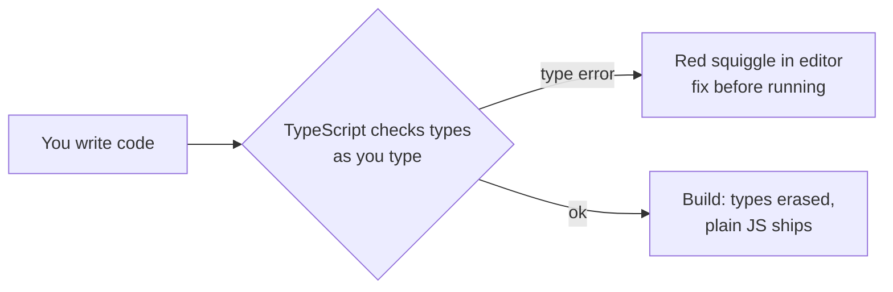
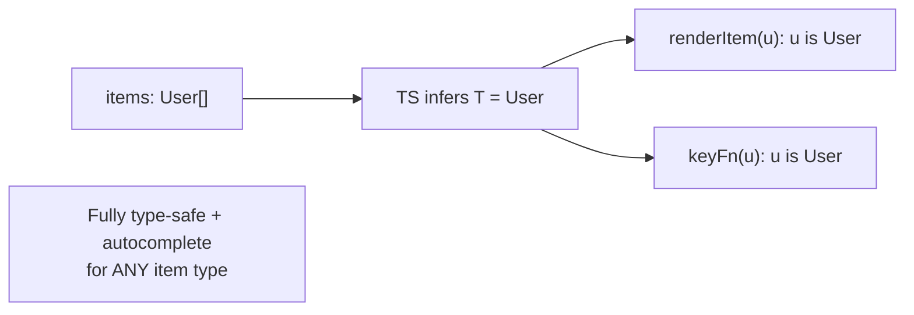
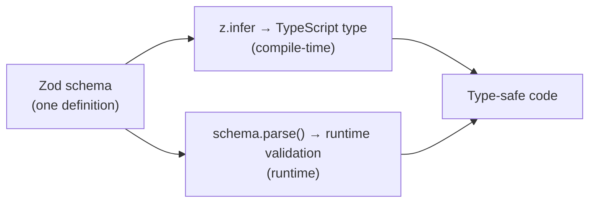

# Part 12 · TypeScript with React

> TypeScript adds static types to JavaScript, catching a whole class of bugs *before* your code runs and making your components self-documenting. In React, it shines: props become contracts, hooks get inferred types, and your editor autocompletes everything. This part isn't a TypeScript language course — it focuses on **typing React**: props, state, events, refs, context, and generics. By the end you can convert any component to TypeScript and enjoy the safety and autocomplete that professional React teams rely on.

## Table of Contents

1. [Why TypeScript for React](#1-why-typescript-for-react)
2. [Typing props](#2-typing-props)
3. [Typing state and useState](#3-typing-state-and-usestate)
4. [Typing events and the DOM](#4-typing-events-and-the-dom)
5. [Typing useRef, useReducer, and context](#5-typing-useref-usereducer-and-context)
6. [Typing children and component props](#6-typing-children-and-component-props)
7. [Generics and reusable typed components](#7-generics-and-reusable-typed-components)
8. [Zod and inferred types](#8-zod-and-inferred-types)
9. [Mini-project: convert a component tree to TypeScript](#9-mini-project-convert-a-component-tree-to-typescript)
10. [Exercises and practice problems](#10-exercises-and-practice-problems)
11. [Glossary](#11-glossary)

> **💡 Suggested learning order:** §1–4 are the daily essentials — props, state, events. §5–6 cover the remaining hooks and children. §7–8 (generics, Zod inference) are the "level up" that makes reusable components truly type-safe. New Vite React projects offer a TypeScript template — use it.

---

## 1. Why TypeScript for React

TypeScript is JavaScript plus **static types** — annotations checked at compile time (really, at edit time in your editor). It doesn't change what runs (types are erased in the build); it catches mistakes *before* they become runtime bugs.

🎯 **Analogy:** As a backend engineer, you know the value of typed function signatures and schema validation — they catch "you passed a string where a number was expected" before it hits production. TypeScript brings that to your UI: a component's props become a **typed contract**. Pass the wrong prop, forget a required one, or typo a field, and your editor flags it *as you type* — red squiggles instead of a blank screen and a console error at runtime.

Start a TypeScript React project — Vite has a template:

```bash
npm create vite@latest my-app     # choose React → TypeScript
```

Files become `.tsx` (TSX = JSX + TypeScript) instead of `.jsx`. The concrete wins:

```cards
Catch bugs early :: wrong/missing props, typos, null access — flagged before running.
Autocomplete :: your editor knows every prop, state field, and API shape.
Self-documenting :: the types ARE the documentation — no guessing what a prop expects.
Safe refactoring :: rename a field and TS shows every place that must change.
Better teamwork :: contracts between components are explicit and enforced.
```



> **🔍 Under the hood:** TypeScript is a **compile-time** tool — types are checked, then *erased*; the browser runs plain JavaScript with no type information. This means types have zero runtime cost and zero runtime enforcement (a bad API response can still violate a type at runtime — that's where Zod, §8, adds *runtime* validation). Think of TypeScript as a very smart linter that understands your data shapes.

> **⚠️ Common beginner mistake:** Overusing `any` to silence errors (`const data: any = ...`). `any` disables type checking for that value — it's an escape hatch that defeats the purpose. Prefer proper types, or `unknown` (which forces you to check before use). A codebase full of `any` gets none of TypeScript's benefits.

**Key takeaways:**
- TypeScript adds compile-time types that catch bugs before runtime, with zero runtime cost.
- In React, props/state/events become typed contracts with full editor autocomplete.
- Avoid `any` — it disables checking; use precise types (or `unknown` when truly unknown).

---

## 2. Typing props

The most common thing you'll type. Define an interface (or type) for a component's props and annotate the parameter.

```tsx
// Define the shape of the props.
interface ButtonProps {
  label: string
  onClick: () => void
  variant?: 'primary' | 'danger'   // ? = optional
  disabled?: boolean
}

// Annotate the destructured props parameter.
function Button({ label, onClick, variant = 'primary', disabled = false }: ButtonProps) {
  return <button className={variant} onClick={onClick} disabled={disabled}>{label}</button>
}

// Now usage is checked:
<Button label="Save" onClick={handleSave} />                 // ✅
<Button label="Save" />                                       // ❌ missing onClick
<Button label="Save" onClick={handleSave} variant="huge" />  // ❌ 'huge' not allowed
<Button label={42} onClick={handleSave} />                   // ❌ label must be string
```

Note the power of **union types** (`'primary' | 'danger'`) — `variant` can *only* be those exact strings; anything else is a compile error, and your editor autocompletes the valid options.

**`interface` vs `type`** — both work for props; use either consistently:

```tsx
type ButtonProps = { label: string; onClick: () => void }   // type alias
interface ButtonProps { label: string; onClick: () => void } // interface
```

Common prop type patterns:

| Prop | Type |
| --- | --- |
| Text | `string` |
| Number | `number` |
| Flag | `boolean` |
| Fixed set of options | `'a' \| 'b' \| 'c'` (union) |
| Array of items | `User[]` or `Array<User>` |
| Object | an `interface`/`type` |
| Callback | `(arg: Type) => ReturnType` |
| Optional | add `?`: `variant?: string` |

> **🔍 Under the hood:** When you type props, TypeScript checks every *usage site* of the component against the interface. Forget a required prop, pass the wrong type, or add an unknown prop — all become errors at the `<Button ... />` call. This is the "contract" idea: the props interface is a promise the component makes and callers must honor, enforced automatically.

> **⚠️ Common beginner mistake:** Making everything optional (`label?: string`) to avoid errors, then dealing with `undefined` everywhere. Mark props optional *only* when they genuinely are; required props catch real mistakes (a `Button` with no `label` is a bug you *want* flagged).

**Key takeaways:**
- Define a props `interface`/`type` and annotate the props parameter.
- Union types (`'primary' | 'danger'`) restrict to exact allowed values with autocomplete.
- Mark props optional (`?`) only when they truly are — required props catch real bugs.

---

## 3. Typing state and useState

`useState` usually **infers** the type from the initial value — no annotation needed:

```tsx
const [count, setCount] = useState(0)         // inferred: number
const [name, setName] = useState('')          // inferred: string
const [open, setOpen] = useState(false)       // inferred: boolean
// setCount('hi')  → ❌ error: string not assignable to number
```

You only annotate when the initial value doesn't capture the full type — commonly when state can be `null` initially, or is a union/complex object:

```tsx
// State that's null until loaded → provide the type explicitly
const [user, setUser] = useState<User | null>(null)
//                                ^^^^^^^^^^^^ type argument

// A union of statuses
const [status, setStatus] = useState<'idle' | 'loading' | 'error'>('idle')

// An array that starts empty (otherwise inferred as never[])
const [items, setItems] = useState<Todo[]>([])
```

The `useState<T>(...)` syntax passes the type explicitly. Without it, `useState(null)` infers `null` (so you could never set a user), and `useState([])` infers `never[]` (so you could never add an item) — hence the annotations.

```mermaid
flowchart TD
  Q{Does the initial value<br/>capture the full type?} -->|Yes: 0, '', false| I[Let it infer<br/>useState(0)]
  Q -->|No: null, empty array,<br/>a union| A["Annotate<br/>useState&lt;User | null&gt;(null)"]
```

> **🔍 Under the hood:** `useState` is a **generic** function: `useState<S>(initial: S)`. When you call `useState(0)`, TypeScript infers `S = number` from the argument. When the argument is `null` or `[]`, inference gives an unhelpful type (`null`, `never[]`), so you supply `S` explicitly with `useState<User | null>(null)`. The setter is then typed to accept only that type, catching bad updates.

> **⚠️ Common beginner mistake:** `const [user, setUser] = useState(null)` then `setUser({ name: 'Ada' })` → error, because the state was inferred as type `null`. Annotate nullable/complex state: `useState<User | null>(null)`. Same for empty arrays and objects.

**Key takeaways:**
- `useState` infers types from the initial value — no annotation for `0`, `''`, `false`.
- Annotate with `useState<T>()` for nullable state, unions, empty arrays, or complex objects.
- The setter is typed too, so invalid updates are caught.

---

## 4. Typing events and the DOM

Event handlers receive typed synthetic events (Part 3). Let TypeScript infer them via **inline handlers**, or annotate when you extract the handler.

**Inline — inference does the work (preferred):**

```tsx
// TS infers `e` as the correct event type from the onChange context.
<input onChange={(e) => setName(e.target.value)} />   // e: ChangeEvent<HTMLInputElement>
<button onClick={(e) => console.log(e.currentTarget)} /> // e: MouseEvent<HTMLButtonElement>
```

**Extracted handler — annotate the event:**

```tsx
import { ChangeEvent, FormEvent, MouseEvent } from 'react'

function handleChange(e: ChangeEvent<HTMLInputElement>) {
  setName(e.target.value)
}
function handleSubmit(e: FormEvent<HTMLFormElement>) {
  e.preventDefault()
}
function handleClick(e: MouseEvent<HTMLButtonElement>) {
  console.log(e.clientX)
}
```

The event types are generic over the element (`<HTMLInputElement>`, `<HTMLFormElement>`), so `e.target`/`e.currentTarget` are correctly typed and autocomplete.

The events you'll use most:

| Event | Type |
| --- | --- |
| Input/select change | `ChangeEvent<HTMLInputElement>` (or `HTMLSelectElement`, `HTMLTextAreaElement`) |
| Form submit | `FormEvent<HTMLFormElement>` |
| Click | `MouseEvent<HTMLButtonElement>` |
| Key press | `KeyboardEvent<HTMLInputElement>` |
| Focus/blur | `FocusEvent<HTMLInputElement>` |

> **🔍 Under the hood:** React's event types are generic over the DOM element type, which is why `ChangeEvent<HTMLInputElement>` makes `e.target.value` a `string` (inputs have `.value`), while `ChangeEvent<HTMLSelectElement>` types it for a select. Using inline handlers lets TypeScript infer all this from the JSX context — you rarely need to write these types by hand unless you extract the handler.

> **⚠️ Common beginner mistake:** Reaching for `e: any` on event handlers to avoid remembering the type. Prefer inline handlers (fully inferred) or the correct `ChangeEvent<HTMLInputElement>`. Also: confusing `e.target` (the element that fired the event) with `e.currentTarget` (the element the handler is attached to) — TS types both, but they can differ.

**Key takeaways:**
- Inline handlers infer the correct event type — prefer them.
- For extracted handlers, annotate: `ChangeEvent<HTMLInputElement>`, `FormEvent<HTMLFormElement>`, etc.
- Event types are generic over the element, giving correctly-typed `e.target`.

---

## 5. Typing useRef, useReducer, and context

**`useRef`** — annotate the ref's value type; for DOM refs, use the element type and `null`:

```tsx
// DOM ref — starts null, React fills it. Type is the element | null.
const inputRef = useRef<HTMLInputElement>(null)
inputRef.current?.focus()     // ?. because it's null before mount

// Mutable value ref (Part 5) — type the value.
const timerRef = useRef<number | null>(null)
```

**`useReducer`** — type the state and the action (a union of action shapes):

```tsx
interface State { count: number }
// A discriminated union: each action has a literal `type` that narrows the shape.
type Action =
  | { type: 'increment' }
  | { type: 'decrement' }
  | { type: 'set'; payload: number }

function reducer(state: State, action: Action): State {
  switch (action.type) {
    case 'increment': return { count: state.count + 1 }
    case 'decrement': return { count: state.count - 1 }
    case 'set': return { count: action.payload }   // TS knows payload exists here
  }
}
const [state, dispatch] = useReducer(reducer, { count: 0 })
dispatch({ type: 'set', payload: 5 })   // ✅ typed
dispatch({ type: 'set' })               // ❌ payload required for 'set'
```

The **discriminated union** for actions is a TypeScript superpower: inside each `case`, TS *narrows* the action to that exact shape — so `action.payload` is available in `'set'` but a type error elsewhere.

**Context** — type the context value so consumers get autocomplete:

```tsx
interface ThemeContextValue { theme: 'light' | 'dark'; toggle: () => void }

// Create with the type (null default handled by the hook's check).
const ThemeContext = createContext<ThemeContextValue | null>(null)

function useTheme(): ThemeContextValue {
  const ctx = useContext(ThemeContext)
  if (!ctx) throw new Error('useTheme must be used within ThemeProvider')
  return ctx   // TS now knows it's non-null here
}
```

> **🔍 Under the hood:** The discriminated union (`Action`) works because each member has a unique literal `type` field. When you `switch (action.type)`, TypeScript uses that literal to *narrow* the union inside each branch — so it knows the `'set'` action has `payload` but `'increment'` doesn't. This is one of TypeScript's most powerful patterns for modeling state machines and events safely. The context null-check similarly *narrows* `ctx` from `Value | null` to `Value` after the `if (!ctx) throw`.

> **⚠️ Common beginner mistake:** Typing the reducer's action as a broad `{ type: string; payload?: any }` — you lose the per-action safety. Use a discriminated union so each action's payload is exactly typed. For context, forgetting the null case (`createContext<T>(...)` needs a default or `| null`) causes consumers to think the value is always present.

**Key takeaways:**
- `useRef<HTMLInputElement>(null)` for DOM refs; access with `?.` (null before mount).
- Type `useReducer` actions as a **discriminated union** for per-action payload safety.
- Type context values and narrow the null case in a custom hook.

---

## 6. Typing children and component props

Components that accept `children` or wrap other components need special types.

**`children`** — use `ReactNode` (anything renderable: elements, strings, numbers, arrays, null):

```tsx
import { ReactNode } from 'react'

interface CardProps {
  title: string
  children: ReactNode      // any renderable content
}
function Card({ title, children }: CardProps) {
  return <section><h2>{title}</h2>{children}</section>
}
```

**Extending native element props** — for wrapper components that forward props to a DOM element, extend the element's prop types so all native attributes (`onClick`, `disabled`, `type`, `aria-*`) are typed:

```tsx
import { ButtonHTMLAttributes } from 'react'

// Your custom props PLUS every native <button> attribute.
interface ButtonProps extends ButtonHTMLAttributes<HTMLButtonElement> {
  variant?: 'primary' | 'danger'
}
function Button({ variant = 'primary', className, ...rest }: ButtonProps) {
  return <button className={`btn-${variant} ${className ?? ''}`} {...rest} />
  //     ...rest is fully typed: onClick, disabled, type, etc. all allowed
}
<Button variant="danger" onClick={fn} disabled type="submit">Go</Button>  // all typed ✅
```

**A function passed as a prop** — type its signature:

```tsx
interface ListProps {
  items: string[]
  onSelect: (item: string, index: number) => void   // typed callback
}
```

Common React types reference:

| Type | Use for |
| --- | --- |
| `ReactNode` | Anything renderable (`children`) |
| `ReactElement` | Specifically a JSX element |
| `ButtonHTMLAttributes<HTMLButtonElement>` | Native button props (extend for wrappers) |
| `InputHTMLAttributes<HTMLInputElement>` | Native input props |
| `CSSProperties` | The `style` object type |
| `ComponentProps<'div'>` | All props of a given element/component |

> **🔍 Under the hood:** `ReactNode` is a broad union covering everything React can render. `ButtonHTMLAttributes<HTMLButtonElement>` is React's type for all valid `<button>` attributes; extending it gives your wrapper component full native-prop support with autocomplete — the typed version of Part 2's prop forwarding. `ComponentProps<typeof SomeComponent>` even lets you borrow another component's prop types.

> **⚠️ Common beginner mistake:** Typing `children` as `string` (too narrow — breaks when you pass elements) or `any` (too loose). Use `ReactNode`. And hand-listing native attributes (`onClick`, `disabled`, …) instead of extending `ButtonHTMLAttributes` — extend it and get them all, correctly typed, for free.

**Key takeaways:**
- Type `children` as `ReactNode`; it covers all renderable content.
- Extend `ButtonHTMLAttributes`/`InputHTMLAttributes` for wrappers that forward native props.
- Type callback props with full signatures; use `ComponentProps` to borrow prop types.

---

## 7. Generics and reusable typed components

Truly reusable components (a `List`, a `Select`, a `Table`) work with *any* data type. **Generics** let a component be typed over the data it receives, so it stays type-safe for every use.

```tsx
// A generic List: <T> is the item type, inferred from the `items` prop.
interface ListProps<T> {
  items: T[]
  renderItem: (item: T) => ReactNode
  keyFn: (item: T) => string | number
}

function List<T>({ items, renderItem, keyFn }: ListProps<T>) {
  return <ul>{items.map((item) => <li key={keyFn(item)}>{renderItem(item)}</li>)}</ul>
}

// Usage — T is inferred as User; renderItem's `u` is typed as User automatically!
<List
  items={users}                                  // User[]
  keyFn={(u) => u.id}                            // u: User (inferred)
  renderItem={(u) => <span>{u.name}</span>}      // u: User — autocomplete works
/>
```

The magic: TypeScript infers `T` from the `items` prop, so `renderItem` and `keyFn` receive correctly-typed items — with autocomplete — *without* you specifying the type. The same `List` works type-safely for `User[]`, `Product[]`, or `string[]`.



🎯 **Analogy:** Generics are like a function that works on any type while preserving that type — think of a backend `Repository<T>` that's type-safe whether it stores `User` or `Order`. A generic `List<T>` is the UI equivalent: one component, type-safe for every data shape, with no `any` and no duplication.

> **🔍 Under the hood:** When you write `<List items={users} .../>`, TypeScript matches `users: User[]` against `items: T[]` and infers `T = User`. That inferred `T` then flows into `renderItem: (item: T) => ...` and `keyFn`, so their parameters are `User`. This *inference* is what makes generics ergonomic — you almost never write `<List<User> ...>` explicitly; TS figures it out from the props.

> **⚠️ Common beginner mistake:** Reaching for `any[]` to make a component "work with any data" — you lose all type safety inside. Use a generic `<T>` instead: same flexibility, full safety, and autocomplete for consumers. Generics feel advanced but are exactly what reusable typed components need.

**Key takeaways:**
- Generics (`<T>`) let one component be type-safe for any data type.
- TypeScript infers `T` from props, so callbacks get correctly-typed parameters automatically.
- Prefer generics over `any[]` for reusable components — safety without duplication.

---

## 8. Zod and inferred types

Part 7 used **Zod** for form validation. Its second superpower with TypeScript: a Zod schema is *also* a TypeScript type, via `z.infer` — one definition gives you **runtime validation and a compile-time type**, guaranteed in sync.

```tsx
import { z } from 'zod'

// Define the schema once.
const userSchema = z.object({
  id: z.string(),
  name: z.string(),
  age: z.number().min(0),
  role: z.enum(['admin', 'user']),
})

// Derive the TypeScript type FROM the schema — no duplication.
type User = z.infer<typeof userSchema>
// Equivalent to: { id: string; name: string; age: number; role: 'admin' | 'user' }

// Validate an API response at runtime AND get the typed result:
async function fetchUser(id: string): Promise<User> {
  const res = await fetch(`/api/users/${id}`)
  const data = await res.json()
  return userSchema.parse(data)   // throws if invalid; returns typed User if valid
}
```

This solves TypeScript's blind spot (§1): types are erased at runtime, so a malformed API response can violate your `User` type without TS knowing. `userSchema.parse(data)` **validates at runtime** and returns a value TypeScript *knows* is a `User` — types and reality stay in sync.



> **🔍 Under the hood:** `z.infer<typeof schema>` uses TypeScript's type inference on the schema's structure to produce the matching type — so editing the schema automatically updates the type. `parse()` runs the actual validation at runtime and its return type is that inferred type, so TypeScript *narrows* the untyped `data` into a fully-typed `User`. This "parse, don't validate" pattern — validate at the boundary, then trust the types inward — is the gold standard for type-safe data handling.

> **⚠️ Common beginner mistake:** Defining a TypeScript `interface User` *and* a separate Zod schema, then keeping them manually in sync (they drift). Define the Zod schema once and `z.infer` the type from it — single source of truth for both runtime and compile-time.

**Key takeaways:**
- `z.infer<typeof schema>` derives a TypeScript type from a Zod schema — one source of truth.
- `schema.parse(data)` validates at runtime and returns a correctly-typed value.
- This bridges TS's runtime blind spot: validate at the boundary, trust types inward.

---

## 9. Mini-project: convert a component tree to TypeScript

🏗️ Convert a small JavaScript component tree to TypeScript, applying everything from this part. We'll type a mini user-directory: props, state, events, a generic list, and a Zod-validated fetch.

```tsx
// src/types.ts — shared types from a Zod schema (single source of truth)
import { z } from 'zod'

export const userSchema = z.object({
  id: z.string(),
  name: z.string(),
  email: z.string().email(),
  role: z.enum(['admin', 'member']),
  active: z.boolean(),
})
export type User = z.infer<typeof userSchema>
```

```tsx
// src/components/List.tsx — a reusable GENERIC list
import { ReactNode } from 'react'

interface ListProps<T> {
  items: T[]
  keyFn: (item: T) => string
  renderItem: (item: T) => ReactNode
}
export function List<T>({ items, keyFn, renderItem }: ListProps<T>) {
  if (items.length === 0) return <p>Nothing to show.</p>
  return <ul>{items.map((item) => <li key={keyFn(item)}>{renderItem(item)}</li>)}</ul>
}
```

```tsx
// src/components/UserBadge.tsx — typed props with a union + optional
interface UserBadgeProps {
  user: Pick<User, 'name' | 'role'>   // only the fields it needs (utility type!)
  onClick?: (name: string) => void
}
export function UserBadge({ user, onClick }: UserBadgeProps) {
  return (
    <button onClick={() => onClick?.(user.name)}>
      {user.name} <em>({user.role})</em>
    </button>
  )
}
```

```tsx
// src/App.tsx — typed state, events, and a validated fetch
import { useState, ChangeEvent } from 'react'
import { useQuery } from '@tanstack/react-query'
import { z } from 'zod'
import { userSchema, type User } from './types'
import { List } from './components/List'
import { UserBadge } from './components/UserBadge'

async function fetchUsers(): Promise<User[]> {
  const res = await fetch('/api/users')
  const data = await res.json()
  return z.array(userSchema).parse(data)      // runtime-validated → typed User[]
}

export default function App() {
  const [query, setQuery] = useState('')                   // inferred: string
  const [selected, setSelected] = useState<User | null>(null)  // annotated: nullable

  const { data: users = [], isLoading } = useQuery({
    queryKey: ['users'],
    queryFn: fetchUsers,                                    // returns User[] — typed end to end
  })

  const handleSearch = (e: ChangeEvent<HTMLInputElement>) => setQuery(e.target.value)
  const visible = users.filter((u) => u.name.toLowerCase().includes(query.toLowerCase()))

  if (isLoading) return <p>Loading…</p>

  return (
    <main>
      <input value={query} onChange={handleSearch} placeholder="Search users" />
      <List
        items={visible}                                      // User[] → T inferred as User
        keyFn={(u) => u.id}                                  // u: User
        renderItem={(u) => <UserBadge user={u} onClick={(name) => setSelected(u)} />}
      />
      {selected && <p>Selected: {selected.name} ({selected.email})</p>}
    </main>
  )
}
```

**Every Part 12 concept, applied:**

```cards
Props :: UserBadgeProps with a union role + optional onClick.
State :: query inferred (string); selected annotated (User | null).
Events :: handleSearch typed ChangeEvent<HTMLInputElement>.
Generics :: List<T> infers User from items — renderItem's u is typed.
Zod inference :: User type from the schema; parse validates the API at runtime.
Utility types :: Pick<User, 'name' | 'role'> for a subset of fields.
```

> **💡 Tip:** Notice you never wrote `any`, and the `List`'s `renderItem` gave you a fully-typed `u: User` with autocomplete — that's the payoff. Try changing the schema (add a field) and watch every dependent type update. This is why teams adopt TypeScript: the compiler becomes a tireless reviewer.

**Extend it (do at least three):**
1. Add a `role` filter (`'all' | 'admin' | 'member'`) as typed state.
2. Type a `useReducer` for multi-select with a discriminated-union action.
3. Make `UserBadge` extend `ButtonHTMLAttributes` so it forwards native button props.
4. Add a `Table<T>` generic component reusing the generics pattern.
5. Convert one of your earlier capstones (Contacts Manager) to TypeScript end to end.

**Key takeaways:**
- You typed a full tree: props, nullable state, events, a generic list, and a validated fetch.
- Generics + Zod inference gave reusable, runtime-safe, fully-autocompleted components.
- No `any` needed — precise types make the editor your co-pilot.

---

## 10. Exercises and practice problems

### 🧪 Warm-ups (easy)

**E1.** Type the props for `Avatar` (a required `src: string`, optional `size: number` defaulting to 40).

<details><summary>Show solution</summary>

```tsx
interface AvatarProps { src: string; size?: number }
function Avatar({ src, size = 40 }: AvatarProps) {
  return 
}
```

*Why:* Required `src`, optional `size` with `?` and a default (§2).
</details>

**E2.** Fix this: `const [user, setUser] = useState(null)` then `setUser({ name: 'Ada' })` errors.

<details><summary>Show solution</summary>

```tsx
interface User { name: string }
const [user, setUser] = useState<User | null>(null)
```

*Why:* Annotate nullable state so the setter accepts a `User` (§3).
</details>

### 🧪 Core (medium)

**E3.** Type a `Select` component with a `value`, `onChange(value: string)`, and `options: { value: string; label: string }[]`.

<details><summary>Show solution</summary>

```tsx
interface Option { value: string; label: string }
interface SelectProps { value: string; onChange: (value: string) => void; options: Option[] }
function Select({ value, onChange, options }: SelectProps) {
  return (
    <select value={value} onChange={(e) => onChange(e.target.value)}>
      {options.map((o) => <option key={o.value} value={o.value}>{o.label}</option>)}
    </select>
  )
}
```

*Why:* Typed props, typed callback, typed options array (§2, §4).
</details>

**E4.** Write a discriminated-union `Action` type and typed reducer for a todo (`add`, `toggle`, `remove`).

<details><summary>Show solution</summary>

```tsx
type Action =
  | { type: 'add'; text: string }
  | { type: 'toggle'; id: string }
  | { type: 'remove'; id: string }

function reducer(state: Todo[], action: Action): Todo[] {
  switch (action.type) {
    case 'add': return [...state, { id: crypto.randomUUID(), text: action.text, done: false }]
    case 'toggle': return state.map((t) => t.id === action.id ? { ...t, done: !t.done } : t)
    case 'remove': return state.filter((t) => t.id !== action.id)
  }
}
```

*Why:* Each action's payload is exactly typed and narrowed per case (§5).
</details>

**E5.** Type a `Card` that accepts `title: string` and `children`.

<details><summary>Show solution</summary>

```tsx
import { ReactNode } from 'react'
interface CardProps { title: string; children: ReactNode }
function Card({ title, children }: CardProps) {
  return <section><h2>{title}</h2>{children}</section>
}
```

*Why:* `ReactNode` covers all renderable children (§6).
</details>

### 🧪 Challenge (hard)

**E6.** Write a generic `Table<T>` with `data: T[]`, `columns: { key: keyof T; header: string }[]`.

<details><summary>Show solution</summary>

```tsx
interface Column<T> { key: keyof T; header: string }
interface TableProps<T> { data: T[]; columns: Column<T>[] }
function Table<T extends { id: string }>({ data, columns }: TableProps<T>) {
  return (
    <table>
      <thead><tr>{columns.map((c) => <th key={String(c.key)}>{c.header}</th>)}</tr></thead>
      <tbody>
        {data.map((row) => (
          <tr key={row.id}>{columns.map((c) => <td key={String(c.key)}>{String(row[c.key])}</td>)}</tr>
        ))}
      </tbody>
    </table>
  )
}
```

*Why:* `keyof T` ties columns to real fields of the data type — type-safe columns (§7).
</details>

**E7.** Given a Zod schema, derive its type and write a `parse`-based fetch that returns the typed value.

<details><summary>Show solution</summary>

```tsx
const postSchema = z.object({ id: z.number(), title: z.string() })
type Post = z.infer<typeof postSchema>
async function getPost(id: number): Promise<Post> {
  const data = await fetch(`/api/posts/${id}`).then((r) => r.json())
  return postSchema.parse(data)
}
```

*Why:* One schema → type + runtime validation, kept in sync (§8).
</details>

**E8 (capstone step).** Convert your **Contacts Manager** (Parts 8–10) to TypeScript: define a `Contact` type from a Zod schema, type all page props and state, type the `api` module, and make any shared UI components (`Button`, `Field`) properly typed with extended native props. Keep it — Part 13 tests it, Part 14 refines its architecture.

<details><summary>Show hint</summary>

Start by renaming files `.jsx` → `.tsx` and let the errors guide you. Define `contactSchema` + `type Contact = z.infer<...>` in one place. Type the `api` functions' returns (`Promise<Contact[]>`, etc.) and `parse` responses. For `Button`, `extends ButtonHTMLAttributes<HTMLButtonElement>`. The compiler will list everything left to type — work through the list.
</details>

---

## 11. Glossary

| Term | Meaning |
| --- | --- |
| **TypeScript** | JavaScript with static, compile-time types (erased at runtime). |
| **`.tsx`** | A file with JSX + TypeScript. |
| **Interface / type** | Ways to define the shape of props/state/objects. |
| **Union type** | `'a' \| 'b'` — a value restricted to specific options. |
| **Type inference** | TypeScript deducing types automatically (e.g., from `useState(0)`). |
| **Discriminated union** | A union whose members share a literal field used to narrow them. |
| **`ReactNode`** | The type for anything renderable (used for `children`). |
| **Generic (`<T>`)** | A component/function typed over a variable type, inferred from usage. |
| **`z.infer`** | Derives a TypeScript type from a Zod schema. |
| **Utility types** | Built-in type transformers like `Pick`, `Omit`, `Partial`, `keyof`. |
| **`any` vs `unknown`** | `any` disables checking; `unknown` forces a check before use. |

---

> **Your components are now type-safe and self-documenting** — bugs caught before runtime, autocomplete everywhere, and refactors that can't silently break. Next, we make sure the code actually *works* and keeps working: testing.
>
> **Next:** [Part 13 · Testing React →](13-testing.md)
