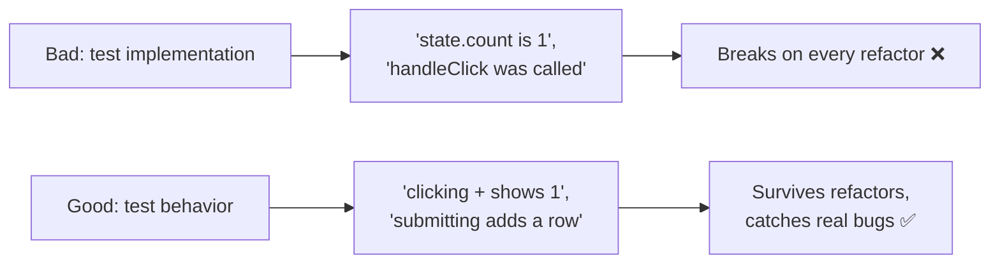
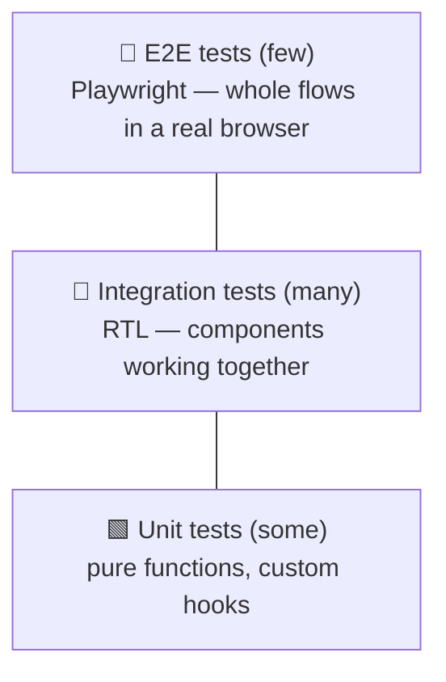
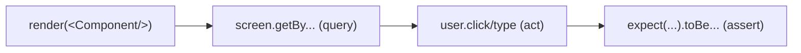
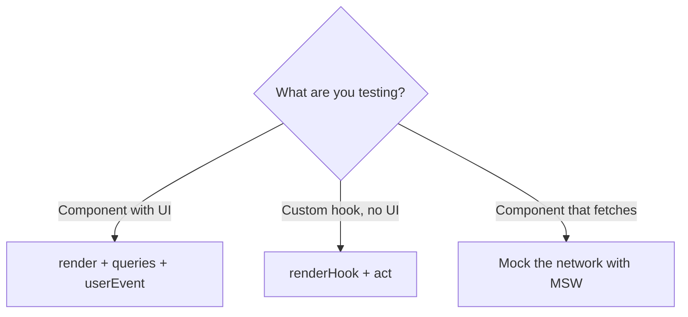

# Part 13 · Testing React

> Tests are what let you change code without fear. They catch regressions, document how components should behave, and make refactoring safe. This part teaches React testing the modern, effective way: **Vitest** as the test runner, **React Testing Library** for testing components the way users actually use them, and **Playwright** for end-to-end tests of whole user flows. The guiding principle throughout — *test behavior, not implementation* — is what separates tests that help from tests that break every time you touch the code.

## Table of Contents

1. [Why test, and the testing philosophy](#1-why-test-and-the-testing-philosophy)
2. [The testing pyramid](#2-the-testing-pyramid)
3. [Setting up Vitest](#3-setting-up-vitest)
4. [Your first component test](#4-your-first-component-test)
5. [Queries: finding elements the right way](#5-queries-finding-elements-the-right-way)
6. [Simulating user interactions](#6-simulating-user-interactions)
7. [Testing async, mocks, and hooks](#7-testing-async-mocks-and-hooks)
8. [End-to-end testing with Playwright](#8-end-to-end-testing-with-playwright)
9. [Mini-project: test the Todo app](#9-mini-project-test-the-todo-app)
10. [Exercises and practice problems](#10-exercises-and-practice-problems)
11. [Glossary](#11-glossary)

> **💡 Suggested learning order:** §1–2 set the philosophy that makes tests valuable instead of a burden. §3–7 are unit/integration testing (your daily testing). §8 (Playwright) is for critical end-to-end flows. The philosophy in §1 is the single most important idea.

---

## 1. Why test, and the testing philosophy

Tests give you **confidence to change code**. Without them, every refactor risks silently breaking something; with them, you edit freely and let the tests catch regressions. But *how* you test determines whether tests help or hinder.

The core principle, from React Testing Library's author Kent C. Dodds:

> **"The more your tests resemble the way your software is used, the more confidence they can give you."**

This means: **test behavior, not implementation.** Test what the *user* sees and does — "clicking Add shows the new todo" — not internal details like "the `todos` state array has length 3" or "the `handleAdd` method was called." Implementation-detail tests break every time you refactor (even when nothing user-facing changed); behavior tests survive refactors and catch real bugs.

🎯 **Analogy:** Testing a component by its rendered output and interactions is like testing an API by its HTTP requests and responses — you verify the *contract*, not the internal SQL queries. If you tested the internal query structure, every refactor would break your tests even though the API still works. Test the component's "API": what renders, and what happens when the user interacts.



> **🔍 Under the hood:** React Testing Library (RTL) deliberately gives you *no* access to component internals — no way to read state, call methods, or inspect props. This is by design: it forces you to test through the DOM (what users see) and events (what users do). The constraint is the feature — it makes it *hard* to write brittle implementation tests and *easy* to write resilient behavior tests.

> **⚠️ Common beginner mistake:** Testing implementation details — asserting on state values, checking that a specific function was called, or querying by CSS class/component internals. These tests break constantly and give false confidence. Always ask: "would a user care about this?" If not, don't assert on it.

**Key takeaways:**
- Tests give you confidence to refactor and catch regressions.
- Test **behavior** (what users see and do), not **implementation** (internal state/methods).
- The more tests resemble real usage, the more confidence they provide.

---

## 2. The testing pyramid

Not all tests are equal. The **testing pyramid** guides *how many* of each kind to write — many fast unit/integration tests, fewer slow end-to-end tests.



| Level | What it tests | Tool | Speed | How many |
| --- | --- | --- | --- | --- |
| **Unit** | Pure functions, single hooks | Vitest | ⚡ Fast | Some |
| **Integration** | Components + their interactions | Vitest + RTL | ⚡ Fast | **Many** |
| **E2E** | Full user journeys in a real browser | Playwright | 🐢 Slow | Few (critical paths) |

For React, the **integration level is the sweet spot** — testing a component (or a few together) through user interactions with RTL. These give the most confidence per test: they exercise real rendering and events, yet run fast in a simulated DOM.

🎯 **Analogy:** It's the same trade-off as backend testing: lots of fast unit/integration tests on your services, plus a handful of slow end-to-end tests hitting the real API for critical flows (login, checkout). You wouldn't E2E-test every edge case (too slow) or unit-test only (misses integration bugs). Balance the pyramid.

> **🔍 Under the hood:** RTL integration tests run in a *simulated* DOM (jsdom/happy-dom) — no real browser — so they're fast (milliseconds) and can run thousands in CI. Playwright tests launch a *real* browser (Chromium/Firefox/WebKit) and drive it like a user — accurate but slow (seconds each). The pyramid shape reflects this: maximize the fast, accurate-enough integration tests; reserve slow E2E for the few flows where "does it work in a real browser end-to-end?" truly matters.

> **⚠️ Common beginner mistake:** Inverting the pyramid — writing mostly slow E2E tests. They're brittle, slow, and hard to debug. Write mostly integration tests (RTL) and only E2E-test the handful of critical journeys (signup, checkout, the core workflow).

**Key takeaways:**
- Write many fast integration tests, some unit tests, few slow E2E tests.
- For React, component integration tests (RTL) give the best confidence-per-test.
- Don't invert the pyramid — E2E only for critical end-to-end journeys.

---

## 3. Setting up Vitest

**Vitest** is a fast, Vite-native test runner (the Jest equivalent for Vite projects). Paired with **React Testing Library** and **jsdom** (a simulated DOM), it's the standard React unit/integration setup.

```bash
npm install -D vitest @testing-library/react @testing-library/jest-dom @testing-library/user-event jsdom
```

Configure Vitest in your Vite config:

```js
// vite.config.js
import { defineConfig } from 'vitest/config'
import react from '@vitejs/plugin-react'

export default defineConfig({
  plugins: [react()],
  test: {
    globals: true,             // use describe/it/expect without importing
    environment: 'jsdom',      // simulate a browser DOM
    setupFiles: './src/test/setup.js',
  },
})
```

```js
// src/test/setup.js — extends expect with DOM matchers (toBeInTheDocument, etc.)
import '@testing-library/jest-dom'
```

Add a script to `package.json`:

```json
{ "scripts": { "test": "vitest", "test:ui": "vitest --ui" } }
```

Run `npm test` — Vitest watches your files and re-runs tests on change (like the dev server, but for tests).

> **🔍 Under the hood:** Vitest reuses your Vite config and transform pipeline, so it understands JSX, TypeScript, path aliases, and CSS imports with zero extra setup — a big advantage over Jest (which needs separate config). `jsdom` implements DOM APIs in Node, so RTL can "render" components and query the DOM without a real browser. `@testing-library/jest-dom` adds readable matchers like `toBeInTheDocument()` and `toBeDisabled()`.

> **⚠️ Common beginner mistake:** Forgetting the `setupFiles` with `@testing-library/jest-dom`, then getting "toBeInTheDocument is not a function." Also forgetting `environment: 'jsdom'`, so there's no `document` to render into. Both are one-time setup — get them right and forget them.

**Key takeaways:**
- Vitest is the Vite-native test runner; pair it with RTL and jsdom.
- Configure `environment: 'jsdom'` and a setup file importing `@testing-library/jest-dom`.
- `npm test` watches and re-runs — a fast feedback loop like the dev server.

---

## 4. Your first component test

A test **renders** a component, **queries** the DOM for what the user would see, and **asserts** on it. Here's the anatomy.

```jsx
// Counter.jsx
import { useState } from 'react'
export function Counter() {
  const [count, setCount] = useState(0)
  return (
    <div>
      <p>Count: {count}</p>
      <button onClick={() => setCount((c) => c + 1)}>Increment</button>
    </div>
  )
}
```

```jsx
// Counter.test.jsx
import { render, screen } from '@testing-library/react'
import userEvent from '@testing-library/user-event'
import { describe, it, expect } from 'vitest'
import { Counter } from './Counter'

describe('Counter', () => {
  it('starts at 0', () => {
    render(<Counter />)                                    // render into jsdom
    expect(screen.getByText('Count: 0')).toBeInTheDocument()  // query + assert
  })

  it('increments when the button is clicked', async () => {
    const user = userEvent.setup()
    render(<Counter />)

    await user.click(screen.getByRole('button', { name: 'Increment' }))  // interact

    expect(screen.getByText('Count: 1')).toBeInTheDocument()   // assert new behavior
  })
})
```

The **Arrange-Act-Assert** structure:
- **Arrange:** `render(<Counter />)` — put the component in the DOM.
- **Act:** `await user.click(...)` — simulate what the user does.
- **Assert:** `expect(...).toBeInTheDocument()` — verify what the user sees.

Notice: we never touch `count` state directly. We check the *rendered text* ("Count: 1") — testing behavior, exactly as §1 preaches.



> **🔍 Under the hood:** `render` mounts the component into a jsdom container. `screen` is a global query interface over that DOM. `userEvent` simulates realistic user interactions (it fires the full sequence of events a real click/type produces). Assertions with `expect` + jest-dom matchers check the DOM state. Everything happens in-memory in Node — no browser, milliseconds fast.

> **⚠️ Common beginner mistake:** Using the old `fireEvent` instead of `userEvent`. `fireEvent.click` dispatches a single raw event; `userEvent.click` simulates the *full* interaction (hover, mousedown, focus, mouseup, click) like a real user, catching more bugs. Always prefer `userEvent` (and `await` it — it's async).

**Key takeaways:**
- A test renders, queries the DOM, acts, and asserts (Arrange-Act-Assert).
- Assert on what the user sees (rendered text/roles), never on internal state.
- Use `userEvent` (async, realistic) over `fireEvent`.

---

## 5. Queries: finding elements the right way

RTL provides queries to find elements. *Which* query you use matters — RTL has a **priority order** that pushes you toward accessible, user-facing selectors (which also makes your app more accessible).

The priority (use the highest that fits):

| Priority | Query | Finds by | Example |
| --- | --- | --- | --- |
| 1 (best) | `getByRole` | Accessibility role + name | `getByRole('button', { name: 'Save' })` |
| 2 | `getByLabelText` | Form label | `getByLabelText('Email')` |
| 3 | `getByPlaceholderText` | Input placeholder | `getByPlaceholderText('Search')` |
| 4 | `getByText` | Visible text | `getByText('Welcome')` |
| 5 (last resort) | `getByTestId` | `data-testid` attribute | `getByTestId('cart-count')` |

```jsx
// ✅ Best — how a user (and screen reader) identifies it
screen.getByRole('button', { name: 'Submit' })
screen.getByRole('heading', { name: 'Dashboard' })
screen.getByLabelText('Password')

// ⚠️ Last resort — only when nothing accessible works
screen.getByTestId('chart-container')
```

**Query variants** — `getBy`, `queryBy`, `findBy` — each for a different situation:

| Variant | Returns | Use when |
| --- | --- | --- |
| `getBy...` | Element (throws if not found) | Element should exist now |
| `queryBy...` | Element or `null` (no throw) | Asserting something is **absent** |
| `findBy...` | Promise (waits for it) | Element appears **asynchronously** |

```jsx
expect(screen.getByText('Loaded')).toBeInTheDocument()          // exists now
expect(screen.queryByText('Error')).not.toBeInTheDocument()     // absent (no throw)
expect(await screen.findByText('Data arrived')).toBeInTheDocument()  // appears later (async)
```

🎯 **Analogy:** `getByRole` finds elements the way a *screen-reader user* does — by role and accessible name. So writing tests this way doubles as an accessibility check: if your test can't find the button by its role and name, neither can assistive technology. Good tests nudge you toward accessible markup for free.

> **🔍 Under the hood:** `getByRole` queries the DOM's *accessibility tree* — the same structure screen readers use. A `<button>Save</button>` has role `button` and accessible name `Save`. This is why RTL prioritizes it: it verifies the element is accessible *and* present. `findBy` is `getBy` + `waitFor` — it retries the query for a timeout (default 1s), resolving when the element appears (perfect for data that loads async).

> **⚠️ Common beginner mistake:** Reaching for `getByTestId` or querying by CSS class/DOM structure first. That's testing implementation and skips accessibility. Start at `getByRole`; drop down the priority list only when necessary. And using `getBy` to check absence (it throws) — use `queryBy` for "should NOT be there."

**Key takeaways:**
- Prefer `getByRole` (accessible, user-facing); `getByTestId` is a last resort.
- `getBy` = exists now, `queryBy` = check absence, `findBy` = wait for async appearance.
- Accessible queries double as accessibility checks.

---

## 6. Simulating user interactions

`userEvent` simulates realistic interactions — clicking, typing, selecting, tabbing. Always `setup()` it and `await` each action.

```jsx
import userEvent from '@testing-library/user-event'

it('submits the form with typed values', async () => {
  const user = userEvent.setup()
  const onSubmit = vi.fn()                           // a mock function (Vitest)
  render(<LoginForm onSubmit={onSubmit} />)

  await user.type(screen.getByLabelText('Email'), 'ada@x.com')   // type into a field
  await user.type(screen.getByLabelText('Password'), 'secret12')
  await user.click(screen.getByRole('button', { name: 'Sign in' }))

  expect(onSubmit).toHaveBeenCalledWith({ email: 'ada@x.com', password: 'secret12' })
})
```

The common interactions:

```jsx
await user.click(element)                        // click
await user.dblClick(element)                     // double-click
await user.type(input, 'hello')                  // type text
await user.clear(input)                          // clear a field
await user.keyboard('{Enter}')                   // press keys
await user.selectOptions(select, 'value')        // pick a select option
await user.tab()                                 // keyboard tab navigation
await user.upload(fileInput, file)               // file upload
```

**Mock functions** (`vi.fn()`) let you assert that callbacks were called correctly — useful for testing that a component calls its props at the right time:

```jsx
const onDelete = vi.fn()
render(<Item onDelete={onDelete} id="42" />)
await user.click(screen.getByRole('button', { name: 'Delete' }))
expect(onDelete).toHaveBeenCalledWith('42')      // verify the callback contract
expect(onDelete).toHaveBeenCalledTimes(1)
```

> **🔍 Under the hood:** `userEvent.type(input, 'hi')` dispatches the full event sequence for each character (keydown, keypress, input, keyup) — mirroring a real keyboard. This realism catches bugs that a single synthetic `fireEvent.change` would miss (e.g., a handler that only responds to `keydown`). `vi.fn()` creates a spy that records every call's arguments, so you can assert the exact contract between a component and its callback props.

> **⚠️ Common beginner mistake:** Forgetting to `await` `userEvent` actions (they're async) — assertions then run before the interaction finishes, causing flaky failures. Always `await user.click(...)`. And forgetting `userEvent.setup()` at the start of the test.

**Key takeaways:**
- Use `userEvent.setup()` and `await` every interaction (`click`, `type`, `selectOptions`).
- `vi.fn()` mock functions verify a component calls its callback props correctly.
- Realistic events catch bugs that raw single-event dispatch would miss.

---

## 7. Testing async, mocks, and hooks

Real components fetch data and use custom hooks. Here's how to test them.

**Async data + `findBy`** — wait for loaded content:

```jsx
it('shows the user after loading', async () => {
  render(<UserProfile userId="1" />)
  expect(screen.getByText('Loading…')).toBeInTheDocument()      // initial state
  expect(await screen.findByText('Ada Lovelace')).toBeInTheDocument()  // waits for fetch
})
```

**Mocking modules/network** — don't hit real APIs in tests. Mock the module, or use **MSW** (Mock Service Worker) to intercept network requests realistically:

```jsx
import { vi } from 'vitest'
import * as api from './api'

// Mock the api module's function.
vi.spyOn(api, 'fetchUser').mockResolvedValue({ id: '1', name: 'Ada Lovelace' })
```

MSW is the gold standard — it intercepts `fetch` at the network layer, so your component's real fetch code runs against fake responses:

```jsx
import { http, HttpResponse } from 'msw'
import { setupServer } from 'msw/node'

const server = setupServer(
  http.get('/api/users/:id', () => HttpResponse.json({ id: '1', name: 'Ada Lovelace' }))
)
beforeAll(() => server.listen())
afterEach(() => server.resetHandlers())
afterAll(() => server.close())
```

**Testing custom hooks** with `renderHook`:

```jsx
import { renderHook, act } from '@testing-library/react'
import { useCounter } from './useCounter'

it('increments', () => {
  const { result } = renderHook(() => useCounter(0))
  expect(result.current.count).toBe(0)
  act(() => result.current.increment())     // state updates wrapped in act()
  expect(result.current.count).toBe(1)
})
```



> **🔍 Under the hood:** `findBy` retries its query until the async content appears (or times out), so you don't manually `waitFor`. MSW intercepts requests at the network boundary, meaning your component's *actual* fetch/axios/Query code executes unchanged — the most realistic mocking (far better than stubbing `fetch` itself). `renderHook` renders a tiny test component that calls your hook, exposing its return via `result.current`; `act()` ensures state updates are flushed before you assert.

> **⚠️ Common beginner mistake:** Making real network calls in tests (slow, flaky, dependent on a server). Mock them — MSW is the best option because your real data-fetching code still runs. Also: testing a custom hook by rendering a component that uses it and inspecting the DOM, when `renderHook` tests the hook directly and more simply.

**Key takeaways:**
- Use `findBy` for async content; mock the network (MSW preferred — your fetch code still runs).
- Test custom hooks directly with `renderHook` + `act`, not through a component.
- Never hit real APIs in tests — mock at the network layer for realism.

---

## 8. End-to-end testing with Playwright

**Playwright** drives a *real browser* through complete user journeys — the top of the pyramid. Use it for a few critical flows (login, checkout, the core workflow) where you need to verify the whole app works together, including routing, real network, and real rendering.

```bash
npm init playwright@latest
```

```js
// e2e/todo.spec.js
import { test, expect } from '@playwright/test'

test('user can add and complete a todo', async ({ page }) => {
  await page.goto('http://localhost:5173')                       // real browser navigation

  // Add a todo
  await page.getByplaceholder('What needs doing?').fill('Buy milk')
  await page.getByRole('button', { name: 'Add' }).click()
  await expect(page.getByText('Buy milk')).toBeVisible()

  // Complete it
  await page.getByRole('checkbox').check()
  await expect(page.getByText('Buy milk')).toHaveCSS('text-decoration-line', 'line-through')
})
```

Playwright's API mirrors RTL (`getByRole`, `getByText`) — so the skills transfer. The difference: it runs against your *actual running app* in Chromium/Firefox/WebKit, testing everything end to end.

**RTL/Vitest vs Playwright — when to use which:**

| | RTL + Vitest (integration) | Playwright (E2E) |
| --- | --- | --- |
| Environment | jsdom (simulated) | Real browser |
| Speed | ⚡ Milliseconds | 🐢 Seconds |
| Scope | A component or few | The whole app + routing + network |
| Quantity | Many | Few (critical paths) |
| Catches | Component logic bugs | Integration/routing/build bugs |

> **🔍 Under the hood:** Playwright launches a real browser and controls it via the DevTools protocol — clicking, typing, navigating exactly as a user would, against your deployed or locally-served app. It auto-waits for elements to be actionable (visible, enabled) before interacting, which reduces flakiness. Because it's the real thing, it catches bugs unit/integration tests can't: broken routing, misconfigured builds, real-API contract mismatches, CSS that only breaks in a real browser.

> **⚠️ Common beginner mistake:** Trying to E2E-test every scenario. E2E tests are slow and more flaky than unit tests — reserve them for the handful of *critical* journeys. Test edge cases and component logic with fast RTL tests; use Playwright to confirm the big end-to-end flows work.

**Key takeaways:**
- Playwright drives a real browser through complete journeys (login, checkout, core flow).
- Its API mirrors RTL (`getByRole`), so skills transfer; it auto-waits to reduce flakiness.
- Use it for a *few* critical paths; use RTL for the many component-level tests.

---

## 9. Mini-project: test the Todo app

🏗️ Write a real test suite for your **Todo app** (Capstone #1) — unit tests for the `useTodos` hook, integration tests for the UI, and an E2E test for the core flow. This proves the whole pyramid on code you built.

```jsx
// src/hooks/useTodos.test.js — UNIT test the custom hook (Part 5)
import { renderHook, act } from '@testing-library/react'
import { describe, it, expect, beforeEach } from 'vitest'
import { useTodos } from './useTodos'

describe('useTodos', () => {
  beforeEach(() => localStorage.clear())   // isolate tests

  it('adds a todo', () => {
    const { result } = renderHook(() => useTodos())
    act(() => result.current.addTodo('Learn testing'))
    expect(result.current.todos).toHaveLength(1)
    expect(result.current.todos[0].text).toBe('Learn testing')
  })

  it('ignores empty todos', () => {
    const { result } = renderHook(() => useTodos())
    act(() => result.current.addTodo('   '))
    expect(result.current.todos).toHaveLength(0)
  })

  it('toggles done', () => {
    const { result } = renderHook(() => useTodos())
    act(() => result.current.addTodo('Task'))
    const id = result.current.todos[0].id
    act(() => result.current.toggleTodo(id))
    expect(result.current.todos[0].done).toBe(true)
  })
})
```

```jsx
// src/App.test.jsx — INTEGRATION test the UI (behavior, not internals)
import { render, screen } from '@testing-library/react'
import userEvent from '@testing-library/user-event'
import { describe, it, expect, beforeEach } from 'vitest'
import App from './App'

describe('Todo app', () => {
  beforeEach(() => localStorage.clear())

  it('adds a todo through the form', async () => {
    const user = userEvent.setup()
    render(<App />)

    await user.type(screen.getByPlaceholderText('What needs doing?'), 'Buy milk')
    await user.click(screen.getByRole('button', { name: 'Add' }))

    expect(screen.getByText('Buy milk')).toBeInTheDocument()
  })

  it('completes a todo when its checkbox is checked', async () => {
    const user = userEvent.setup()
    render(<App />)
    await user.type(screen.getByPlaceholderText('What needs doing?'), 'Task')
    await user.click(screen.getByRole('button', { name: 'Add' }))

    await user.click(screen.getByRole('checkbox'))

    expect(screen.getByText('Task')).toHaveStyle('text-decoration: line-through')
  })

  it('does not add an empty todo', async () => {
    const user = userEvent.setup()
    render(<App />)
    // Button disabled when input empty (or nothing happens on submit)
    expect(screen.getByRole('button', { name: 'Add' })).toBeDisabled()
  })
})
```

```js
// e2e/todo.spec.js — E2E the core flow (one critical journey)
import { test, expect } from '@playwright/test'

test('add, complete, and filter todos', async ({ page }) => {
  await page.goto('http://localhost:5173')
  await page.getByplaceholder('What needs doing?').fill('Ship the app')
  await page.getByRole('button', { name: 'Add' }).click()
  await expect(page.getByText('Ship the app')).toBeVisible()
  await page.getByRole('checkbox').check()
  await page.getByRole('button', { name: 'done' }).click()
  await expect(page.getByText('Ship the app')).toBeVisible()
})
```

**The pyramid, realized on your own app:**

```cards
Unit :: useTodos logic (add/toggle/empty) via renderHook — fast, isolated.
Integration :: App UI through user interactions — the bulk of the value.
E2E :: one core journey in a real browser via Playwright.
Behavior-focused :: every assertion is on what the user sees, never internal state.
```

> **💡 Tip:** Notice the integration tests never check `todos.length` in state — they check that "Buy milk" *appears on screen*. That's the §1 principle in action: if you later refactor `useTodos` (say, to `useReducer`), these tests still pass, because the user-facing behavior is unchanged. That resilience is the whole point.

**Extend it (do at least three):**
1. Test the filter buttons (add active + done todos, filter, assert visibility).
2. Test "Clear completed" removes done todos but keeps active ones.
3. Test that todos persist: render, add, unmount, re-render, assert they're still there.
4. Add an MSW-mocked version if you wire the Todo app to a real API.
5. Add a Playwright test for editing a todo (double-click → type → Enter).

**Key takeaways:**
- You built the full pyramid on real code: unit (hook), integration (UI), E2E (journey).
- Every assertion targets user-visible behavior, so tests survive refactors.
- This suite lets you change the Todo app fearlessly — the entire point of testing.

---

## 10. Exercises and practice problems

### 🧪 Warm-ups (easy)

**E1.** Write a test that a `<Greeting name="Ada" />` renders "Hello, Ada".

<details><summary>Show solution</summary>

```jsx
render(<Greeting name="Ada" />)
expect(screen.getByText('Hello, Ada')).toBeInTheDocument()
```

*Why:* Render + query by visible text + assert (§4).
</details>

**E2.** Which query finds a button labeled "Delete"? Which checks that an error message is *absent*?

<details><summary>Show solution</summary>

Button: `screen.getByRole('button', { name: 'Delete' })`. Absent: `expect(screen.queryByText('Error')).not.toBeInTheDocument()` (use `queryBy` for absence). *(§5)*
</details>

### 🧪 Core (medium)

**E3.** Test that clicking a toggle button shows then hides a paragraph.

<details><summary>Show solution</summary>

```jsx
const user = userEvent.setup()
render(<Toggle />)
await user.click(screen.getByRole('button'))
expect(screen.getByText('Now you see me.')).toBeInTheDocument()
await user.click(screen.getByRole('button'))
expect(screen.queryByText('Now you see me.')).not.toBeInTheDocument()
```

*Why:* `getBy` for presence, `queryBy` for absence after hiding (§5–6).
</details>

**E4.** Test that a form calls `onSubmit` with the typed email.

<details><summary>Show solution</summary>

```jsx
const onSubmit = vi.fn()
const user = userEvent.setup()
render(<EmailForm onSubmit={onSubmit} />)
await user.type(screen.getByLabelText('Email'), 'a@b.com')
await user.click(screen.getByRole('button', { name: 'Submit' }))
expect(onSubmit).toHaveBeenCalledWith({ email: 'a@b.com' })
```

*Why:* Mock fn + typed interaction + contract assertion (§6).
</details>

**E5.** Test an async component that shows "Loading…" then the fetched title. Mock the fetch.

<details><summary>Show solution</summary>

```jsx
vi.spyOn(api, 'getPost').mockResolvedValue({ title: 'Hello' })
render(<Post id="1" />)
expect(screen.getByText('Loading…')).toBeInTheDocument()
expect(await screen.findByText('Hello')).toBeInTheDocument()
```

*Why:* `findBy` waits for async content; the module is mocked (§7).
</details>

### 🧪 Challenge (hard)

**E6.** Test the `useCounter` hook (increment, decrement, reset) with `renderHook`.

<details><summary>Show solution</summary>

```jsx
const { result } = renderHook(() => useCounter(5))
act(() => result.current.increment())
expect(result.current.count).toBe(6)
act(() => result.current.reset())
expect(result.current.count).toBe(5)
```

*Why:* Test the hook directly; wrap state changes in `act` (§7).
</details>

**E7.** Rewrite this brittle implementation test as a behavior test.

```jsx
// Brittle: expect(wrapper.state('isOpen')).toBe(true)
```

<details><summary>Show solution</summary>

```jsx
await user.click(screen.getByRole('button', { name: 'Open' }))
expect(screen.getByRole('dialog')).toBeInTheDocument()   // user-visible outcome
```

*Why:* Assert the visible result (dialog appears), not internal state (§1).
</details>

**E8 (capstone step).** Write a test suite for your **Contacts Manager** (Parts 8–12): unit-test the `api`/hooks, integration-test create/delete flows (mock the store), and one Playwright E2E for "add a contact, see it in the list, open it, delete it." Keep it — Part 14 refines the architecture these tests protect.

<details><summary>Show hint</summary>

Mock the `api` store module with `vi.spyOn`. Integration-test `ContactList` (renders contacts), `NewContact` (submitting calls `api.create` + navigates — wrap in a `MemoryRouter` and `QueryClientProvider` test wrapper). For E2E, script the full journey in Playwright. Create a reusable `renderWithProviders` helper that wraps components in the router + query client.
</details>

---

## 11. Glossary

| Term | Meaning |
| --- | --- |
| **Vitest** | The Vite-native test runner (Jest equivalent). |
| **React Testing Library (RTL)** | Library for testing components via the DOM, as users use them. |
| **jsdom** | A simulated browser DOM for running tests in Node. |
| **`render`** | Mounts a component into the test DOM. |
| **`screen`** | The query interface over the rendered DOM. |
| **`getByRole` / `findByRole`** | Query by accessibility role (preferred); `findBy` waits for async. |
| **`userEvent`** | Simulates realistic user interactions (click, type). |
| **`vi.fn()`** | A mock function that records calls (for asserting callbacks). |
| **MSW** | Mock Service Worker — intercepts network requests for realistic mocking. |
| **`renderHook`** | Tests a custom hook directly, exposing its return value. |
| **Playwright** | End-to-end testing in a real browser. |
| **Testing pyramid** | Many unit/integration tests, few slow E2E tests. |

---

> **Your app is now protected by tests** that give you the confidence to change it — and they test behavior, so they survive refactors. You've built, styled, optimized, typed, and tested real apps. The final craft skills tie it together: patterns and architecture for code that scales.
>
> **Next:** [Part 14 · Patterns and Architecture →](14-patterns-architecture.md)
