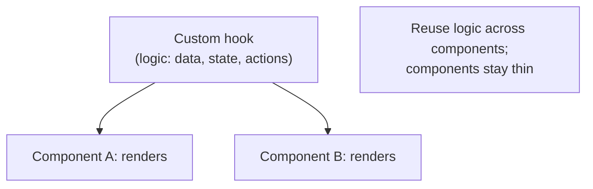
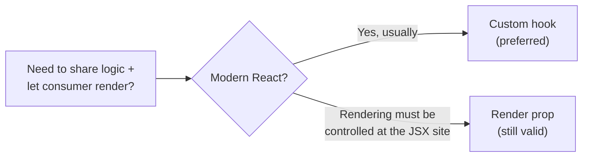
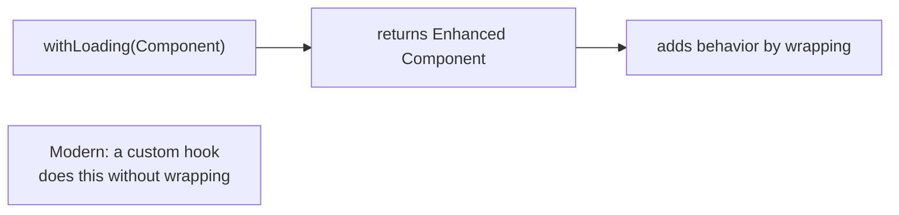
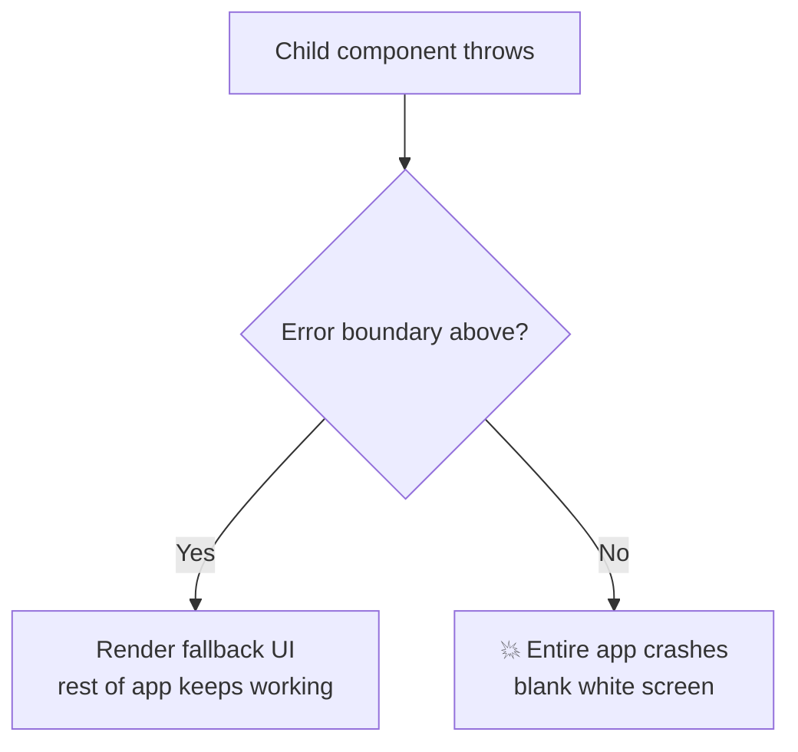
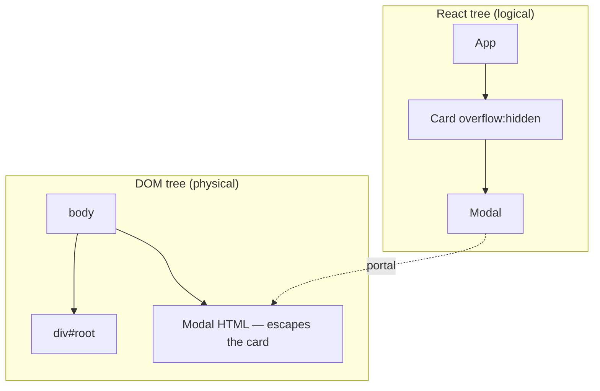
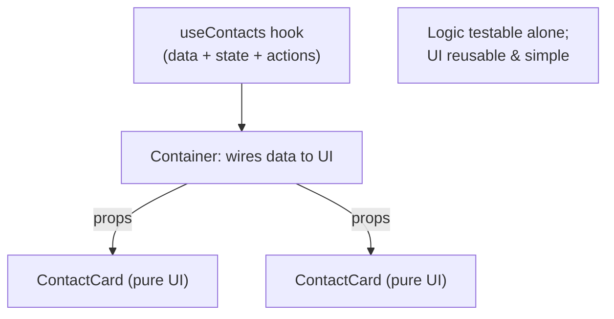

# Part 14 · Patterns and Architecture

> You can now build, style, optimize, type, and test React apps. This part is about writing React that *scales* — the patterns senior engineers reach for and the architecture that keeps a growing codebase maintainable. You'll learn the classic component patterns (compound components, render props, HOCs), error boundaries, portals, and — most importantly — how to *structure* a real project so it stays understandable at 10,000 lines. These are the skills that separate a working app from a professional one.

## Table of Contents

1. [Custom hooks as the primary pattern](#1-custom-hooks-as-the-primary-pattern)
2. [Compound components](#2-compound-components)
3. [Render props and function-as-children](#3-render-props-and-function-as-children)
4. [Higher-order components](#4-higher-order-components)
5. [Error boundaries](#5-error-boundaries)
6. [Portals](#6-portals)
7. [Project structure and architecture](#7-project-structure-and-architecture)
8. [Container/presentational and separation of concerns](#8-containerpresentational-and-separation-of-concerns)
9. [Mini-project: a compound Modal and app architecture](#9-mini-project-a-compound-modal-and-app-architecture)
10. [Exercises and practice problems](#10-exercises-and-practice-problems)
11. [Glossary](#11-glossary)

> **💡 Suggested learning order:** §1 (custom hooks) is the pattern you'll use most — it's the modern default. §2–4 are component patterns (compound components especially). §5–6 are essential production tools. §7–8 (architecture) are what keep large apps sane.

---

## 1. Custom hooks as the primary pattern

You learned custom hooks in Part 5. Here's the architectural point: **custom hooks are the primary way to share and organize logic in modern React.** Most problems that older patterns (render props, HOCs) solved are now solved more cleanly with hooks. When you have logic to reuse, reach for a custom hook first.

🎯 **Analogy:** Custom hooks are to React what well-named service functions are to backend code. You don't repeat a database query in ten places; you extract `getUserById()` and call it. Custom hooks do the same for *stateful* logic — `useUser(id)`, `useForm()`, `useMediaQuery()` — packaging behavior behind a clean, reusable API and keeping components focused on rendering.

The pattern for organizing a feature: **logic in hooks, UI in components.**

```jsx
// The hook owns ALL the logic — data, state, actions.
function useContacts() {
  const { data: contacts = [], isLoading } = useQuery({ queryKey: ['contacts'], queryFn: api.list })
  const qc = useQueryClient()
  const remove = useMutation({ mutationFn: api.remove, onSuccess: () => qc.invalidateQueries({ queryKey: ['contacts'] }) })
  return { contacts, isLoading, removeContact: remove.mutate }
}

// The component is thin — just rendering, no logic.
function ContactList() {
  const { contacts, isLoading, removeContact } = useContacts()
  if (isLoading) return <Spinner />
  return <ul>{contacts.map((c) => <ContactRow key={c.id} contact={c} onDelete={removeContact} />)}</ul>
}
```

This separation makes logic **testable in isolation** (Part 13's `renderHook`), **reusable** across components, and keeps components readable. It's the foundation of the architecture in §7–8.



> **🔍 Under the hood:** Because a custom hook is just a function calling hooks (Part 5), extracting logic into one has *zero* runtime overhead — it inlines into the component's hook sequence. So there's no cost to splitting a big component's logic into several focused hooks (`useContactForm`, `useContactFilters`, `useContactSelection`). This composability — small hooks combining into feature hooks — is how large React features stay organized.

> **⚠️ Common beginner mistake:** Cramming all logic directly into components, producing 300-line components mixing fetching, state, derived values, and JSX. Extract logic into custom hooks: the component should read like a description of the UI, delegating "how" to hooks.

**Key takeaways:**
- Custom hooks are the primary modern pattern for sharing and organizing logic.
- Put logic in hooks, rendering in components — testable, reusable, readable.
- Compose small hooks into feature hooks; there's no runtime cost to splitting.

---

## 2. Compound components

**Compound components** are a set of components that work together to form one cohesive unit, sharing state implicitly — like `<select>` and `<option>` in HTML. You saw the idea in Part 2 (Dialog). It's the go-to pattern for flexible, composable UI widgets (tabs, accordions, menus, modals).

The consumer composes the pieces; the parent shares state via context so the children coordinate without prop drilling:

```jsx
import { createContext, useContext, useState } from 'react'

const TabsContext = createContext(null)

// Parent: holds the shared state, provides it to children.
function Tabs({ children, defaultTab }) {
  const [active, setActive] = useState(defaultTab)
  return <TabsContext.Provider value={{ active, setActive }}>{children}</TabsContext.Provider>
}

// Children read the shared context — no props threaded by the consumer.
function TabList({ children }) { return <div className="tab-list">{children}</div> }

function Tab({ id, children }) {
  const { active, setActive } = useContext(TabsContext)
  return (
    <button className={active === id ? 'active' : ''} onClick={() => setActive(id)}>
      {children}
    </button>
  )
}

function TabPanel({ id, children }) {
  const { active } = useContext(TabsContext)
  return active === id ? <div className="tab-panel">{children}</div> : null
}

// Attach children as properties for a clean namespaced API.
Tabs.List = TabList
Tabs.Tab = Tab
Tabs.Panel = TabPanel
```

The consumer API is clean and flexible — arrange the pieces however they like:

```jsx
<Tabs defaultTab="profile">
  <Tabs.List>
    <Tabs.Tab id="profile">Profile</Tabs.Tab>
    <Tabs.Tab id="settings">Settings</Tabs.Tab>
  </Tabs.List>
  <Tabs.Panel id="profile"><ProfileForm /></Tabs.Panel>
  <Tabs.Panel id="settings"><SettingsForm /></Tabs.Panel>
</Tabs>
```

🎯 **Analogy:** Compound components are like `<select><option>` — the pieces are meaningless alone but powerful together, and the parent coordinates them invisibly. The consumer doesn't wire up `active`/`onClick` for each tab; they just declare the structure, and the components handle the shared state internally. This gives *both* flexibility (arrange freely) and simplicity (no prop wiring).

> **🔍 Under the hood:** The shared state lives in the parent (`Tabs`) and flows to children via **context** (Part 5) — that's the "implicit" sharing. Attaching children as static properties (`Tabs.List = TabList`) is just namespacing for a nice API; they're ordinary components. This pattern shines when a widget has multiple coordinated parts and you want consumers to control layout without a prop explosion (the alternative Part 2 warned against).

> **⚠️ Common beginner mistake:** Building a `<Tabs tabs={[...]} />` mega-component with a big config prop, which is rigid (can't customize a single tab's rendering). Compound components trade a little more consumer code for far more flexibility. Use them for reusable widgets with coordinated parts.

**Key takeaways:**
- Compound components form one unit from cooperating pieces sharing state via context.
- The consumer composes the parts freely; state coordination is internal (`<select>`-like).
- Ideal for flexible reusable widgets: tabs, accordions, menus, modals.

---

## 3. Render props and function-as-children

A **render prop** is a prop whose value is a *function that returns JSX* — letting a component share data/behavior while the consumer controls rendering. You met a form of this in Part 2 (`renderItem`). It's more explicit than compound components and useful when a component provides *logic/data* but shouldn't dictate the *look*.

```jsx
// A component that tracks the mouse and lets the CONSUMER decide what to render.
function MouseTracker({ render }) {
  const [pos, setPos] = useState({ x: 0, y: 0 })
  return (
    <div onMouseMove={(e) => setPos({ x: e.clientX, y: e.clientY })} style={{ height: '100vh' }}>
      {render(pos)}      {/* hand the data to the consumer's function */}
    </div>
  )
}

// The consumer controls rendering with the data provided:
<MouseTracker render={({ x, y }) => <p>Mouse at {x}, {y}</p>} />
<MouseTracker render={({ x, y }) => <Cat x={x} y={y} />} />   // same logic, different UI
```

The **function-as-children** variant passes the function as `children` (common with data-fetching components):

```jsx
<DataFetcher url="/api/user">
  {({ data, loading }) => (loading ? <Spinner /> : <Profile user={data} />)}
</DataFetcher>
```

**Render props vs custom hooks** — important: in modern React, a **custom hook usually replaces a render prop** more cleanly. `MouseTracker` is better as `useMousePosition()`:

```jsx
// The hook version — cleaner, no wrapper component, no nesting.
function useMousePosition() {
  const [pos, setPos] = useState({ x: 0, y: 0 })
  useEffect(() => {
    const handler = (e) => setPos({ x: e.clientX, y: e.clientY })
    window.addEventListener('mousemove', handler)
    return () => window.removeEventListener('mousemove', handler)
  }, [])
  return pos
}
// const { x, y } = useMousePosition()   ← so much simpler
```



> **🔍 Under the hood:** Render props were the dominant logic-sharing pattern *before* hooks (2016–2018). Hooks (2019) made most render-prop use cases obsolete because a hook shares logic *without* adding a wrapper component or nesting your JSX. Render props still have niches — when the shared thing must render *at a specific JSX location* the consumer controls, or in class-based/older code — but for new code, try a hook first.

> **⚠️ Common beginner mistake:** Reaching for render props out of habit or old tutorials, creating "wrapper hell" (deeply nested render-prop components). Prefer a custom hook, which flattens the structure. Recognize render props (you'll see them in libraries), but default to hooks.

**Key takeaways:**
- A render prop is a function prop returning JSX, letting the consumer control rendering.
- In modern React, a **custom hook usually replaces a render prop** more cleanly.
- Know render props (libraries use them), but default to hooks for new code.

---

## 4. Higher-order components

A **higher-order component (HOC)** is a function that takes a component and returns a new, enhanced component — a way to reuse logic by wrapping. It's the oldest sharing pattern (think `connect()` from old Redux). Like render props, **hooks have largely replaced HOCs** — but you'll encounter them, so understand the concept.

```jsx
// An HOC: takes a component, returns it wrapped with extra behavior.
function withLoading(Component) {
  return function WithLoading({ isLoading, ...props }) {
    if (isLoading) return <Spinner />
    return <Component {...props} />       // forward the rest of the props
  }
}

// Usage — wrap a component to add loading behavior:
const UserListWithLoading = withLoading(UserList)
<UserListWithLoading isLoading={loading} users={users} />
```

HOCs "decorate" a component with reusable behavior (loading, auth, logging, theming). The classic example is Redux's old `connect(mapState)(Component)`.

**Why hooks replaced them** — the same logic as a hook is flatter and clearer:

```jsx
// Hook version — no wrapping, no prop-forwarding gymnastics.
function UserList({ users }) {
  const isLoading = useLoadingState()   // or just receive isLoading and branch
  if (isLoading) return <Spinner />
  return <ul>{users.map(...)}</ul>
}
```



> **🔍 Under the hood:** HOCs suffer from real problems hooks avoid: **wrapper hell** (nested `withA(withB(withC(Component)))` deepens the tree), **prop collisions** (two HOCs injecting a prop with the same name), and **unclear prop origins** (where did `isLoading` come from?). Hooks share logic *without* adding components to the tree, so none of these issues arise. This is precisely why the React team introduced hooks and why new code rarely uses HOCs.

> **⚠️ Common beginner mistake:** Writing new HOCs when a hook would be simpler and clearer. HOCs are largely legacy — recognize them (React Router, some libraries still use them), but don't reach for them in new code. If you're wrapping a component to add behavior, a hook almost always does it better.

**Key takeaways:**
- An HOC wraps a component to add reusable behavior (`withLoading(Component)`).
- Hooks have largely replaced HOCs, avoiding wrapper hell and prop collisions.
- Recognize HOCs in existing code; prefer hooks for new logic sharing.

---

## 5. Error boundaries

By default, a JavaScript error during rendering **crashes your entire React app** — a blank white screen. An **error boundary** is a component that *catches* errors in its subtree and renders a fallback UI instead, isolating failures. Every production app needs them.

Error boundaries must currently be **class components** (the one place you still write a class), because they use lifecycle methods hooks don't yet expose:

```jsx
import { Component } from 'react'

class ErrorBoundary extends Component {
  state = { hasError: false }

  // Called when a child throws — update state to show the fallback.
  static getDerivedStateFromError(error) {
    return { hasError: true }
  }

  // Called with error details — log to your monitoring service (Part 15).
  componentDidCatch(error, errorInfo) {
    logToService(error, errorInfo)
  }

  render() {
    if (this.state.hasError) {
      return this.props.fallback ?? <p>Something went wrong.</p>
    }
    return this.props.children
  }
}
```

Wrap parts of your app so a failure in one section doesn't take down everything:

```jsx
<ErrorBoundary fallback={<AppCrashPage />}>
  <App />
</ErrorBoundary>

// Or granularly — a broken widget doesn't crash the whole page:
<Dashboard>
  <ErrorBoundary fallback={<WidgetError />}><RevenueChart /></ErrorBoundary>
  <ErrorBoundary fallback={<WidgetError />}><ActivityFeed /></ErrorBoundary>
</Dashboard>
```

In practice, most teams use the **`react-error-boundary`** library, which wraps this in a hook-friendly API with reset support:

```jsx
import { ErrorBoundary } from 'react-error-boundary'
<ErrorBoundary FallbackComponent={ErrorFallback} onReset={refetch}>
  <MyComponent />
</ErrorBoundary>
```



> **🔍 Under the hood:** When a component throws during render, React unwinds up the tree looking for the nearest error boundary; it renders that boundary's fallback and *unmounts* the broken subtree, keeping the rest of the app alive. `getDerivedStateFromError` sets the fallback state; `componentDidCatch` receives the error for logging. Note: error boundaries catch errors in *rendering*, not in event handlers or async code (use try/catch there) — and they pair with Suspense (Part 11) for a complete loading+error story.

> **⚠️ Common beginner mistake:** Having *no* error boundaries, so one bad component (a null-access bug) whites out the entire app in production. At minimum, wrap your app root; better, wrap major sections so failures stay isolated. Also expecting boundaries to catch event-handler errors — those need try/catch.

**Key takeaways:**
- Error boundaries catch render errors in their subtree and show a fallback, preventing full crashes.
- They must be class components (or use `react-error-boundary`); place them at the root and around risky sections.
- They catch *render* errors, not event-handler/async errors (use try/catch there).

---

## 6. Portals

A **portal** renders a component's output into a *different* part of the DOM tree — outside its parent — while keeping it in the React tree (so props, context, and events still work). It's the fix for modals, tooltips, and dropdowns that must escape a parent's `overflow: hidden` or `z-index` stacking.

```jsx
import { createPortal } from 'react-dom'

function Modal({ children, onClose }) {
  // Render into document.body, NOT the parent DOM node.
  return createPortal(
    <div className="overlay" onClick={onClose}>
      <div className="modal" onClick={(e) => e.stopPropagation()}>
        {children}
      </div>
    </div>,
    document.body       // the DOM target — escapes any parent clipping/stacking
  )
}
```

Even though `<Modal>` might be declared deep inside a card with `overflow: hidden`, its DOM lands directly in `<body>`, so it can cover the whole screen and stack above everything.

🎯 **Analogy:** A portal is like a *teleporter* for DOM output. In your React code, the `<Modal>` lives inside `<Card>` (so it inherits context, gets props, bubbles events to React parents). But its actual HTML materializes in `<body>`, escaping the card's CSS box. It's "logically here, physically there."



> **🔍 Under the hood:** `createPortal(children, domNode)` tells React to *commit* those children into `domNode` instead of the parent's DOM position — but they remain part of the React tree at their declared location. So context (Part 5) still flows in, event bubbling still reaches React ancestors (even though the DOM parent differs!), and state works normally. This "React-tree vs DOM-tree" split is exactly what modals need: logical containment, physical freedom from CSS clipping.

> **⚠️ Common beginner mistake:** Building modals *without* portals, then fighting `z-index` and `overflow: hidden` from ancestor elements clipping or hiding the modal. Portals eliminate that entire class of CSS headaches. Also forgetting keyboard/focus management (trap focus, close on Escape) — portals handle DOM placement, not accessibility, which you must add.

**Key takeaways:**
- Portals render output into a different DOM node (e.g., `document.body`) while staying in the React tree.
- Use them for modals, tooltips, dropdowns that must escape parent `overflow`/`z-index`.
- Context and event bubbling still follow the React tree, not the DOM position.

---

## 7. Project structure and architecture

How you *organize files* determines whether a growing app stays navigable. There's no single right answer, but there are clearly better and worse approaches. The key shift: **organize by feature, not by file type.**

**❌ Type-based (breaks down as the app grows)** — everything of a kind lumped together:

```
src/
├─ components/     (100 components from every feature, mixed together)
├─ hooks/          (every hook)
├─ utils/
└─ pages/
```

Finding everything related to "contacts" means hunting across many folders. It doesn't scale.

**✅ Feature-based (scales)** — group everything for a feature together:

```
src/
├─ features/
│  ├─ contacts/
│  │  ├─ components/      (ContactList, ContactCard, ContactForm)
│  │  ├─ hooks/           (useContacts, useContactForm)
│  │  ├─ api.js           (contacts data access)
│  │  └─ types.ts
│  └─ auth/
│     ├─ components/
│     ├─ hooks/
│     └─ api.js
├─ components/ui/         (SHARED design system: Button, Input, Modal)
├─ hooks/                 (SHARED generic hooks: useLocalStorage, useToggle)
├─ lib/                   (config: queryClient, router, api client)
└─ App.tsx
```

Everything about a feature lives in one folder — its components, hooks, data, and types. Shared, cross-feature code (the design system, generic hooks) lives in top-level `components/ui` and `hooks`.

🎯 **Analogy:** Type-based folders are like organizing a company by "all managers in one building, all engineers in another, all designers in a third" — collaboration requires constant cross-building trips. Feature-based is like cross-functional *teams*: everyone working on Contacts sits together. As the org (app) grows, the team structure scales; the role-based structure doesn't.

The architectural principles:

```cards
Feature folders :: co-locate everything for a feature; delete a feature = delete a folder.
Shared UI layer :: a design system (components/ui) used across features.
Data access isolated :: each feature's api.js; swap the backend without touching UI.
Logic in hooks :: features expose hooks; components stay thin (§1, §8).
Clear boundaries :: features don't reach into each other's internals.
```

> **🔍 Under the hood:** Feature-based structure enforces **cohesion** (related code together) and **loose coupling** (features are independent). This mirrors good backend architecture (bounded contexts / modules). It makes onboarding easier ("where's the contacts code?" → `features/contacts/`), refactoring safer (changes are localized), and deletion clean (remove a feature by removing its folder). The shared `ui`/`hooks`/`lib` layers hold genuinely cross-cutting code.

> **⚠️ Common beginner mistake:** Starting with type-based folders (fine for a tiny app) and never restructuring as it grows — ending with a `components/` folder of 200 unrelated files. Switch to feature-based as soon as you have more than one real feature. Also: over-engineering structure on day one — start simple, refactor toward features as complexity demands.

**Key takeaways:**
- Organize by **feature**, not file type — everything for a feature in one folder.
- Keep a shared UI/design-system layer and shared generic hooks separately.
- Feature structure scales: high cohesion, loose coupling, easy onboarding and deletion.

---

## 8. Container/presentational and separation of concerns

A durable architectural idea: separate components that **manage logic/data** from those that **render UI**. Modern React expresses this with **hooks (logic) + presentational components (UI)** rather than the old "container component" wrapper — but the principle is the same and vital.

```jsx
// PRESENTATIONAL: pure UI, all data via props, no fetching/state logic. Easy to test & reuse.
function ContactCard({ contact, onDelete }) {
  return (
    <div className="card">
      <h3>{contact.name}</h3>
      <p>{contact.email}</p>
      <button onClick={() => onDelete(contact.id)}>Delete</button>
    </div>
  )
}

// LOGIC (via hook) + thin container: fetches, manages state, delegates rendering.
function ContactListContainer() {
  const { contacts, isLoading, removeContact } = useContacts()   // logic in the hook
  if (isLoading) return <Spinner />
  return (
    <ul>
      {contacts.map((c) => (
        <ContactCard key={c.id} contact={c} onDelete={removeContact} />  // pure UI
      ))}
    </ul>
  )
}
```

**Why separate them:**
- **Presentational components** are trivial to test (just props → output), reuse (in Storybook, other pages), and reason about (no side effects).
- **Logic** lives in hooks/containers, testable in isolation (Part 13's `renderHook`).



🎯 **Analogy:** This is the frontend version of separating your *business logic layer* from your *view/serialization layer* on the backend. The presentational component is the view template — dumb, reusable, given data. The hook is the service — it knows *how* to get and change data. Mixing them (fetching inside a deeply-styled component) is like putting SQL queries in your HTML templates: it works, but it's untestable and unmaintainable.

> **🔍 Under the hood:** The value is **testability and reuse**. A pure `ContactCard` needs no mocks — pass props, assert output (Part 13). The `useContacts` hook is tested with `renderHook`. Combined in the container, they form the feature. This separation also enables design-system work: presentational components can be developed and previewed in isolation (Storybook) without any backend. It's the same "logic in hooks, UI in components" theme from §1, stated as an architecture.

> **⚠️ Common beginner mistake:** Building components that both fetch data *and* render deeply-styled UI *and* manage complex state — untestable, unreusable monoliths. Keep presentational components pure (props in, JSX out) and push logic into hooks. You don't need a rigid "container for everything," but keep the *separation of concerns*.

**Key takeaways:**
- Separate logic (hooks/containers) from presentation (pure, props-driven components).
- Pure presentational components are easy to test, reuse, and preview in isolation.
- It's the frontend echo of separating business logic from the view layer.

---

## 9. Mini-project: a compound Modal and app architecture

🏗️ Two deliverables: build a **compound, portal-based Modal** (combining §2, §6), and **restructure your Contacts Manager** into a feature-based architecture (§7–8). These are the capstone-quality refinements that make an app professional.

**Part A — a reusable compound Modal with a portal:**

```jsx
// src/components/ui/Modal.jsx
import { createContext, useContext, useState } from 'react'
import { createPortal } from 'react-dom'

const ModalContext = createContext(null)

export function Modal({ children }) {
  const [open, setOpen] = useState(false)
  return <ModalContext.Provider value={{ open, setOpen }}>{children}</ModalContext.Provider>
}

// A trigger the consumer places anywhere.
Modal.Trigger = function Trigger({ children }) {
  const { setOpen } = useContext(ModalContext)
  return <span onClick={() => setOpen(true)}>{children}</span>
}

// The content — portaled to body, escaping any parent clipping (§6).
Modal.Content = function Content({ children }) {
  const { open, setOpen } = useContext(ModalContext)
  if (!open) return null
  return createPortal(
    <div className="overlay" onClick={() => setOpen(false)}
      style={{ position: 'fixed', inset: 0, background: 'rgba(0,0,0,.5)', display: 'grid', placeItems: 'center' }}>
      <div onClick={(e) => e.stopPropagation()}
        style={{ background: 'var(--card, #fff)', padding: 24, borderRadius: 16, minWidth: 320 }}>
        {children}
        <button onClick={() => setOpen(false)}>Close</button>
      </div>
    </div>,
    document.body
  )
}
```

```jsx
// Clean, flexible consumer API — compound components + portal, invisibly:
<Modal>
  <Modal.Trigger><button>Delete contact</button></Modal.Trigger>
  <Modal.Content>
    <h2>Are you sure?</h2>
    <p>This cannot be undone.</p>
    <button onClick={handleDelete}>Yes, delete</button>
  </Modal.Content>
</Modal>
```

**Part B — restructure Contacts Manager into features:**

```
src/
├─ features/
│  └─ contacts/
│     ├─ components/
│     │  ├─ ContactList.jsx        (presentational)
│     │  ├─ ContactCard.jsx        (presentational)
│     │  └─ ContactForm.jsx        (presentational, reused by New + Edit)
│     ├─ hooks/
│     │  └─ useContacts.js         (all data logic — query + mutations)
│     └─ api.js                    (data access — the localStorage store)
├─ components/ui/                   (SHARED design system)
│  ├─ Button.jsx  Input.jsx  Modal.jsx  Field.jsx
├─ hooks/
│  └─ useLocalStorage.js           (shared generic hook, from Part 5)
├─ lib/
│  ├─ queryClient.js               (TanStack Query config)
│  └─ router.jsx                   (route definitions)
└─ App.jsx
```

**Every Part 14 concept, applied:**

```cards
Compound components :: Modal.Trigger + Modal.Content share state via context (§2).
Portal :: Modal.Content escapes to document.body — no z-index fights (§6).
Custom hooks :: useContacts owns all logic; components stay thin (§1, §8).
Presentational :: ContactCard/List are pure props-in-JSX-out — reusable & testable (§8).
Feature architecture :: everything contacts-related in one folder (§7).
Error boundary :: wrap the app (and the modal-triggering actions) to isolate failures (§5).
```

> **💡 Tip:** After this refactor, adding a new feature (say, "companies") means creating `features/companies/` with the same structure — no hunting through shared folders. And the `Modal`, `Button`, `Field` in `components/ui` serve *every* feature. This is exactly how professional React codebases are organized; it's the architecture that keeps a 50,000-line app understandable.

**Extend it (do at least three):**
1. Wrap the app in an `ErrorBoundary` with a friendly fallback + "reload" button.
2. Use the compound `Modal` for delete confirmation across the app.
3. Extract a `useDisclosure()` hook (open/close/toggle) and have `Modal` use it.
4. Add a `features/auth/` folder with the same structure (login form + `useAuth`).
5. Add a tooltip using a portal, reusing the pattern from the modal.

**Key takeaways:**
- You built a professional compound + portal Modal and a scalable feature architecture.
- Feature folders + a shared UI layer + logic-in-hooks = a codebase that scales.
- These patterns are what separate a hobby project from production-grade React.

---

## 10. Exercises and practice problems

### 🧪 Warm-ups (easy)

**E1.** Convert a `MouseTracker` render-prop component into a `useMousePosition` hook.

<details><summary>Show solution</summary>

See §3's `useMousePosition`. The component becomes: `function Demo() { const { x, y } = useMousePosition(); return <p>{x},{y}</p> }` — no wrapper, no nesting.

*Why:* Hooks flatten render-prop nesting (§3).
</details>

**E2.** Why must a modal use a portal? Name two CSS problems it solves.

<details><summary>Show solution</summary>

A portal renders the modal into `document.body`, escaping ancestor `overflow: hidden` (which would clip it) and `z-index` stacking contexts (which could hide it behind other content). *(§6)*
</details>

### 🧪 Core (medium)

**E3.** Build a compound `<Accordion>` with `<Accordion.Item>` that expands/collapses, sharing open state via context.

<details><summary>Show solution</summary>

```jsx
const Ctx = createContext(null)
function Accordion({ children }) {
  const [openId, setOpenId] = useState(null)
  return <Ctx.Provider value={{ openId, setOpenId }}>{children}</Ctx.Provider>
}
Accordion.Item = function Item({ id, title, children }) {
  const { openId, setOpenId } = useContext(Ctx)
  const open = openId === id
  return (
    <div>
      <button onClick={() => setOpenId(open ? null : id)}>{title}</button>
      {open && <div>{children}</div>}
    </div>
  )
}
```

*Why:* Compound pattern with context-shared state (§2).
</details>

**E4.** Write an `ErrorBoundary` and wrap a component that throws; show a fallback.

<details><summary>Show solution</summary>

See §5's `ErrorBoundary`. Wrap: `<ErrorBoundary fallback={<p>Oops</p>}><Buggy /></ErrorBoundary>`. Test by throwing in `Buggy`'s render.

*Why:* Catches the render error and shows fallback instead of crashing (§5).
</details>

**E5.** Refactor a component that fetches AND renders into a `useX` hook + a presentational component.

<details><summary>Show solution</summary>

```jsx
function useUsers() {
  const { data = [], isLoading } = useQuery({ queryKey: ['users'], queryFn: fetchUsers })
  return { users: data, isLoading }
}
function UserList({ users }) { return <ul>{users.map((u) => <li key={u.id}>{u.name}</li>)}</ul> }
function UserListContainer() {
  const { users, isLoading } = useUsers()
  return isLoading ? <Spinner /> : <UserList users={users} />
}
```

*Why:* Logic in the hook, pure UI in `UserList` — testable & reusable (§8).
</details>

### 🧪 Challenge (hard)

**E6.** Restructure a small type-based project (`components/`, `hooks/`) into feature-based folders. Explain your boundaries.

<details><summary>Show solution</summary>

Group by feature: `features/<name>/{components,hooks,api}`, keep shared primitives in `components/ui` and generic hooks in `hooks/`, config in `lib/`. Boundary rule: if code is used by one feature, it lives in that feature; if shared across features, it goes in the shared layers. *(§7)*
</details>

**E7.** Build a `useDisclosure()` hook (`{ isOpen, open, close, toggle }`) and refactor the compound Modal to use it.

<details><summary>Show solution</summary>

```jsx
function useDisclosure(initial = false) {
  const [isOpen, setOpen] = useState(initial)
  return {
    isOpen,
    open: () => setOpen(true),
    close: () => setOpen(false),
    toggle: () => setOpen((o) => !o),
  }
}
```

*Why:* Extracts reusable open/close logic (§1) — the Modal context can expose this shape.
</details>

**E8 (capstone step).** Fully restructure your **Contacts Manager** into features, add the compound Modal for deletes, wrap the app in an error boundary, and ensure all logic lives in hooks with pure presentational components. This is your capstone's final architecture — Part 15 ships it.

<details><summary>Show hint</summary>

Work incrementally: (1) create `features/contacts/` and move files in; (2) extract all data logic into `useContacts`; (3) make `ContactCard`/`ContactList` pure (props only); (4) drop the `Modal` into `components/ui`; (5) wrap `App` in `ErrorBoundary`. Run your Part 13 tests after each step — they should still pass (behavior unchanged), proving the refactor is safe. That's the payoff of behavior-focused tests.
</details>

---

## 11. Glossary

| Term | Meaning |
| --- | --- |
| **Custom hook** | The primary pattern for sharing/organizing logic (Part 5). |
| **Compound components** | Cooperating components sharing state via context (`<select>`-like). |
| **Render prop** | A function prop returning JSX, letting the consumer control rendering. |
| **Higher-order component (HOC)** | A function wrapping a component to add behavior (largely legacy). |
| **Error boundary** | A component that catches render errors in its subtree and shows a fallback. |
| **Portal** | Renders output into a different DOM node while staying in the React tree. |
| **Feature-based structure** | Organizing files by feature, not by file type. |
| **Presentational component** | A pure, props-driven component with no logic/side effects. |
| **Container** | A component that wires data/logic (via hooks) to presentational components. |
| **Separation of concerns** | Splitting logic (hooks) from presentation (UI components). |

---

> **You now write React that scales** — the right patterns, error isolation, portals, and an architecture that stays sane as the codebase grows. Everything is built, styled, fast, typed, tested, and well-structured. The final step: ship it to real users.
>
> **Next:** [Part 15 · Production, Deployment and Beyond →](15-production-and-beyond.md)
