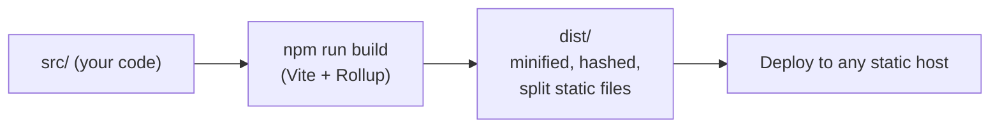
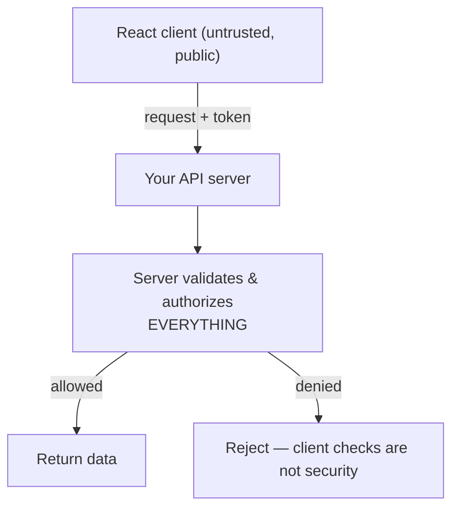
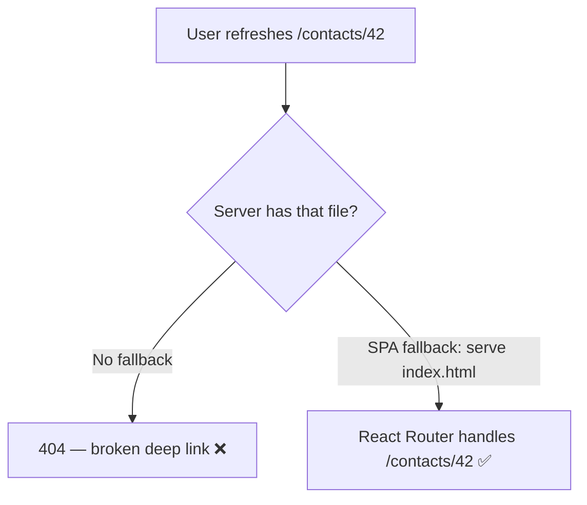
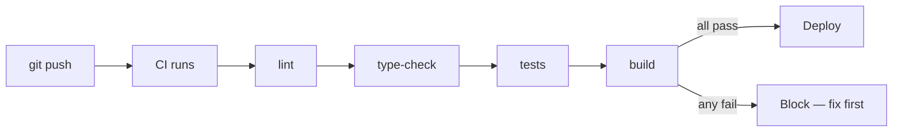
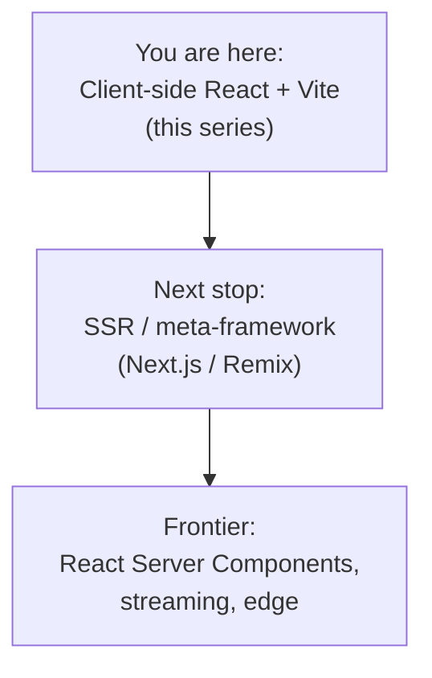
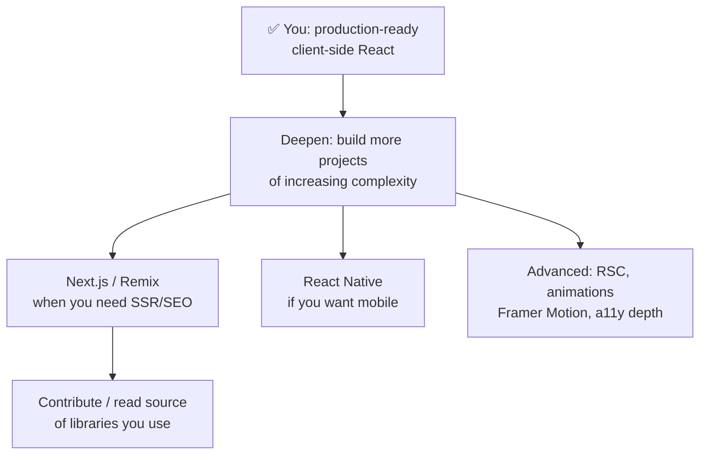

# Part 15 · Production, Deployment and Beyond

> You've learned to build, style, optimize, type, test, and architect React apps. The final step is shipping to real users — and everything that comes with production: builds, environment config, accessibility, security, deployment, and monitoring. This part turns your projects into deployable products. It closes with an honest map of **where to go next** — the SSR/meta-framework world (Next.js, Remix), React Server Components, and how to keep growing. You'll finish with a complete mental model of professional React, from first component to production.

## Table of Contents

1. [The production build](#1-the-production-build)
2. [Environment variables and config](#2-environment-variables-and-config)
3. [Accessibility (a11y)](#3-accessibility-a11y)
4. [Security in React apps](#4-security-in-react-apps)
5. [Deploying a React app](#5-deploying-a-react-app)
6. [Monitoring, errors, and analytics](#6-monitoring-errors-and-analytics)
7. [A production readiness checklist](#7-a-production-readiness-checklist)
8. [Where to go next: SSR and meta-frameworks](#8-where-to-go-next-ssr-and-meta-frameworks)
9. [Capstone finish and your learning roadmap](#9-capstone-finish-and-your-learning-roadmap)
10. [Exercises and practice problems](#10-exercises-and-practice-problems)
11. [Glossary](#11-glossary)

> **💡 Suggested learning order:** §1–2 (build & config) and §5 (deploy) are the mechanics of shipping. §3–4 (a11y & security) are non-negotiable quality bars. §6–7 make it production-grade. §8 opens the door to your next phase of learning.

---

## 1. The production build

Everything so far ran via `npm run dev` — an unoptimized dev server. Production needs a **build**: an optimized, minified, bundled version of your app that loads fast for real users.

```bash
npm run build       # produces an optimized bundle in dist/
npm run preview     # serve the built app locally to verify before deploying
```

`npm run build` runs Vite's production build (Rollup under the hood), which:

```cards
Bundles :: combines your modules into a few optimized files.
Minifies :: strips whitespace, shortens names — smaller downloads.
Tree-shakes :: removes unused code (dead-code elimination).
Splits :: separates chunks (your lazy routes from Part 11 become separate files).
Hashes :: filenames get content hashes (app.a1b2c3.js) for cache-busting.
Optimizes assets :: compresses images, inlines tiny assets.
```

The output in `dist/` is **static files** — HTML, JS, CSS, assets — that any static host can serve. That's the whole deployable artifact.



> **🔍 Under the hood:** In dev, Vite serves source files as native ES modules (fast startup, no bundling). For production it *does* bundle with Rollup, because shipping hundreds of separate module requests to real browsers over real networks would be slow. Content-hashed filenames (`index.a1b2c3.js`) enable aggressive caching: the hash changes only when the file's content changes, so browsers cache forever and re-download only what actually changed. Always test the build with `npm run preview` — some issues (env vars, base paths, dynamic imports) only surface in the production build.

> **⚠️ Common beginner mistake:** Deploying without ever running `npm run build` locally, or assuming "works in dev = works in prod." The production build behaves differently (minification, env vars, StrictMode off, real chunk loading). Always `npm run build && npm run preview` before deploying.

**Key takeaways:**
- `npm run build` produces optimized, minified, hashed static files in `dist/`.
- The build bundles, tree-shakes, splits chunks, and cache-busts via content hashes.
- Test with `npm run preview` — prod behaves differently from dev.

---

## 2. Environment variables and config

Apps need configuration that differs per environment — API URLs, feature flags, public keys. Vite exposes environment variables prefixed with **`VITE_`** to your code via `import.meta.env`.

```bash
# .env (committed defaults) / .env.local (secrets, git-ignored) / .env.production
VITE_API_URL=https://api.example.com
VITE_ENABLE_BETA=true
```

```jsx
// Access them in code — only VITE_-prefixed vars are exposed to the client.
const apiUrl = import.meta.env.VITE_API_URL
const isBeta = import.meta.env.VITE_ENABLE_BETA === 'true'

// Built-in flags:
import.meta.env.MODE        // 'development' | 'production'
import.meta.env.PROD        // true in production build
import.meta.env.DEV         // true in dev
```

Environment file precedence (Vite loads the right one per mode):

| File | When loaded | Commit to git? |
| --- | --- | --- |
| `.env` | Always | Yes (non-secret defaults) |
| `.env.local` | Always, local only | **No** (git-ignored — secrets) |
| `.env.production` | Production build | Yes (non-secret) |
| `.env.development` | Dev | Yes |

> **🔍 Under the hood:** Vite **statically replaces** `import.meta.env.VITE_X` with the literal value at build time — so the value is *baked into the bundle*. This is why only `VITE_`-prefixed vars are exposed: it's a safeguard so you don't accidentally leak a server secret into client code. **Anything in a client bundle is public** — viewable in browser DevTools. Never put true secrets (database passwords, private API keys) in `VITE_` vars; those belong on a server the client talks to.

> **⚠️ Common beginner mistake — a security risk:** Putting a secret API key in `VITE_SECRET_KEY` thinking it's hidden. It's shipped in the JS bundle and fully visible to anyone. Client env vars are for *public* config only (public API URLs, publishable keys). Real secrets stay server-side. This is the #1 React security mistake.

**Key takeaways:**
- Vite exposes `VITE_`-prefixed vars via `import.meta.env`, baked in at build time.
- Use `.env.local` (git-ignored) for local config; commit non-secret defaults.
- Client env vars are **public** — never put real secrets in them.

---

## 3. Accessibility (a11y)

**Accessibility** means your app works for everyone — including people using screen readers, keyboard-only navigation, or with low vision. It's a professional requirement (often a legal one), and good a11y also improves SEO and usability for all. React makes it manageable if you build it in from the start.

The essentials:

**Semantic HTML** — use the right element for the job. Semantic elements come with built-in accessibility:

```jsx
// ❌ divs for everything — no meaning for assistive tech
<div onClick={go}>Submit</div>
// ✅ real elements — keyboard-focusable, announced correctly, free behavior
<button onClick={go}>Submit</button>
<nav>...</nav> <main>...</main> <header>...</header>   // landmarks screen readers navigate by
```

**Labels for form inputs** — every input needs an accessible label:

```jsx
<label htmlFor="email">Email</label>
<input id="email" type="email" />
// or wrap: <label>Email <input type="email" /></label>
// use useId() (Part 5) for unique ids in reusable components
```

**Keyboard navigation** — everything clickable must be keyboard-operable (real `<button>`/`<a>` are automatically; custom widgets need `tabIndex`, `onKeyDown`, and ARIA roles).

**ARIA attributes** — when semantic HTML isn't enough, ARIA describes elements to assistive tech:

```jsx
<button aria-label="Close" onClick={close}>✕</button>       {/* icon button needs a label */}
<div role="alert">{errorMessage}</div>                       {/* announced immediately */}
<input aria-invalid={hasError} aria-describedby="email-err" />
```

**Alt text** on images; **focus management** for modals (trap focus, return it on close); **color contrast** (WCAG AA = 4.5:1 for text).

```cards
Semantic HTML :: button/nav/main/header — meaning + free keyboard support.
Labels :: every input associated with a label (htmlFor/id or wrapping).
Keyboard :: all interactive elements operable without a mouse.
ARIA :: aria-label, role, aria-invalid where HTML falls short.
Contrast + alt text :: readable colors; images described.
```

🎯 **Analogy:** Accessibility is like writing a good API with clear error messages and status codes — you're making your app *legible to other systems* (assistive technology) and users you can't see. Just as you wouldn't ship an API that returns `200 OK` for errors, you shouldn't ship a UI where a screen reader can't tell a button from a `<div>`. Semantic HTML is your "status codes."

> **🔍 Under the hood:** Screen readers build an **accessibility tree** from your DOM — the same tree RTL's `getByRole` queries (Part 13!). Semantic elements populate it correctly (a `<button>` is announced as "button, Submit"); a `<div onClick>` is invisible to it. This is why testing with `getByRole` and building accessibly reinforce each other: accessible markup is testable markup. Tools like `eslint-plugin-jsx-a11y` (in Vite's React template) catch many issues as you type; `axe-core` audits at runtime.

> **⚠️ Common beginner mistake:** Building interactive UI from `<div>`s with `onClick` — invisible to keyboards and screen readers. Use real `<button>`/`<a>`. Second mistake: icon-only buttons with no `aria-label` — a screen reader announces "button" with no idea what it does. Add labels.

**Key takeaways:**
- Use semantic HTML (`<button>`, `<nav>`, `<main>`) — it's accessible and keyboard-ready by default.
- Label every input; add `aria-*` where HTML isn't enough; ensure keyboard operability and contrast.
- Accessible markup is testable markup (`getByRole`); lint with `eslint-plugin-jsx-a11y`.

---

## 4. Security in React apps

React handles some security automatically but not all. Know the real risks and your responsibilities.

**XSS (Cross-Site Scripting)** — React **escapes values by default**, so `{userInput}` renders as text, not HTML — this prevents most XSS automatically:

```jsx
const evil = '<script>steal()</script>'
<p>{evil}</p>     // ✅ renders the literal text — the script does NOT execute
```

The escape hatch that *reintroduces* the risk is `dangerouslySetInnerHTML` — the name warns you:

```jsx
// ⚠️ Bypasses React's escaping — only with SANITIZED, trusted HTML
<div dangerouslySetInnerHTML={{ __html: sanitize(userContent) }} />
// Use a sanitizer like DOMPurify: sanitize(html) = DOMPurify.sanitize(html)
```

**The key security principles for React SPAs:**

```cards
Trust nothing from the client :: all real auth/validation happens on the SERVER. The client is public.
No secrets in the bundle :: env vars, keys — anything shipped is visible (§2).
Sanitize any raw HTML :: use DOMPurify before dangerouslySetInnerHTML.
Validate on the server :: client validation (Zod, Part 7) is UX; the server must re-validate.
HTTPS + secure tokens :: store auth tokens carefully (httpOnly cookies preferred over localStorage).
Guard against CSRF :: for cookie auth, use CSRF tokens / SameSite cookies.
```

🎯 **Analogy:** Treat the browser like a hostile client — because it is. As a backend engineer you already know: *never trust client input, enforce everything server-side*. A React SPA is just another untrusted client. Its "protected routes" (Part 8) are UX conveniences, not security — a determined user can bypass any client-side check. Real authorization lives on your API.



> **🔍 Under the hood:** React's auto-escaping works because `{value}` sets `textContent`, not `innerHTML` — the browser treats it as text. `dangerouslySetInnerHTML` sets `innerHTML`, which *parses and executes* HTML/scripts — hence the danger and the need to sanitize. For auth, `localStorage` tokens are readable by any XSS-injected script; `httpOnly` cookies aren't accessible to JS, mitigating token theft (at the cost of needing CSRF protection). These are the same web-security fundamentals your backend already enforces.

> **⚠️ Common beginner mistake:** Believing client-side route guards (Part 8) or hidden UI provide *security*. They only improve UX — anyone can open DevTools, call your API directly, or modify the JS. Enforce authorization on the server for every request. Second mistake: `dangerouslySetInnerHTML` with unsanitized user content — a direct XSS hole.

**Key takeaways:**
- React auto-escapes `{values}`, preventing most XSS; `dangerouslySetInnerHTML` reopens it — sanitize.
- Client checks are UX, not security — enforce all auth/validation on the server.
- Never ship secrets in the bundle; prefer `httpOnly` cookies for tokens; treat the client as hostile.

---

## 5. Deploying a React app

A Vite React SPA builds to static files (§1), so deployment is simple: host the `dist/` folder on any static host or CDN. Modern platforms make this a one-command (or one-push) affair.

**The general flow:**

```bash
npm run build          # produce dist/
# then upload dist/ — or connect your git repo to a platform that builds automatically
```

**Popular hosts** (all free-tier friendly, git-integrated):

| Platform | How | Notes |
| --- | --- | --- |
| **Vercel** | Connect git repo → auto-builds on push | Zero-config for Vite; great DX |
| **Netlify** | Connect repo or drag-drop `dist/` | SPA redirects built-in |
| **Cloudflare Pages** | Connect repo | Fast global CDN |
| **GitHub Pages** | Push `dist/` (set `base` in Vite config) | Free; needs base path config |
| **Any static host / S3+CloudFront** | Upload `dist/` | Full control |

**The critical SPA gotcha — the redirect fallback.** Recall from Part 8: your app has client-side routes like `/contacts/42`, but there's no `contacts/42.html` file. If a user refreshes or deep-links there, the server returns **404**. The fix: configure the host to serve `index.html` for *all* paths, letting React Router handle routing:

```
# Netlify: public/_redirects
/*    /index.html   200

# Vercel: vercel.json
{ "rewrites": [{ "source": "/(.*)", "destination": "/index.html" }] }
```



> **🔍 Under the hood:** A SPA is *one* `index.html` + JS. The server has no file for `/contacts/42` — that route exists only in your JS (React Router, Part 8). The "serve index.html for all routes" rewrite makes the server return your app for *any* path; then React boots, reads the URL, and renders the right route. Without it, only the home page survives a refresh. Platforms like Vercel/Netlify detect SPAs and add this automatically; static hosts (S3, GitHub Pages) need manual config.

> **⚠️ Common beginner mistake:** Deploying, testing only the home page (which works), and shipping — then users report that refreshing any other page 404s. Always test a deep link + refresh in production. Set up the SPA fallback. Also: forgetting to set Vite's `base` when hosting under a subpath (GitHub Pages `/repo-name/`).

**Key takeaways:**
- A Vite SPA deploys as static `dist/` files to any host/CDN — often one git push.
- Configure the **SPA fallback** (serve `index.html` for all routes) or deep links 404 on refresh.
- Test deep-link + refresh in production; set Vite `base` for subpath hosting.

---

## 6. Monitoring, errors, and analytics

Once live, you need to know what's happening: which errors real users hit, how the app performs, and how it's used. You can't fix what you can't see.

**Error monitoring** — capture runtime errors from real users (an error boundary from Part 14 shows a fallback; a monitoring service *reports* the error to you):

```jsx
// In your ErrorBoundary's componentDidCatch (Part 14):
componentDidCatch(error, errorInfo) {
  Sentry.captureException(error, { extra: errorInfo })   // report to a service
}
```

Tools like **Sentry** capture errors with stack traces, user context, and breadcrumbs — so you learn about bugs *before* users complain.

**Performance monitoring** — track real-user metrics (**Core Web Vitals**): LCP (load speed), INP (interactivity), CLS (visual stability). These reflect actual user experience and affect SEO:

```jsx
import { onLCP, onINP, onCLS } from 'web-vitals'
onLCP(sendToAnalytics)   // report real metrics from real devices
```

**Analytics** — understand usage (page views, feature adoption, funnels) with privacy-respecting tools (Plausible, PostHog, or GA4).

```cards
Error monitoring :: Sentry — real-user errors with stack traces + context.
Performance :: web-vitals / Sentry — Core Web Vitals from real devices.
Analytics :: Plausible / PostHog — usage, funnels, feature adoption.
Uptime :: is the site even reachable? (host dashboards, uptime pings).
Source maps :: upload them so minified stack traces are readable.
```

> **🔍 Under the hood:** In production, code is minified (§1), so an error stack trace reads like `a.b is not a function at t.x`. **Source maps** (generated by the build) let monitoring tools map minified traces back to your original source lines — essential for debugging production errors. Upload them to Sentry during your build/deploy. Core Web Vitals are measured on *real user devices* (field data), which differs from your fast laptop — that's why real-user monitoring matters beyond local testing.

> **⚠️ Common beginner mistake:** Shipping with no error/performance monitoring, then being blind to production issues — learning about bugs only when users leave. Add at least error monitoring (Sentry's free tier is generous) before real users arrive. Also: not uploading source maps, making production stack traces useless.

**Key takeaways:**
- Add error monitoring (Sentry) to learn about real-user bugs proactively.
- Track Core Web Vitals (real-user performance) and usage analytics.
- Upload source maps so minified production traces are debuggable.

---

## 7. A production readiness checklist

Before shipping any React app to real users, run through this. It consolidates the whole series.

```cards
Build :: npm run build succeeds; tested with npm run preview.
Env :: config via VITE_ vars; NO secrets in the bundle; .env.local git-ignored.
Routing :: SPA fallback configured; deep links + refresh work in prod.
Errors :: error boundaries around app + risky sections; monitoring wired up.
Loading/empty/error states :: every async view handles all states (Parts 4, 6).
Accessibility :: semantic HTML, labels, keyboard nav, contrast; a11y lint passing.
Security :: server enforces auth/validation; user HTML sanitized; HTTPS.
Performance :: route-split; measured; no obvious needless re-renders (Part 11).
Types :: TypeScript passing with no errors; minimal any (Part 12).
Tests :: critical flows covered; CI runs them on every push (Part 13).
SEO/meta :: title, description, favicon, Open Graph tags set.
```

A minimal **CI pipeline** (GitHub Actions) that gates every push on quality:

```yaml
# .github/workflows/ci.yml
name: CI
on: [push, pull_request]
jobs:
  check:
    runs-on: ubuntu-latest
    steps:
      - uses: actions/checkout@v4
      - uses: actions/setup-node@v4
        with: { node-version: 20 }
      - run: npm ci
      - run: npm run lint          # ESLint
      - run: npx tsc --noEmit      # TypeScript check
      - run: npm test              # Vitest
      - run: npm run build         # ensure it builds
```



> **💡 Tip:** Automate the checklist. A CI pipeline that runs lint + type-check + tests + build on every push means broken code *can't* reach production — the machine enforces quality so humans don't have to remember. Pair it with auto-deploy on merge to `main` (Vercel/Netlify do this) for a smooth, safe pipeline. This is how professional teams ship confidently many times a day.

> **⚠️ Common beginner mistake:** Treating "it works on my machine" as done. Production readiness is a distinct bar: builds, config, a11y, security, error handling, monitoring, and automated checks. Skipping these is how apps break for real users in ways you never saw locally.

**Key takeaways:**
- Run the readiness checklist before shipping — build, env, routing, errors, a11y, security, tests.
- Automate quality with CI: lint + type-check + test + build on every push.
- "Works locally" isn't "production-ready" — the checklist is the difference.

---

## 8. Where to go next: SSR and meta-frameworks

This series focused on **client-side React with Vite** — you render everything in the browser. That's the right foundation and perfect for apps behind a login (dashboards, tools, internal apps). But there's a whole world beyond it worth knowing, even if you don't use it yet.

**The limitation of client-side rendering (CSR):** the browser downloads a near-empty HTML shell, then JS, then renders. This means a slower *first* paint and weaker SEO (crawlers may see an empty page before JS runs). For content sites (marketing, blogs, e-commerce) where SEO and first-load speed are critical, **server-side rendering (SSR)** helps.

**The meta-frameworks** that add SSR (and much more) on top of React:

| Framework | What it adds |
| --- | --- |
| **Next.js** | SSR, static generation, file-based routing, API routes, React Server Components — the dominant React framework |
| **Remix / React Router 7** | SSR with a focus on web fundamentals, nested routing + data loaders (which you already know from Part 8!) |
| **Astro** | Content-focused, ships minimal JS, great for mostly-static sites |

**React Server Components (RSC)** — the frontier: components that render *on the server* and send HTML (not JS) to the client, reducing bundle size. Next.js's App Router is built on them. This is where React is heading.



🎯 **Analogy:** Client-side React is like a rich desktop app that loads once and runs locally — great for interactive tools. SSR/meta-frameworks are like server-rendered pages *plus* that richness — the server does initial work (fast first paint, SEO) and the client hydrates into an interactive app. You've mastered the interactive part; meta-frameworks add the server part on top. Crucially, **everything you learned transfers** — components, hooks, state, data fetching are the same; the framework changes *where* rendering starts.

> **🔍 Under the hood:** SSR renders your React components to HTML *on the server* for the first request, so the user sees content immediately; then React "hydrates" that HTML into a live app on the client. React Server Components go further — some components render only on the server and never ship their JS, shrinking bundles. The good news for you: these build *directly* on this series' foundations. Next.js's data loaders resemble React Router's (Part 8); its components are the same components you've been writing. You're well-prepared to learn it when a project needs SEO or first-load performance.

> **⚠️ Common beginner mistake:** Jumping to Next.js *before* understanding core React — then not knowing what the framework is doing for you (or against you). You did it right: master client-side React first (this series), *then* add a meta-framework when a project genuinely needs SSR/SEO. Don't reach for Next.js for an internal dashboard where CSR is perfect.

**Key takeaways:**
- This series taught client-side React (Vite) — ideal for apps behind a login.
- SSR/meta-frameworks (Next.js, Remix) add server rendering for SEO and fast first paint.
- Everything you learned transfers; learn a meta-framework when a project needs SSR — not before.

---

## 9. Capstone finish and your learning roadmap

🏗️ **Ship your capstones.** Take the **Contacts Manager** (Capstone #3) — now built, styled (Part 10), optimized (11), typed (12), tested (13), and architected (14) — and deploy it. Same for the **Todo app** and **Data Dashboard**. This is the real finish line: a live URL you can share.

**Deploy checklist for your capstone:**

```cards
1. Build :: npm run build && npm run preview — verify it works.
2. SPA fallback :: add _redirects / vercel.json so routes survive refresh.
3. Env :: move the API URL to a VITE_ var; confirm no secrets shipped.
4. Deploy :: push to a git repo connected to Vercel/Netlify.
5. Verify :: test deep links, refresh, all flows on the live URL.
6. Monitor :: wire in Sentry + web-vitals.
```

**Your continued learning roadmap** — you now have a professional foundation. Where to grow:



**Concrete next steps:**
1. **Build, build, build.** Clone apps you use (a Twitter clone, a Trello clone, a Spotify UI). Nothing cements skills like shipping projects.
2. **Learn Next.js** when you hit a need for SEO or server rendering — you're ready.
3. **Explore an area deep:** animations (Framer Motion), advanced accessibility, data-viz (D3 + React), or React Native for mobile.
4. **Read the source** of libraries you use (TanStack Query, React Router) — it's how you go from user to expert.
5. **Stay current:** follow the React blog, the changelogs of your core libraries, and build with new features (RSC, `use`, Actions).

> **💡 The meta-lesson:** You came in knowing JavaScript and now understand React from `UI = f(state)` to production deployment — components, hooks, data, routing, state, styling, performance, types, tests, patterns, and shipping. The framework will keep evolving, but the *mental models* you built (declarative UI, composition, unidirectional data flow, separating logic from presentation) are durable. New APIs are variations on these themes. You're no longer a beginner — you're a React developer.

**Key takeaways:**
- Deploy your capstones to live URLs — the true finish line of learning.
- Keep building projects of increasing complexity; that's what deepens skill.
- Learn meta-frameworks/native/advanced topics *when a project needs them* — your foundation transfers.

---

## 10. Exercises and practice problems

### 🧪 Warm-ups (easy)

**E1.** What commands build and locally preview a production bundle? Where does the output go?

<details><summary>Show solution</summary>

`npm run build` (output → `dist/`), then `npm run preview` to serve it locally. *(§1)*
</details>

**E2.** Why can't you store a secret API key in a `VITE_SECRET` environment variable?

<details><summary>Show solution</summary>

Vite bakes `VITE_` vars into the client bundle at build time, so the value is shipped in the JS and visible to anyone in DevTools. Client env vars are public; secrets belong on a server. *(§2, §4)*
</details>

### 🧪 Core (medium)

**E3.** Your deployed app 404s when refreshing `/dashboard`. Explain and fix (Netlify).

<details><summary>Show solution</summary>

The server has no `dashboard.html` — the route exists only in your JS. Add a SPA fallback: a `public/_redirects` file with `/*  /index.html  200`, so the server serves `index.html` for all paths and React Router handles routing. *(§5)*
</details>

**E4.** Add three accessibility fixes to this snippet.

```jsx
<div onClick={submit}>Send</div>

<div onClick={close}>✕</div>
```

<details><summary>Show solution</summary>

```jsx
<button onClick={submit}>Send</button>                    // real button (keyboard + role)
                // alt text
<button aria-label="Close" onClick={close}>✕</button>     // labeled icon button
```

*Why:* Semantic elements + alt + aria-label (§3).
</details>

**E5.** Where must authentication/authorization actually be enforced, and why aren't Part 8's protected routes enough?

<details><summary>Show solution</summary>

On the **server**, for every request. Client route guards only hide UI — a user can open DevTools, modify JS, or call the API directly, bypassing any client check. The client is untrusted and public. *(§4)*
</details>

### 🧪 Challenge (hard)

**E6.** Write a minimal CI workflow that lints, type-checks, tests, and builds on every push.

<details><summary>Show solution</summary>

See §7's `ci.yml`: checkout → setup-node → `npm ci` → `npm run lint` → `npx tsc --noEmit` → `npm test` → `npm run build`. Any failing step blocks the merge.

*Why:* Automated quality gate — broken code can't reach production (§7).
</details>

**E7.** Explain the trade-off between client-side rendering (this series) and SSR. When would you switch to Next.js?

<details><summary>Show solution</summary>

CSR: empty shell → JS → render (slower first paint, weaker SEO, but simple and great for apps behind login). SSR: server renders HTML first (fast first paint, strong SEO, more complexity). Switch to Next.js/Remix when you need SEO or fast first-load for public content (marketing, blog, e-commerce). Not needed for internal/authenticated tools. *(§8)*
</details>

**E8 (final capstone).** Deploy your fully-built **Contacts Manager** to Vercel or Netlify: configure the SPA fallback, move the API base to a `VITE_` var, verify all flows on the live URL, and wire in Sentry error monitoring. Share the URL. **This completes the series** — you've taken an app from first component to production.

<details><summary>Show hint</summary>

Push the repo to GitHub, connect it to Vercel (auto-detects Vite). Add the `_redirects`/`vercel.json` SPA fallback. Set `VITE_API_URL` in the platform's env settings. After deploy, test: navigate to a contact, refresh (should NOT 404), create/delete a contact. Add `@sentry/react` with `Sentry.init(...)` and hook it into your `ErrorBoundary`. You now have a live, monitored, production React app — the goal of this entire series.
</details>

---

## 11. Glossary

| Term | Meaning |
| --- | --- |
| **Production build** | The optimized, minified, bundled output (`npm run build` → `dist/`). |
| **`import.meta.env`** | How Vite exposes `VITE_`-prefixed environment variables. |
| **Accessibility (a11y)** | Making an app usable by everyone, including assistive-tech users. |
| **Semantic HTML** | Using meaningful elements (`<button>`, `<nav>`) with built-in accessibility. |
| **ARIA** | Attributes describing elements to assistive technology. |
| **XSS** | Cross-Site Scripting; React auto-escapes `{values}` to prevent it. |
| **`dangerouslySetInnerHTML`** | The escape hatch that renders raw HTML (must be sanitized). |
| **SPA fallback** | Server config serving `index.html` for all routes (for client routing). |
| **Core Web Vitals** | Real-user performance metrics (LCP, INP, CLS). |
| **Source maps** | Files mapping minified code back to source for readable stack traces. |
| **SSR** | Server-Side Rendering — rendering React to HTML on the server. |
| **Meta-framework** | A framework (Next.js, Remix) adding SSR/routing/more on top of React. |

---

> **🎉 You've reached the end.** From your first `<h1>` to a monitored, accessible, production-deployed application — you now understand React the way professional engineers do. You learned not just *how* but *why*: the render model, the data flow, the trade-offs. The ecosystem will keep evolving, but your mental models are durable, and you have three real apps to prove your skills.
>
> Go build something and ship it. That's the whole point.
>
> **← Back to the [Series Index](README.md)** · Revisit any part as a reference whenever you build.
