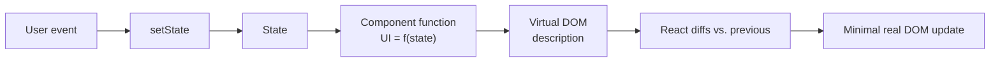
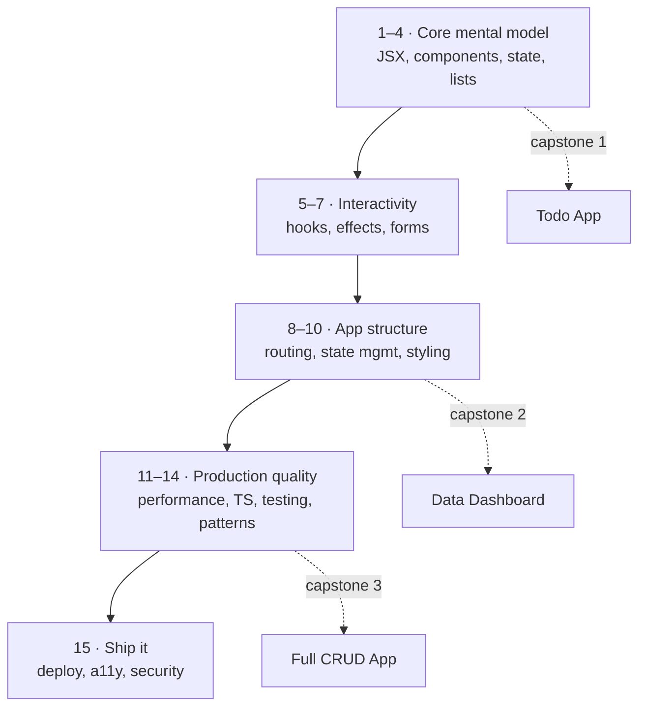

# React from Scratch — A Build-First Learning Series

> A patient, senior-engineer-led path to learning **React JS** from your very first component to a production-ready application. This series assumes you already know JavaScript — so we spend **zero** time on the language and **all** of our time on React itself. It is built for *learning by doing*: every part is packed with hands-on exercises, a mini-project, and feeds into larger capstone projects.

This is a **15-part series**. Each part is an independent, deeply-annotated `.md` file with a paired rendered `.html`. Read them in order the first time — later parts build directly on earlier ones — then use them as a reference whenever you're building.

```stat
15 | Parts, scratch → production
100+ | Hands-on exercises
3 | Capstone projects
0 | Prior React needed
```

## How to read this guide

You are an experienced backend/AI engineer who is fluent in JavaScript but new to building UIs. That's the perfect starting point — you already understand functions, closures, arrays, promises, and modules. What's *new* is the **UI mindset**: thinking in components, describing what the screen should look like for a given state, and letting React keep the DOM in sync. This series is designed around that shift.

- **First pass (learn):** Go top-to-bottom, Part 1 → 15. **Do the exercises** at the end of each section — they are the point, not decoration. Type the code yourself; do not copy-paste.
- **Build as you go:** Each part ends with a **mini-project**. Three larger **capstones** (a Todo app, a data dashboard, and a full CRUD app) are built up across multiple parts.
- **Reference later:** Once you've done a first pass, use the "🔍 Under the hood", "⚠️ Common mistakes", and **Key takeaways** blocks as a quick refresher.
- **Icons used throughout:** 🎯 analogy · 🔍 internals · ⚠️ trap · 💡 tip · 🧪 exercise · 🏗️ project.

> **💡 Tip:** Keep a scratch Vite project open in one window and this guide in another. React is a *muscle* — it rewards typing over reading. If a concept feels abstract, build the smallest possible example that demonstrates it.

## Table of Contents

1. [Why React, and how it thinks](#1-why-react-and-how-it-thinks)
2. [The 15 parts at a glance](#2-the-15-parts-at-a-glance)
3. [Suggested learning order](#3-suggested-learning-order)
4. [Setting up your environment](#4-setting-up-your-environment)
5. [Your first Vite + React project](#5-your-first-vite-and-react-project)
6. [Anatomy of a React project](#6-anatomy-of-a-react-project)
7. [Tooling: ESLint, Prettier, and VS Code](#7-tooling-eslint-prettier-and-vs-code)
8. [How the exercises and projects work](#8-how-the-exercises-and-projects-work)
9. [The reference tech stack](#9-the-reference-tech-stack)

---

## 1. Why React, and how it thinks

> React is a JavaScript library for building **user interfaces** out of small, reusable pieces called **components**. Its core promise: *you describe what the UI should look like for a given state, and React figures out how to update the actual screen efficiently.*

🎯 **Analogy:** Imagine you're a backend engineer who used to write HTML by hand-manipulating the DOM — `document.getElementById(...)`, `.appendChild(...)`, `.innerHTML = ...`. That's like manually issuing SQL `UPDATE` statements for every field that changes on a screen: tedious and error-prone. React is more like a **declarative view layer** — you write a function that returns *what the screen should be* for the current data, and React diffs the old and new descriptions and applies the minimal set of DOM changes. You stopped writing `UPDATE`s and started describing the desired final state.

The single most important idea, which everything else follows from:

```
UI = f(state)
```

Your UI is a **function of state**. When state changes, React re-runs your component functions to get a new description of the UI, compares it to the previous one, and updates only what actually changed. You never touch the DOM directly.



> **🔍 Under the hood:** React builds a lightweight in-memory tree (the "virtual DOM" — really just plain JS objects describing elements). On each render it produces a new tree, **reconciles** it against the previous one, and computes the smallest set of real DOM mutations. This is why React feels fast even though "re-rendering" sounds expensive: re-rendering means *re-running your function*, not rebuilding the whole page.

> **⚠️ Common beginner mistake:** Coming from vanilla JS, the instinct is to "reach into" the DOM and change things imperatively. In React, **you almost never touch the DOM**. Instead you change *state*, and let the UI follow. Fighting this is the #1 source of beginner bugs.

**Why React specifically (vs. Angular, Vue, Svelte)?** It has the largest ecosystem and job market, a gentle-but-deep learning curve, and the "just JavaScript" philosophy — components are functions, props are arguments, and there's no template DSL to learn separately from the language you already know. Skills transfer directly to **React Native** (mobile) and meta-frameworks like **Next.js**.

**Key takeaways:**
- React is declarative: you describe the UI for a state; React syncs the DOM.
- The mental model is `UI = f(state)` — change state, not the DOM.
- Re-rendering means *re-running your component function*, which is cheap.

---

## 2. The 15 parts at a glance

| # | Part | What you'll learn |
| --- | --- | --- |
| 1 | [JSX and the Rendering Model](01-jsx-and-rendering.md) | What JSX compiles to, elements vs. components, expressions, fragments, how React renders |
| 2 | [Components and Props](02-components-and-props.md) | Function components, props, `children`, composition, reusable UI |
| 3 | [State and Events](03-state-and-events.md) | `useState`, event handlers, immutable updates, re-render timing |
| 4 | [Lists, Keys and Conditionals](04-lists-keys-conditional.md) | Rendering arrays, keys, reconciliation, conditional UI |
| 5 | [Hooks Deep Dive](05-hooks-deep-dive.md) | Every built-in hook, Rules of Hooks, custom hooks |
| 6 | [Effects and Data Fetching](06-effects-and-data-fetching.md) | `useEffect`, cleanup, race conditions, TanStack Query |
| 7 | [Forms](07-forms.md) | Controlled/uncontrolled inputs, validation, React Hook Form + Zod |
| 8 | [Routing](08-routing.md) | React Router: nested routes, params, loaders, guards |
| 9 | [State Management](09-state-management.md) | Context, Redux Toolkit, Zustand, client vs. server state |
| 10 | [Styling](10-styling.md) | CSS Modules, Tailwind, styled-components, design systems |
| 11 | [Performance](11-performance.md) | `memo`, `useMemo`, `useCallback`, code splitting, profiling |
| 12 | [TypeScript with React](12-typescript-react.md) | Typing props, hooks, events, context, generics |
| 13 | [Testing](13-testing.md) | Vitest, React Testing Library, Playwright E2E |
| 14 | [Patterns and Architecture](14-patterns-architecture.md) | Compound components, render props, error boundaries, structure |
| 15 | [Production and Beyond](15-production-and-beyond.md) | Build, deploy, a11y, security, monitoring, SSR overview |

---

## 3. Suggested learning order

The series is deliberately linear for a first pass. Here's *why* the order matters and where the capstones live.



```cards
Parts 1–4 :: The non-negotiable foundation. Don't skip. Everything else assumes fluency with state and rendering.
Parts 5–7 :: Where apps become interactive. Hooks are the heart of modern React.
Parts 8–10 :: Turning components into real, navigable, styled applications.
Parts 11–15 :: What separates a hobby project from production code.
```

> **💡 Tip:** If you're impatient, the *minimum* path to building something real is Parts 1–8. But do 9–15 before you ship anything to real users.

---

## 4. Setting up your environment

You need three things: **Node.js**, a **package manager**, and an **editor**. We'll use **Vite** as our build tool for every project in this series — it's fast, modern, and the current community default for client-side React.

**Install Node.js (LTS).** React tooling needs Node. Install the current **LTS** (v20+). Verify:

```bash
node --version   # v20.x or newer
npm --version    # comes with Node
```

> **💡 Tip:** If you juggle multiple Node versions (common for backend engineers), use a version manager: `nvm` (macOS/Linux) or `nvm-windows` / `fnm` on Windows. It lets you pin a Node version per project.

**Package manager.** `npm` ships with Node and is perfectly fine. You'll also see `pnpm` (faster, disk-efficient) and `yarn`. This series uses `npm` commands; translate freely if you prefer another.

| Tool | Role | Why we use it |
| --- | --- | --- |
| **Node.js 20+** | JS runtime for tooling | Runs Vite, ESLint, the dev server |
| **npm** | Package manager | Installs React and libraries |
| **Vite** | Build tool + dev server | Instant startup, hot reload, optimized builds |
| **VS Code** | Editor | Best React tooling and extensions |

**Key takeaways:**
- Install Node LTS (v20+); `npm` comes with it.
- Vite is our build tool for the whole series.
- A version manager (`nvm`/`fnm`) saves pain across projects.

---

## 5. Your first Vite and React project

Let's scaffold a project. Run this and pick **React** → **JavaScript** when prompted (we'll add TypeScript in Part 12):

```bash
# Scaffold a new project called "my-first-app"
npm create vite@latest my-first-app

# Then:
cd my-first-app
npm install        # download React + dependencies into node_modules
npm run dev        # start the dev server (usually http://localhost:5173)
```

Open the URL it prints. You now have a live React app with **hot module replacement** — edit a file, save, and the browser updates instantly without a full reload.

The scripts you'll use constantly (defined in `package.json`):

| Command | What it does |
| --- | --- |
| `npm run dev` | Start the dev server with hot reload (your daily driver) |
| `npm run build` | Produce an optimized production bundle in `dist/` |
| `npm run preview` | Serve the production build locally to sanity-check it |
| `npm run lint` | Run ESLint over your code (if configured) |

> **🔍 Under the hood:** Vite serves your source files as **native ES modules** during development — the browser requests each module on demand, so startup is near-instant regardless of project size. For production, `npm run build` uses **Rollup** to bundle, tree-shake, and minify everything into a handful of cache-friendly files. This dev/prod split is why Vite feels so fast compared to older bundlers.

> **⚠️ Common beginner mistake:** Committing `node_modules/` to git. Never do this — it's huge and reproducible from `package.json`. Vite's template already includes a `.gitignore` that excludes it. Commit `package.json` and `package-lock.json`; run `npm install` to recreate `node_modules`.

**Key takeaways:**
- `npm create vite@latest` scaffolds a project; `npm install` then `npm run dev`.
- `dev` for development, `build` for production, `preview` to test the build.
- Never commit `node_modules/`.

---

## 6. Anatomy of a React project

Here's what Vite generates, and what each piece is for:

```
my-first-app/
├─ node_modules/        # installed dependencies (git-ignored)
├─ public/              # static assets served as-is (favicon, etc.)
├─ src/
│  ├─ assets/           # images/fonts imported by your code
│  ├─ App.jsx           # your root component
│  ├─ App.css           # styles for App
│  ├─ main.jsx          # entry point — mounts React into the page
│  └─ index.css         # global styles
├─ index.html           # the single HTML page (SPA shell)
├─ package.json         # dependencies + scripts
├─ vite.config.js       # Vite configuration
└─ .gitignore
```

The two files that make React "start". First, `index.html` — notice it's almost empty. There's one `<div id="root">` and a script tag. This is the **single page** of your single-page app:

```html
<!-- index.html -->
<body>
    <div id="root"></div>                    <!-- React mounts everything here -->
    <script type="module" src="/src/main.jsx"></script>
</body>
```

Then `main.jsx` — the entry point that connects React to that `<div>`:

```jsx
// src/main.jsx
import { StrictMode } from 'react'
import { createRoot } from 'react-dom/client'
import App from './App.jsx'          // your root component
import './index.css'                 // global styles

// Find the <div id="root"> and render <App/> into it.
createRoot(document.getElementById('root')).render(
  <StrictMode>
    <App />
  </StrictMode>,
)
```

> **🔍 Under the hood:** `createRoot` creates a React "root" bound to a real DOM node. `.render(<App/>)` tells React to render your component tree into it. `<StrictMode>` is a dev-only helper that intentionally double-invokes certain functions to surface bugs (you'll see this in Part 6) — it renders nothing itself and disappears in production builds.

> **⚠️ Common beginner mistake:** Looking for "where the HTML is". In React, the HTML for your app lives *inside your components* as JSX — `index.html` is just an empty shell. If you add markup to `index.html` expecting it in your app, you're in the wrong place.

**Key takeaways:**
- `index.html` is an empty shell with one `<div id="root">`.
- `main.jsx` mounts your `<App/>` into that div via `createRoot`.
- All your real UI lives inside components as JSX — starting in Part 1.

---

## 7. Tooling: ESLint, Prettier, and VS Code

Good tooling catches mistakes before you run the app and keeps code consistent. Vite's React template ships with **ESLint** preconfigured. Add **Prettier** for formatting.

**ESLint** (bugs & bad patterns) is already in the template. It flags things like a hook called conditionally, or an unused variable. Run it with `npm run lint`.

**Prettier** (formatting) — install and let it auto-format on save:

```bash
npm install -D prettier
```

Create a `.prettierrc` in the project root:

```json
{
  "semi": false,
  "singleQuote": true,
  "trailingComma": "es5",
  "printWidth": 80
}
```

**VS Code extensions** worth installing:

```cards
ESLint :: Shows lint errors inline as you type — red squiggles for real problems.
Prettier - Code formatter :: Auto-formats on save so you stop arguing about style.
ES7+ React/Redux snippets :: Type `rafce` to scaffold a component instantly.
Error Lens :: Surfaces errors/warnings on the line itself, not just the gutter.
```

Enable format-on-save in VS Code settings (`settings.json`):

```json
{
  "editor.formatOnSave": true,
  "editor.defaultFormatter": "esbenp.prettier-vscode",
  "editor.codeActionsOnSave": { "source.fixAll.eslint": "explicit" }
}
```

> **💡 Tip:** The `rafce` snippet (from the React snippets extension) expands to a full arrow-function component with an export. You'll create hundreds of components — this saves real time.

**Key takeaways:**
- ESLint catches bugs; Prettier handles formatting. Use both.
- Turn on format-on-save and ESLint auto-fix for a frictionless loop.
- Install the ESLint, Prettier, React snippets, and Error Lens extensions.

---

## 8. How the exercises and projects work

This is a **learning** series, not an interview cram guide — so practice is front and center. Here's the structure you'll see in every part:

```cards
🧪 Inline exercises :: Small, focused drills right after a concept. Do them immediately while it's fresh.
End-of-part problems :: Graded easy → hard, each with a collapsible solution and a "why" note. Try before peeking.
🏗️ Mini-project :: A small but complete app at the end of each part, applying everything from that part.
Capstones :: Three larger projects (Todo App, Data Dashboard, CRUD App) that grow across multiple parts.
```

**How to get the most from them:**

1. **Type, don't copy.** Muscle memory matters. Copy-pasting teaches your clipboard, not you.
2. **Break things on purpose.** Delete a `key`, forget a dependency, mutate state directly — see what React does. Understanding failure modes is how you debug later.
3. **Attempt before revealing solutions.** The `<details>` solution blocks are a safety net, not a shortcut.
4. **Keep your projects.** You'll extend earlier projects in later parts. Use a `react-practice/` folder with one subfolder per project.

> **💡 Tip:** Set up a single Vite project as a "playground" for tiny experiments, and separate projects for the mini-projects and capstones. Delete and re-scaffold the playground whenever it gets messy.

**Key takeaways:**
- Every part has inline drills, graded problems, and a mini-project.
- Three capstones grow across the series — keep your code.
- Type everything; attempt before peeking; break things to learn.

---

## 9. The reference tech stack

These are the libraries this series teaches in depth. You don't need them yet — this is a map of where we're headed.

| Concern | Library | Introduced in |
| --- | --- | --- |
| Build tool / dev server | **Vite** | This page |
| UI library | **React 19** | Part 1 |
| Routing | **React Router** | Part 8 |
| Server state / data fetching | **TanStack Query** | Part 6 |
| Client state (global) | **Redux Toolkit**, **Zustand** | Part 9 |
| Forms + validation | **React Hook Form** + **Zod** | Part 7 |
| Styling | **CSS Modules**, **Tailwind CSS**, **styled-components** | Part 10 |
| Types | **TypeScript** | Part 12 |
| Testing | **Vitest** + **React Testing Library**, **Playwright** | Part 13 |

```tags
decided:Vite, decided:React 19, info:Client-side SPA, new:TypeScript in Part 12
```

> **🎯 You're ready.** With Node installed and a Vite project running, head to **[Part 1 · JSX and the Rendering Model](01-jsx-and-rendering.md)** and write your first real components. See you there.

**Key takeaways:**
- Vite + React 19 is the foundation; everything else layers on top.
- Each library is introduced exactly when you need it — no upfront overload.
- Next stop: Part 1, where you start writing React for real.

---

## Glossary

| Term | Meaning |
| --- | --- |
| **Component** | A reusable, self-contained piece of UI, written as a JavaScript function that returns JSX. |
| **JSX** | The HTML-like syntax you write inside components; compiles to `React.createElement` calls. |
| **State** | Data owned by a component that can change over time and triggers re-renders. |
| **Props** | Inputs passed into a component from its parent (like function arguments). |
| **Render** | React calling your component function to get a description of the UI. |
| **Virtual DOM** | React's in-memory description of the UI, used to compute minimal real-DOM updates. |
| **Hook** | A special function (name starts with `use`) that lets components use React features like state. |
| **Vite** | The build tool and dev server used throughout this series. |
| **SPA** | Single-Page Application — one HTML page; JS swaps content client-side without full reloads. |

---

> **Next:** [Part 1 · JSX and the Rendering Model →](01-jsx-and-rendering.md)
